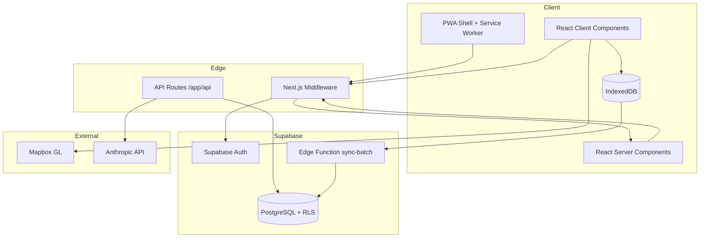
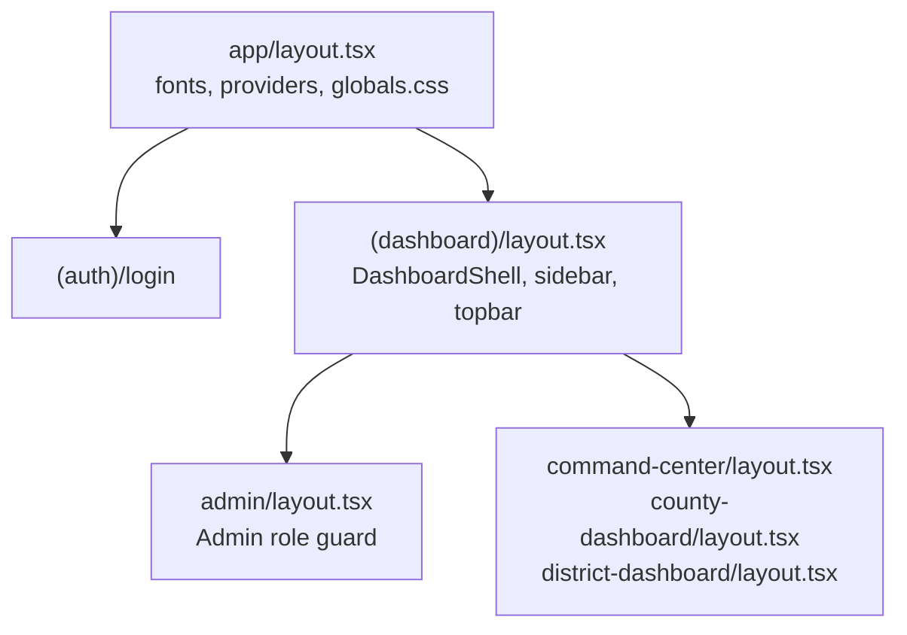
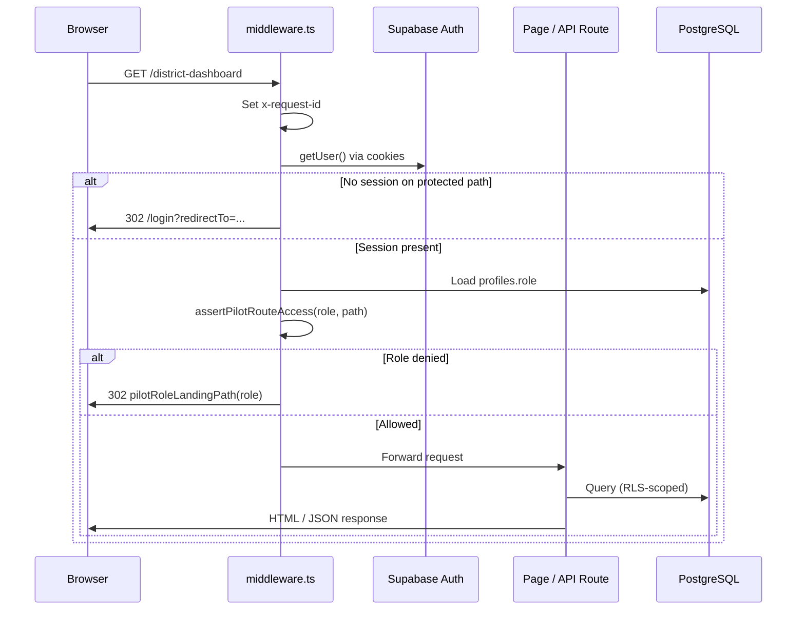
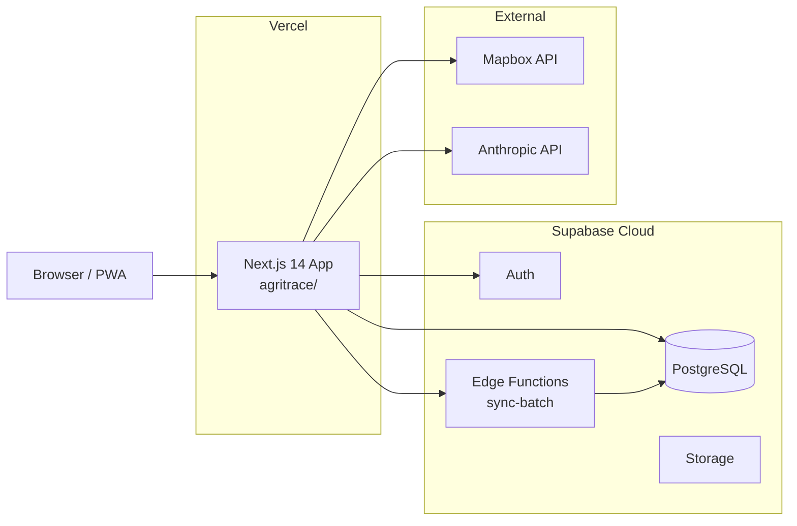

# AgriVault System Architecture

**Product:** AgriVault (`agritrace`)  
**Version:** 0.1.0-rc1  
**Related:** [DATABASE.md](./DATABASE.md) · [WORKFLOW_ENGINE.md](./WORKFLOW_ENGINE.md) · [SECURITY.md](./SECURITY.md) · [DEPLOYMENT_GUIDE.md](./DEPLOYMENT_GUIDE.md)

---

## Table of contents

1. [Overview](#overview)
2. [Technology stack](#technology-stack)
3. [Repository layout](#repository-layout)
4. [Application structure](#application-structure)
5. [Request lifecycle](#request-lifecycle)
6. [Authentication and authorization](#authentication-and-authorization)
7. [Data flow](#data-flow)
8. [Module map](#module-map)
9. [Build pipeline](#build-pipeline)
10. [Deployment topology](#deployment-topology)
11. [Extension points](#extension-points)

---

## Overview

AgriVault is a Next.js 14 application that supports Liberia's Ministry of Agriculture pilot programme. Field technicians capture farmer data, GPS boundaries, and operational reports offline. District, county, and national staff review submissions through a finite-state workflow engine backed by Supabase PostgreSQL.

The platform serves three surfaces:

| Surface | Route prefix | Users |
|---------|--------------|-------|
| Public marketing | `/`, `/about`, `/platform`, `/liberia` | Anonymous |
| Operational dashboard | `/command-center`, `/field/*`, `/workspace/*` | Authenticated operational roles |
| Admin console | `/admin/*` | Ministry admin roles |



---

## Technology stack

| Layer | Technology | Version |
|-------|------------|---------|
| Runtime | Node.js | 20.x |
| Framework | Next.js (App Router) | 14.2.25 |
| UI | React | 18.3.1 |
| Language | TypeScript | 5.x |
| Styling | Tailwind CSS | 3.4.x |
| Database | Supabase PostgreSQL | — |
| Auth | Supabase Auth (`@supabase/ssr`) | 0.10.x |
| Client state | TanStack React Query | 5.x |
| Maps | Mapbox GL + react-map-gl | 3.22.x |
| Offline | IndexedDB (`idb`) | 8.x |
| Geometry | Turf.js (`@turf/area`, `@turf/centroid`) | 7.x |
| PDF | `@react-pdf/renderer` | 4.x (server-only) |
| AI | Anthropic SDK | 0.95.x |

---

## Repository layout

```
agritrace/
├── src/
│   ├── app/                    # Next.js App Router pages and API routes
│   │   ├── (auth)/             # Login route group
│   │   ├── (dashboard)/        # Protected operational UI (~102 pages)
│   │   ├── api/                # 22 API route handlers
│   │   ├── layout.tsx          # Root layout (fonts, providers)
│   │   ├── manifest.ts         # PWA manifest
│   │   └── globals.css         # Design tokens and utility classes
│   ├── components/             # UI components by domain
│   ├── hooks/                  # React hooks (workflow queue, data)
│   ├── lib/                    # Business logic, no UI
│   └── platform/               # React Query client and providers
├── supabase/
│   ├── migrations/             # 11 ordered SQL migrations
│   └── functions/sync-batch/   # Offline batch upsert Edge Function
├── public/
│   ├── sw.js                   # Service worker
│   └── icons/                  # PWA icons (generated at build)
├── scripts/                    # Build helpers (PWA icons, postbuild fix)
├── docs/                       # Engineering and pilot documentation
├── next.config.mjs             # CSP, headers, image optimization
├── tailwind.config.ts          # Tailwind extensions
└── package.json
```

---

## Application structure

### Route groups

Next.js route groups `(auth)` and `(dashboard)` organize files without affecting URLs.

| Group | Example file | URL |
|-------|--------------|-----|
| Root marketing | `src/app/page.tsx` | `/` |
| Auth | `src/app/(auth)/login/page.tsx` | `/login` |
| Dashboard | `src/app/(dashboard)/command-center/page.tsx` | `/command-center` |
| Admin (nested) | `src/app/(dashboard)/admin/users/page.tsx` | `/admin/users` |

The dashboard group contains ~102 operational pages across workspaces, field capture, GIS, inventory, rice/cocoa programmes, compliance, and reporting.

### Layout hierarchy



**Key layout files:**

| File | Responsibility |
|------|----------------|
| `src/app/layout.tsx` | Google fonts, `PlatformProviders`, marketing CSS |
| `src/app/(dashboard)/layout.tsx` | Auth redirect, `DashboardShell`, sidebar |
| `src/app/(dashboard)/admin/layout.tsx` | `isAdminConsoleRole()` guard |
| `src/components/layout/DashboardShell.tsx` | Sidebar, topbar, sync indicator |

### Platform providers

`src/platform/providers.tsx` wraps the dashboard in TanStack React Query with a shared query client (`src/platform/query-client.ts`). Server components fetch directly via Supabase server client; client components use React Query hooks for cached reads.

---

## Request lifecycle

Every HTTP request passes through middleware before reaching a page or API handler.



**Middleware file:** `src/middleware.ts`

**Matcher:** All paths except `_next/static`, `_next/image`, `favicon.ico`.

**Steps:**

1. Assign or propagate `x-request-id` (`src/lib/http/request-context.ts`)
2. Refresh Supabase session cookies via `createServerClient`
3. Redirect unauthenticated users on protected path roots to `/login?redirectTo=<path>`
4. Load `profiles.role, is_active`; a missing, deactivated or unreadable profile redirects to `/account-unavailable` (no fallback role)
5. Call `assertPilotRouteAccess(role, pathname)` for role-gated prefixes
6. Redirect denied users to `pilotRoleLandingPath(role)` without redirect loops

**Protected path roots** include `/command-center`, `/field`, `/workspace`, `/verification-queue`, `/admin`, and 25+ operational prefixes defined in `src/lib/auth/workspace-access.ts`.

See [SECURITY.md](./SECURITY.md) for the full access policy matrix.

---

## Authentication and authorization

Authorization operates at four layers:

| Layer | Mechanism | File |
|-------|-----------|------|
| 1. Middleware | Session + role route gates | `src/middleware.ts` |
| 2. Layout | Dashboard auth redirect; admin role check | `(dashboard)/layout.tsx`, `admin/layout.tsx` |
| 3. Page | Workspace asserts (`assertPilotWorkspaceAccess`) | Individual `page.tsx` files |
| 4. Database | Row Level Security on all operational tables | `supabase/migrations/*` |

**Operational chain roles** map to workflow stages in `src/lib/workflow/roles.ts`:

| DB role | Workflow stage | Default landing |
|---------|---------------|-----------------|
| `clan_technician`, `field_agent` | `clan` | `/district-dashboard` |
| `dao_officer`, `district_officer` | `dao` | `/district-dashboard` |
| `county_agriculture_coordinator`, `county_officer` | `cac` | `/county-dashboard` |
| `ministry_admin`, `ministry_officer`, `government_officer` | `ministry` | `/command-center` |

Full role inventory: [DATABASE.md#user-role-enum](./DATABASE.md#user-role-enum).

---

## Data flow

### Online read path

```
Browser → middleware → Server/Client Component
       → Supabase anon client (session JWT)
       → PostgreSQL (RLS filters by role + county)
       → SourcedResult<T> with DataSourceBadge disclosure
```

Data source taxonomy (`src/lib/data/data-source.ts`):

| Kind | Meaning |
|------|---------|
| `live` | Supabase operational tables |
| `pilot` | Ministry pilot fixtures (`pilot_*` tables, canonical arrays) |
| `offline` | IndexedDB queues on device |
| `demo` | Illustrative training data |

See [data-source-inventory.md](./data-source-inventory.md).

### Workflow mutation path

```
Client form persist → domain table INSERT
                   → ensureOperationalSubmission() [submission-bridge.ts]
                   → POST /api/ops/workflows/submission
                   → requireWorkflowPrincipal()
                   → computeSubmissionTransition() + checkWorkflowPermission()
                   → UPDATE operational_submissions + INSERT workflow_actions
                   → INSERT workflow_notifications
```

See [WORKFLOW_ENGINE.md](./WORKFLOW_ENGINE.md).

### Offline sync path

```
Field capture → queueFarmer/queuePlot/queueProductionRecord()
             → IndexedDB (agrivault-offline)
             → processSyncQueue() when online
             → supabase.functions.invoke("sync-batch")
             → service-role upsert (farmers, plots, rice_production_records)
             → ensureOperationalSubmission() for farm_boundary
```

See [OFFLINE_ARCHITECTURE.md](./OFFLINE_ARCHITECTURE.md).

---

## Module map

### `src/lib/` organization

| Directory | Responsibility | Key files |
|-----------|---------------|-----------|
| `auth/` | Route access, post-login paths, demo role cookie | `workspace-access.ts`, `post-login-home.ts` |
| `supabase/` | Clients, types, seeds, env normalization | `client.ts`, `server.ts`, `types.ts` |
| `workflow/` | Status model, roles, submission bridge, client API | `status-model.ts`, `submission-bridge.ts` |
| `ops/` | Server permissions, verification queue data | `server-permissions.ts`, `permissions.ts` |
| `offline/` | IndexedDB schema, sync queue | `db.ts`, `sync-queue.ts` |
| `gis/` | Boundary math, Turf helpers | `operational-boundary-math.ts` |
| `mapbox/` | Token, Liberia center/zoom | `config.ts` |
| `data/` | Data-source taxonomy, ministry service | `data-source.ts`, `ministry-data-service.ts` |
| `http/` | Rate limit, API security, structured logging | `rate-limit.ts`, `api-security.ts` |
| `logistics/` | Transfer repository, movement timeline | `transfer-repository.ts` |
| `dao/`, `cao/` | Form writers, workflow display helpers | `dao-workflow-writers.ts` |
| `navigation/` | Sidebar nav, layout mode | `ministry-nav.ts`, `layout-mode.ts` |

### `src/components/` organization

| Directory | Contents |
|-----------|----------|
| `enterprise/` | Shared UI primitives (`PageHeader`, `KpiCard`, `DataSourceBadge`) |
| `layout/` | `DashboardShell`, `MinistrySidebar`, `Topbar` |
| `gis/`, `maps/` | Mapbox map components |
| `workspace/` | CLAN/DAO/CAC/Ministry workspace clients |
| `operations/` | Operational forms (RegisterFarmer, inspections) |
| `pwa/` | Service worker registration, install prompt |

Component primitives and tokens: [DESIGN_SYSTEM.md](./DESIGN_SYSTEM.md).

---

## Build pipeline

| Script | Command | Output |
|--------|---------|--------|
| `dev` | `WATCHPACK_POLLING=true next dev` | Development server |
| `build` | `generate-pwa-icons.mjs && next build` | Production bundle (150 routes) |
| `postbuild` | `postbuild-fix-nft-manifests.mjs` | NFT manifest fix |
| `start` | `next start` | Production server |
| `lint` | `eslint` | Static analysis |
| `test:workflow` | `tsx workflow.spec.ts` | 29 unit checks |

**Build optimizations** (`next.config.mjs`):

- `experimental.optimizePackageImports`: `lucide-react`, `recharts`
- Image formats: AVIF, WebP
- `compress: true`, `poweredByHeader: false`
- Static cache: `/icons/*` immutable 1 year; `/sw.js` must-revalidate

---

## Deployment topology



Deployment procedure: [DEPLOYMENT_GUIDE.md](./DEPLOYMENT_GUIDE.md).

---

## Extension points

### Adding a new operational form

1. Create form component in `src/components/operations/`
2. Persist to domain table via Supabase client
3. Call `ensureOperationalSubmission()` in `src/lib/workflow/submission-bridge.ts`
4. Add submission type constant in `src/lib/workflow/submission-types.ts` if new type
5. Wire form into district/county dashboard drawer
6. Add transition tests in `src/lib/workflow/__tests__/workflow.spec.ts`

### Adding a new API route

1. Create `src/app/api/<path>/route.ts`
2. Use `beginApiRequest()` + `rejectIfRateLimited()` from `src/lib/http/api-response.ts`
3. Validate body with `parseJsonObject()` from `src/lib/http/api-security.ts`
4. Return via `apiJson()` / `apiError()` with `x-request-id`
5. Document in [API_GUIDE.md](./API_GUIDE.md)

### Adding a new protected route

1. Create `src/app/(dashboard)/<path>/page.tsx`
2. Add prefix to `PILOT_ROUTE_RULES` in `src/lib/auth/workspace-access.ts`
3. Add sidebar entry in `src/lib/navigation/ministry-nav.ts` with role filter
4. Update `src/lib/auth/PILOT_ROUTE_CHECKLIST.md`

### Adding a database table

1. Create migration in `supabase/migrations/YYYYMMDDHHMMSS_<name>.sql`
2. Add TypeScript type in `src/lib/supabase/types.ts`
3. Define RLS policies using `profile_role()`, `profile_county()` helpers
4. Document in [DATABASE.md](./DATABASE.md)

---

## Related documents

| Document | Topic |
|----------|-------|
| [README.md](./README.md) | Documentation portal index |
| [WORKFLOW_ENGINE.md](./WORKFLOW_ENGINE.md) | Approval state machine |
| [OFFLINE_ARCHITECTURE.md](./OFFLINE_ARCHITECTURE.md) | Field offline sync |
| [GIS_ARCHITECTURE.md](./GIS_ARCHITECTURE.md) | Mapbox and boundary capture |
| [SECURITY.md](./SECURITY.md) | CSP, rate limits, RLS |
| [API_GUIDE.md](./API_GUIDE.md) | HTTP API reference |
| [RELEASE_NOTES_RC1.md](./RELEASE_NOTES_RC1.md) | RC1 verification results |
