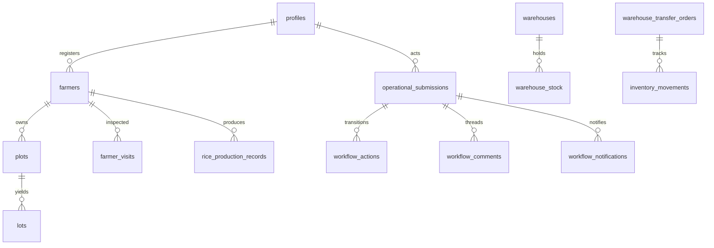

# AgriVault Database Reference

**Engine:** Supabase PostgreSQL
**Version:** 0.1.0-rc1
**Related:** [ARCHITECTURE.md](./ARCHITECTURE.md) · [WORKFLOW_ENGINE.md](./WORKFLOW_ENGINE.md) · [SECURITY.md](./SECURITY.md)

---

## Table of contents

1. [Overview](#overview)
2. [Migration history](#migration-history)
3. [Schema bootstrap paths](#schema-bootstrap-paths)
4. [Enums](#enums)
5. [Core tables](#core-tables)
6. [Workflow tables](#workflow-tables)
7. [Ministry pilot tables](#ministry-pilot-tables)
8. [Profiles and auth](#profiles-and-auth)
9. [Row Level Security](#row-level-security)
10. [Indexes and constraints](#indexes-and-constraints)
11. [TypeScript types](#typescript-types)
12. [Seeding](#seeding)

---

## Overview

AgriVault stores operational data in Supabase PostgreSQL. All client reads and writes use the anon key with the user's session JWT; Row Level Security (RLS) enforces role and county scope at the database layer.



**Type definitions:** `src/lib/supabase/types.ts`
**Baseline schema:** `src/lib/supabase/schema.sql`
**Ordered migrations:** `supabase/migrations/*.sql`

---

## Migration history

Apply migrations in filename order via `supabase db push` or the Supabase SQL editor.

| File | Date | Purpose |
|------|------|---------|
| `20260207100000_national_pilot_schema.sql` | 2026-02-07 | Baseline tables: counties, districts, profiles, farmers, plots, warehouses, inventory, rice |
| `20260207101000_auth_trigger_and_rls.sql` | 2026-02-07 | `handle_new_user()` trigger, core RLS policies |
| `20260208100000_orgs_locations_unique_for_upserts.sql` | 2026-02-08 | Unique indexes for upsert-on-conflict |
| `20260507120000_ministry_canonical.sql` | 2026-05-07 | Pilot ministry tables, farmer/warehouse extensions |
| `20260508180000_dao_workflow_rls.sql` | 2026-05-08 | DAO field role RLS updates |
| `20260509130000_warehouse_transfer_orders.sql` | 2026-05-09 | `warehouse_transfer_orders` table |
| `20260510120000_pilot_operational_events_insert_policy.sql` | 2026-05-10 | Insert policy on `pilot_operational_events` |
| `20260512120000_farmer_visits_operational_boundary.sql` | 2026-05-12 | Boundary columns on `farmer_visits` |
| `20260513110000_add_user_role_enums.sql` | 2026-05-13 | Additional `user_role` enum values |
| `20260513120000_user_role_operational_hierarchy.sql` | 2026-05-13 | Hierarchy roles + RLS refresh |
| `20260619120000_workflow_engine.sql` | 2026-06-19 | Workflow tables, `workflow_status` enum, RLS |

---

## Schema bootstrap paths

Two supported paths exist for fresh environments:

### Path A — Supabase CLI migrations

```bash
supabase db push
```

Applies all files in `supabase/migrations/` in order.

### Path B — Manual SQL editor (legacy bootstrap)

Run in order via Supabase SQL editor:

1. `src/lib/supabase/schema.sql`
2. `src/lib/supabase/schema.enterprise.sql`
3. `src/lib/supabase/schema.integrity.sql`
4. `src/lib/supabase/schema.demo_inquiries.sql`
5. `src/lib/supabase/schema.analytics.sql`
6. `src/lib/supabase/schema.notifications.sql`
7. `src/lib/supabase/schema.content.sql`
8. All files in `supabase/migrations/` (for workflow engine and pilot extensions)

---

## Enums

### `user_role`

PostgreSQL enum on `profiles.role`. TypeScript mirror: `UserRole` in `src/lib/supabase/types.ts`.

| Value | Operational group |
|-------|-------------------|
| `super_admin`, `admin` | Platform admin |
| `ministry_admin`, `ministry_officer`, `government_officer` | Ministry national |
| `county_agriculture_coordinator`, `county_officer` | CAC (county) |
| `dao_officer`, `district_officer` | DAO (district) |
| `clan_technician`, `field_agent` | CLAN (field) |
| `warehouse_manager` | Logistics |
| `cooperative_manager`, `exporter` | Registry / export |
| `donor_observer`, `donor_partner` | Donor read access |
| `auditor` | Read-only audit |
| `call_center_agent` | Call center |

### `workflow_status`

Defined in `20260619120000_workflow_engine.sql`:

```
draft → submitted → dao_review → dao_approved → cac_review → cac_approved
  → ministry_review → ministry_approved
```

Side states: `dao_corrections_requested`, `cac_corrections_requested`, `rejected`, `escalated`, `archived`

### Other enums

| Enum | Values (summary) |
|------|-----------------|
| `org_type` | cooperative, exporter, government, donor, … |
| `location_type` | farm, warehouse, port, … |
| `commodity_type` | rice, cocoa, … |
| `lot_status` | pending, verified, exported, … |
| `movement_status` | draft, in_transit, received, … |
| `compliance_status` | compliant, flagged, … |
| `deforestation_status` | clear, flagged, unknown |

---

## Core tables

### Geographic hierarchy

| Table | Key columns | Purpose |
|-------|-------------|---------|
| `counties` | `id`, `name`, `code` | County reference |
| `districts` | `id`, `county_id`, `name` | District within county |

### Registry

| Table | Key columns | Purpose |
|-------|-------------|---------|
| `organizations` | `id`, `name`, `type`, `county`, `license_number` | Cooperatives, exporters, government orgs |
| `profiles` | `id` → `auth.users`, `role`, `county`, `district`, `organization_id` | User identity and scope |
| `farmers` | `id`, `client_id`, `full_name`, `national_id`, `county`, `district`, `latitude`, `longitude`, `registered_by` | Farmer registry |
| `plots` | `id`, `client_id`, `farmer_id`, `polygon_geojson`, `area_hectares`, `commodity`, `county` | Farm boundaries |
| `farmer_visits` | `id`, `farmer_id`, `visit_type`, `boundary_geometry`, `boundary_points`, `boundary_area_ha` | Inspection visits |
| `geo_locations` | `id`, `name`, `latitude`, `longitude`, `county` | Named geo points |

### Production and commodities

| Table | Key columns | Purpose |
|-------|-------------|---------|
| `rice_production_records` | `id`, `client_id`, `farmer_id`, `plot_id`, `season`, `yield_kg`, `county`, `recorded_by` | Harvest records |
| `lots` | `id`, `lot_code`, `commodity`, `weight_kg_current`, `status`, `organization_id` | Commodity lots (cocoa) |
| `movements` | `id`, `client_id`, `lot_id`, `from_location_id`, `to_location_id`, `status` | Lot movements |

### Inventory and logistics

| Table | Key columns | Purpose |
|-------|-------------|---------|
| `warehouses` | `id`, `code`, `name`, `county`, `capacity_kg` | Warehouse registry |
| `warehouse_assignments` | `warehouse_id`, `user_id`, `role` | Staff assignments |
| `warehouse_stock` | `warehouse_id`, `item_id`, `quantity` | Current stock levels |
| `inventory_items` | `id`, `name`, `category`, `unit` | Item catalog |
| `inventory_movements` | `id`, `from_warehouse_id`, `to_warehouse_id`, `quantity`, `status` | Stock movements |
| `warehouse_transfer_orders` | `id`, `reference_code`, `status`, `from_warehouse_id`, `to_warehouse_id` | Transfer workflow orders |
| `input_allocations` | `id`, `programme`, `county`, `quantity` | Subsidy allocations |
| `distribution_logs` | `id`, `farmer_id`, `warehouse_id`, `item_id`, `quantity`, `distributed_by` | Input distribution events |
| `donor_shipments` | `id`, `donor_org_id`, `commodity`, `quantity`, `status` | Donor manifest |

### Compliance and audit

| Table | Key columns | Purpose |
|-------|-------------|---------|
| `compliance_records` | `id`, `entity_type`, `entity_id`, `status`, `findings` | Compliance flags |
| `audit_log` | `id`, `user_id`, `action`, `table_name`, `record_id`, `old_values`, `new_values`, `ip_address` | Append-only audit trail |
| `field_reports` | `id`, `report_type`, `county`, `submitted_by`, `payload` | Structured field reports |
| `food_security_indicators` | `id`, `county`, `indicator`, `value`, `period` | Food security metrics |
| `reports` | `id`, `title`, `format`, `generated_by` | Generated report metadata |

### Supplementary (manual schema files)

| Table | Schema file | Purpose |
|-------|-------------|---------|
| `app_settings` | `schema.enterprise.sql` | Application configuration |
| `demo_inquiries` | `schema.demo_inquiries.sql` | Public demo form submissions |
| `analytics_events` | `schema.analytics.sql` | Client analytics events |
| `notifications` | `schema.notifications.sql` | In-app notifications |
| `notification_reads` | `schema.notifications.sql` | Read receipts |
| `public_content_blocks` | `schema.content.sql` | CMS content blocks |
| `discrepancy_issues` | `schema.integrity.sql` | Movement discrepancy tracking |

---

## Workflow tables

Defined in `supabase/migrations/20260619120000_workflow_engine.sql`.

### `operational_submissions`

Primary workflow entity. One row per auditable operational event.

| Column | Type | Description |
|--------|------|-------------|
| `id` | UUID PK | `gen_random_uuid()` |
| `reference_code` | text | Human-readable reference (e.g. `SUB-2026-001`) |
| `submission_type` | text | See [WORKFLOW_ENGINE.md#submission-types](./WORKFLOW_ENGINE.md#submission-types) |
| `title` | text | Display title |
| `summary` | text | Short description |
| `status` | `workflow_status` | Current FSM state |
| `actor_id` | UUID FK → `profiles` | Submitting user |
| `organization_id` | UUID FK → `organizations` | Optional org scope |
| `county` | text | County scope |
| `district` | text | District scope |
| `current_assignee_id` | UUID FK → `profiles` | Active reviewer |
| `metadata` | jsonb | `dedupe_key`, `entity_refs`, `payload_snapshot` |
| `created_at`, `updated_at` | timestamptz | Timestamps |

Example metadata:

```json
{
  "dedupe_key": "farmer_registration:a1b2c3d4-e5f6-7890-abcd-ef1234567890",
  "entity_refs": {
    "farmer_id": "a1b2c3d4-e5f6-7890-abcd-ef1234567890"
  },
  "payload_snapshot": {
    "full_name": "James Kollie",
    "county": "Bong"
  }
}
```

### `workflow_actions`

Append-only transition ledger.

| Column | Type | Description |
|--------|------|-------------|
| `id` | UUID PK | |
| `submission_id` | UUID FK | Parent submission |
| `actor_id` | UUID FK → `profiles` | Acting user |
| `action` | text | `approve`, `reject`, `submit`, … |
| `from_status` | `workflow_status` | State before |
| `to_status` | `workflow_status` | State after |
| `county`, `district` | text | Scope at time of action |
| `note` | text | Optional comment |
| `metadata` | jsonb | Additional context |

### `workflow_comments`

Thread comments on submissions.

| Column | Type | Description |
|--------|------|-------------|
| `id` | UUID PK | |
| `submission_id` | UUID FK | |
| `actor_id` | UUID FK → `profiles` | |
| `body` | text | Comment text |
| `is_correction_request` | boolean | Marks correction feedback |
| `county` | text | |
| `metadata` | jsonb | |

### `workflow_assignments`

Reviewer assignment records.

| Column | Type | Description |
|--------|------|-------------|
| `id` | UUID PK | |
| `submission_id` | UUID FK | |
| `assigned_by` | UUID FK → `profiles` | |
| `assignee_id` | UUID FK → `profiles` | |
| `role_scope` | text | Expected reviewer role |
| `status` | text | `active`, `completed` |
| `county`, `district` | text | |
| `note` | text | |

### `workflow_notifications`

Directed notifications to reviewers and authors.

| Column | Type | Description |
|--------|------|-------------|
| `id` | UUID PK | |
| `submission_id` | UUID FK | |
| `recipient_id` | UUID FK → `profiles` | |
| `created_by` | UUID FK → `profiles` | |
| `kind` | text | `assigned`, `correction`, `approved`, `rejected`, `escalated` |
| `title`, `body` | text | Display content |
| `county` | text | |
| `read_at` | timestamptz | Null until read |

---

## Ministry pilot tables

| Table | Purpose |
|-------|---------|
| `pilot_dao_officers` | DAO officer roster for pilot counties |
| `pilot_operational_events` | Operational event feed for national dashboards |
| `pilot_county_metrics` | County-level KPI snapshots |

These tables fall back to canonical TypeScript arrays in `src/lib/data/` when empty. See [data-source-inventory.md](./data-source-inventory.md).

---

## Profiles and auth

### `profiles` schema

```sql
create table public.profiles (
  id          uuid primary key references auth.users(id) on delete cascade,
  email       text,
  full_name   text not null default '',
  role        user_role not null default 'field_agent',
  organization_id uuid references organizations(id),
  county      text,
  district    text,
  phone       text,
  is_active   boolean default true,
  deactivated_at timestamptz,
  created_at  timestamptz default now()
);
```

### Auth bootstrap

Trigger `on_auth_user_created` calls `handle_new_user()` which reads `raw_user_meta_data.role` from the auth signup and inserts the profiles row.

**Provision a pilot user manually:**

```sql
-- After creating user in Supabase Auth dashboard:
insert into public.profiles (id, email, full_name, role, county, district)
values (
  '<auth-user-uuid>',
  'officer@example.gov.lr',
  'District Officer Name',
  'dao_officer',
  'Bong',
  'Salala'
);
```

### TypeScript `Profile` type

```typescript
interface Profile {
  id: string;
  email?: string;
  full_name: string;
  role: UserRole;
  organization_id?: string;
  county?: string;
  district?: string;
  phone?: string;
  is_active?: boolean;
  deactivated_at?: string;
  created_at?: string;
}
```

---

## Row Level Security

RLS is enabled on all operational tables. Authorization helpers (security definer functions):

| Function | Returns true when |
|----------|-------------------|
| `profile_role()` | Current user's role |
| `profile_county()` | Current user's county |
| `profile_district()` | Current user's district |
| `is_ministry_wide()` | Role is ministry national or admin |
| `wf_is_ministry()` | Workflow ministry reviewer |
| `wf_is_reviewer()` | DAO, CAC, or ministry reviewer |
| `wf_can_create()` | CLAN, DAO, or field agent can submit |
| `wf_county_in_scope(county)` | User's county matches or ministry-wide |

### Policy summary

| Table group | SELECT | INSERT / UPDATE |
|-------------|--------|-----------------|
| `counties`, `districts` | Any authenticated | — |
| `profiles` | Self + ministry-wide | Self update; ministry-wide admin update |
| `farmers`, `plots` | County/org scoped + ministry | Field agents, DAO, county officers |
| `operational_submissions` | County scope + ministry + author/assignee | Server-validated; RLS defense-in-depth |
| `workflow_actions`, `workflow_comments` | Same as parent submission | Insert via workflow API principal |
| `warehouses`, `warehouse_stock` | Assignment + county + ministry | Ministry, warehouse managers |
| `audit_log` | Auditor + ministry | Any authenticated insert |
| `pilot_*` | Any authenticated | Operational roles for events insert |

**Important:** The workflow API (`/api/ops/workflows/submission`) validates transitions in application code before writing. RLS provides a second layer — even a direct Supabase client call cannot mutate out of county scope.

Service role key is used only in: admin API routes, analytics, demo-inquiry insert, and the `sync-batch` Edge Function. It is never used in workflow submission routes.

See [SECURITY.md](./SECURITY.md) for the full authorization model.

---

## Indexes and constraints

Key indexes from migrations:

| Table | Index | Purpose |
|-------|-------|---------|
| `farmers` | `client_id` UNIQUE | Offline upsert deduplication |
| `plots` | `client_id` UNIQUE | Offline upsert deduplication |
| `rice_production_records` | `client_id` UNIQUE | Offline upsert deduplication |
| `operational_submissions` | `metadata->>'dedupe_key'` | Workflow deduplication |
| `organizations` | `(name, county)` UNIQUE | Upsert safety |
| `locations` | `(name, organization_id)` UNIQUE | Upsert safety |

---

## TypeScript types

Primary type file: `src/lib/supabase/types.ts`

Key domain types:

```typescript
interface Farmer {
  id: string;
  client_id?: string;
  full_name: string;
  national_id?: string;
  phone?: string;
  county: string;
  district?: string;
  village?: string;
  latitude?: number;
  longitude?: number;
  registered_by?: string;
  created_at?: string;
}

interface Plot {
  id: string;
  client_id?: string;
  farmer_id: string;
  commodity?: string;
  area_hectares?: number;
  polygon_geojson?: GeoJSON.Feature;
  center_latitude?: number;
  center_longitude?: number;
  county: string;
  district?: string;
  registered_by?: string;
}

interface RiceProductionRecord {
  id: string;
  client_id?: string;
  farmer_id: string;
  plot_id?: string;
  season: string;
  yield_kg?: number;
  loss_kg?: number;
  county: string;
  district?: string;
  recorded_by?: string;
  recorded_at?: string;
}
```

---

## Seeding

| Command | Script | Purpose |
|---------|--------|---------|
| `npm run seed` | `src/lib/supabase/seed.ts` | Baseline geographic and reference data |
| Admin → Users & Roles | Protected server workflow | Unique Auth invitations and operational profiles |
| `npm run seed:ministry` | `src/lib/supabase/seed-ministry-canonical.ts` | Ministry canonical CSV fixtures |

**Requires:** `SUPABASE_SERVICE_ROLE_KEY` in environment.

Unique training accounts are invited through Admin → Users & Roles:

| Email | Role | Password |
|-------|------|----------|
| `unique Ministry presenter account` | `ministry_officer` | `user-selected private password` |
| `unique DAO presenter account` | `dao_officer` | `user-selected private password` |
| `unique Exporter presenter account` | `exporter` | `user-selected private password` |
| `unique Cooperative presenter account` | `cooperative_manager` | `user-selected private password` |

See [DEPLOYMENT_GUIDE.md](./DEPLOYMENT_GUIDE.md) for full setup procedure.

---

## Related documents

| Document | Topic |
|----------|-------|
| [WORKFLOW_ENGINE.md](./WORKFLOW_ENGINE.md) | Workflow FSM and API |
| [OFFLINE_ARCHITECTURE.md](./OFFLINE_ARCHITECTURE.md) | `client_id` upsert pattern |
| [SECURITY.md](./SECURITY.md) | RLS and auth model |
| [data-source-inventory.md](./data-source-inventory.md) | LIVE vs PILOT data paths |
