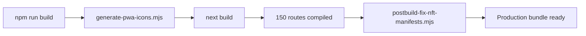
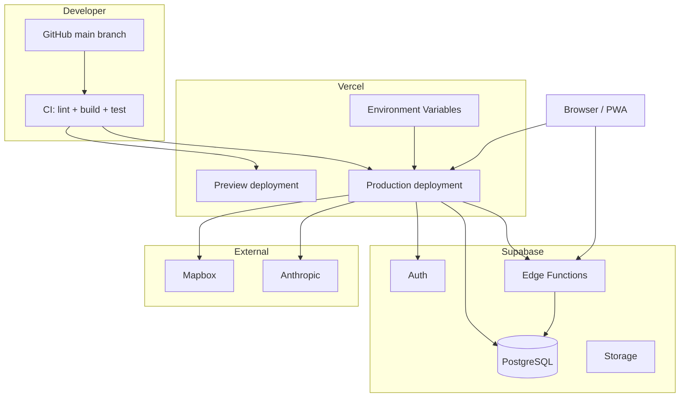

# AgriVault Deployment Guide

**Version:** 0.1.0-rc1
**Related:** [ARCHITECTURE.md](./ARCHITECTURE.md) · [SECURITY.md](./SECURITY.md) · [DATABASE.md](./DATABASE.md)

---

## Table of contents

1. [Prerequisites](#prerequisites)
2. [Environment variables](#environment-variables)
3. [Local development](#local-development)
4. [Database setup](#database-setup)
5. [Edge Function deployment](#edge-function-deployment)
6. [Vercel deployment](#vercel-deployment)
7. [Build pipeline](#build-pipeline)
8. [Seeding](#seeding)
9. [Smoke tests](#smoke-tests)
10. [Deployment diagram](#deployment-diagram)
11. [Troubleshooting](#troubleshooting)
12. [Production checklist](#production-checklist)

---

## Prerequisites

| Requirement | Version | Notes |
|-------------|---------|-------|
| Node.js | 20.x | Enforced in `package.json` engines |
| npm | 9+ | Package manager |
| Supabase project | — | Auth + Postgres + Edge Functions |
| Mapbox account | — | Public token for GIS |
| Vercel account | — | Recommended hosting |
| Supabase CLI | Latest | Optional — for migrations and Edge Functions |

---

## Environment variables

Create `agritrace/.env.local` for local development. Set all variables in Vercel Project Settings for deployment.

### Required

| Variable | Scope | Description |
|----------|-------|-------------|
| `NEXT_PUBLIC_SUPABASE_URL` | Client + server | Supabase project URL (`https://xxx.supabase.co`) |
| `NEXT_PUBLIC_SUPABASE_ANON_KEY` | Client + server | Supabase anon/public key |
| `SUPABASE_SERVICE_ROLE_KEY` | Server only | Service role key — never expose to browser |
| `NEXT_PUBLIC_MAPBOX_TOKEN` | Client | Mapbox public token (`pk.eyJ...`) |

### Recommended

| Variable | Scope | Description |
|----------|-------|-------------|
| `NEXT_PUBLIC_APP_URL` | Client | Canonical app URL for metadata and OG tags |
| `ANTHROPIC_API_KEY` | Server | Required for `/api/ai/chat` |
| `ANTHROPIC_MODEL` | Server | Default: `claude-3-haiku-20240307` |
| `NEXT_PUBLIC_SENTRY_DSN` | Client + build | Sentry public DSN — enables error monitoring |
| `SENTRY_ENVIRONMENT` | Server + client | e.g. `production`, `preview`, `development` |
| `UPSTASH_REDIS_REST_URL` | Server | Distributed rate limiting (Upstash Redis REST) |
| `UPSTASH_REDIS_REST_TOKEN` | Server | Upstash REST token — server only |

### Optional

| Variable | Default | Description |
|----------|---------|-------------|
| `NEXT_PUBLIC_ENABLE_HOMEPAGE_EXPERIMENT` | enabled | Set `"false"` to disable A/B cookie on `/` |
| `NEXT_PUBLIC_SHOW_DEMO_RAIL` | off | Set `"true"` to show demo rail in dashboard shell |
| `VERCEL_PROJECT_PRODUCTION_URL` | auto | Vercel auto-set; used in metadata fallback |
| `SENTRY_DSN` | — | Server Sentry DSN if different from public DSN |
| `SENTRY_AUTH_TOKEN` | — | Build-time token for source map upload (CI/Vercel only) |
| `SENTRY_ORG` | — | Sentry organization slug (source maps) |
| `SENTRY_PROJECT` | — | Sentry project slug (source maps) |
| `SENTRY_RELEASE` | `VERCEL_GIT_COMMIT_SHA` | Release tag in Sentry |
| `SENTRY_TRACES_SAMPLE_RATE` | `0.1` prod | Performance trace sampling `0.0`–`1.0` |
| `KV_REST_API_URL` | — | Vercel KV REST URL (alternative to Upstash) |
| `KV_REST_API_TOKEN` | — | Vercel KV REST token |

### Example `.env.local`

```bash
NEXT_PUBLIC_SUPABASE_URL=https://your-project.supabase.co
NEXT_PUBLIC_SUPABASE_ANON_KEY=eyJhbGciOiJIUzI1NiIsInR5cCI6IkpXVCJ9...
SUPABASE_SERVICE_ROLE_KEY=eyJhbGciOiJIUzI1NiIsInR5cCI6IkpXVCJ9...
NEXT_PUBLIC_MAPBOX_TOKEN=pk.eyJ1IjoieW91ci11c2VyIiwiYSI6ImNt...
NEXT_PUBLIC_APP_URL=http://localhost:3000
ANTHROPIC_API_KEY=sk-ant-...
```

### Environment validation

| Surface | Path | Checks |
|---------|------|--------|
| Health page | `/health` | Env var presence |
| Health API | `/api/health` | App + Supabase + Mapbox config (JSON, no secrets) |
| Setup page | `/setup` | First-run bootstrap instructions |
| Admin launch readiness | `/admin/launch-readiness` | Env + table presence matrix |
| Admin system | `/admin/system` | Runtime configuration display |

---

## Local development

```bash
cd agritrace
npm install
cp .env.example .env.local   # configure variables
npm run dev
```

Development server starts at `http://localhost:3000`.

`WATCHPACK_POLLING=true` is set in the dev script for file watcher compatibility on some systems.

### First super admin

1. Create user in Supabase Auth dashboard
2. Visit `/setup` for the SQL snippet, or run:

```sql
insert into public.profiles (id, email, full_name, role, county)
values (
  '<auth-user-uuid>',
  'admin@example.gov.lr',
  'Platform Administrator',
  'super_admin',
  'Montserrado'
);
```

3. Sign in at `/login` → lands on `/command-center`

---

## Database setup

### Path A — Supabase CLI (recommended)

```bash
# Link to your project
supabase link --project-ref your-project-ref

# Apply all migrations in order
supabase db push
```

Migration files (apply in filename order):

```
supabase/migrations/20260207100000_national_pilot_schema.sql
supabase/migrations/20260207101000_auth_trigger_and_rls.sql
supabase/migrations/20260208100000_orgs_locations_unique_for_upserts.sql
supabase/migrations/20260507120000_ministry_canonical.sql
supabase/migrations/20260508180000_dao_workflow_rls.sql
supabase/migrations/20260509130000_warehouse_transfer_orders.sql
supabase/migrations/20260510120000_pilot_operational_events_insert_policy.sql
supabase/migrations/20260512120000_farmer_visits_operational_boundary.sql
supabase/migrations/20260513110000_add_user_role_enums.sql
supabase/migrations/20260513120000_user_role_operational_hierarchy.sql
supabase/migrations/20260619120000_workflow_engine.sql
```

### Path B — SQL editor (manual bootstrap)

Run in Supabase SQL editor in order:

1. `src/lib/supabase/schema.sql`
2. `src/lib/supabase/schema.enterprise.sql`
3. `src/lib/supabase/schema.integrity.sql`
4. `src/lib/supabase/schema.demo_inquiries.sql`
5. `src/lib/supabase/schema.analytics.sql`
6. `src/lib/supabase/schema.notifications.sql`
7. `src/lib/supabase/schema.content.sql`
8. All files in `supabase/migrations/`

See [DATABASE.md](./DATABASE.md) for full schema reference.

---

## Edge Function deployment

The offline sync pipeline requires the `sync-batch` Edge Function.

```bash
supabase functions deploy sync-batch
```

**Function path:** `supabase/functions/sync-batch/index.ts`

**Required secrets** (set in Supabase dashboard → Edge Functions → Secrets):

```
SUPABASE_URL=https://your-project.supabase.co
SUPABASE_SERVICE_ROLE_KEY=eyJ...
```

**Verify deployment:**

```bash
curl -X POST https://your-project.supabase.co/functions/v1/sync-batch \
  -H "Authorization: Bearer <anon-key>" \
  -H "Content-Type: application/json" \
  -d '{ "farmers": [], "plots": [], "production_records": [] }'
```

Expected response:
```json
{ "farmers": { "synced": 0, "failed": 0, "errors": [] }, "plots": { ... }, "production_records": { ... } }
```

See [OFFLINE_ARCHITECTURE.md](./OFFLINE_ARCHITECTURE.md).

---

## Vercel deployment

No `vercel.json` in the repository — standard Next.js deployment.

### Project settings

| Setting | Value |
|---------|-------|
| Framework preset | Next.js |
| Root directory | `agritrace` |
| Node.js version | 20.x |
| Build command | `npm run build` (default) |
| Output directory | `.next` (default) |

### Deploy steps

```bash
# Install Vercel CLI
npm i -g vercel

# From agritrace directory
cd agritrace
vercel

# Production deployment
vercel --prod
```

Or connect the GitHub repository in Vercel dashboard with root directory set to `agritrace`.

### Environment variables in Vercel

Add all required variables in Project Settings → Environment Variables for Production, Preview, and Development scopes.

**Critical:** `SUPABASE_SERVICE_ROLE_KEY` must be marked as sensitive and never prefixed with `NEXT_PUBLIC_`.

---

## Build pipeline

```bash
npm run lint          # ESLint — must pass
npm run build         # PWA icons + next build + postbuild fix
npm run test:workflow # 29 unit checks — must pass
```

### Build stages



| Stage | Script | Output |
|-------|--------|--------|
| PWA icons | `scripts/generate-pwa-icons.mjs` | `public/icons/pwa-*.png` |
| Next.js build | `next build` | `.next/` production bundle |
| Postbuild fix | `scripts/postbuild-fix-nft-manifests.mjs` | NFT manifest repair |

### Build output (RC1)

- 150 compiled routes
- Shared First Load JS: 88 kB
- Middleware bundle: 81.9 kB
- Heaviest pages: `/county-dashboard` (212 kB), `/gis-intelligence` (196 kB)

### CI recommendation

```yaml
# .github/workflows/ci.yml (recommended)
- run: npm run lint
- run: npm run build
- run: npm run test:workflow
```

---

## Seeding

All seed scripts require `SUPABASE_SERVICE_ROLE_KEY`.

```bash
# Baseline geographic and reference data
npm run seed

# Demo login accounts + pilot fixtures (training environments)
Admin Users & Roles invitation workflow

# Ministry canonical CSV fixtures
npm run seed:ministry
```

### Unique training accounts

| Email | Role | Password | Landing |
|-------|------|----------|---------|
| `unique Ministry presenter account` | `ministry_officer` | `user-selected private password` | `/command-center` |
| `unique DAO presenter account` | `dao_officer` | `user-selected private password` | `/district-dashboard` |
| `unique Exporter presenter account` | `exporter` | `user-selected private password` | `/cocoa/lots` |
| `unique Cooperative presenter account` | `cooperative_manager` | `user-selected private password` | `/cocoa/farmers` |

Provision every training user individually and keep training identities isolated
from production operational data.

---

## Smoke tests

Run after every deployment to staging or production.

### Automated

```bash
npm run test:workflow
# Expected: All 29 workflow checks passed.
```

### Manual smoke test script

```bash
# 1. Public homepage
curl -s -o /dev/null -w "%{http_code}" https://your-app.vercel.app/
# Expected: 200

# 2. Health check
curl https://your-app.vercel.app/health
# Expected: env status JSON

# 3. Request ID header
curl -I https://your-app.vercel.app/login | grep x-request-id
# Expected: x-request-id: <uuid>

# 4. Rate limit (demo inquiry — run 11 times quickly)
for i in $(seq 1 11); do
  curl -s -o /dev/null -w "%{http_code}\n" \
    -X POST https://your-app.vercel.app/api/demo-inquiry \
    -H "Content-Type: application/json" \
    -d '{"full_name":"Test","email":"test@example.com"}'
done
# Expected: 11th response = 429

# 5. Executive briefing auth (no session)
curl -s -o /dev/null -w "%{http_code}" \
  https://your-app.vercel.app/api/reports/executive-briefing
# Expected: 401
```

### Operational smoke test (manual)

| Step | Action | Expected |
|------|--------|----------|
| 1 | Login as `unique Ministry presenter account` | Lands on `/command-center` |
| 2 | Login as `unique DAO presenter account` | Lands on `/district-dashboard` |
| 3 | Navigate to `/map` | Mapbox tiles load (no CSP errors) |
| 4 | Navigate to `/verification-queue` as DAO | Workflow action buttons visible |
| 5 | Submit field report as CLAN | Appears in DAO verification queue |
| 6 | DAO approve → CAC approve → Ministry approve | Status reaches `ministry_approved` |
| 7 | Export executive briefing PDF | PDF downloads (authenticated) |
| 8 | Install PWA from login page | App added to home screen |
| 9 | Capture boundary offline → sync | Pending count reaches 0 |
| 10 | Check Data Source badges | LIVE/PILOT badges visible on dashboards |

Full pilot checklist: [PILOT_CHECKLIST.md](./PILOT_CHECKLIST.md).

---

## Deployment diagram



---

## Troubleshooting

| Symptom | Cause | Resolution |
|---------|-------|------------|
| All routes accessible without login | Supabase env vars missing | Set `NEXT_PUBLIC_SUPABASE_URL` and anon key |
| Maps blank | Mapbox token missing | Set `NEXT_PUBLIC_MAPBOX_TOKEN`; redeploy |
| CSP errors in console | Missing Mapbox/Supabase in CSP | Verify `next.config.mjs` deployed; check connect-src |
| Build fails on icons | Sharp/node issue | Run `node scripts/generate-pwa-icons.mjs` manually |
| Sync never completes | Edge Function not deployed | `supabase functions deploy sync-batch` |
| Workflow buttons disabled | Wrong role or demo fixture row | Confirm session role; check `submissionId` is real UUID |
| 401 on all API routes | Session cookie not sent | Verify Supabase auth cookie domain matches deployment URL |
| Demo login fails | Demo users not seeded | Run `Admin Users & Roles invitation workflow` |
| PDF export 401 | Not authenticated | Sign in before calling `/api/reports/executive-briefing` |
| Rate limit in dev | Previous test run | Wait 60 seconds; limits are per-instance |

---

## Production checklist

Before Ministry pilot go-live:

- [ ] All required env vars set in Vercel Production
- [ ] `supabase db push` applied — workflow tables exist
- [ ] `sync-batch` Edge Function deployed and tested
- [ ] Mapbox token configured and maps load on staging
- [ ] `npm run lint && npm run build && npm run test:workflow` pass
- [ ] Unique training accounts seeded (training) or production users provisioned
- [ ] HSTS confirmed on custom domain
- [ ] CSP smoke: no console violations on login + maps + auth
- [ ] Executive briefing PDF requires auth (401 without session)
- [ ] Rate limit smoke: 11th demo-inquiry → 429
- [ ] End-to-end workflow: CLAN submit → Ministry approve
- [ ] Offline sync tested on CLAN device
- [ ] [PILOT_CHECKLIST.md](./PILOT_CHECKLIST.md) Phase 1 complete

---

## Related documents

| Document | Topic |
|----------|-------|
| [SECURITY.md](./SECURITY.md) | Security configuration |
| [DATABASE.md](./DATABASE.md) | Schema and migrations |
| [OFFLINE_ARCHITECTURE.md](./OFFLINE_ARCHITECTURE.md) | Edge Function detail |
| [RELEASE_NOTES_RC1.md](./RELEASE_NOTES_RC1.md) | RC1 verification results |
| [PILOT_CHECKLIST.md](./PILOT_CHECKLIST.md) | Pilot launch checklist |
| [production-readiness.md](./production-readiness.md) | HTTP infrastructure detail |
