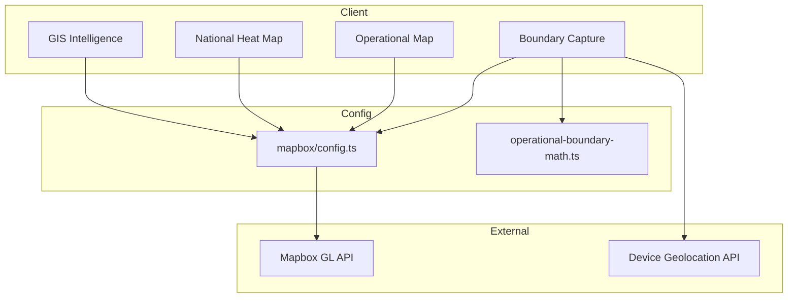
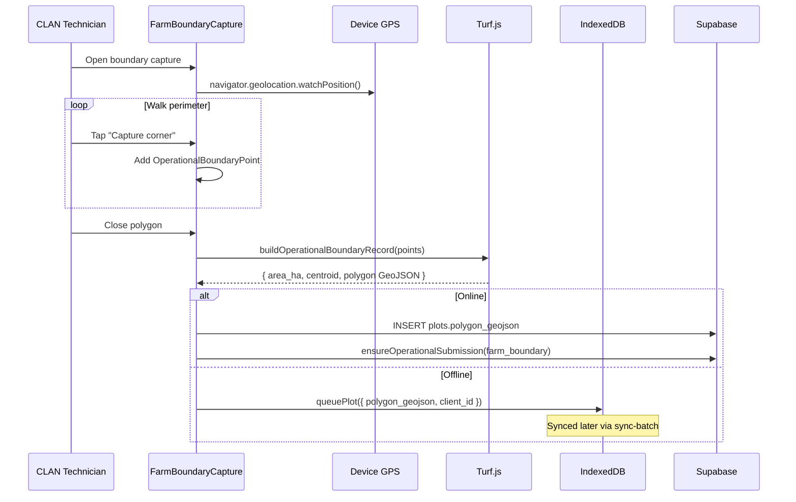
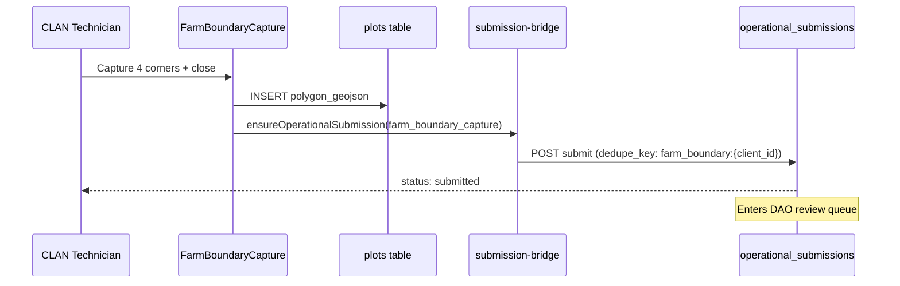
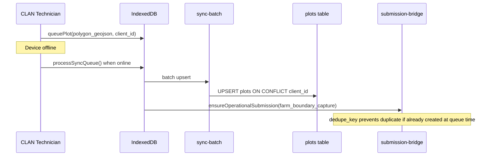

# AgriVault GIS Architecture

**Version:** 0.1.0-rc1  
**Related:** [ARCHITECTURE.md](./ARCHITECTURE.md) · [OFFLINE_ARCHITECTURE.md](./OFFLINE_ARCHITECTURE.md) · [SECURITY.md](./SECURITY.md)

---

## Table of contents

1. [Overview](#overview)
2. [Mapbox configuration](#mapbox-configuration)
3. [GIS routes and access control](#gis-routes-and-access-control)
4. [Component map](#component-map)
5. [Boundary capture flow](#boundary-capture-flow)
6. [Geometry processing](#geometry-processing)
7. [Operational maps](#operational-maps)
8. [County geo data](#county-geo-data)
9. [Performance considerations](#performance-considerations)
10. [Sequence diagrams](#sequence-diagrams)

---

## Overview

AgriVault uses Mapbox GL for all interactive map surfaces. GPS boundary capture, operational map views, national heat maps, and GIS intelligence workspaces share a common configuration layer and Turf.js geometry utilities.



All Mapbox components use `dynamic(..., { ssr: false })` — Mapbox GL requires browser APIs and cannot render on the server.

---

## Mapbox configuration

**File:** `src/lib/mapbox/config.ts`

| Export | Value | Purpose |
|--------|-------|---------|
| `LIBERIA_CENTER` | `{ longitude: -9.4295, latitude: 6.4281 }` | Default map center |
| `LIBERIA_ZOOM` | `6.5` | Default national zoom |
| `mapboxToken()` | throws if missing | Strict token for production maps |
| `optionalMapboxToken()` | returns `null` if unset | Graceful degradation |

### Environment variable

```
NEXT_PUBLIC_MAPBOX_TOKEN=pk.eyJ1...
```

Without this variable, map components render a token-missing state with setup instructions rather than crashing.

### Content Security Policy

Mapbox domains allowed in `next.config.mjs`:

| Directive | Allowed origins |
|-----------|----------------|
| `connect-src` | `https://api.mapbox.com`, `https://events.mapbox.com`, `https://*.tiles.mapbox.com` |
| `img-src` | `https://*.mapbox.com` |
| `worker-src` | `'self' blob:` (Mapbox GL web workers) |
| `child-src` | `'self' blob:` |

---

## GIS routes and access control

Access policy: `src/lib/auth/workspace-access.ts`

| Route | Component | Access |
|-------|-----------|--------|
| `/field/boundary-capture` | `BoundaryCaptureStandalone` | CLAN, DAO, CAC, Ministry |
| `/map` | `MapOperationalWorkspace` | CLAN, DAO, CAC, Ministry |
| `/geo-registry` | Geo registry page | CLAN, DAO, CAC, Ministry |
| `/national-heat-map` | `NationalHeatMapWorkspace` | CLAN, DAO, CAC, Ministry (not donor/auditor) |
| `/gis-intelligence` | `GisIntelligenceWorkspace` | Ministry + CAC only (advanced) |

### Layout mode

`/field/boundary-capture` and `/gis-intelligence` use map layout mode (`src/lib/navigation/layout-mode.ts`) — full-bleed map with minimal sidebar chrome.

### Access helper functions

```typescript
canAccessPilotPrimaryGis(role)      // /map, /geo-registry, /field/boundary-capture
canAccessAdvancedGisIntelligence(role)  // /gis-intelligence — ministry + CAC only
canAccessNationalHeatMap(role)        // /national-heat-map
```

---

## Component map

| Component | Path | Used on |
|-----------|------|---------|
| `FarmBoundaryCapture` | `src/components/gis/FarmBoundaryCapture.tsx` | Boundary capture, field forms |
| `BoundaryCaptureStandalone` | `src/components/field/BoundaryCaptureStandalone.tsx` | `/field/boundary-capture` |
| `GisIntelligenceWorkspace` | `src/components/gis/GisIntelligenceWorkspace.tsx` | `/gis-intelligence` |
| `GisIntelligenceMap` | `src/components/gis/GisIntelligenceMap.tsx` | GIS workspace |
| `MapOperationalWorkspace` | `src/components/maps/MapOperationalWorkspace.tsx` | `/map` |
| `NationalHeatMapWorkspace` | `src/components/maps/NationalHeatMapWorkspace.tsx` | `/national-heat-map` |
| `CountyHeatmap` | `src/components/maps/CountyHeatmap.tsx` | Heat map layers |
| `FarmPlotMap` | `src/components/maps/FarmPlotMap.tsx` | Plot visualization |
| `MovementMap` | `src/components/maps/MovementMap.tsx` | Logistics/cocoa |
| `MapLayerLegend` | `src/components/maps/MapLayerLegend.tsx` | Layer toggle controls |
| `LogisticsNetworkMap` | `src/components/logistics/LogisticsNetworkMap.tsx` | `/logistics` |
| `CaoCountyOperationsMap` | `src/components/cao/CaoCountyOperationsMap.tsx` | County dashboard |
| `LiberiaCountyMap` | `src/components/ais/LiberiaCountyMap.tsx` | AIS dashboards |

All components import `mapbox-gl/dist/mapbox-gl.css` and initialize with `mapboxToken()` or `optionalMapboxToken()`.

---

## Boundary capture flow

Primary route: `/field/boundary-capture?farmer=<uuid>`



### GPS accuracy thresholds

`FarmBoundaryCapture` displays warnings based on `gps_accuracy_m`:

| Accuracy | UI state |
|----------|----------|
| ≤ 10 m | Good — capture enabled |
| 10–35 m | Caution warning |
| 35–55 m | Strong warning |
| > 55 m | Strong warning — capture discouraged |
| > 120 m | Extreme — capture blocked |

### Captured data shape

Stored in `plots.polygon_geojson` as GeoJSON Feature:

```json
{
  "type": "Feature",
  "geometry": {
    "type": "Polygon",
    "coordinates": [[[-9.43, 6.42], [-9.42, 6.42], [-9.42, 6.43], [-9.43, 6.43], [-9.43, 6.42]]]
  },
  "properties": {
    "captured_points": [
      { "latitude": 6.42, "longitude": -9.43, "accuracy_m": 8.2, "captured_at": "2026-07-03T10:00:00Z" }
    ],
    "captured_at": "2026-07-03T10:05:00Z",
    "area_ha": 1.24
  }
}
```

Also persisted on `farmer_visits` when captured during inspection:

| Column | Type |
|--------|------|
| `boundary_geometry` | jsonb (GeoJSON) |
| `boundary_points` | jsonb (point array) |
| `boundary_area_ha` | numeric |
| `boundary_captured_at` | timestamptz |

Migration: `20260512120000_farmer_visits_operational_boundary.sql`

### DAO GPS evidence

District dashboard `DaoGpsEvidenceForm` captures point/field evidence as `gps_verification` workflow submissions without full polygon capture.

---

## Geometry processing

**File:** `src/lib/gis/operational-boundary-math.ts`  
**Types:** `src/lib/gis/operational-boundary-types.ts`

### Turf.js usage

| Function | Turf module | Purpose |
|----------|-------------|---------|
| `estimateAreasSqm()` | `@turf/area` | Polygon area in square metres |
| `polygonCentroidLngLat()` | `@turf/centroid` | Polygon center point |
| `ringFromPoints()` | `@turf/helpers` | Close point ring for polygon |
| `polygonFromPoints()` | `@turf/helpers` | Build GeoJSON Polygon |

### Key functions

```typescript
// Build complete boundary record from captured corner points
buildOperationalBoundaryRecord(points: OperationalBoundaryPoint[]): OperationalFarmBoundary

// Convert persisted plot GeoJSON back to boundary record
operationalBoundaryFromPlotGeoJson(geojson: GeoJSON.Feature): OperationalFarmBoundary

// Convert DB row to boundary record
operationalBoundaryFromPersistedRow(row: FarmerVisitRow): OperationalFarmBoundary
```

### Area conversion

```typescript
const areaSqm = estimateAreasSqm(polygon);
const areaHa = areaSqm / 10_000;
const areaAcres = areaSqm / 4_046.86;
```

---

## Operational maps

### `/map` — Operational map workspace

`MapOperationalWorkspace` displays farmer plots, warehouse locations, and operational events on a Mapbox base map. Layer toggles via `MapLayerLegend`.

Data sources: LIVE Supabase geo queries + PILOT fixtures with `DataSourceBadge` disclosure.

### `/national-heat-map` — National heat map

`NationalHeatMapWorkspace` + `CountyHeatmap` render county-level operational indicators as choropleth layers over Liberia county boundaries.

Accessible to all operational chain roles (CLAN through Ministry).

### `/gis-intelligence` — Advanced GIS workspace

`GisIntelligenceWorkspace` provides multi-layer GIS analysis for Ministry and CAC users. Marked as advanced/experimental — not part of core CLAN/DAO pilot workflow.

First Load JS: ~196 kB — heaviest GIS page. See [RELEASE_NOTES_RC1.md](./RELEASE_NOTES_RC1.md).

### County dashboard map

`CaoCountyOperationsMap` embedded in `/county-dashboard` shows county-scoped operational events and warehouse signals.

---

## County geo data

| File | Contents |
|------|----------|
| `src/lib/gis/liberia-county-geo.ts` | County boundary GeoJSON features |
| `src/lib/ais/liberia-counties.ts` | County metadata (name, code, population) |

County boundaries used for choropleth rendering in heat maps and GIS intelligence layers.

---

## Performance considerations

| Concern | Mitigation |
|---------|------------|
| Mapbox bundle size | Dynamic import with `ssr: false` on all map components |
| GPS battery drain | `watchPosition` stopped when capture complete |
| Large polygon payloads | Geometry stripped from workflow `payload_snapshot`; full GeoJSON in `plots` table only |
| CSP worker requirements | `worker-src blob:` required for Mapbox GL — do not remove from CSP |
| Token missing in dev | `optionalMapboxToken()` prevents crash; shows setup UI |

### Bundle sizes (production build)

| Route | First Load JS |
|-------|--------------|
| `/field/boundary-capture` | 169 kB |
| `/map` | 113 kB |
| `/national-heat-map` | 112 kB |
| `/gis-intelligence` | 196 kB |
| `/geo-registry` | 164 kB |

---

## Sequence diagrams

### Online boundary capture with workflow



### Offline boundary with deferred workflow



---

## Related documents

| Document | Topic |
|----------|-------|
| [OFFLINE_ARCHITECTURE.md](./OFFLINE_ARCHITECTURE.md) | Offline plot queue and sync |
| [WORKFLOW_ENGINE.md](./WORKFLOW_ENGINE.md) | farm_boundary submission type |
| [SECURITY.md](./SECURITY.md) | CSP Mapbox allowlist |
| [DEPLOYMENT_GUIDE.md](./DEPLOYMENT_GUIDE.md) | Mapbox token configuration |
| [CLAN_FIELD_GUIDE.md](./CLAN_FIELD_GUIDE.md) | Field technician GPS procedures |
