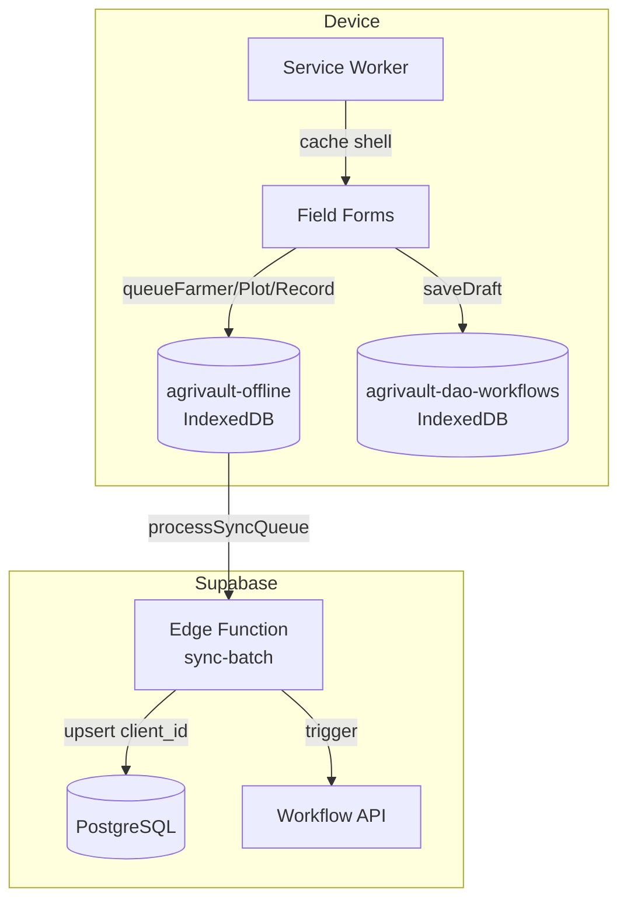
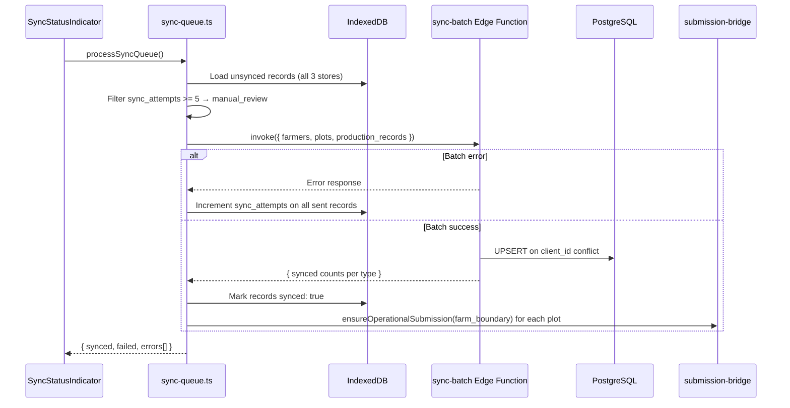
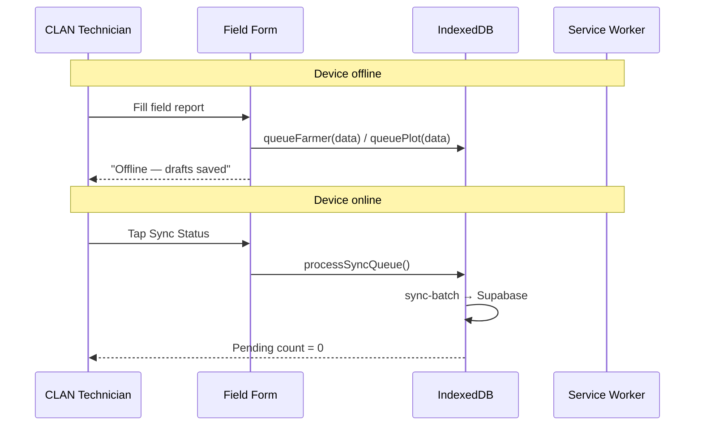
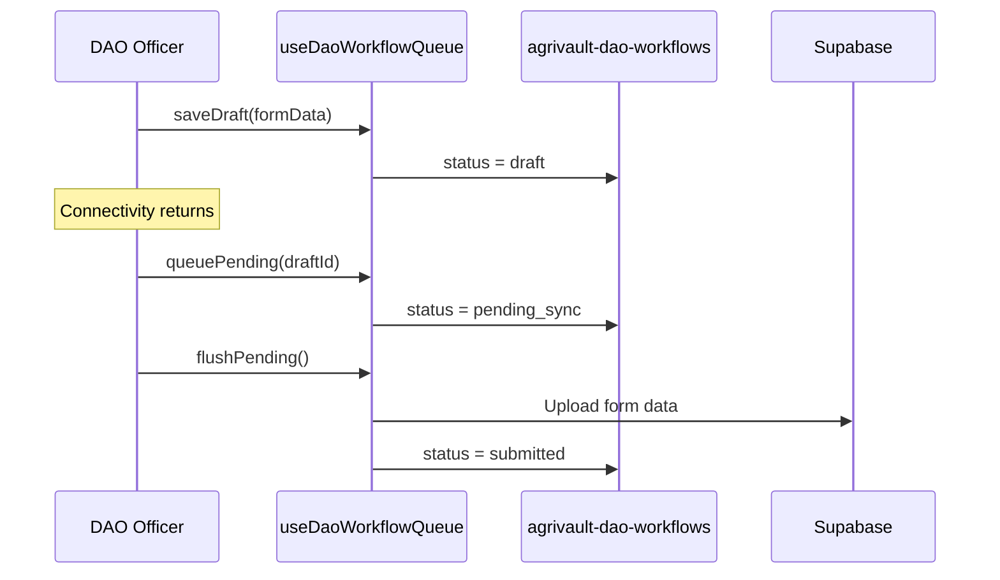

# AgriVault Offline Architecture

**Version:** 0.1.0-rc1  
**Related:** [ARCHITECTURE.md](./ARCHITECTURE.md) · [WORKFLOW_ENGINE.md](./WORKFLOW_ENGINE.md) · [DATABASE.md](./DATABASE.md)

---

## Table of contents

1. [Overview](#overview)
2. [Design constraints](#design-constraints)
3. [IndexedDB schema](#indexeddb-schema)
4. [Sync queue](#sync-queue)
5. [Edge Function sync-batch](#edge-function-sync-batch)
6. [DAO workflow queue](#dao-workflow-queue)
7. [PWA architecture](#pwa-architecture)
8. [Retry and error handling](#retry-and-error-handling)
9. [UI surfaces](#ui-surfaces)
10. [Sequence diagrams](#sequence-diagrams)
11. [Operational procedures](#operational-procedures)

---

## Overview

AgriVault field operations must function in low-connectivity rural areas. The offline architecture queues capture data locally in IndexedDB and synchronizes to Supabase when connectivity returns.



Two independent offline stores serve different roles:

| Store | Database | Used by |
|-------|----------|---------|
| Field capture queue | `agrivault-offline` | CLAN technicians |
| DAO workflow queue | `agrivault-dao-workflows` | DAO district forms |

---

## Design constraints

| Constraint | Implementation |
|------------|----------------|
| No data loss on connectivity drop | Write to IndexedDB before network attempt |
| Idempotent sync | `client_id` UUID upsert on conflict |
| Audit trail after sync | `ensureOperationalSubmission()` after plot sync |
| Retry without duplicate records | `sync_attempts` counter; dedupe keys in workflow |
| PWA installable | Web manifest + service worker |
| Manual review after persistent failure | 5-attempt cap → `manual_review` flag |

---

## IndexedDB schema

**File:** `src/lib/offline/db.ts`  
**Database name:** `agrivault-offline`  
**Version:** `1`

### Object stores

All stores use `client_id` (UUID) as keyPath.

| Store | Record shape |
|-------|-------------|
| `pending_farmers` | `{ client_id, data: FarmerInsert, created_at, sync_attempts, synced }` |
| `pending_plots` | `{ client_id, data: PlotInsert, created_at, sync_attempts, synced }` |
| `pending_production_records` | `{ client_id, data: RiceProductionRecordInsert, created_at, sync_attempts, synced }` |

### Record lifecycle

```
created → synced: false, sync_attempts: 0
       → [sync attempt fails] → sync_attempts++
       → [sync_attempts >= 5] → manual_review (excluded from auto-sync)
       → [sync success] → synced: true
```

### Enqueue API

```typescript
// src/lib/offline/sync-queue.ts

await queueFarmer(farmerData);          // → pending_farmers
await queuePlot(plotData);              // → pending_plots
await queueProductionRecord(recordData); // → pending_production_records
```

Each function generates a UUID `client_id`, stores the record with `synced: false`, and returns the client ID for UI reference.

---

## Sync queue

**File:** `src/lib/offline/sync-queue.ts`

### `processSyncQueue()`

Called from `SyncStatusIndicator` in the topbar when the user triggers sync or when connectivity returns.



**Return value:**

```typescript
{
  synced: number;    // Successfully uploaded records
  failed: number;    // Records at retry limit or batch failure
  errors: string[];  // Error messages including manual_review flags
}
```

### Individual sync functions

**File:** `src/lib/offline/sync-functions.ts`

Direct Supabase upsert fallback (alternative to batch):

```typescript
await syncFarmer(data);           // upsert farmers onConflict: client_id
await syncPlot(data);             // upsert plots onConflict: client_id
await syncProductionRecord(data); // upsert rice_production_records onConflict: client_id
```

### Queue metadata

LocalStorage key `av_offline_queue_clear_at` records the last queue clear timestamp via `recordQueueClearTimestamp()` / `readQueueClearTimestamp()`.

---

## Edge Function sync-batch

**Path:** `supabase/functions/sync-batch/index.ts`  
**Runtime:** Deno (Supabase Edge Functions)

### Environment variables

| Variable | Purpose |
|----------|---------|
| `SUPABASE_URL` | Supabase project URL |
| `SUPABASE_SERVICE_ROLE_KEY` | Service role for bypassing RLS on upsert |

### Request

```http
POST /functions/v1/sync-batch
Content-Type: application/json
Authorization: Bearer <anon-or-user-jwt>

{
  "farmers": [
    {
      "client_id": "550e8400-e29b-41d4-a716-446655440000",
      "full_name": "James Kollie",
      "county": "Bong",
      "district": "Salala",
      "registered_by": "<user-uuid>"
    }
  ],
  "plots": [
    {
      "client_id": "660e8400-e29b-41d4-a716-446655440001",
      "farmer_id": "550e8400-e29b-41d4-a716-446655440000",
      "polygon_geojson": { "type": "Feature", "geometry": { "type": "Polygon", "coordinates": [...] } },
      "area_hectares": 1.2,
      "county": "Bong"
    }
  ],
  "production_records": []
}
```

### Response

```json
{
  "farmers": { "synced": 1, "failed": 0, "errors": [] },
  "plots": { "synced": 1, "failed": 0, "errors": [] },
  "production_records": { "synced": 0, "failed": 0, "errors": [] }
}
```

Upsert uses `onConflict: "client_id"` — re-syncing the same record is idempotent.

After plot sync, the client calls `ensureOperationalSubmission({ kind: "farm_boundary_capture", ... })` to create the workflow record. Dedupe key `farm_boundary:{plot_client_id}` prevents duplicate workflow rows on re-sync.

---

## DAO workflow queue

**File:** `src/lib/dao/dao-workflow-db.ts`  
**Database name:** `agrivault-dao-workflows`  
**Hook:** `src/hooks/useDaoWorkflowQueue.ts`

### Object store

| Store | Indexes |
|-------|---------|
| `dao_queue` | `by-status`, `by-updated` |

### Status lifecycle

| Status | Label | Meaning |
|--------|-------|---------|
| `draft` | Draft | Saved locally, not queued for sync |
| `pending_sync` | Pending Sync | Queued, awaiting connectivity |
| `submitted` | Submitted | Successfully uploaded to Supabase |
| `failed` | Sync Failed | Upload failed; retry available |

### Hook API

```typescript
const {
  items,           // Current queue items
  saveDraft,       // Save form as draft
  queuePending,    // Mark for sync
  markSubmitted,   // Mark individual item submitted
  flushPending,    // Batch upload all pending items
  retryOne,        // Retry single failed item
  pendingCount,    // Count of pending_sync items
} = useDaoWorkflowQueue();
```

Used by: `DistrictOfficerDashboard`, `CountyOfficerDashboard`.

The DAO workspace displays a **Live Queue Stat** showing real IndexedDB pending count.

---

## PWA architecture

```mermaid
graph LR
  subgraph Browser
    MAN[manifest.webmanifest]
    SW[public/sw.js]
    REG[PwaRegistrar.tsx]
    PAGE[App Pages]
  end

  MAN -->|install prompt| REG
  REG -->|register /sw.js| SW
  SW -->|precache| PAGE
  SW -->|navigate fallback| OFFLINE[/offline]
```

### Web manifest

**File:** `src/app/manifest.ts` → served at `/manifest.webmanifest`

| Field | Value |
|-------|-------|
| `name` | AgriVault |
| `short_name` | AgriVault |
| `theme_color` | `#0b1220` |
| `background_color` | `#0b1220` |
| `display` | `standalone` |
| Icons | `pwa-192.png`, `pwa-512.png`, `pwa-512-maskable.png` |

Icons generated at build by `scripts/generate-pwa-icons.mjs`.

### Service worker

**File:** `public/sw.js`

| Feature | Implementation |
|---------|----------------|
| Cache name | `agrivault-offline-v2` |
| Precache | `/`, `/offline`, `/favicon.ico`, `/og.svg`, PWA icons |
| Navigation fallback | Offline → serve `/offline` page |
| Strategy | Cache-first for shell; network for API |

Registration: `src/components/pwa/PwaRegistrar.tsx` registers `/sw.js` with scope `/`.

Cache headers (`next.config.mjs`):
- `/sw.js`: `must-revalidate` (always check for updates)
- `/icons/*`: `immutable` 1 year

### Install prompt

`src/components/pwa/install-prompt-context.tsx` manages the beforeinstallprompt event.  
Login page renders `InstallAppButton` — "Install for Offline Use".

### Offline fallback page

**Route:** `/offline` (`src/app/offline/page.tsx`)  
Static page shown when navigation fails and service worker serves cached fallback.

---

## Retry and error handling

| Condition | Behavior |
|-----------|----------|
| Network unavailable | Records stay in IndexedDB; UI shows "Offline — drafts saved" |
| Batch sync HTTP error | All in-flight records: `sync_attempts++` |
| `sync_attempts >= 5` | Record excluded from auto-sync; error `manual_review:<client_id> exceeded retry limit` |
| Partial batch success | Per-type synced counts returned; failed types retried individually |
| Plot sync + workflow bridge failure | Plot synced; workflow submission may fail independently (logged) |

### Manual review recovery

1. Identify stuck records via `getSyncErrors()` or topbar sync indicator error list
2. DAO officer re-submits from district dashboard form
3. Administrator can clear queue timestamp via `recordQueueClearTimestamp()` after manual resolution

---

## UI surfaces

| Surface | Path / component | Function |
|---------|-----------------|----------|
| Sync status indicator | Topbar `SyncStatusIndicator` | Pending count + trigger sync |
| Sync guidance | `/field/sync-queue` | Instructions (informational) |
| CLAN workspace KPI | `/workspace/clan` | Offline pending count |
| Field mobile | `/field/mobile` | Capture with offline queue |
| Boundary capture | `/field/boundary-capture` | GPS + offline plot queue |
| DAO live queue stat | `/workspace/dao` | DAO workflow pending count |
| PWA diagnostics | `PwaDiagnosticsPanel` | SW registration status (admin) |
| Install button | Login page `InstallAppButton` | PWA install prompt |

**Known limitation:** `/field/sync-queue` does not render a live IndexedDB table — use the topbar indicator for queue depth. See [KNOWN_LIMITATIONS.md](./KNOWN_LIMITATIONS.md).

---

## Sequence diagrams

### CLAN field capture offline



### DAO form draft workflow



---

## Operational procedures

### Pre-field deployment checklist

- [ ] PWA install instructions shared with CLAN technicians
- [ ] `sync-batch` Edge Function deployed to Supabase
- [ ] Test offline capture + sync on target device (Android Chrome recommended)
- [ ] Confirm Mapbox token set (maps needed for boundary capture, not for sync)

### During pilot

Monitor sync health via:
- Topbar sync indicator on CLAN devices
- `/field-agents` dashboard (DAO/Ministry)
- Supabase Edge Function logs for `sync-batch` errors

### Troubleshooting

| Symptom | Check | Resolution |
|---------|-------|------------|
| Pending count never reaches 0 | Edge Function logs | Redeploy `sync-batch`; verify service role key |
| `manual_review` errors | `getSyncErrors()` | DAO re-submits from dashboard |
| PWA not installable | Chrome DevTools → Application → Manifest | Verify HTTPS; check manifest icons exist |
| Service worker not updating | Hard refresh; check `/sw.js` cache headers | Clear site data; re-register SW |
| Duplicate workflow submissions | Check dedupe_key in metadata | Expected on offline boundary — dedupe prevents duplicate rows |

---

## Related documents

| Document | Topic |
|----------|-------|
| [WORKFLOW_ENGINE.md](./WORKFLOW_ENGINE.md) | Post-sync workflow bridge |
| [DATABASE.md](./DATABASE.md) | `client_id` upsert columns |
| [DEPLOYMENT_GUIDE.md](./DEPLOYMENT_GUIDE.md) | Edge Function deployment |
| [CLAN_FIELD_GUIDE.md](./CLAN_FIELD_GUIDE.md) | Field technician offline procedures |
