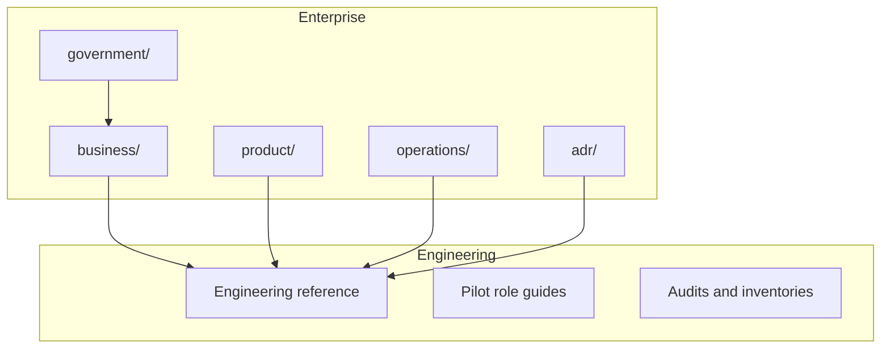

# AgriVault Documentation Portal

Complete documentation for deploying, operating, and governing AgriVault as Liberia's national agriculture operations platform.

**Version:** 0.1.0-rc1 · **Product:** AgriVault (`agritrace`) · **Stack:** Next.js 14 · Supabase · Mapbox · IndexedDB PWA

---

## Documentation map



---

## Enterprise documentation

### [business/](./business/) — Programme and implementation

Implementation playbooks, operating model, data governance, risk, continuity, and national scale.

| Document | Purpose |
|----------|---------|
| [PLATFORM_OVERVIEW.md](./business/PLATFORM_OVERVIEW.md) | Platform scope and capability summary |
| [MINISTRY_IMPLEMENTATION_GUIDE.md](./business/MINISTRY_IMPLEMENTATION_GUIDE.md) | Ministry deployment path |
| [IMPLEMENTATION_PLAYBOOK.md](./business/IMPLEMENTATION_PLAYBOOK.md) | Phased rollout playbook |
| [OPERATING_MODEL.md](./business/OPERATING_MODEL.md) | RACI and service ownership |
| [DATA_GOVERNANCE.md](./business/DATA_GOVERNANCE.md) | Data stewards and quality policy |
| [PILOT_SUCCESS_METRICS.md](./business/PILOT_SUCCESS_METRICS.md) | Pilot KPIs and measurement |
| [NATIONAL_SCALE_GUIDE.md](./business/NATIONAL_SCALE_GUIDE.md) | County-to-national expansion |
| [RISK_REGISTER.md](./business/RISK_REGISTER.md) | Programme risk matrix |

[Full business index →](./business/README.md)

### [product/](./product/) — Product definition

Vision, principles (constitution), role/entity catalogues, permissions, journeys, roadmap.

| Document | Purpose |
|----------|---------|
| [PRODUCT_PRINCIPLES.md](./product/PRODUCT_PRINCIPLES.md) | **Product constitution** |
| [VISION.md](./product/VISION.md) | Strategic vision and outcomes |
| [ROLE_CATALOG.md](./product/ROLE_CATALOG.md) | All 18 system roles |
| [ENTITY_CATALOG.md](./product/ENTITY_CATALOG.md) | Core data entities |
| [USER_JOURNEYS.md](./product/USER_JOURNEYS.md) | Operational workflows J1–J8 |
| [PERMISSIONS_MATRIX.md](./product/PERMISSIONS_MATRIX.md) | Role × capability matrix |

[Full product index →](./product/README.md)

### [operations/](./operations/) — Runbooks and SOPs

Daily operations, incident response, monitoring, release process, role SOPs.

| Document | Purpose |
|----------|---------|
| [RUNBOOK.md](./operations/RUNBOOK.md) | Daily/weekly/monthly procedures |
| [INCIDENT_RESPONSE.md](./operations/INCIDENT_RESPONSE.md) | P1–P4 incident protocol |
| [MONITORING.md](./operations/MONITORING.md) | Observability and alerts |
| [SERVICE_LEVEL_OBJECTIVES.md](./operations/SERVICE_LEVEL_OBJECTIVES.md) | SLOs and availability targets |
| [SOP_FIELD_OPERATIONS.md](./operations/SOP_FIELD_OPERATIONS.md) | CLAN field SOP |

[Full operations index →](./operations/README.md)

### [government/](./government/) — Executive and donor

Minister briefings, cabinet memos, procurement, county rollout, legal framework.

| Document | Purpose |
|----------|---------|
| [MINISTER_BRIEFING.md](./government/MINISTER_BRIEFING.md) | Minister executive summary |
| [CABINET_BRIEF.md](./government/CABINET_BRIEF.md) | Cabinet memorandum |
| [COUNTY_ROLLOUT_PLAN.md](./government/COUNTY_ROLLOUT_PLAN.md) | County deployment waves |
| [PILOT_EVALUATION_FRAMEWORK.md](./government/PILOT_EVALUATION_FRAMEWORK.md) | Pilot go/no-go evaluation |
| [NATIONAL_GOVERNANCE_MODEL.md](./government/NATIONAL_GOVERNANCE_MODEL.md) | Three-tier governance |

[Full government index →](./government/README.md)

### [adr/](./adr/) — Architecture decision records

| ADR | Decision |
|-----|----------|
| [0001](./adr/0001-enterprise-design-system.md) | Enterprise design system |
| [0002](./adr/0002-workflow-engine.md) | Workflow engine FSM |
| [0003](./adr/0003-offline-first.md) | Offline-first field capture |
| [0007](./adr/0007-data-source-strategy.md) | Data source disclosure |
| [0008](./adr/0008-role-based-security.md) | Role-based security |

[Full ADR index →](./adr/README.md)

---

## Engineering reference

| Document | Purpose |
|----------|---------|
| [ARCHITECTURE.md](./ARCHITECTURE.md) | System architecture |
| [DATABASE.md](./DATABASE.md) | Schema and RLS |
| [WORKFLOW_ENGINE.md](./WORKFLOW_ENGINE.md) | Approval state machine |
| [OFFLINE_ARCHITECTURE.md](./OFFLINE_ARCHITECTURE.md) | IndexedDB and PWA |
| [GIS_ARCHITECTURE.md](./GIS_ARCHITECTURE.md) | Mapbox and boundary capture |
| [SECURITY.md](./SECURITY.md) | Auth, CSP, rate limits |
| [API_GUIDE.md](./API_GUIDE.md) | HTTP API reference |
| [DEPLOYMENT_GUIDE.md](./DEPLOYMENT_GUIDE.md) | Deploy and smoke tests |

---

## Pilot operator guides

| Guide | Role |
|-------|------|
| [PILOT_ADMIN_GUIDE.md](./PILOT_ADMIN_GUIDE.md) | Administrator |
| [CLAN_FIELD_GUIDE.md](./CLAN_FIELD_GUIDE.md) | CLAN Technician |
| [DAO_GUIDE.md](./DAO_GUIDE.md) | DAO Officer |
| [CAC_GUIDE.md](./CAC_GUIDE.md) | CAC Coordinator |
| [MINISTRY_GUIDE.md](./MINISTRY_GUIDE.md) | Ministry Officer |
| [DEMO_SCRIPT.md](./DEMO_SCRIPT.md) | Live demonstration (45–60 min) |
| [LIVE_DEMO_RUNBOOK.md](./LIVE_DEMO_RUNBOOK.md) | Live demo operator script (30–45 min) |
| [PILOT_CHECKLIST.md](./PILOT_CHECKLIST.md) | Launch checklist |

---

## Release and audits

| Document | Purpose |
|----------|---------|
| [RELEASE_NOTES_RC1.md](./RELEASE_NOTES_RC1.md) | RC1 verification |
| [KNOWN_LIMITATIONS.md](./KNOWN_LIMITATIONS.md) | Accepted constraints |
| [TECHNICAL_DEBT.md](./TECHNICAL_DEBT.md) | Engineering debt register |
| [workflow-completeness-audit.md](./workflow-completeness-audit.md) | Form wiring audit |
| [data-source-inventory.md](./data-source-inventory.md) | LIVE/PILOT/OFFLINE/DEMO |

---

## Operational chain

```
CLAN (field capture) → DAO (district review) → CAC (county verify) → Ministry (national approve)
```

---

## Quick start

**Engineers:** [DEPLOYMENT_GUIDE.md](./DEPLOYMENT_GUIDE.md)  
**Programme managers:** [business/IMPLEMENTATION_PLAYBOOK.md](./business/IMPLEMENTATION_PLAYBOOK.md)  
**Ministers:** [government/MINISTER_BRIEFING.md](./government/MINISTER_BRIEFING.md)  
**Field technicians:** [CLAN_FIELD_GUIDE.md](./CLAN_FIELD_GUIDE.md)

```bash
npm run lint && npm run build && npm run test:workflow
```
