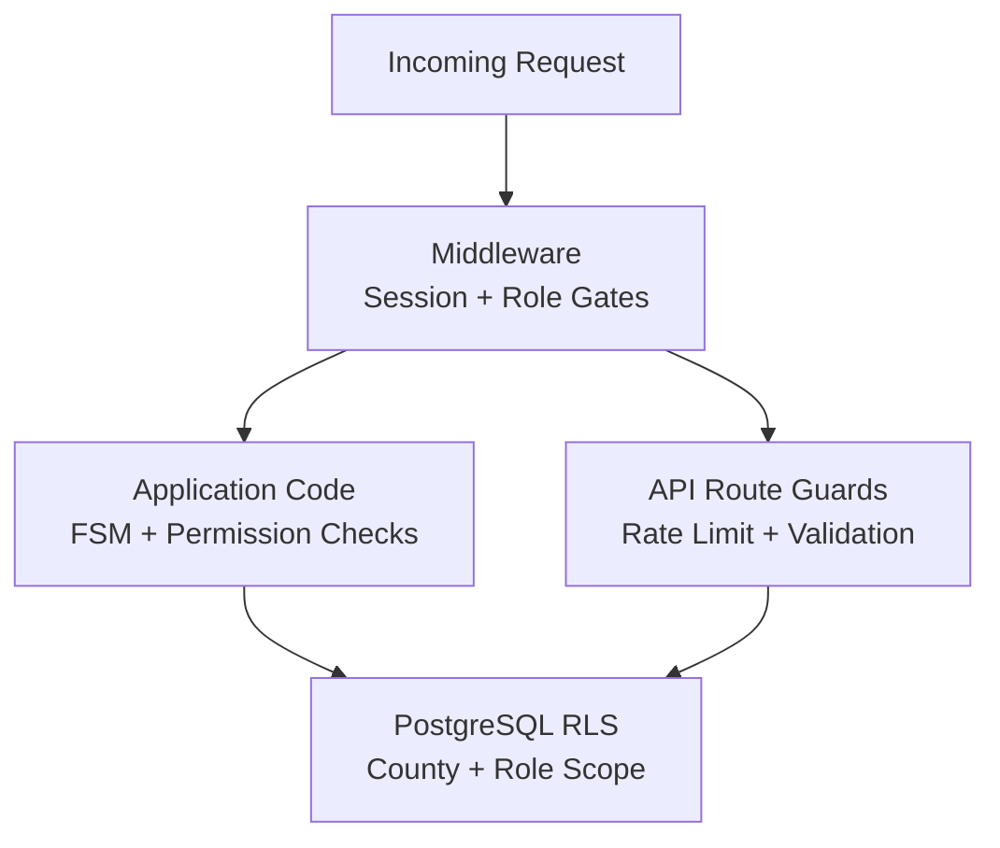

# AgriVault Security Reference

**Version:** 0.1.0-rc1  
**Related:** [ARCHITECTURE.md](./ARCHITECTURE.md) · [DATABASE.md](./DATABASE.md) · [API_GUIDE.md](./API_GUIDE.md)

---

## Table of contents

1. [Security model](#security-model)
2. [Authentication](#authentication)
3. [Authorization layers](#authorization-layers)
4. [Row Level Security](#row-level-security)
5. [Content Security Policy](#content-security-policy)
6. [HTTP security headers](#http-security-headers)
7. [Rate limiting](#rate-limiting)
8. [API security helpers](#api-security-helpers)
9. [Structured logging](#structured-logging)
10. [Service role usage](#service-role-usage)
11. [Known gaps](#known-gaps)
12. [Security checklist](#security-checklist)

---

## Security model

AgriVault applies defense in depth across four layers:



| Layer | Enforces | Bypass risk |
|-------|----------|-------------|
| Middleware | Session exists; role can access route prefix | Supabase env unset (dev only) |
| Application | Workflow FSM transitions; county scope | Direct API call with valid session |
| RLS | Row read/write by role + county | Service role (server-only paths) |
| API guards | Rate limits; body size; input validation | Unprotected routes (see gaps) |

---

## Authentication

### Supabase Auth (SSR)

**Files:** `src/middleware.ts`, `src/lib/supabase/server.ts`, `src/lib/supabase/client.ts`

Session managed via `@supabase/ssr` cookie-based auth:

```typescript
// middleware.ts — session refresh on every request
const supabase = createServerClient(url, anonKey, { cookies: { ... } });
const { data: { user } } = await supabase.auth.getUser();
```

Unauthenticated requests to protected path roots redirect to:

```
/login?redirectTo=<original-path>
```

### Protected path roots

Defined in `src/middleware.ts`. Includes all operational routes: `/command-center`, `/field`, `/workspace`, `/verification-queue`, `/admin`, and 25+ additional prefixes.

If `NEXT_PUBLIC_SUPABASE_URL` or `NEXT_PUBLIC_SUPABASE_ANON_KEY` is unset, middleware **skips authentication entirely**. Never deploy without these variables configured.

### Profile resolution

After authentication, role is loaded from `profiles.role`:

```typescript
const profile = await loadProfile(supabase, user.id);
const role = resolveUserRoleWithDemoFallback(profile, user);
```

Fallback: `buildDemoProfileForAuthUser()` for demo seed accounts when profiles row is missing.

### Demo accounts

Created by `npm run seed:demo`. Password: `DemoPass!2026`.  
Demo accounts are for training environments only — disable or rotate before production GA.

---

## Authorization layers

### Route access policy

**File:** `src/lib/auth/workspace-access.ts`

`assertPilotRouteAccess(role, pathname)` checks role against `PILOT_ROUTE_RULES`:

| Route prefix | Allowed roles (summary) |
|--------------|------------------------|
| `/command-center`, `/national-operations` | Ministry national |
| `/county-dashboard`, `/workspace/cac` | CAC, Ministry |
| `/district-dashboard`, `/workspace/dao`, `/field/*` | CLAN, DAO, CAC, Ministry |
| `/workspace/clan` | CLAN, DAO, CAC, Ministry |
| `/workspace/ministry` | Ministry only |
| `/verification-queue`, `/registration-approvals` | DAO, CAC, Ministry |
| `/gis-intelligence` | Ministry, CAC |
| `/inventory`, `/transfers`, `/operations` | DAO, CAC, Ministry, warehouse roles |
| `/admin` | Admin console roles |

Denied users redirect to `pilotRoleLandingPath(role)` without redirect loops.

Full inventory: `src/lib/auth/PILOT_ROUTE_CHECKLIST.md`

### Admin console guard

**Double guard:**

1. Middleware: `/admin` prefix requires `isAdminConsoleRole()`
2. Layout: `src/app/(dashboard)/admin/layout.tsx` — redirects non-admin to `/command-center`

**Admin roles** (`src/lib/supabase/admin-access.ts`):
`super_admin`, `admin`, `ministry_admin`, `ministry_officer`, `government_officer`

### Workflow authorization

**File:** `src/lib/ops/server-permissions.ts`

```typescript
const principal = await requireWorkflowPrincipal(request);
// Returns { userId, role, county, district } from profiles — never from client
```

Workflow mutations require:
1. Valid session with profiles row
2. `checkWorkflowPermission()` — role stage + county scope
3. `computeSubmissionTransition()` — FSM validity

See [WORKFLOW_ENGINE.md](./WORKFLOW_ENGINE.md).

### Workspace demo role cookie

Topbar role switcher sets httpOnly cookie `av_workspace_demo_role` via `POST /api/workspace-demo-role`.

**Server APIs ignore this cookie** — they always use the session profile role. The cookie affects sidebar visibility and UI button states only.

---

## Row Level Security

RLS is enabled on all operational tables. Key helper functions (security definer):

| Function | Purpose |
|----------|---------|
| `profile_role()` | Current user's role enum |
| `profile_county()` | Current user's county |
| `profile_district()` | Current user's district |
| `is_ministry_wide()` | Ministry or admin role |
| `wf_is_ministry()` | Ministry workflow reviewer |
| `wf_is_reviewer()` | DAO, CAC, or ministry reviewer |
| `wf_can_create()` | Can submit operational records |
| `wf_county_in_scope(text)` | County match or ministry-wide |

### Workflow table policies

```sql
-- operational_submissions: county-scoped read for reviewers
-- Authors can read own submissions regardless of county
-- Ministry-wide roles bypass county filter
-- Mutations go through server API; RLS is defense-in-depth
```

Service role key bypasses RLS — used only in server-only paths (see [Service role usage](#service-role-usage)).

Full policy inventory: [DATABASE.md#row-level-security](./DATABASE.md#row-level-security).

---

## Content Security Policy

**File:** `next.config.mjs` — applied to all routes via `/:path*`

```
default-src 'self'
base-uri 'self'
form-action 'self'
frame-ancestors 'none'
object-src 'none'
script-src 'self' 'unsafe-inline' 'unsafe-eval'
style-src 'self' 'unsafe-inline'
img-src 'self' data: blob: https://*.mapbox.com https://*.supabase.co
font-src 'self' data:
connect-src 'self' https://*.supabase.co wss://*.supabase.co https://api.mapbox.com https://events.mapbox.com https://*.tiles.mapbox.com
worker-src 'self' blob:
child-src 'self' blob:
```

### CSP notes

| Directive | Reason |
|-----------|--------|
| `'unsafe-inline' 'unsafe-eval'` in script-src | Required for Next.js hydration — tighten with nonces post-GA |
| `blob:` in worker-src | Mapbox GL web workers |
| `wss://*.supabase.co` | Supabase Realtime subscriptions |
| `frame-ancestors 'none'` | Clickjacking prevention |

Verify on staging: maps load, Supabase auth works, service worker registers without CSP console errors.

---

## HTTP security headers

Applied globally via `next.config.mjs`:

| Header | Value | Purpose |
|--------|-------|---------|
| `Content-Security-Policy` | See above | XSS/injection mitigation |
| `X-Content-Type-Options` | `nosniff` | MIME sniffing prevention |
| `Referrer-Policy` | `strict-origin-when-cross-origin` | Referrer leakage control |
| `X-Frame-Options` | `DENY` | Clickjacking prevention |
| `Permissions-Policy` | `camera=(), microphone=(), geolocation=(self), ...` | Feature access control |
| `X-DNS-Prefetch-Control` | `on` | Performance |

**HSTS:** Not set in app config. Vercel edge sends HSTS automatically for custom domains. Verify with:

```bash
curl -I https://your-domain.com | grep -i strict
```

Do not enable HSTS preload on `*.vercel.app` preview URLs.

---

## Rate limiting

**File:** `src/lib/http/rate-limit.ts`

In-process sliding window keyed by `clientRateLimitKey()`:
- Authenticated: `user:<userId>`
- Anonymous: `ip:<x-forwarded-for>`

### Enforced routes

| Route | Limit | Window |
|-------|-------|--------|
| `GET /api/farmers` | 120 requests | 60 seconds |
| `GET /api/registrations` | 120 requests | 60 seconds |
| `GET /api/production` | 120 requests | 60 seconds |
| `POST /api/demo-inquiry` | 10 requests | 60 seconds |
| `POST /api/ai/chat` | 20 requests | 60 seconds |

### Response headers

```
X-RateLimit-Limit: 120
X-RateLimit-Remaining: 119
X-RateLimit-Reset: 1750000060
X-RateLimit-Policy: 120;w=60
```

**429 response:**

```json
{ "error": "Too many requests. Please retry shortly." }
```

### Scale limitation

In-memory `Map` store resets on cold starts and is not shared across Vercel instances. Replace with Vercel KV / Upstash Redis before GA. See [TECHNICAL_DEBT.md#td-002](./TECHNICAL_DEBT.md).

---

## API security helpers

**File:** `src/lib/http/api-security.ts`

| Helper | Purpose |
|--------|---------|
| `parseJsonObject(request, maxBytes)` | Parse + validate JSON body; 413 if too large |
| `clampStr(value, maxLen)` | Bound string fields |
| `parseBoundedInt(value, min, max)` | Bound integer query params |
| `requestBodyTooLarge(request, maxBytes)` | Content-Length pre-check |
| `jsonPayloadTooLarge(payload, maxBytes)` | Post-parse size check |
| `isEmail(value)` | Email format validation |
| `isPlainObject(value)` | Reject arrays/primitives as body root |
| `logApiError(scope, err, requestId)` | Server-side error logging |

**File:** `src/lib/http/api-response.ts`

| Helper | Purpose |
|--------|---------|
| `beginApiRequest(request, policy)` | Request ID + rate limit context |
| `rejectIfRateLimited(ctx)` | Returns 429 Response or null |
| `apiJson(data, ctx, status)` | JSON response with security headers |
| `apiError(message, ctx, status)` | Error response — generic messages only |
| `apiHeaders(ctx)` | `x-request-id` + rate limit headers |

**Error message policy:** Client responses use generic messages. Raw Supabase errors, stack traces, and secrets never reach the client.

Constants:
```typescript
API_ERROR_GENERIC = "Request could not be processed."
API_ERROR_UNAUTHORIZED = "Authentication required."
API_ERROR_INVALID_JSON = "Invalid JSON body."
```

---

## Structured logging

**File:** `src/lib/http/structured-log.ts`

```json
{
  "ts": "2026-07-03T18:00:00.000Z",
  "level": "error",
  "event": "api.failure",
  "scope": "api/farmers",
  "requestId": "550e8400-e29b-41d4-a716-446655440000",
  "message": "Supabase query failed"
}
```

Correlate logs by searching for `"requestId":"<uuid>"` matching the `x-request-id` response header.

---

## Service role usage

The Supabase service role key (`SUPABASE_SERVICE_ROLE_KEY`) bypasses RLS. It is used **only** in:

| Path | Purpose |
|------|---------|
| `src/lib/supabase/admin.ts` | Admin API server client |
| `src/app/api/demo-inquiry/route.ts` | Public form insert |
| `src/app/api/analytics/route.ts` | Analytics event insert |
| `supabase/functions/sync-batch/index.ts` | Offline batch upsert |

**Never** expose service role key to the browser. Never use it in workflow submission routes — those use the user-scoped anon client with RLS.

---

## Known gaps

Documented in [KNOWN_LIMITATIONS.md](./KNOWN_LIMITATIONS.md) and [TECHNICAL_DEBT.md](./TECHNICAL_DEBT.md):

| Gap | Risk | Priority |
|-----|------|----------|
| 4 PDF routes without auth | Unauthenticated PDF generation | P0 |
| Partial rate limiting | Abuse on unprotected routes | P0 |
| In-memory rate limit store | Per-instance bypass | P1 |
| No CAPTCHA on demo-inquiry | Spam submissions | P1 |
| `'unsafe-inline'` in CSP | XSS if injection occurs | P1 |
| No `global-error.tsx` | Poor UX on root errors | P2 |
| `/reports/*` no role gate | URL direct access | P1 |
| Supabase-unset auth bypass | Open access in dev | Dev only |

### Unauthenticated PDF routes

| Route | Method |
|-------|--------|
| `/api/reports/compliance-oversight` | GET |
| `/api/reports/donor-programme` | GET |
| `/api/reports/rice` | POST |
| `/api/reports/dds` | POST |

Do not expose these URLs publicly until auth is added. `/api/reports/executive-briefing` **is** authenticated.

---

## Security checklist

### Pre-deployment

- [ ] All env vars set (no Supabase-unset bypass)
- [ ] Service role key server-only (not in `NEXT_PUBLIC_*`)
- [ ] Mapbox token scoped to deployment domain
- [ ] Demo accounts disabled or password rotated for production
- [ ] CSP verified — no console violations on login, maps, auth
- [ ] HSTS confirmed on custom domain via `curl -I`
- [ ] Rate limit smoke: 11th demo-inquiry within 1 min → 429
- [ ] Executive briefing PDF requires auth (401 without session)
- [ ] Admin routes redirect non-admin users
- [ ] CLAN user cannot access `/verification-queue` (redirect)

### Post-deployment monitoring

- [ ] Search logs for `"level":"error"` with rising frequency
- [ ] Monitor 429 rate on `/api/demo-inquiry`
- [ ] Review Supabase Auth logs for anomalous sign-in patterns
- [ ] Confirm RLS policies active: `SELECT tablename, rowsecurity FROM pg_tables WHERE schemaname = 'public'`

---

## Related documents

| Document | Topic |
|----------|-------|
| [API_GUIDE.md](./API_GUIDE.md) | Route-level auth matrix |
| [DATABASE.md](./DATABASE.md) | RLS policy detail |
| [production-readiness.md](./production-readiness.md) | Infrastructure hardening |
| [security-hardening-notes.md](./security-hardening-notes.md) | API audit history |
| [TECHNICAL_DEBT.md](./TECHNICAL_DEBT.md) | Security debt items |
