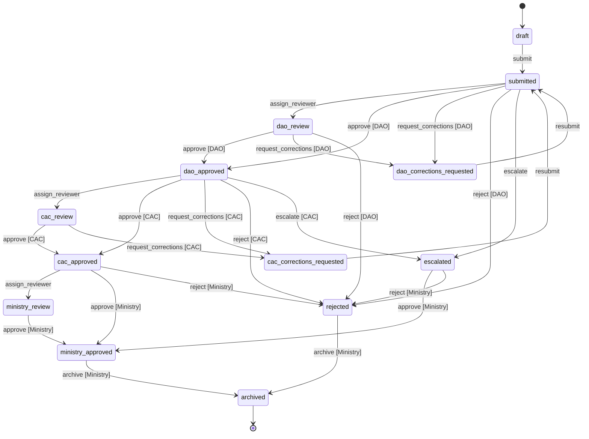
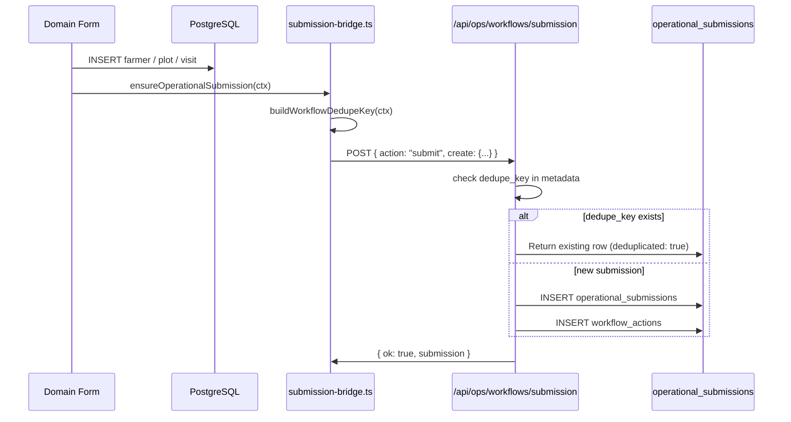
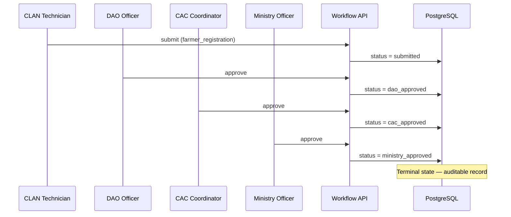
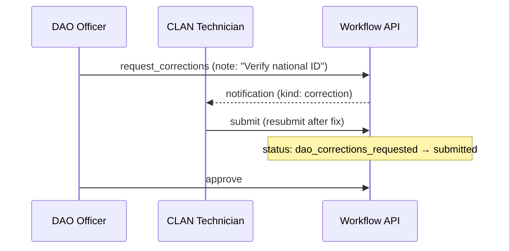

# AgriVault Workflow Engine

**Chain:** CLAN → DAO → CAC → Ministry  
**Version:** 0.1.0-rc1  
**Related:** [DATABASE.md](./DATABASE.md) · [ARCHITECTURE.md](./ARCHITECTURE.md) · [API_GUIDE.md](./API_GUIDE.md)

---

## Table of contents

1. [Overview](#overview)
2. [State machine](#state-machine)
3. [Submission types](#submission-types)
4. [Actions and permissions](#actions-and-permissions)
5. [API reference](#api-reference)
6. [Submission bridge](#submission-bridge)
7. [Domain form wiring](#domain-form-wiring)
8. [Verification queue integration](#verification-queue-integration)
9. [Notifications](#notifications)
10. [Deduplication](#deduplication)
11. [Testing](#testing)
12. [Sequence diagrams](#sequence-diagrams)

---

## Overview

The workflow engine manages auditable approval of operational submissions from field capture through national sign-off. Every state change is validated server-side against a declarative finite-state machine before writing to PostgreSQL.



**Key modules:**

| Module | Path | Role |
|--------|------|------|
| Status model | `src/lib/workflow/status-model.ts` | FSM transitions (pure, unit-tested) |
| Role permissions | `src/lib/workflow/roles.ts` | Stage mapping, county scope |
| Submission bridge | `src/lib/workflow/submission-bridge.ts` | Domain form → submission |
| Client API | `src/lib/workflow/client.ts` | Browser fetch helpers |
| Server API | `src/app/api/ops/workflows/submission/route.ts` | Mutation handler |
| Types | `src/lib/workflow/types.ts` | Request/response shapes |
| Submission types | `src/lib/workflow/submission-types.ts` | Canonical type constants |

---

## State machine

### Statuses (13)

| Status | Description |
|--------|-------------|
| `draft` | Author working copy (not yet in review pipeline) |
| `submitted` | Awaiting DAO assignment or review |
| `dao_review` | Assigned to DAO reviewer |
| `dao_corrections_requested` | Returned to author for DAO-requested fixes |
| `dao_approved` | DAO approved; awaiting CAC |
| `cac_review` | Assigned to CAC reviewer |
| `cac_corrections_requested` | Returned to author for CAC-requested fixes |
| `cac_approved` | CAC approved; awaiting Ministry |
| `ministry_review` | Assigned to Ministry reviewer |
| `ministry_approved` | **Terminal** — fully approved |
| `rejected` | **Terminal** — rejected at any stage |
| `escalated` | Escalated to Ministry attention |
| `archived` | **Terminal** — archived from final state |

Terminal statuses: `ministry_approved`, `rejected`, `archived`.

### Transition table

Validated by `computeSubmissionTransition()` in `status-model.ts`:

| From | Action | Stage | To |
|------|--------|-------|-----|
| `draft` | `submit` | clan, dao, cac, ministry | `submitted` |
| `dao_corrections_requested`, `cac_corrections_requested` | `submit` | clan, dao, cac, ministry | `submitted` |
| `submitted` | `assign_reviewer` | dao, ministry | `dao_review` |
| `dao_review` | `assign_reviewer` | dao, ministry | `dao_review` |
| `submitted`, `dao_review` | `approve` | dao, ministry | `dao_approved` |
| `submitted`, `dao_review` | `request_corrections` | dao, ministry | `dao_corrections_requested` |
| `submitted`, `dao_review` | `reject` | dao, ministry | `rejected` |
| `submitted`, `dao_review` | `escalate` | dao, cac, ministry | `escalated` |
| `dao_approved` | `assign_reviewer` | cac, ministry | `cac_review` |
| `cac_review` | `assign_reviewer` | cac, ministry | `cac_review` |
| `dao_approved`, `cac_review` | `approve` | cac, ministry | `cac_approved` |
| `dao_approved`, `cac_review` | `request_corrections` | cac, ministry | `cac_corrections_requested` |
| `dao_approved`, `cac_review` | `reject` | cac, ministry | `rejected` |
| `dao_approved`, `cac_review` | `escalate` | cac, ministry | `escalated` |
| `cac_approved` | `assign_reviewer` | ministry | `ministry_review` |
| `ministry_review` | `assign_reviewer` | ministry | `ministry_review` |
| `cac_approved`, `ministry_review`, `escalated` | `approve` | ministry | `ministry_approved` |
| `cac_approved`, `ministry_review`, `escalated` | `reject` | ministry | `rejected` |
| `cac_approved`, `ministry_review` | `request_corrections` | ministry | `cac_corrections_requested` |
| `ministry_approved`, `rejected` | `archive` | ministry | `archived` |
| any non-archived | `comment` | any | unchanged |

`comment` never changes status.

---

## Submission types

Defined in `src/lib/workflow/submission-types.ts`:

| Constant | DB value | Typical source form |
|----------|----------|---------------------|
| `farmerRegistration` | `farmer_registration` | `RegisterFarmerForm` |
| `farmBoundary` | `farm_boundary` | `BoundaryCaptureStandalone`, offline sync |
| `fieldInspection` | `field_inspection` | `RecordFieldInspectionForm` |
| `gpsVerification` | `gps_verification` | `DaoGpsEvidenceForm` |
| `pestDiseaseAlert` | `pest_disease_alert` | `DaoPestDiseaseReportForm` |
| `warehouseAssignment` | `warehouse_assignment` | Warehouse assignment flow |
| `inputDistribution` | `input_distribution` | `DaoSubsidyDistributionForm` |
| `harvestReport` | `harvest_report` | `DaoProductionEstimateForm` |
| `warehouseTransfer` | `warehouse_transfer_confirmation` | `RecordStockTransferForm` |
| `donorShipment` | `donor_shipment_verification` | Donor verification (fixtures) |
| `fieldReport` | `field_report` | MoA operational survey forms |

---

## Actions and permissions

### Actions (8)

`submit`, `approve`, `reject`, `request_corrections`, `escalate`, `assign_reviewer`, `comment`, `archive`

### Role → stage mapping

`workflowStageForRole()` in `src/lib/workflow/roles.ts`:

| DB role | Stage | Can review? | County-bound? |
|---------|-------|-------------|---------------|
| `clan_technician`, `field_agent` | `clan` | No | Yes |
| `dao_officer`, `district_officer` | `dao` | Yes | Yes |
| `county_agriculture_coordinator`, `county_officer` | `cac` | Yes | Yes |
| `ministry_admin`, `ministry_officer`, `government_officer`, `super_admin`, `admin` | `ministry` | Yes | No |
| `auditor` | `auditor` | Read-only | No |
| `donor_observer`, `donor_partner` | `donor` | Read-only | No |
| Others | `none` | Read-only | No |

### Permission checks

Two independent gates must pass for every mutation:

```typescript
// 1. Role and county scope
checkWorkflowPermission({ stage, actorCounty, submissionCounty, action, isAuthor })

// 2. FSM transition validity
computeSubmissionTransition({ status, action, stage })
```

County-bound stages (`clan`, `dao`, `cac`) require `actorCounty === submissionCounty` for review actions. Ministry stage is not county-bound. Authors can always `comment` on their own submissions regardless of county.

---

## API reference

### `POST /api/ops/workflows/submission`

**Auth:** `requireWorkflowPrincipal()` — session + profiles row required.

**Request body:**

```typescript
{
  action: "submit" | "approve" | "reject" | "request_corrections"
        | "escalate" | "assign_reviewer" | "comment" | "archive";
  submissionId?: string;       // UUID — required except create+submit
  note?: string;
  assigneeId?: string;         // required for assign_reviewer
  create?: {                   // for submit without existing submissionId
    submissionType: string;
    title: string;
    summary?: string;
    county?: string;
    district?: string;
    organizationId?: string;
    metadata?: Record<string, unknown>;
  };
}
```

**Example — submit new farmer registration:**

```bash
curl -X POST https://your-app.vercel.app/api/ops/workflows/submission \
  -H "Content-Type: application/json" \
  -H "Cookie: <session-cookie>" \
  -d '{
    "action": "submit",
    "create": {
      "submissionType": "farmer_registration",
      "title": "Farmer registration — James Kollie",
      "county": "Bong",
      "district": "Salala",
      "metadata": {
        "dedupe_key": "farmer_registration:a1b2c3d4-e5f6-7890-abcd-ef1234567890",
        "entity_refs": { "farmer_id": "a1b2c3d4-e5f6-7890-abcd-ef1234567890" }
      }
    }
  }'
```

**Success response (200):**

```json
{
  "ok": true,
  "submission": {
    "id": "f47ac10b-58cc-4372-a567-0e02b2c3d479",
    "status": "submitted",
    "submission_type": "farmer_registration",
    "title": "Farmer registration — James Kollie",
    "county": "Bong"
  },
  "persisted": true,
  "deduplicated": false
}
```

**Error response:**

```json
{
  "ok": false,
  "code": "TRANSITION_DENIED",
  "message": "Action approve is not permitted at status submitted for stage cac"
}
```

HTTP status codes: `400` (invalid body), `401` (no session), `403` (permission denied), `404` (submission not found), `422` (invalid transition).

### `GET /api/ops/workflows/submission`

**Auth:** `requireWorkflowPrincipal()`

**Thread query:** `?submissionId=<uuid>`

```json
{
  "ok": true,
  "thread": {
    "submission": { "id": "...", "status": "dao_review", "...": "..." },
    "actions": [{ "action": "submit", "from_status": "draft", "to_status": "submitted" }],
    "comments": [{ "body": "Please verify national ID", "is_correction_request": true }],
    "assignments": [{ "assignee_id": "...", "status": "active" }]
  }
}
```

**List query:** `?status=dao_review&type=farmer_registration` (max 100 rows, RLS-scoped)

```json
{
  "ok": true,
  "submissions": [ { "id": "...", "status": "dao_review", "...": "..." } ]
}
```

### `POST /api/ops/workflows/transfer`

**Body:**

```json
{
  "transferId": "TRF-2026-001",
  "action": "approve",
  "note": "Approved for dispatch"
}
```

Actions: `approve`, `reject`, `dispatch`, `mark_received`, `verify`, `escalate`, `investigate`, `dispute`

### `POST /api/ops/workflows/verification`

**Body:**

```json
{
  "verificationId": "VRF-001",
  "action": "approve",
  "note": "Registration verified"
}
```

Actions: `approve`, `reject`, `escalate`, `revision`, `investigate`

Full API catalog: [API_GUIDE.md](./API_GUIDE.md).

---

## Submission bridge

`src/lib/workflow/submission-bridge.ts` connects domain form persistence to the workflow engine.

### Flow



### `ensureOperationalSubmission(ctx)`

Maps DAO workflow kinds to submission types:

| Bridge kind | Submission type |
|-------------|-----------------|
| `register_farmer` | `farmer_registration` |
| `farm_inspection` | `field_inspection` |
| `gps_field_evidence` | `gps_verification` |
| `pest_disease_report` | `pest_disease_alert` |
| `production_estimate` | `harvest_report` |
| `subsidy_delivery_verify` | `input_distribution` |
| `farm_boundary_capture` | `farm_boundary` |
| `warehouse_transfer` | `warehouse_transfer_confirmation` |
| `clan_*`, `dao_*`, `cac_*` surveys | `field_report` |

Heavy geometry is stripped from `metadata.payload_snapshot` before persistence.

---

## Domain form wiring

Full audit in [workflow-completeness-audit.md](./workflow-completeness-audit.md):

| Form | Creates submission | Submission type |
|------|-------------------|-----------------|
| `RegisterFarmerForm` | Yes | `farmer_registration` |
| `RecordFieldInspectionForm` | Yes | `field_inspection` |
| `DaoGpsEvidenceForm` | Yes | `gps_verification` |
| `DaoPestDiseaseReportForm` | Yes | `pest_disease_alert` |
| `DaoProductionEstimateForm` | Yes | `harvest_report` |
| `DaoSubsidyDistributionForm` | Yes | `input_distribution` |
| `BoundaryCaptureStandalone` | Yes | `farm_boundary` |
| `RecordStockTransferForm` | Yes | `warehouse_transfer_confirmation` |
| `RecordFarmerVerificationDecisionForm` | Updates linked submission | — |
| `RecordWarehouseForm` | No (master data) | — |
| `RecordInventoryReceiptForm` | No (not yet bridged) | — |

---

## Verification queue integration

`/verification-queue` merges live `operational_submissions` with pilot `VRF-*` fixtures via `src/lib/workflow/operational-submission-queue.ts`.

Live rows carry a real UUID `submissionId` — workflow action buttons call the submission API. Demo fixture rows have synthetic IDs and buttons are disabled or narrate-only.

UI component: `src/components/verification/VerificationQueueWorkspace.tsx`  
Hook: `src/hooks/useVerificationQueue.ts`

CAC approval queues (`CaoApprovalQueues`) use the same live merge pattern.

---

## Notifications

On every state-changing transition, the submission API writes to `workflow_notifications`:

| Event | `kind` | Recipient |
|-------|--------|-----------|
| Reviewer assigned | `assigned` | Assignee |
| Corrections requested | `correction` | Original author |
| Approved | `approved` | Author + next-stage reviewer |
| Rejected | `rejected` | Author |
| Escalated | `escalated` | Ministry reviewers |

UI: `NotificationsMenu` in topbar reads unread notifications via Supabase client.

---

## Deduplication

`buildWorkflowDedupeKey()` generates stable keys per entity:

| Entity | Dedupe key pattern |
|--------|-------------------|
| Farmer registration | `farmer_registration:{farmer_id}` |
| Harvest report | `harvest_report:{production_record_id}` |
| Farm boundary | `farm_boundary:{plot_client_id}` |
| Missing refs | `null` (no dedupe) |

On `POST /api/ops/workflows/submission` with a matching `metadata.dedupe_key`, the API returns the existing non-archived row with `deduplicated: true` instead of creating a duplicate.

This prevents double submissions when offline boundary capture creates a submission at queue time and again after sync.

---

## Testing

```bash
npm run test:workflow
```

29 unit checks in `src/lib/workflow/__tests__/workflow.spec.ts`:

| Category | Checks |
|----------|--------|
| Status model transitions | 14 |
| Role permissions | 7 |
| Dedupe keys | 4 |
| Data source layer | 3 |
| Rate limit enforcement | 1 |

Example test assertion:

```
✓ DAO approves submitted → dao_approved
✓ CAC cannot approve a freshly submitted item (must clear DAO first)
✓ farmer registration dedupe uses farmer_id
```

---

## Sequence diagrams

### Full approval chain



### Corrections loop



---

## Related documents

| Document | Topic |
|----------|-------|
| [DATABASE.md](./DATABASE.md) | Workflow table schemas |
| [API_GUIDE.md](./API_GUIDE.md) | Full HTTP API reference |
| [workflow-completeness-audit.md](./workflow-completeness-audit.md) | Form wiring audit |
| [KNOWN_LIMITATIONS.md](./KNOWN_LIMITATIONS.md) | Demo fixture merge caveat |
