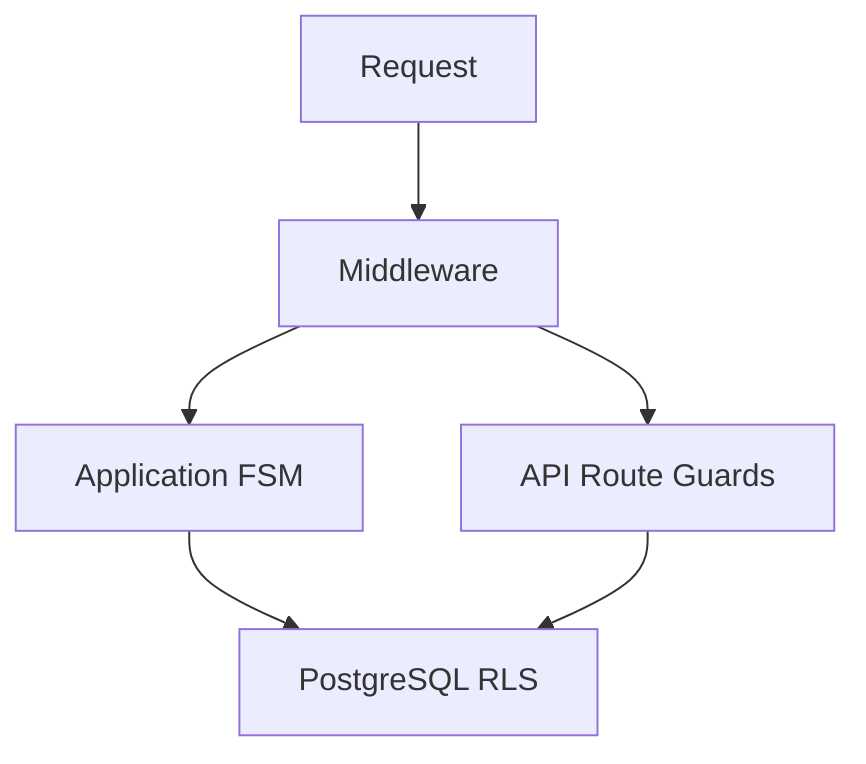

# ADR 0008: Role-Based Security Model

**Status:** Accepted  
**Date:** 2026-07-03  
**Deciders:** AgriVault engineering team

---

## Context

AgriVault serves users across Liberia's agricultural hierarchy — CLAN field technicians, DAO district officers, CAC county coordinators, Ministry national staff, warehouse operators, donors, and auditors. Each role has different route access, workflow actions, and county data scope. A single missed authorization check could expose farmer PII or allow cross-county data modification.

Security must operate at multiple layers so that bypassing one check (e.g. crafting a direct API request) still encounters enforcement downstream. The model must align with the workflow engine's CLAN→DAO→CAC→Ministry chain (ADR 0002).

---

## Decision

Implement **defense-in-depth authorization** across four layers: middleware route gates, layout/page guards, application workflow permissions, and PostgreSQL Row Level Security.

### Four authorization layers

| Layer | Mechanism | Primary file |
|-------|-----------|--------------|
| 1. Middleware | Session + role route gates | `src/middleware.ts` |
| 2. Layout / Page | Auth redirect; admin guard; workspace asserts | `(dashboard)/layout.tsx`, `page.tsx` |
| 3. Application | FSM transitions; county scope; API principals | `server-permissions.ts`, `status-model.ts` |
| 4. Database | RLS by role + county | `supabase/migrations/*` |



### Middleware flow

**File:** `src/middleware.ts`

1. Assign `x-request-id`
2. Refresh Supabase session via `@supabase/ssr`
3. Redirect unauthenticated users on protected paths → `/login?redirectTo=...`
4. Load `profiles.role` (demo fallback if missing)
5. `assertPilotRouteAccess(role, pathname)` — deny → `pilotRoleLandingPath(role)`

Protected path roots: `/command-center`, `/field`, `/workspace`, `/verification-queue`, `/admin`, and 25+ prefixes in `src/lib/auth/workspace-access.ts`.

### Role → workflow stage mapping

**File:** `src/lib/workflow/roles.ts`

| DB role | Workflow stage | Default landing |
|---------|---------------|-----------------|
| `clan_technician`, `field_agent` | `clan` | `/district-dashboard` |
| `dao_officer`, `district_officer` | `dao` | `/district-dashboard` |
| `county_agriculture_coordinator`, `county_officer` | `cac` | `/county-dashboard` |
| `ministry_admin`, `ministry_officer`, `government_officer` | `ministry` | `/command-center` |

### County scope

DAO and CAC roles are restricted to their assigned county:

- Application: `requireWorkflowPrincipal()` validates county on workflow mutations
- Database: `profile_county()` in RLS policies filters rows

Ministry roles bypass county filter for national visibility.

### Workflow principal

**File:** `src/lib/ops/server-permissions.ts`

```typescript
requireWorkflowPrincipal()  // Used by /api/ops/workflows/*
```

Returns authenticated user, role, county, and workflow stage — or auth failure. All workflow API routes require this before FSM evaluation.

### Route access policy

**File:** `src/lib/auth/workspace-access.ts`

`PILOT_ROUTE_RULES` maps path prefixes to allowed roles. Inventory maintained in `PILOT_ROUTE_CHECKLIST.md`.

Key prefixes: `/gis-intelligence` (Ministry + CAC), `/workspace/ministry` (Ministry only), `/verification-queue` (DAO, CAC, Ministry), `/admin` (admin console roles).

---

## Consequences

### Positive

- Bypassing middleware still hits RLS on database reads/writes.
- Route gates prevent UI navigation to unauthorized workspaces.
- Workflow FSM enforces stage-appropriate actions (DAO cannot Ministry-approve).
- County scope prevents cross-jurisdiction data leakage at DB layer.
- Request ID propagation enables audit correlation across layers.

### Negative

- Four layers require synchronized updates when adding routes or roles.
- Demo profile fallback (`buildDemoProfileForAuthUser`) must be disabled before production GA.
- Middleware skips auth when Supabase env unset — deployment checklist critical.
- RLS policy debugging requires SQL expertise and Supabase logs.

### Neutral

- Rate limiting and CSP are complementary controls (see [SECURITY.md](../SECURITY.md)) — not authorization layers.
- Donor/auditor roles have read-heavy, mutation-restricted access.

---

## Alternatives Considered

| Alternative | Why rejected |
|-------------|--------------|
| **Middleware-only authorization** | Direct API calls bypass UI gates |
| **RLS-only (no app checks)** | Poor error messages; FSM logic doesn't belong in SQL |
| **JWT custom claims without profiles table** | Harder to update roles; no admin UI for role assignment |
| **RBAC library (CASL, etc.)** | Duplicates workflow stage mapping; adds dependency |
| **Single "admin" role for pilot** | Violates county scope and chain-of-command requirements |

---

## Tradeoffs

| Tradeoff | Choice | Rationale |
|----------|--------|-----------|
| Redirect vs 403 on deny | Redirect to role landing | Better UX; avoids dead-end pages |
| County in profile vs JWT claim | Profile table + RLS helper | Admin-manageable; single source of truth |
| Page-level asserts vs middleware only | Both | Deep links and RSC need page guards |
| Demo auth fallback | Enabled for training | Must document production disable step |

---

## References

- [ARCHITECTURE.md](../ARCHITECTURE.md) — authentication and authorization section
- [SECURITY.md](../SECURITY.md) — full security model, CSP, rate limits, known gaps
- [DATABASE.md](../DATABASE.md) — RLS policies, user_role enum
- [WORKFLOW_ENGINE.md](../WORKFLOW_ENGINE.md) — action permissions by stage
- ADR [0002](./0002-workflow-engine.md) — FSM and workflow principal
- ADR [0005](./0005-supabase-platform.md) — Supabase Auth and RLS
- Source: `src/middleware.ts`, `src/lib/auth/workspace-access.ts`, `src/lib/ops/server-permissions.ts`
