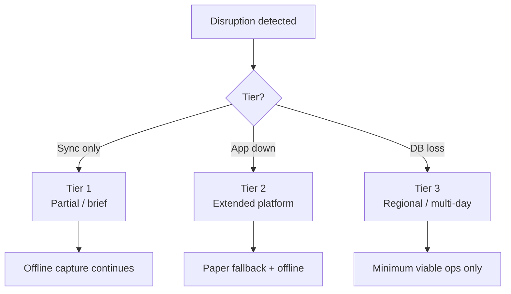
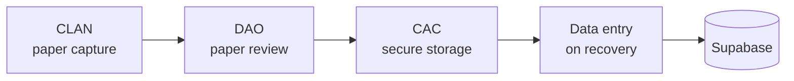
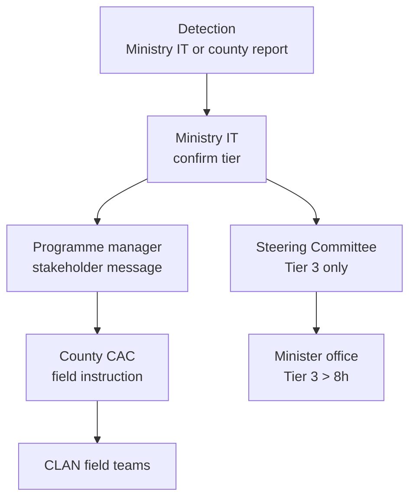

# AgriVault Business Continuity Plan

**Classification:** Internal — Programme leadership, county operations, Ministry IT  
**Version:** 0.1.0-rc1  
**Platform:** AgriVault (`agritrace`)  
**Audience:** Programme manager, county CACs, field lead, Ministry IT, DAO leads, Steering Committee

**Related:** [DISASTER_RECOVERY_PLAN.md](./DISASTER_RECOVERY_PLAN.md) · [SUPPORT_MODEL.md](./SUPPORT_MODEL.md) · [CHANGE_MANAGEMENT.md](./CHANGE_MANAGEMENT.md) · [../operations/SOP_FIELD_OPERATIONS.md](../operations/SOP_FIELD_OPERATIONS.md) · [../OFFLINE_ARCHITECTURE.md](../OFFLINE_ARCHITECTURE.md) · [../CLAN_FIELD_GUIDE.md](../CLAN_FIELD_GUIDE.md)

---

## Table of contents

1. [Purpose](#purpose)
2. [Continuity principles](#continuity-principles)
3. [Disruption tiers](#disruption-tiers)
4. [Minimum viable operations](#minimum-viable-operations)
5. [Field operations during outage](#field-operations-during-outage)
6. [Paper fallback SOP](#paper-fallback-sop)
7. [Communication tree](#communication-tree)
8. [Role-specific continuity actions](#role-specific-continuity-actions)
9. [Recovery and resumption](#recovery-and-resumption)
10. [Related documents](#related-documents)

---

## Purpose

This plan ensures agriculture field operations and approval workflows continue — at reduced capacity if necessary — when AgriVault platform components are unavailable. It addresses the business operations layer; technical recovery is in [DISASTER_RECOVERY_PLAN.md](./DISASTER_RECOVERY_PLAN.md).

Continuity planning accepts that RC1 offline capture survives short outages ([../OFFLINE_ARCHITECTURE.md](../OFFLINE_ARCHITECTURE.md)) but extended outages require paper fallback and deferred sync per [CHANGE_MANAGEMENT.md](./CHANGE_MANAGEMENT.md).

---

## Continuity principles

| Principle | Application |
|-----------|-------------|
| Field first | CLAN field work must not halt for connectivity or platform outages |
| Safety over sync | No data loss on device; paper backup when device unavailable |
| Transparent provenance | Paper and offline captures flagged on re-entry; never presented as real-time LIVE |
| County autonomy | CAC activates county BCP without waiting for national approval for Tier 1–2 disruptions |
| Single source after recovery | Reconcile paper/offline to Supabase before national reporting resumes |

---

## Disruption tiers

| Tier | Definition | Examples | BCP activation |
|------|------------|----------|----------------|
| **Tier 1** | Partial degradation; core field capture possible | Edge Function down; slow connectivity; single county issue | County CAC notifies field lead; offline mode |
| **Tier 2** | Application unreachable; Supabase or Vercel outage | Platform P1 incident | CAC activates paper fallback; Ministry IT DR |
| **Tier 3** | Extended outage (> 8 h) or data integrity event | Regional Supabase failure; corruption restore | MVO only; Steering Committee notified |

Incident classification: [../operations/INCIDENT_RESPONSE.md](../operations/INCIDENT_RESPONSE.md).

---

## Minimum viable operations

During Tier 2–3 disruptions, the programme maintains these minimum functions:

| Function | MVO target | Without platform |
|----------|------------|------------------|
| Farmer contact and field visits | Continue | Paper log |
| Farmer registration (core fields) | Continue | Paper form → data entry on recovery |
| GPS boundary capture | Degraded | Sketch map + later digital capture |
| DAO review of new submissions | Pause digital queue | Review paper register |
| CAC county verification | Pause | Hold paper-approved items |
| Ministry national approval | Pause | Deferred until LIVE data restored |
| Executive reporting | Pause LIVE briefing | Qualitative verbal update only |

**Non-negotiable during MVO:** Do not present paper-derived numbers as LIVE dashboard KPIs ([../data-source-inventory.md](../data-source-inventory.md)).

---

## Field operations during outage

### CLAN procedures (platform unavailable)

| Step | Action | Reference |
|------|--------|-----------|
| 1 | Continue PWA use if app shell cached; capture offline in IndexedDB | [../CLAN_FIELD_GUIDE.md](../CLAN_FIELD_GUIDE.md) § Offline |
| 2 | If app unreachable: switch to paper fallback forms | § Paper fallback below |
| 3 | Do not clear device drafts | [DISASTER_RECOVERY_PLAN.md](./DISASTER_RECOVERY_PLAN.md) |
| 4 | Record outage start time on paper log header | Field lead |
| 5 | On restoration: sync device first; then enter paper records | CAC coordination |

### Offline architecture advantage

RC1 PWA stores drafts locally. Tier 1 Edge Function failures do **not** require paper fallback if CLAN can still open cached app shell.

| Condition | Field action |
|-----------|--------------|
| App opens; sync fails | Capture offline; retry sync periodically |
| App does not open | Paper fallback |
| Device lost/damaged | Paper fallback; report to CAC (R-025) |

Reference: [../OFFLINE_ARCHITECTURE.md](../OFFLINE_ARCHITECTURE.md), [../adr/0003-offline-first.md](../adr/0003-offline-first.md).

---

## Paper fallback SOP

Paper fallback is the authorised manual procedure when digital capture is impossible. Usage is tracked as KPI-10 in [PILOT_SUCCESS_METRICS.md](./PILOT_SUCCESS_METRICS.md) (target ≤ 5% of captures).

### When to activate

| Trigger | Authority |
|---------|-----------|
| CLAN device failure | CLAN → CAC approval |
| Application unreachable > 2 hours | CAC county decision |
| National platform Tier 2 incident declared | Ministry IT → all counties |

### Paper form requirements

Each paper capture must include:

| Field | Required |
|-------|----------|
| Form serial number | Yes (pre-printed booklet) |
| Date and time | Yes |
| CLAN name and signature | Yes |
| Farmer name, ID if available, village | Yes |
| Activity type (registration, report, boundary sketch) | Yes |
| GPS coordinates (if device GPS works standalone) | Optional |
| Outage reference ID | Yes (from communication tree) |
| "PAPER — pending digital entry" stamp | Yes |

### Paper handling chain

| Step | Owner | Action |
|------|-------|--------|
| 1 | CLAN | Complete paper form; duplicate copy to farmer where policy requires |
| 2 | DAO | Review paper within 24 h (same SLA as digital) |
| 3 | CAC | Store approved forms in locked county register |
| 4 | Ministry IT | Announce platform ready for data entry |
| 5 | DAO or designated clerk | Enter into AgriVault with `data_source = 'pilot'` or offline flag |
| 6 | Programme manager | Report paper fallback count in weekly KPI pack |

**Prohibited:** Storing paper forms with PII in unsecured locations; photographing forms to personal phones.

Change management context: [CHANGE_MANAGEMENT.md](./CHANGE_MANAGEMENT.md) § resistance and paper fallback.

---

## Communication tree

### Outage notification flow

### Communication channels

| Audience | Channel | Message owner | Update cadence |
|----------|---------|---------------|----------------|
| CLAN field teams | County WhatsApp / radio | CAC coordinator | At activation + every 4 h |
| DAO desks | Phone + county group | DAO lead | At activation |
| Ministry staff | Email + SMS | Programme manager | At activation + every 2 h (Tier 2+) |
| Steering Committee | Email | Programme manager | Tier 3 within 1 h |
| Minister office | Briefing note | Programme manager | Tier 3 > 8 h |
| Vendor | Support ticket P1 | Ministry IT | Immediate |

### Message templates

**Tier 2 activation (county field teams):**

> AgriVault platform unavailable as of [TIME]. Continue field work using offline capture if app opens; otherwise use paper forms. Do not discard device drafts. Next update in 4 hours. Outage ID: [ID].

**Recovery announcement:**

> AgriVault restored as of [TIME]. CLAN: sync all pending items before new capture. DAO: resume digital queue; begin paper data entry for outage period. Report sync failures immediately. Outage ID: [ID].

Support escalation during outage: [SUPPORT_MODEL.md](./SUPPORT_MODEL.md) Tier 2 P1.

---

## Role-specific continuity actions

| Role | Tier 1 | Tier 2 | Tier 3 |
|------|--------|--------|--------|
| **CLAN** | Offline capture; retry sync | Paper if app down | Paper only; preserve devices |
| **DAO** | Monitor queue when restored | Review paper register | Hold approvals; secure paper |
| **CAC** | County helpdesk continues | Activate paper SOP; secure forms | MVO coordination; county comms |
| **Ministry** | Await restoration | Pause LIVE briefing | Steering Committee; verbal status only |
| **Ministry IT** | Edge Function redeploy | DR plan execution | Full restore; data validation |
| **Programme manager** | Log incident | Stakeholder comms | SC + Minister briefing |

Operational SOPs: [../operations/SOP_FIELD_OPERATIONS.md](../operations/SOP_FIELD_OPERATIONS.md), [../operations/SOP_DAO.md](../operations/SOP_DAO.md), [../operations/SOP_CAC.md](../operations/SOP_CAC.md), [../operations/SOP_MINISTRY.md](../operations/SOP_MINISTRY.md).

---

## Recovery and resumption

### Resumption checklist

| # | Check | Owner |
|---|-------|-------|
| 1 | Ministry IT confirms platform healthy ([../PILOT_CHECKLIST.md](../PILOT_CHECKLIST.md) infra section) | Ministry IT |
| 2 | Recovery announcement sent per communication tree | Programme manager |
| 3 | CLAN devices sync pending queues; `manual_review` count = 0 | Field lead |
| 4 | Paper forms data-entered with correct provenance | DAO + CAC |
| 5 | Digital workflow queue cleared within 48 h of resumption | County DAO lead |
| 6 | LIVE KPI reporting resumes only after data reconciliation | Ministry programme lead |
| 7 | Post-incident review within 24 h | Programme manager |
| 8 | [RISK_REGISTER.md](./RISK_REGISTER.md) updated | Programme manager |

### Reconciliation rules

| Source | Enter as | Disclosure |
|--------|----------|--------------|
| IndexedDB offline sync | Standard LIVE workflow | Normal |
| Paper fallback entry | Flag per data governance | Exclude from real-time KPI until verified |
| Duplicate (paper + offline same farmer) | DAO deduplication | Keep LIVE device record; void duplicate |

Reference: [DATA_GOVERNANCE.md](./DATA_GOVERNANCE.md) § provenance.

---

## Related documents

[DISASTER_RECOVERY_PLAN.md](./DISASTER_RECOVERY_PLAN.md) · [CHANGE_MANAGEMENT.md](./CHANGE_MANAGEMENT.md) · [PILOT_SUCCESS_METRICS.md](./PILOT_SUCCESS_METRICS.md) · [../CLAN_FIELD_GUIDE.md](../CLAN_FIELD_GUIDE.md) · [../OFFLINE_ARCHITECTURE.md](../OFFLINE_ARCHITECTURE.md) · [PROJECT_GOVERNANCE.md](./PROJECT_GOVERNANCE.md)
