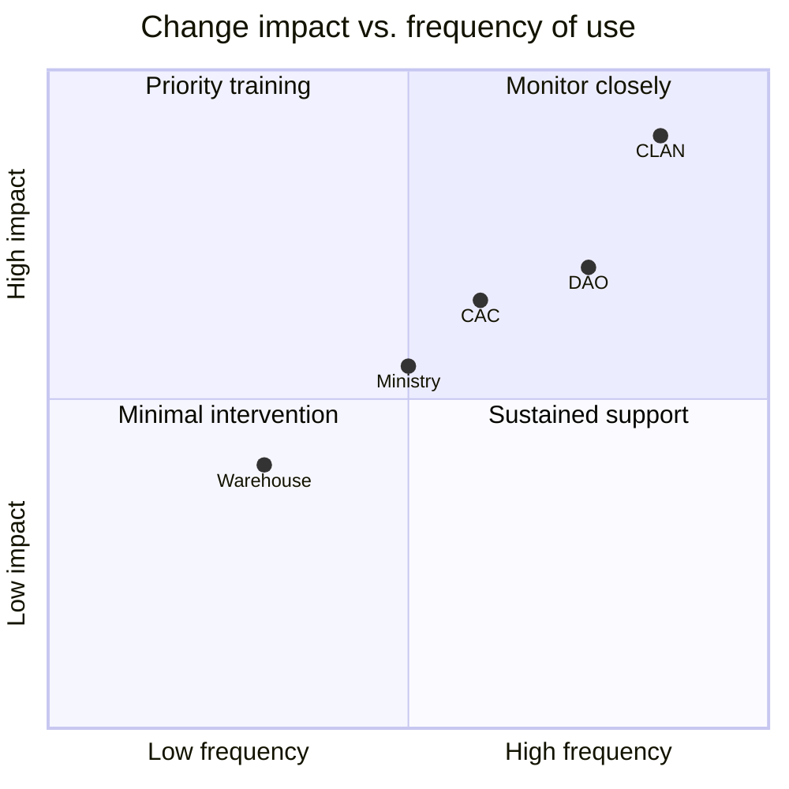
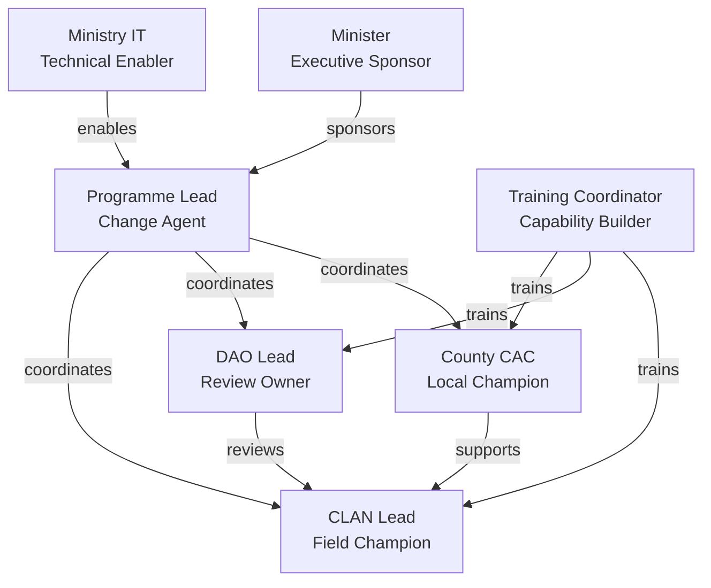
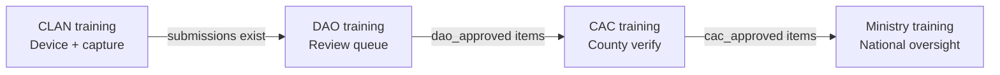

# AgriVault Change Management Plan

**Classification:** Internal — HR, programme managers, county leadership  
**Version:** 0.1.0-rc1  
**Platform:** AgriVault (`agritrace`)  
**Audience:** Ministry HR, county CACs, district DAO leads, training coordinators, programme communications staff

**Related:** [MINISTRY_IMPLEMENTATION_GUIDE.md](./MINISTRY_IMPLEMENTATION_GUIDE.md) · [IMPLEMENTATION_PLAYBOOK.md](./IMPLEMENTATION_PLAYBOOK.md) · [../product/PRODUCT_PRINCIPLES.md](../product/PRODUCT_PRINCIPLES.md) · [../WORKFLOW_ENGINE.md](../WORKFLOW_ENGINE.md) · [OPERATING_MODEL.md](./OPERATING_MODEL.md) · [TRAINING_PROGRAM.md](./TRAINING_PROGRAM.md)

---

## Table of contents

1. [Purpose](#purpose)
2. [Change context](#change-context)
3. [ADKAR model by role group](#adkar-model-by-role-group)
4. [Stakeholder map](#stakeholder-map)
5. [Resistance sources and mitigation](#resistance-sources-and-mitigation)
6. [Communication plan](#communication-plan)
7. [Training and adoption sequence](#training-and-adoption-sequence)
8. [Sponsorship model](#sponsorship-model)
9. [Adoption metrics](#adoption-metrics)
10. [Feedback and continuous improvement](#feedback-and-continuous-improvement)
11. [Related documents](#related-documents)

---

## Purpose

AgriVault replaces paper-based and fragmented digital workflows with a single auditable platform spanning field capture through national approval. This plan addresses the human side of that transition — awareness, desire, knowledge, ability, and reinforcement — for each role in the CLAN→DAO→CAC→Ministry chain.

Change management is a gate criterion in [IMPLEMENTATION_PLAYBOOK.md](./IMPLEMENTATION_PLAYBOOK.md) Phase 1 (Prepare). Communications must be sent before county go-live per [MINISTRY_IMPLEMENTATION_GUIDE.md](./MINISTRY_IMPLEMENTATION_GUIDE.md).

---

## Change context

### What is changing

| From (current state) | To (AgriVault target state) |
|----------------------|-------------------------------|
| Paper farmer registration forms | Digital registration with offline capture |
| Manual district review ledgers | Verification queue with audit trail |
| County sign-off via email/phone | CAC approval in workflow engine |
| Ministry reports compiled manually | Command center + executive briefing PDF |
| No GPS boundary records | Mapbox GL boundary capture with Turf.js area calculation |
| No data provenance tracking | LIVE / PILOT / OFFLINE / DEMO badges on every surface |

### What is not changing

- Organisational hierarchy: CLAN reports to DAO, DAO to CAC, CAC to Ministry
- Approval authority: human reviewers retain approve/reject authority ([../product/PRODUCT_PRINCIPLES.md](../product/PRODUCT_PRINCIPLES.md) Principle 3)
- County and district geographic boundaries
- Ministry policy on farmer data confidentiality

### Change magnitude by role

CLAN technicians face the highest change magnitude: new devices, PWA install, GPS capture, and offline sync — all daily activities.

---

## ADKAR model by role group

ADKAR (Awareness, Desire, Knowledge, Ability, Reinforcement) provides the framework for each role group's adoption journey.

### CLAN Technicians

| ADKAR element | Objective | Tactics | Success indicator |
|---------------|-----------|---------|-------------------|
| **Awareness** | Understand why digital capture replaces paper | County kickoff meeting with CAC; explain audit trail benefits | 100% attendance at kickoff |
| **Desire** | Willingness to use mobile device in field | Pair experienced CLAN with new users; highlight reduced duplicate data entry | Voluntary PWA install within week 1 |
| **Knowledge** | Know how to register farmers, capture GPS, sync offline | [../CLAN_FIELD_GUIDE.md](../CLAN_FIELD_GUIDE.md) training; hands-on device session | Training completion logged |
| **Ability** | Perform capture without trainer present | Supervised field day (week 1); unsupervised field day (week 2) | ≥ 10 registrations in week 2 |
| **Reinforcement** | Sustained daily use | Weekly CLAN lead check-in; sync success recognition | ≥ 90% sync success rate |

### DAO Officers

| ADKAR element | Objective | Tactics | Success indicator |
|---------------|-----------|---------|-------------------|
| **Awareness** | Understand verification queue replaces manual ledger | DAO briefing with district map of pending items | Briefing attendance |
| **Desire** | See value in structured review vs. ad-hoc email | Demonstrate audit trail and correction-request workflow | Active queue review within 48h of submission |
| **Knowledge** | Know approve, reject, request corrections, escalate actions | [../DAO_GUIDE.md](../DAO_GUIDE.md) training; live queue walkthrough | Training completion logged |
| **Ability** | Process submissions independently | Supervised review of first 5 submissions | Median review time ≤ 48h |
| **Reinforcement** | Daily queue discipline | DAO lead reports backlog in weekly status | Zero submissions stale > 72h |

### CAC Coordinators

| ADKAR element | Objective | Tactics | Success indicator |
|---------------|-----------|---------|-------------------|
| **Awareness** | Understand county-level verification responsibility | CAC session with county performance dashboard preview | Session attendance |
| **Desire** | County ownership of data quality | Assign CAC as county data steward ([DATA_GOVERNANCE.md](./DATA_GOVERNANCE.md)) | Steward role accepted |
| **Knowledge** | Know CaoApprovalQueues and county dashboard | [../CAC_GUIDE.md](../CAC_GUIDE.md) training | Training completion logged |
| **Ability** | Verify and escalate independently | Supervised review of first county submissions | Median CAC review ≤ 48h |
| **Reinforcement** | Monthly county data quality review | County steward report to programme lead | Monthly report submitted |

### Ministry Officers

| ADKAR element | Objective | Tactics | Success indicator |
|---------------|-----------|---------|-------------------|
| **Awareness** | Understand national oversight role in platform | Ministry briefing with command center demo | Briefing attendance |
| **Desire** | Cabinet-ready reporting from live data | Executive briefing PDF demonstration | First PDF generated in week 2 |
| **Knowledge** | Know command center, verification queue, escalation handling | [../MINISTRY_GUIDE.md](../MINISTRY_GUIDE.md) training | Training completion logged |
| **Ability** | Approve ministry-stage and escalated items | Supervised handling of first escalations | All escalations actioned ≤ 48h |
| **Reinforcement** | Weekly national status review | Steering Committee reporting cadence | Weekly report submitted |

---

## Stakeholder map

| Stakeholder | Role in change | Influence | Interest | Engagement strategy |
|-------------|---------------|-----------|----------|---------------------|
| Minister / Deputy Minister | Executive sponsor | High | High | Monthly briefing; gate approvals |
| Programme lead | Change agent | High | High | Daily pilot oversight |
| County CAC | Local champion | Medium | High | County kickoff; weekly check-in |
| District DAO lead | Review process owner | Medium | High | Daily queue monitoring |
| CLAN field lead | Field adoption champion | Medium | High | Device setup; sync support |
| Ministry IT | Technical enabler | High | Medium | Provisioning; env config |
| HR / training | Capability builder | Medium | Medium | Training schedule; completion tracking |
| Farmers (indirect) | Data subjects | Low | Medium | Communicate via CLAN — no direct platform access in RC1 |
| Vendor / engineering | Platform support | Medium | Medium | Issue resolution; not change communications |

---

## Resistance sources and mitigation

### Identified resistance patterns

| Source | Role group | Manifestation | Root cause | Mitigation |
|--------|------------|---------------|------------|------------|
| Device unfamiliarity | CLAN | Avoidance of PWA install; paper fallback | Limited smartphone experience | Pairing programme; simplified install guide; CAC device clinic |
| Connectivity anxiety | CLAN | Refusal to work offline; waiting for signal | Misbelief that platform requires live connection | Demonstrate offline capture + sync; reference [../OFFLINE_ARCHITECTURE.md](../OFFLINE_ARCHITECTURE.md) |
| Review burden | DAO | Delayed queue processing; email-based parallel review | Perceived duplication of existing process | Show audit trail value; set 48h SLA with DAO lead accountability |
| Authority concern | CAC | Reluctance to approve digitally | Unclear legal standing of digital approval | Ministry policy memo confirming digital approval authority |
| Data exposure fear | All | Reluctance to enter real farmer data | Privacy concerns | Explain RLS county scoping ([../SECURITY.md](../SECURITY.md)); data governance policy |
| Status quo preference | DAO, CAC | Continued use of existing ledgers | Habit; no consequence for non-adoption | Steering Committee directive; weekly adoption metrics review |
| Role switcher confusion | All | Belief that UI role switch changes permissions | Misunderstanding of preview feature | Explicit training note: server uses DB role only |
| Demo vs. live confusion | Ministry | Reporting demo data as operational | Unclear badge meaning | Data provenance training; [DATA_GOVERNANCE.md](./DATA_GOVERNANCE.md) |
| GPS accuracy doubt | CLAN | Avoidance of boundary capture | Past experience with poor GPS | Field test in open areas; document accuracy expectations |
| Escalation stigma | DAO, CAC | Under-use of escalate action | Fear of appearing incompetent | Normalise escalation in training; Ministry response SLA |

### Escalation path for persistent resistance

1. **Week 1–2:** CLAN/DAO lead addresses locally
2. **Week 3:** County CAC escalates to programme lead
3. **Week 4:** Programme lead reports to Steering Committee
4. **Post-pilot:** HR review if non-adoption persists after training and support

---

## Communication plan

### Communication principles

- Use Ministry terminology (CLAN, DAO, CAC) — not generic SaaS language ([../product/PRODUCT_PRINCIPLES.md](../product/PRODUCT_PRINCIPLES.md) Principle 4)
- Lead with operational benefit, not technology features
- Always disclose data source policy (LIVE vs. PILOT vs. DEMO)
- No communication promises features outside RC1 scope ([../RELEASE_NOTES_RC1.md](../RELEASE_NOTES_RC1.md))

### Communication calendar

| When | Audience | Channel | Message | Owner |
|------|----------|---------|---------|-------|
| Week −4 | Steering Committee | Meeting | Programme charter and pilot scope | Programme lead |
| Week −3 | All pilot counties | Written memo (Ministry letterhead) | Platform introduction; timeline; county selection | Programme lead |
| Week −2 | CLAN technicians | In-person (county) | Device requirements; PWA install; offline workflow | County CAC |
| Week −2 | DAO officers | In-person (district) | Verification queue; review SLA; role guide distribution | DAO lead |
| Week −1 | CAC coordinators | Video call | County dashboard; data steward role | Programme lead |
| Week −1 | Ministry staff | In-person | Command center; escalation handling; reporting | Programme lead |
| Week 0 (go-live) | All pilot users | SMS / WhatsApp group | Login URL; support contact; first-day checklist | County CAC |
| Week 1 | All pilot users | SMS / group | "Week 1 check-in" — sync status; common issues FAQ | Programme lead |
| Week 2 | Steering Committee | Meeting | Pilot week 2 status; early metrics | Programme lead |
| Week 4 | All pilot counties | Written summary | Pilot phase outcomes; hardening plan preview | Programme lead |
| Monthly (scale) | New county | County kickoff package | Repeat Week −2/−1/0 sequence per county | Programme lead |

### Message templates

**Go-live (Week 0):** AgriVault is active for [County]. CLAN: install PWA and begin capture. DAO/CAC: check verification queue daily. Login: [URL]. Support: [contact]. Only LIVE and PILOT badges represent operational data.

**Provenance reminder (Week 1):** Every dashboard shows a data source badge. LIVE = operational. PILOT = pilot fixtures. DEMO = training only — do not cite in official reports. See [DATA_GOVERNANCE.md](./DATA_GOVERNANCE.md).

---

## Training and adoption sequence

Training follows the role dependency chain — CLAN first, then DAO, then CAC, then Ministry.

| Session | Duration | Format | Materials | Completion criteria |
|---------|----------|--------|-----------|---------------------|
| CLAN field training | 4 hours | In-person, hands-on | [../CLAN_FIELD_GUIDE.md](../CLAN_FIELD_GUIDE.md), devices | PWA installed; 1 test registration |
| DAO review training | 2 hours | In-person or video | [../DAO_GUIDE.md](../DAO_GUIDE.md), live queue | 1 test approval action |
| CAC verification training | 2 hours | Video call | [../CAC_GUIDE.md](../CAC_GUIDE.md), county dashboard | 1 test verification |
| Ministry oversight training | 2 hours | In-person | [../MINISTRY_GUIDE.md](../MINISTRY_GUIDE.md), command center | 1 test escalation handled |
| Admin provisioning training | 1 hour | Video call | [../PILOT_ADMIN_GUIDE.md](../PILOT_ADMIN_GUIDE.md) | 1 test user provisioned |

Full curriculum: [TRAINING_PROGRAM.md](./TRAINING_PROGRAM.md).

---

## Sponsorship model

| Sponsor level | Person / role | Responsibilities |
|---------------|---------------|------------------|
| Executive | Minister or Deputy Minister | Authorise pilot; remove organisational blockers; monthly review |
| Programme | Programme lead | Day-to-day change coordination; metrics; escalation |
| County | CAC coordinator | Local champion; CLAN device support; county communications |
| District | Senior DAO officer | Review queue discipline; DAO lead coaching |
| Technical | Ministry IT director | Infrastructure; provisioning; security |

Executive sponsors must visibly use AgriVault outputs (executive briefing PDF) in at least one Steering Committee meeting during pilot to reinforce adoption.

---

## Adoption metrics

Track weekly during pilot; monthly during scale.

| Metric | Formula | Target (pilot) | Source |
|--------|---------|----------------|--------|
| Login rate | Unique logins / roster size | ≥ 90% weekly | Auth logs |
| CLAN capture rate | Registrations per CLAN per week | ≥ 5 | `farmers` table |
| DAO review rate | Items reviewed / items submitted | ≥ 95% within 48h | Verification queue |
| CAC review rate | Items verified / items dao_approved | ≥ 95% within 48h | Verification queue |
| Offline sync rate | Successful syncs / attempts | ≥ 90% | Sync queue |
| Training completion | Trained / roster | 100% before go-live | Training log |
| Paper fallback incidents | Reported paper use / total captures | ≤ 5% | Programme lead report |

Detailed KPI definitions: [PILOT_SUCCESS_METRICS.md](./PILOT_SUCCESS_METRICS.md).

---

## Feedback and continuous improvement

| Mechanism | Frequency | Owner | Output |
|-----------|-----------|-------|--------|
| CLAN field feedback form | Weekly (weeks 1–4) | CLAN lead | Issue log entries |
| DAO/CAC review feedback | Bi-weekly | Programme lead | Process refinement notes |
| Pilot survey (all roles) | End of week 4 | Programme lead | Gate G2 input |
| Steering Committee retrospective | End of pilot | Programme lead | Hardening priorities |
| County expansion lessons learned | Per county (scale) | Programme lead | Rollout checklist updates |

Feedback that implies product changes must be evaluated against [../product/PRODUCT_PRINCIPLES.md](../product/PRODUCT_PRINCIPLES.md) before entering the engineering backlog.

---

## Related documents

[MINISTRY_IMPLEMENTATION_GUIDE.md](./MINISTRY_IMPLEMENTATION_GUIDE.md) · [IMPLEMENTATION_PLAYBOOK.md](./IMPLEMENTATION_PLAYBOOK.md) · [OPERATING_MODEL.md](./OPERATING_MODEL.md) · [DATA_GOVERNANCE.md](./DATA_GOVERNANCE.md) · [TRAINING_PROGRAM.md](./TRAINING_PROGRAM.md) · [../CLAN_FIELD_GUIDE.md](../CLAN_FIELD_GUIDE.md) · [../DAO_GUIDE.md](../DAO_GUIDE.md) · [../CAC_GUIDE.md](../CAC_GUIDE.md) · [../MINISTRY_GUIDE.md](../MINISTRY_GUIDE.md) · [../product/PRODUCT_PRINCIPLES.md](../product/PRODUCT_PRINCIPLES.md)
