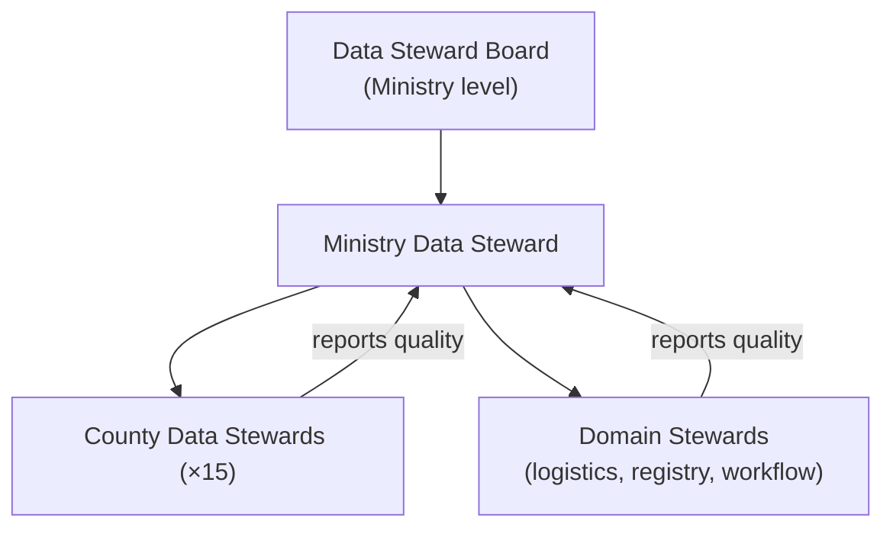

# AgriVault Data Governance

**Classification:** Internal — Data stewards, IT, programme leadership  
**Version:** 0.1.0-rc1  
**Platform:** AgriVault (`agritrace`)  
**Audience:** County data stewards, Ministry data stewards, programme leads, DAO/CAC officers, auditors

**Related:** [../data-source-inventory.md](../data-source-inventory.md) · [../product/PRODUCT_PRINCIPLES.md](../product/PRODUCT_PRINCIPLES.md) · [../DATABASE.md](../DATABASE.md) · [../SECURITY.md](../SECURITY.md) · [OPERATING_MODEL.md](./OPERATING_MODEL.md) · [MINISTRY_IMPLEMENTATION_GUIDE.md](./MINISTRY_IMPLEMENTATION_GUIDE.md)

---

## Table of contents

1. [Purpose](#purpose)
2. [Governance structure](#governance-structure)
3. [Data stewards by entity](#data-stewards-by-entity)
4. [Data source taxonomy (LIVE / PILOT / OFFLINE / DEMO)](#data-source-taxonomy-live--pilot--offline--demo)
5. [Provenance policy](#provenance-policy)
6. [Data quality rules](#data-quality-rules)
7. [Retention and archival](#retention-and-archival)
8. [Access control and RLS](#access-control-and-rls)
9. [Audit and compliance](#audit-and-compliance)
10. [Steward responsibilities and cadence](#steward-responsibilities-and-cadence)
11. [Related documents](#related-documents)

---

## Purpose

This document defines data ownership, quality standards, provenance disclosure rules, and retention policies for AgriVault operational data. It implements [../product/PRODUCT_PRINCIPLES.md](../product/PRODUCT_PRINCIPLES.md) Principles 5 (data integrity), 6 (provenance), 8 (one source of truth), and 9 (no silent data loss).

Engineering implementation of the data source layer is documented in [../data-source-inventory.md](../data-source-inventory.md). This governance document defines the **policy** that engineering implements.

---

## Governance structure

| Body | Composition | Meets | Decisions |
|------|-------------|-------|-----------|
| Data Steward Board | Ministry data steward (chair), programme lead, Ministry IT, 2 county steward reps | Quarterly | Policy changes, retention amendments, quality standards |
| Ministry data steward | Appointed Ministry officer | Monthly (working) | Cross-county quality review, PILOT fixture approval |
| County data steward | Designated CAC coordinator or delegate | Monthly (county) | County farmer data quality, offline sync reconciliation |
| Domain stewards | Assigned per entity table below | As needed | Entity-specific quality rules |

Appointment of county stewards is a Phase 1 deliverable per [IMPLEMENTATION_PLAYBOOK.md](./IMPLEMENTATION_PLAYBOOK.md).

---

## Data stewards by entity

| Entity | Primary table(s) | County steward | Ministry steward | Domain steward |
|--------|------------------|----------------|------------------|----------------|
| Farmer registry | `farmers`, `farmer_visits` | County CAC | Ministry registry officer | Registry steward |
| Farm boundaries | `operational_submissions` (type: `farm_boundary`) | County CAC | Ministry GIS officer | Registry steward |
| Operational submissions | `operational_submissions`, `workflow_actions` | County CAC | Ministry workflow officer | Workflow steward |
| Rice production | `rice_production_records` | County CAC | Ministry programmes officer | Programmes steward |
| Warehouses | `warehouses`, `warehouse_transfer_orders` | — (national) | Ministry logistics officer | Logistics steward |
| Inventory movements | `inventory_movements` | — (national) | Ministry logistics officer | Logistics steward |
| Pilot fixtures | `pilot_dao_officers`, `pilot_operational_events`, `pilot_county_metrics` | — | Programme lead | Programme steward |
| User profiles | `profiles` | — | Ministry IT | IT steward |
| Audit log | `audit_log`, `workflow_actions` | — | Ministry auditor | Compliance steward |
| Offline queues | IndexedDB (`agrivault-offline`) | County CLAN lead | — | County steward (delegated) |

### Steward RACI for data entities

| Activity | County steward | Ministry steward | Domain steward | Programme lead |
|----------|:--------------:|:----------------:|:--------------:|:--------------:|
| Farmer record accuracy | A/R | C | C | I |
| Boundary GPS quality | A/R | C | R | I |
| Workflow data integrity | R | A | R | C |
| PILOT fixture updates | C | C | — | A/R |
| DEMO data segregation | I | C | — | A/R |
| Retention enforcement | C | A/R | R | C |
| Quality report submission | A/R | C | C | I |
| Data export approval | R | A | C | I |

Full operational RACI: [OPERATING_MODEL.md](./OPERATING_MODEL.md) § RACI matrix — data management.

---

## Data source taxonomy (LIVE / PILOT / OFFLINE / DEMO)

AgriVault classifies every data surface with one of four source kinds. Engineering reference: [../data-source-inventory.md](../data-source-inventory.md).

| Kind | Badge | Meaning | Authoritative for reporting? | Typical origin |
|------|-------|---------|------------------------------|----------------|
| **LIVE** | `LIVE` | Operational Supabase tables scoped by RLS | Yes | `farmers`, `operational_submissions`, `warehouses`, `inventory_movements` |
| **PILOT** | `PILOT` | Ministry pilot tables or CSV canonical fixtures | Yes (with PILOT disclosure) | `pilot_dao_officers`, `pilot_operational_events`, `MINISTRY_*` arrays |
| **OFFLINE** | `OFFLINE` | Device-local IndexedDB / localStorage queues | Yes (after sync confirmed) | `agrivault-offline`, `agrivault-dao-workflows`, transfer localStorage |
| **DEMO** | `DEMO` | Illustrative national story for training | **No** | `agriculture-pilot-data.ts` |

Mixed badges display as `Mixed · …` with contributors listed. Precedence: `demo` > `pilot` > `offline` > `live` ([../data-source-inventory.md](../data-source-inventory.md)).

---

## Provenance policy

### Binding rules

1. **No silent fallback.** Every data fallback sets `source.detail` explaining the path taken ([../product/PRODUCT_PRINCIPLES.md](../product/PRODUCT_PRINCIPLES.md) Principle 9).
2. **Badge required.** Every operational surface that displays data must show a `DataSourceBadge` or equivalent disclosure ([../data-source-inventory.md](../data-source-inventory.md)).
3. **DEMO never cited in official reports.** DEMO data is for training and demonstration only. Stewards must reject reports citing DEMO numbers without disclosure.
4. **PILOT must be disclosed.** PILOT data is valid for pilot reporting but must carry the PILOT badge and be noted in report footers.
5. **OFFLINE must sync before national reporting.** OFFLINE data is valid for county operations but must be synced and confirmed before inclusion in national aggregates.
6. **LIVE is default authority.** When LIVE data exists, it takes precedence over PILOT fixtures. PILOT fixtures activate only when LIVE tables are empty or unreachable.

### Reporting authority matrix

| Report type | Allowed sources | Prohibited sources | Steward approval required |
|-------------|----------------|-------------------|--------------------------|
| County operational report | LIVE, PILOT, OFFLINE (synced) | DEMO | County steward |
| District review summary | LIVE, PILOT | DEMO, unsynced OFFLINE | County steward |
| National executive briefing | LIVE, PILOT | DEMO (unless labelled "illustrative") | Ministry steward |
| Steering Committee dashboard | LIVE, PILOT | DEMO | Ministry steward |
| Training walkthrough | DEMO, PILOT | — | Training coordinator |
| Donor report | LIVE, PILOT | DEMO | Ministry steward + programme lead |
| Audit export | LIVE only | PILOT, DEMO, OFFLINE | Compliance steward |

### Demo-only surfaces (always DEMO badge)

These surfaces display DEMO data regardless of database state. They must not be used for operational decisions:

- `CountyOperationsClient`, `FieldAgentsClient`, `ReportsCenterClient`
- `FoodSecurityClient`, `InventoryOperationsClient`
- Ministry workspace hero KPIs (`/workspace/ministry`)

Source: [../data-source-inventory.md](../data-source-inventory.md) § Demo-only surfaces.

---

## Data quality rules

### Farmer registry

| Rule | Validation | Severity | Owner |
|------|------------|----------|-------|
| Unique farmer per county | No duplicate `national_id` within county | Error | County steward |
| Required fields complete | Name, county, district, contact | Error | CLAN (capture) / County steward (review) |
| GPS coordinates valid | Lat/lng within Liberia bounds | Error | CLAN (capture) |
| Boundary area plausible | Turf.js area > 0 and < 10,000 ha | Warning | County steward |
| Visit record linked | `farmer_visits` references valid `farmer_id` | Error | County steward |

### Workflow submissions

| Rule | Validation | Severity | Owner |
|------|------------|----------|-------|
| Valid state transitions only | FSM enforced server-side | Error | Workflow steward (automatic) |
| No orphaned submissions | Every non-draft submission has `workflow_actions` | Warning | Workflow steward |
| Review within SLA | DAO ≤ 48h, CAC ≤ 48h, Ministry ≤ 48h | Warning | Programme lead |
| Corrections loop closed | `*_corrections_requested` resubmitted or rejected | Warning | DAO/CAC steward |
| Terminal states archived | `ministry_approved` and `rejected` archived within 30 days | Warning | Ministry steward |

Reference: [../WORKFLOW_ENGINE.md](../WORKFLOW_ENGINE.md)

### GPS and boundary data

| Rule | Validation | Severity | Owner |
|------|------------|----------|-------|
| Minimum 3 boundary points | Polygon closure validated | Error | CLAN (capture) |
| GPS accuracy ≤ 10m (preferred) | Device GPS metadata | Warning | CLAN lead |
| Boundary within county bounds | Geo validation against county polygon | Error | County steward |
| No overlapping boundaries (same farmer) | Duplicate polygon check | Warning | Registry steward |

Reference: [../GIS_ARCHITECTURE.md](../GIS_ARCHITECTURE.md)

### Offline sync integrity

| Rule | Validation | Severity | Owner |
|------|------------|----------|-------|
| Idempotent sync | `client_id` upsert prevents duplicates | Error | Engineering (automatic) |
| No data loss on sync failure | Local queue retained until confirmed | Error | CLAN lead / County steward |
| Sync within 72h of capture | Pending queue age check | Warning | County steward |
| Conflict resolution documented | Sync conflict logged in audit | Warning | County steward |

Reference: [../OFFLINE_ARCHITECTURE.md](../OFFLINE_ARCHITECTURE.md)

---

## Retention and archival

| Data category | Active retention | Archive | Deletion | Legal basis |
|---------------|-----------------|---------|----------|-------------|
| Farmer registry | Indefinite (active programme) | After programme end + 7 years | Anonymised after archive period | Ministry data policy |
| Operational submissions (approved) | 3 years active | 7 years archived | After archive period | Audit requirement |
| Operational submissions (rejected) | 1 year active | 3 years archived | After archive period | Audit requirement |
| Workflow actions (audit trail) | Indefinite | Never deleted | Never | [../product/PRODUCT_PRINCIPLES.md](../product/PRODUCT_PRINCIPLES.md) Principle 1 |
| Audit log entries | Indefinite | Never deleted | Never | Compliance requirement |
| Offline queue (local) | Until synced + 7 days | Device wipe | Automatic on confirmed sync | Operational |
| PILOT fixtures | Duration of pilot phase | Removed at national scale gate | At G4 transition | Programme decision |
| DEMO data | Not retained | N/A | N/A (generated at runtime) | Training only |
| User profiles | Duration of employment + 1 year | 3 years | After archive period | HR policy |
| Executive briefing PDFs | 3 years | 7 years | After archive period | Cabinet records |

### Archival workflow

Workflow archival is triggered by Ministry officers via the `archive` action on terminal submissions ([../WORKFLOW_ENGINE.md](../WORKFLOW_ENGINE.md)). Database-level retention enforcement is a post-pilot deliverable per [../ROADMAP_POST_PILOT.md](../ROADMAP_POST_PILOT.md).

---

## Access control and RLS

Row-Level Security enforces county scoping for operational roles. Engineering reference: [../SECURITY.md](../SECURITY.md) · [../DATABASE.md](../DATABASE.md).

| Role group | Data scope | RLS policy |
|------------|------------|------------|
| CLAN | Own county | `profiles.county` match |
| DAO | Own county (+ district where set) | County + optional district filter |
| CAC | Own county | County match |
| Ministry | National (all counties) | Ministry role bypass |
| Admin / super_admin | National | Full access |
| Donor / auditor | Read-only national | Select policies only |

**Governance rules:**

- Stewards may not request RLS exceptions without Data Steward Board approval
- Cross-county data access requires Ministry steward authorisation and audit log entry
- Service role key (`SUPABASE_SERVICE_ROLE_KEY`) usage restricted to Ministry IT; never shared with county staff

---

## Audit and compliance

| Audit type | Scope | Frequency | Owner | Output |
|------------|-------|-----------|-------|--------|
| Provenance badge audit | All dashboard surfaces | Monthly | Ministry data steward | Compliance report |
| Workflow audit trail review | `workflow_actions` completeness | Monthly | Compliance steward | Audit report |
| RLS policy review | Supabase policies vs. role matrix | Quarterly | Ministry IT | Security report |
| Data quality scorecard | Quality rules above | Monthly | County stewards → Ministry steward | Quality dashboard |
| Offline sync reconciliation | Local queue vs. synced records | Weekly (pilot) | County steward | Sync report |
| Duplicate detection | Farmer registry + submissions | Monthly | Registry steward | Duplicate report |

Audit log immutability is enforced by [../product/PRODUCT_PRINCIPLES.md](../product/PRODUCT_PRINCIPLES.md) Principle 1. No steward, IT operator, or vendor may delete audit records.

---

## Steward responsibilities and cadence

### County data steward — monthly checklist

- [ ] Review farmer registry for duplicates and incomplete records
- [ ] Verify all dashboard surfaces show correct data source badges
- [ ] Reconcile offline sync queue (pending items > 72h flagged)
- [ ] Confirm DAO and CAC review SLAs met
- [ ] Submit county data quality report to Ministry data steward
- [ ] Escalate data disputes per [OPERATING_MODEL.md](./OPERATING_MODEL.md)

### Ministry data steward — monthly checklist

- [ ] Aggregate county quality reports
- [ ] Conduct provenance badge audit across national surfaces
- [ ] Review PILOT fixture currency (remove stale fixtures)
- [ ] Verify no DEMO data cited in official reports
- [ ] Report to Data Steward Board (quarterly) or programme lead (monthly)
- [ ] Approve data exports for donor and cabinet reporting

### Data Steward Board — quarterly agenda

1. Review retention policy compliance
2. Approve PILOT → LIVE transition for counties passing G3 gate
3. Review and resolve cross-county data disputes
4. Assess data quality trends and set targets for next quarter
5. Approve any RLS policy changes or data access exceptions

---

## Related documents

[../data-source-inventory.md](../data-source-inventory.md) · [../product/PRODUCT_PRINCIPLES.md](../product/PRODUCT_PRINCIPLES.md) · [../DATABASE.md](../DATABASE.md) · [../SECURITY.md](../SECURITY.md) · [../WORKFLOW_ENGINE.md](../WORKFLOW_ENGINE.md) · [../OFFLINE_ARCHITECTURE.md](../OFFLINE_ARCHITECTURE.md) · [OPERATING_MODEL.md](./OPERATING_MODEL.md) · [MINISTRY_IMPLEMENTATION_GUIDE.md](./MINISTRY_IMPLEMENTATION_GUIDE.md) · [IMPLEMENTATION_PLAYBOOK.md](./IMPLEMENTATION_PLAYBOOK.md)
