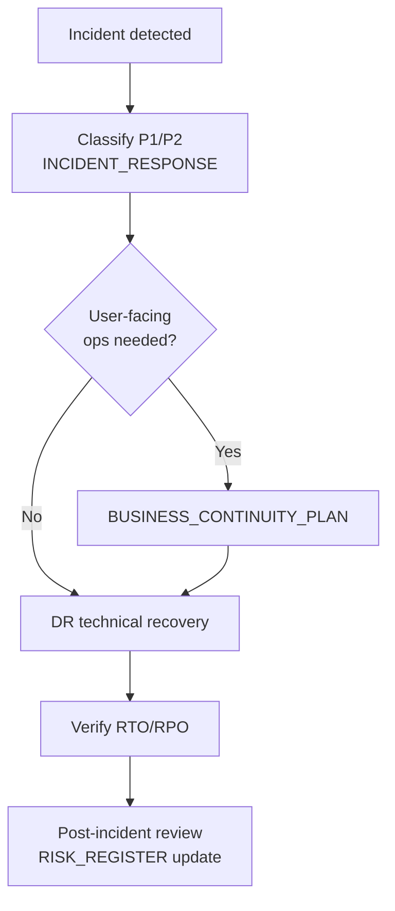
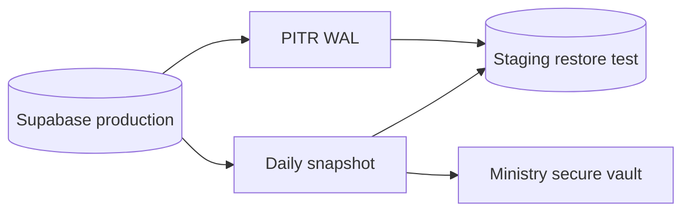

# AgriVault Disaster Recovery Plan

**Classification:** Internal — Ministry IT, operations, vendor engineering  
**Version:** 0.1.0-rc1  
**Platform:** AgriVault (`agritrace`)  
**Audience:** Ministry IT director, on-call engineer, programme manager, Supabase/Vercel account owners

**Related:** [BUSINESS_CONTINUITY_PLAN.md](./BUSINESS_CONTINUITY_PLAN.md) · [SUPPORT_MODEL.md](./SUPPORT_MODEL.md) · [../operations/BACKUP_RESTORE.md](../operations/BACKUP_RESTORE.md) · [../operations/INCIDENT_RESPONSE.md](../operations/INCIDENT_RESPONSE.md) · [../operations/SERVICE_LEVEL_OBJECTIVES.md](../operations/SERVICE_LEVEL_OBJECTIVES.md) · [../DATABASE.md](../DATABASE.md) · [../DEPLOYMENT_GUIDE.md](../DEPLOYMENT_GUIDE.md)

---

## Table of contents

1. [Purpose](#purpose)
2. [Recovery objectives](#recovery-objectives)
3. [System inventory](#system-inventory)
4. [Scenario 1 — Supabase outage](#scenario-1--supabase-outage)
5. [Scenario 2 — Vercel outage](#scenario-2--vercel-outage)
6. [Scenario 3 — Edge Function failure](#scenario-3--edge-function-failure)
7. [Scenario 4 — Data corruption](#scenario-4--data-corruption)
8. [Backup strategy](#backup-strategy)
9. [Recovery roles](#recovery-roles)
10. [Testing and drills](#testing-and-drills)
11. [Related documents](#related-documents)

---

## Purpose

This plan defines recovery procedures for AgriVault infrastructure failures affecting production availability or data integrity. It complements the business-facing continuity plan ([BUSINESS_CONTINUITY_PLAN.md](./BUSINESS_CONTINUITY_PLAN.md)) with technical recovery steps.

Incident classification and communication follow [../operations/INCIDENT_RESPONSE.md](../operations/INCIDENT_RESPONSE.md). SLA targets: [../operations/SERVICE_LEVEL_OBJECTIVES.md](../operations/SERVICE_LEVEL_OBJECTIVES.md).

---

## Recovery objectives

| Metric | Pilot (Wave 1) | Scale (Wave 2+) | Notes |
|--------|----------------|-----------------|-------|
| **RTO** (Recovery Time Objective) | 4 hours | 2 hours | Production read/write restored |
| **RPO** (Recovery Point Objective) | 24 hours | 1 hour | Maximum acceptable data loss |
| **MTPD** (Max Tolerable Period of Disruption) | 8 hours | 4 hours | Before BCP minimum viable ops |

RPO improvement at Wave 2 requires Supabase Point-in-Time Recovery (PITR) enabled per [NATIONAL_SCALE_GUIDE.md](./NATIONAL_SCALE_GUIDE.md) and [PROCUREMENT_GUIDE.md](./PROCUREMENT_GUIDE.md).

---

## System inventory

| Component | Provider | Criticality | Backup method | Owner |
|-----------|----------|-------------|---------------|-------|
| Next.js application | Vercel | Critical | Git repository; Vercel deployment history | Ministry IT |
| API routes / middleware | Vercel | Critical | Git repository | Ministry IT |
| PostgreSQL database | Supabase | Critical | Daily automated backup; PITR (Wave 2+) | Ministry IT |
| Supabase Auth | Supabase | Critical | Included in DB backup | Ministry IT |
| Edge Function `sync-batch` | Supabase | High | Git + Supabase CLI deploy | Ministry IT |
| Environment variables | Vercel + Supabase | Critical | Secure vault (Ministry to complete) | Ministry IT |
| Mapbox token | Mapbox | High | Ministry credential store | Ministry IT |
| IndexedDB (field devices) | Client | Medium | Device-local; not centrally backed up | Field lead |

Architecture reference: [../ARCHITECTURE.md](../ARCHITECTURE.md), [../OFFLINE_ARCHITECTURE.md](../OFFLINE_ARCHITECTURE.md).

---

## Scenario 1 — Supabase outage

**Trigger:** Supabase status page incident; auth failures; database connection errors; API 5xx from Supabase.

**Impact:** All roles lose read/write access. CLAN offline capture continues on device; sync fails until restored.

### Detection

| Signal | Source |
|--------|--------|
| Auth login failures | User reports; Vercel logs |
| API errors | `/admin/launch-readiness` red on Supabase check |
| Provider status | status.supabase.com |

### Recovery steps

| Step | Action | Owner | Target time |
|------|--------|-------|-------------|
| 1 | Confirm incident on Supabase status page | Ministry IT | T+0 |
| 2 | Declare P1; notify programme manager and field lead | Ministry IT | T+15 min |
| 3 | Activate [BUSINESS_CONTINUITY_PLAN.md](./BUSINESS_CONTINUITY_PLAN.md) field ops | Field lead | T+30 min |
| 4 | Monitor Supabase incident updates | Ministry IT | Ongoing |
| 5 | If provider recovery: verify auth, RLS, sample workflow query | Ministry IT | T+recovery |
| 6 | If extended outage (> 4 h): evaluate restore to new project from latest backup | Ministry IT + vendor | T+4 h |
| 7 | Post-restore: CLAN devices sync pending queues (monitor `manual_review`) | Field lead | T+restore + 2 h |
| 8 | Post-incident review | Programme manager | T+24 h |

**RTO target:** 4 hours (pilot); 2 hours with PITR and runbook maturity (Wave 2).

---

## Scenario 2 — Vercel outage

**Trigger:** Vercel status incident; application unreachable; 502/503 on all routes.

**Impact:** Users cannot access web application. Offline CLAN data safe on device; no new logins.

### Recovery steps

| Step | Action | Owner | Target time |
|------|--------|-------|-------------|
| 1 | Confirm on vercel-status.com | Ministry IT | T+0 |
| 2 | Declare P1; notify stakeholders | Ministry IT | T+15 min |
| 3 | Activate BCP; field ops continue offline | Field lead | T+30 min |
| 4 | If deployment corruption (not platform): rollback to last known good deployment | Ministry IT | T+30 min |
| 5 | Rollback command: redeploy previous production deployment via Vercel dashboard or CLI | Ministry IT | T+1 h |
| 6 | Verify launch readiness, login, workflow API | Ministry IT | T+restore |
| 7 | If platform outage: wait for Vercel resolution; communicate ETA | Ministry IT | Ongoing |
| 8 | Post-incident review | Programme manager | T+24 h |

Reference: [../operations/RELEASE_PROCESS.md](../operations/RELEASE_PROCESS.md) rollback procedure.

**Note:** Supabase may remain healthy during Vercel outage — data intact; access blocked.

---

## Scenario 3 — Edge Function failure

**Trigger:** CLAN sync failures; Edge Function logs show errors; `sync-batch` returns non-200.

**Impact:** Offline submissions cannot sync to Supabase. Online workflow otherwise functional.

### Recovery steps

| Step | Action | Owner | Target time |
|------|--------|-------|-------------|
| 1 | Confirm via Supabase Edge Function logs | Ministry IT | T+0 |
| 2 | Classify P2 (partial degradation) unless all counties affected | Ministry IT | T+15 min |
| 3 | Redeploy `sync-batch` from known good Git commit | Ministry IT / vendor | T+30 min |
| 4 | Verify env vars and Supabase service role in function config | Ministry IT | T+45 min |
| 5 | Test sync from staging CLAN device | Field lead | T+1 h |
| 6 | Notify CLAN users to retry sync; monitor `manual_review` count | County CAC | T+1 h |
| 7 | If code defect: escalate Tier 3 vendor hotfix | Vendor engineering | T+2 h |

Reference: [../OFFLINE_ARCHITECTURE.md](../OFFLINE_ARCHITECTURE.md), [../DEPLOYMENT_GUIDE.md](../DEPLOYMENT_GUIDE.md) Edge Function section.

**Prevention:** Edge Function deployment in [../PILOT_CHECKLIST.md](../PILOT_CHECKLIST.md) Week 0 gate.

---

## Scenario 4 — Data corruption

**Trigger:** Incorrect mass update; failed migration; accidental row deletion; RLS policy error exposing wrong data.

**Impact:** Data integrity compromised; possible regulatory and programme reputational harm.

### Recovery steps

| Step | Action | Owner | Target time |
|------|--------|-------|-------------|
| 1 | Stop writes: disable affected API routes or put app in maintenance mode | Ministry IT | T+0 |
| 2 | Assess scope: identify tables, counties, time range affected | Ministry IT + vendor | T+30 min |
| 3 | Preserve evidence: export current state before restore | Ministry IT | T+1 h |
| 4 | Select recovery point: latest clean backup or PITR timestamp | Ministry IT | T+1 h |
| 5 | Restore to staging first; validate row counts and sample workflows | Ministry IT + vendor | T+2 h |
| 6 | Promote restore to production or selective table restore | Ministry IT | T+4 h |
| 7 | Reconcile CLAN device queues against restored DB | Field lead | T+restore + 4 h |
| 8 | Notify Steering Committee if PII affected | Programme manager | T+4 h |
| 9 | Root cause analysis; update [RISK_REGISTER.md](./RISK_REGISTER.md) | Programme manager | T+48 h |

**RPO target:** 24 hours (daily backup) at pilot; 1 hour with PITR at Wave 2.

---

## Backup strategy

### Supabase automated backups

| Backup type | Frequency | Retention | Availability |
|-------------|-----------|-----------|--------------|
| Daily snapshot | Daily | 7 days (Pro default) | Supabase dashboard |
| PITR | Continuous WAL | 7 days (add-on) | Wave 2 onward |

### Manual backup procedure

Execute before each production migration or wave onboarding:

1. Export schema via Supabase CLI or dashboard.
2. Export critical tables: `operational_submissions`, `profiles`, workflow-related tables.
3. Store encrypted copy in Ministry secure storage (location: Ministry to complete).
4. Log backup in DR drill register.

Detail: [../operations/BACKUP_RESTORE.md](../operations/BACKUP_RESTORE.md).

### What is not backed up centrally

| Data | Location | Recovery approach |
|------|----------|-------------------|
| IndexedDB offline drafts | CLAN devices | Device sync after restore; paper fallback if device lost |
| Vercel deployment artefacts | Vercel + Git | Redeploy from Git tag |
| Mapbox usage history | Mapbox dashboard | Not required for recovery |

---

## Recovery roles

| Role | DR responsibilities |
|------|---------------------|
| DR lead (Ministry IT) | Incident command for technical recovery; restore execution |
| Programme manager | Stakeholder communication; Steering Committee notification |
| Field lead | CLAN device coordination; sync retry after restore |
| Vendor engineering | Code rollback; migration repair; assisted restore |
| County CAC | County user communication; BCP activation |
| Pilot administrator | User account verification post-restore |

On-call rotation: [../operations/ON_CALL_GUIDE.md](../operations/ON_CALL_GUIDE.md) (Wave 2+).

---

## Testing and drills

| Drill | Frequency | Success criteria | Owner |
|-------|-----------|------------------|-------|
| Backup restore to staging | Before each wave | Workflow query returns expected data | Ministry IT |
| Vercel rollback | Quarterly | Previous deployment serves traffic in < 30 min | Ministry IT |
| Edge Function redeploy | Before each pilot field week | Staging sync test passes | Ministry IT |
| Tabletop exercise (all scenarios) | Semi-annual | Roles know escalation path | Programme manager |
| PITR point restore | Before Wave 2 | Restore to specific timestamp within RPO | Ministry IT |

Drill results logged; failures create [RISK_REGISTER.md](./RISK_REGISTER.md) entries.

Gate G2 requires completed restore drill ([NATIONAL_SCALE_GUIDE.md](./NATIONAL_SCALE_GUIDE.md)).

---

## Related documents

| Document | Relationship |
|----------|--------------|
| [BUSINESS_CONTINUITY_PLAN.md](./BUSINESS_CONTINUITY_PLAN.md) | Field ops during outage |
| [SUPPORT_MODEL.md](./SUPPORT_MODEL.md) | Tier 2/3 escalation |
| [../operations/BACKUP_RESTORE.md](../operations/BACKUP_RESTORE.md) | Detailed backup procedures |
| [../operations/INCIDENT_RESPONSE.md](../operations/INCIDENT_RESPONSE.md) | Incident classification |
| [../operations/SERVICE_LEVEL_OBJECTIVES.md](../operations/SERVICE_LEVEL_OBJECTIVES.md) | RTO/RPO SLA alignment |
| [../operations/MONITORING.md](../operations/MONITORING.md) | Detection signals |
| [NATIONAL_SCALE_GUIDE.md](./NATIONAL_SCALE_GUIDE.md) | PITR before Wave 2 |
| [PROCUREMENT_GUIDE.md](./PROCUREMENT_GUIDE.md) | PITR procurement |
| [RISK_REGISTER.md](./RISK_REGISTER.md) | R-002, R-021, R-022 |
| [../DATABASE.md](../DATABASE.md) | Schema reference for restore validation |
