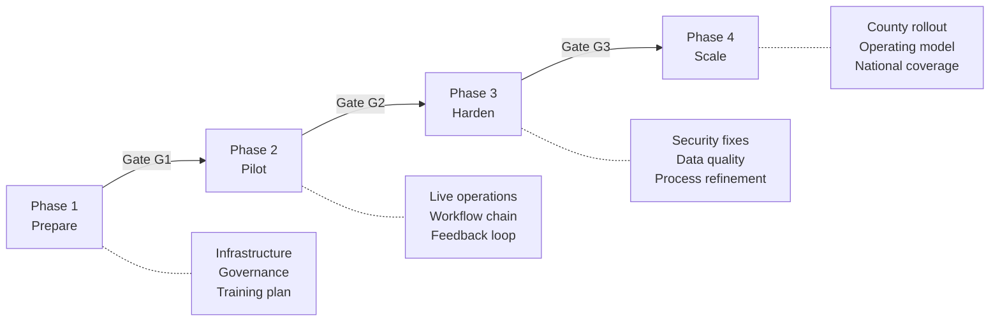

# AgriVault Implementation Playbook

**Classification:** Internal — PMO, implementation partners  
**Version:** 0.1.0-rc1  
**Platform:** AgriVault (`agritrace`)  
**Audience:** Project management office, Ministry programme leads, vendor delivery managers

**Related:** [MINISTRY_IMPLEMENTATION_GUIDE.md](./MINISTRY_IMPLEMENTATION_GUIDE.md) · [../ARCHITECTURE.md](../ARCHITECTURE.md) · [../WORKFLOW_ENGINE.md](../WORKFLOW_ENGINE.md) · [../product/PRODUCT_PRINCIPLES.md](../product/PRODUCT_PRINCIPLES.md) · [CHANGE_MANAGEMENT.md](./CHANGE_MANAGEMENT.md) · [OPERATING_MODEL.md](./OPERATING_MODEL.md)

---

## Table of contents

1. [Purpose](#purpose)
2. [Playbook overview](#playbook-overview)
3. [Phase 1 — Prepare](#phase-1--prepare)
4. [Phase 2 — Pilot](#phase-2--pilot)
5. [Phase 3 — Harden](#phase-3--harden)
6. [Phase 4 — Scale](#phase-4--scale)
7. [Master timeline](#master-timeline)
8. [Cross-phase dependencies](#cross-phase-dependencies)
9. [Risk and decision gates](#risk-and-decision-gates)
10. [Related documents](#related-documents)

---

## Purpose

This playbook defines the four-phase implementation methodology for deploying AgriVault from initial preparation through national county scale. Each phase has explicit deliverables, owners, and gate criteria. No phase may begin until the prior phase gate passes.

RC1 scope: Phases 1–2 are mandatory for pilot counties. Phases 3–4 require Steering Committee approval based on pilot outcomes documented in [../ROADMAP_POST_PILOT.md](../ROADMAP_POST_PILOT.md).

---

## Playbook overview

| Phase | Duration | Counties | Primary outcome |
|-------|----------|----------|-----------------|
| Prepare | 4 weeks | 0 (setup) | Infrastructure and roster ready |
| Pilot | 4 weeks | 1–2 | Validated CLAN→DAO→CAC→Ministry chain |
| Harden | 4 weeks | 1–2 (continued) | Production readiness ≥ 85/100 |
| Scale | 4–6 months | 5–15 | National operational coverage |

---

## Phase 1 — Prepare

**Objective:** Establish technical foundation, governance structure, and county readiness before any user accesses production data.

**Duration:** Weeks −4 to 0 (relative to pilot go-live)

### Deliverables

| ID | Deliverable | Owner | Acceptance criteria |
|----|-------------|-------|---------------------|
| P1-D1 | Supabase project live with migrations applied | Ministry IT | All 11 migrations applied; RLS policies active |
| P1-D2 | Vercel deployment with env vars configured | Ministry IT / vendor | `/admin/launch-readiness` green |
| P1-D3 | Edge Function `sync-batch` deployed | Ministry IT | Offline smoke test passes |
| P1-D4 | Pilot county selection memo | Programme lead | Steering Committee approved |
| P1-D5 | County user roster (CLAN, DAO, CAC, Ministry) | County CAC | Names, emails, roles, counties finalised |
| P1-D6 | Data steward assignments | Programme lead | [DATA_GOVERNANCE.md](./DATA_GOVERNANCE.md) roster complete |
| P1-D7 | Change management plan | Programme lead | [CHANGE_MANAGEMENT.md](./CHANGE_MANAGEMENT.md) distributed |
| P1-D8 | Training schedule | Training coordinator | All four role groups scheduled |
| P1-D9 | Operating model agreement | Operations leadership | [OPERATING_MODEL.md](./OPERATING_MODEL.md) signed |
| P1-D10 | End-to-end staging test | Vendor + programme lead | Full workflow chain on staging environment |

### Timeline

| Week | Activities | Milestone |
|------|------------|-----------|
| −4 | Steering Committee kickoff; county selection | Charter approved |
| −3 | IT provisioning begins; roster collection | Supabase project created |
| −2 | Migrations applied; env vars set; device inventory | Staging deployment live |
| −1 | User provisioning; training materials distributed; staging E2E test | **Gate G1 review** |
| 0 | Go-live (Phase 2 begins) | County users activated |

### Gate G1 — Prepare complete

| Criterion | Verification method | Must pass |
|-----------|---------------------|-----------|
| All P1 deliverables complete | Deliverable tracker | Yes |
| Staging E2E workflow test passed | Test submission ID logged | Yes |
| Launch readiness admin page green | `/admin/launch-readiness` | Yes |
| Steering Committee go-live authorisation | Meeting minutes | Yes |
| Change communications sent to pilot counties | Distribution log | Yes |

**Gate authority:** Steering Committee. Programme lead presents; Committee approves or defers.

---

## Phase 2 — Pilot

**Objective:** Operate AgriVault in 1–2 pilot counties with real field data flowing through the full approval chain.

**Duration:** Weeks 1–4. Focus: Week 1 stabilise capture and sync; Week 2 establish review chain throughput; Week 3 audit data provenance and GPS quality; Week 4 assess metrics and prepare Gate G2.

### Deliverables

| ID | Deliverable | Owner | Acceptance criteria |
|----|-------------|-------|---------------------|
| P2-D1 | Live field registrations | CLAN lead | ≥ 50 farmer records captured (pilot target) |
| P2-D2 | Workflow submissions through all four stages | Programme lead | ≥ 20 submissions reach `ministry_approved` |
| P2-D3 | Offline sync success rate documented | County CAC | ≥ 90% sync success on field days |
| P2-D4 | Verification queue SLA met | DAO/CAC leads | DAO review ≤ 48h; CAC review ≤ 48h |
| P2-D5 | Weekly status reports (×4) | Programme lead | Submitted to Steering Committee |
| P2-D6 | Training completion log | Training coordinator | ≥ 90% of roster trained |
| P2-D7 | Data source badge compliance audit | Data steward | No LIVE data mislabelled ([../data-source-inventory.md](../data-source-inventory.md)) |
| P2-D8 | Issue log with severity classification | Programme lead | All P1/P2 issues tracked |
| P2-D9 | Executive briefing PDF generated | Ministry officer | At least one cabinet-ready export |
| P2-D10 | Pilot feedback survey results | Programme lead | All role groups represented |

### Pilot metrics (targets)

| Metric | Target | Measurement | Source |
|--------|--------|-------------|--------|
| Submission throughput | ≥ 20 ministry-approved | Count of `ministry_approved` status | `operational_submissions` |
| Workflow rejection rate | ≤ 15% | Rejected / total submitted | Workflow engine |
| Offline sync success | ≥ 90% | Successful syncs / attempted | CLAN sync queue |
| DAO review turnaround | ≤ 48 hours median | Time in `dao_review` | `workflow_actions` timestamps |
| CAC review turnaround | ≤ 48 hours median | Time in `cac_review` | `workflow_actions` timestamps |
| User login success (week 1) | ≥ 95% | Successful logins / roster | Auth logs |
| Training completion | ≥ 90% | Trained / roster | Training log |
| Data provenance compliance | 100% | Surfaces with correct badges | Manual audit |

Detailed KPI definitions: [PILOT_SUCCESS_METRICS.md](./PILOT_SUCCESS_METRICS.md).

### Gate G2 — Pilot complete

| Criterion | Threshold | Evidence |
|-----------|-----------|----------|
| Ministry-approved submissions | ≥ 20 | Database query |
| Full chain operational | CLAN→DAO→CAC→Ministry verified | Workflow audit |
| No open P1 (critical) issues | 0 open | Issue log |
| Pilot feedback collected | All role groups | Survey results |
| Production readiness score | ≥ 76/100 (current RC1 baseline) | [../production-readiness.md](../production-readiness.md) |
| Steering Committee pilot assessment | Pass / conditional pass | Meeting minutes |

**Conditional pass:** Pilot may proceed to Harden with documented remediation plan for failed criteria. National scale blocked until all G2 criteria pass.

---

## Phase 3 — Harden

**Objective:** Resolve pilot findings, close technical debt items blocking production readiness, and refine operational processes before county expansion.

**Duration:** Weeks 5–8

### Deliverables

| ID | Deliverable | Owner | Acceptance criteria |
|----|-------------|-------|---------------------|
| P3-D1 | Critical and high issues resolved | Vendor + Ministry IT | Issue log cleared of P1/P2 |
| P3-D2 | Security hardening complete | Ministry IT | [../security-hardening-notes.md](../security-hardening-notes.md) checklist |
| P3-D3 | Data quality rules enforced | Data stewards | [DATA_GOVERNANCE.md](./DATA_GOVERNANCE.md) quality rules active |
| P3-D4 | Workflow completeness gaps closed | Engineering | [../workflow-completeness-audit.md](../workflow-completeness-audit.md) |
| P3-D5 | Updated role guides (if process changes) | Programme lead | Guides re-distributed |
| P3-D6 | DR plan tested | Ministry IT | [DISASTER_RECOVERY_PLAN.md](./DISASTER_RECOVERY_PLAN.md) tabletop exercise |
| P3-D7 | Support model operational | Support lead | [SUPPORT_MODEL.md](./SUPPORT_MODEL.md) tiers active |
| P3-D8 | Production readiness re-assessment | PMO | Score ≥ 85/100 |
| P3-D9 | Post-pilot technical roadmap prioritised | Engineering + programme lead | [../ROADMAP_POST_PILOT.md](../ROADMAP_POST_PILOT.md) updated |
| P3-D10 | Scale county shortlist (3–5 counties) | Programme lead | Steering Committee reviewed |

### Hardening workstreams

| Workstream | Focus | Reference |
|------------|-------|-----------|
| Security | CSP, RLS audit, auth hardening | [../SECURITY.md](../SECURITY.md) |
| Data | Provenance gaps, retention policy, steward training | [DATA_GOVERNANCE.md](./DATA_GOVERNANCE.md) |
| Workflow | Submission type coverage, notification gaps | [../WORKFLOW_ENGINE.md](../WORKFLOW_ENGINE.md) |
| Offline | Sync reliability, conflict resolution | [../OFFLINE_ARCHITECTURE.md](../OFFLINE_ARCHITECTURE.md) |
| Operations | Support tiers, escalation paths, cadence | [OPERATING_MODEL.md](./OPERATING_MODEL.md) |

### Gate G3 — Harden complete

| Criterion | Threshold | Gate authority |
|-----------|-----------|----------------|
| Production readiness score | ≥ 85/100 | PMO |
| Open P1/P2 issues | 0 | Programme lead |
| DR tabletop exercise | Completed | Ministry IT |
| Data governance policy | Approved and active | Data steward board |
| Scale county shortlist | Approved | Steering Committee |
| Post-pilot roadmap | Prioritised backlog | Engineering lead |

---

## Phase 4 — Scale

**Objective:** Expand AgriVault from pilot counties to national coverage (15 counties) using a repeatable county rollout pattern.

**Duration:** Months 3–8 (post-hardening)

### Rollout waves

| Wave | Counties | Duration | Cumulative |
|------|----------|----------|------------|
| Wave 1 | Pilot counties (continued) | Ongoing | 1–2 |
| Wave 2 | 3 adjacent counties | 6 weeks | 4–5 |
| Wave 3 | 3 counties | 6 weeks | 7–8 |
| Wave 4 | Remaining counties | 8 weeks | 15 |

County rollout detail: [NATIONAL_SCALE_GUIDE.md](./NATIONAL_SCALE_GUIDE.md) · [../government/COUNTY_ROLLOUT_PLAN.md](../government/COUNTY_ROLLOUT_PLAN.md).

### Per-county rollout checklist (repeatable)

Each new county follows the Prepare phase deliverables scoped to a single county:

1. County roster finalised (CLAN, DAO, CAC)
2. Users provisioned per [MINISTRY_IMPLEMENTATION_GUIDE.md](./MINISTRY_IMPLEMENTATION_GUIDE.md)
3. County data steward assigned
4. CLAN device setup session
5. End-to-end workflow test on production
6. Change communications sent ([CHANGE_MANAGEMENT.md](./CHANGE_MANAGEMENT.md))
7. County go-live sign-off
8. 2-week hypercare period (daily programme lead check-in)

### Deliverables

| ID | Deliverable | Owner | Acceptance criteria |
|----|-------------|-------|---------------------|
| P4-D1 | Wave 2 counties live | Programme lead | 3 counties operational |
| P4-D2 | National heat map with live county data | Ministry officer | [../GIS_ARCHITECTURE.md](../GIS_ARCHITECTURE.md) |
| P4-D3 | Operating model fully transitioned to BAU | Operations leadership | [OPERATING_MODEL.md](./OPERATING_MODEL.md) |
| P4-D4 | Training programme self-sufficient | Training coordinator | [TRAINING_PROGRAM.md](./TRAINING_PROGRAM.md) |
| P4-D5 | All 15 counties onboarded | Programme lead | County roster complete |
| P4-D6 | National executive briefing cadence | Ministry leadership | Monthly PDF export |

### Gate G4 — National scale complete

| Criterion | Threshold |
|-----------|-----------|
| Counties onboarded | 15/15 |
| Ministry-approved submissions (national) | Programme-defined annual target |
| Support model self-sufficient | Tier 1 handled by Ministry IT |
| Production readiness | ≥ 90/100 |
| Steering Committee national declaration | Formal sign-off |

---

## Master timeline

| Phase | Start | End | Duration | Gate |
|-------|-------|-----|----------|------|
| Prepare | Week −4 | Week 0 | 4 weeks | G1 |
| Pilot | Week 1 | Week 4 | 4 weeks | G2 |
| Harden | Week 5 | Week 8 | 4 weeks | G3 |
| Scale Wave 1 | Month 3 | Month 4 | 6 weeks | — |
| Scale Wave 2 | Month 4 | Month 5 | 6 weeks | — |
| Scale Wave 3 | Month 6 | Month 7 | 8 weeks | G4 |

---

## Cross-phase dependencies

| Dependency | From | To | Risk if missed |
|------------|------|----|----------------|
| Supabase migrations | Prepare | Pilot | Workflow engine non-functional |
| User roster | Prepare | Pilot | Role assignment errors |
| Change communications | Prepare | Pilot | Low adoption, resistance |
| Pilot metrics | Pilot | Harden | No evidence for scale decision |
| Security hardening | Harden | Scale | County expansion with open vulnerabilities |
| Data governance policy | Harden | Scale | Inconsistent data quality across counties |
| Operating model | Harden | Scale | Support gaps during rollout waves |
| Training programme | Harden | Scale | Cannot onboard counties without vendor |

---

## Risk and decision gates

| Risk | Phase | Mitigation | Owner |
|------|-------|------------|-------|
| Offline sync failures in remote areas | Pilot | Mobile hotspot plan; sync-day scheduling | County CAC |
| DAO/CAC review backlog | Pilot | Daily queue monitoring; temporary reviewer assignment | Programme lead |
| Mapbox token misconfiguration | Prepare | Staging GPS test before go-live | Ministry IT |
| Data provenance confusion in reports | Pilot | Badge audit; steward training | Data steward |
| Scope creep (national features during pilot) | Pilot | RC1 scope lock per [../RELEASE_NOTES_RC1.md](../RELEASE_NOTES_RC1.md) | Steering Committee |
| Vendor dependency for county onboarding | Scale | Training programme + Ministry IT capability | Training coordinator |

Full risk register: [RISK_REGISTER.md](./RISK_REGISTER.md).

## Related documents

[MINISTRY_IMPLEMENTATION_GUIDE.md](./MINISTRY_IMPLEMENTATION_GUIDE.md) · [CHANGE_MANAGEMENT.md](./CHANGE_MANAGEMENT.md) · [OPERATING_MODEL.md](./OPERATING_MODEL.md) · [DATA_GOVERNANCE.md](./DATA_GOVERNANCE.md) · [../ARCHITECTURE.md](../ARCHITECTURE.md) · [../WORKFLOW_ENGINE.md](../WORKFLOW_ENGINE.md) · [../product/PRODUCT_PRINCIPLES.md](../product/PRODUCT_PRINCIPLES.md) · [../ROADMAP_POST_PILOT.md](../ROADMAP_POST_PILOT.md) · [../PILOT_CHECKLIST.md](../PILOT_CHECKLIST.md)
