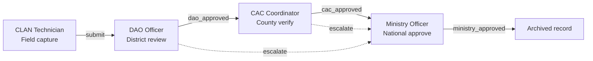
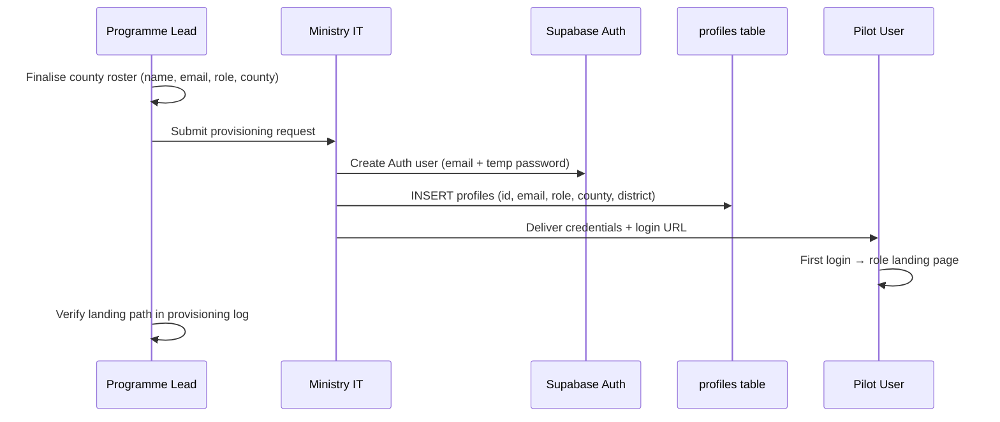

# Ministry Implementation Guide

**Classification:** Internal — Ministry programme leads  
**Version:** 0.1.0-rc1  
**Platform:** AgriVault (`agritrace`)  
**Audience:** Ministry of Agriculture programme directors, pilot administrators, IT liaison officers

**Related:** [../ARCHITECTURE.md](../ARCHITECTURE.md) · [../WORKFLOW_ENGINE.md](../WORKFLOW_ENGINE.md) · [../product/PRODUCT_PRINCIPLES.md](../product/PRODUCT_PRINCIPLES.md) · [../DEPLOYMENT_GUIDE.md](../DEPLOYMENT_GUIDE.md) · [IMPLEMENTATION_PLAYBOOK.md](./IMPLEMENTATION_PLAYBOOK.md) · [OPERATING_MODEL.md](./OPERATING_MODEL.md)

---

## Table of contents

1. [Purpose and scope](#purpose-and-scope)
2. [Operational chain overview](#operational-chain-overview)
3. [Implementation phases](#implementation-phases)
4. [Prerequisites](#prerequisites)
5. [User provisioning](#user-provisioning)
6. [Environment variables reference](#environment-variables-reference)
7. [County pilot setup sequence](#county-pilot-setup-sequence)
8. [Go-live checklist](#go-live-checklist)
9. [Post go-live responsibilities](#post-go-live-responsibilities)
10. [Escalation and support paths](#escalation-and-support-paths)
11. [Related documents](#related-documents)

---

## Purpose and scope

This guide defines the Ministry programme lead's responsibilities for deploying AgriVault RC1 in controlled county environments. It covers prerequisites, user provisioning, environment configuration, and the go-live gate — not day-to-day field operations (see role guides) or engineering deployment steps (see [../DEPLOYMENT_GUIDE.md](../DEPLOYMENT_GUIDE.md)).

AgriVault RC1 is approved for **pilot deployment only**. National scale requires completion of post-pilot hardening per [../ROADMAP_POST_PILOT.md](../ROADMAP_POST_PILOT.md) and [IMPLEMENTATION_PLAYBOOK.md](./IMPLEMENTATION_PLAYBOOK.md) Phase 3–4.

| In programme lead scope | Out of scope |
|-------------------------|--------------|
| Pilot county selection and stakeholder sign-off | Application code changes |
| User account creation and role assignment | Supabase project provisioning (Ministry IT) |
| Training schedule and change communications | Vercel account and billing |
| Go-live gate approval | Mapbox account creation |
| Weekly pilot status reporting | Security penetration testing |

---

## Operational chain overview

AgriVault enforces a four-stage approval chain backed by the finite-state workflow engine ([../WORKFLOW_ENGINE.md](../WORKFLOW_ENGINE.md)). Every operational submission progresses through authenticated human review — no stage may be skipped by configuration.



| Stage | Role(s) | Primary surface | Workflow statuses |
|-------|---------|-----------------|-------------------|
| Capture | `clan_technician`, `field_agent` | `/field/mobile`, `/field/boundary-capture` | `draft`, `submitted` |
| District review | `dao_officer`, `district_officer` | `/district-dashboard`, `/verification-queue` | `dao_review`, `dao_approved` |
| County verify | `county_agriculture_coordinator`, `county_officer` | `/county-dashboard`, CaoApprovalQueues | `cac_review`, `cac_approved` |
| National approve | `ministry_officer`, `ministry_admin` | `/command-center`, `/verification-queue` | `ministry_review`, `ministry_approved` |

Role guides: [../CLAN_FIELD_GUIDE.md](../CLAN_FIELD_GUIDE.md) · [../DAO_GUIDE.md](../DAO_GUIDE.md) · [../CAC_GUIDE.md](../CAC_GUIDE.md) · [../MINISTRY_GUIDE.md](../MINISTRY_GUIDE.md)

---

## Implementation phases

Programme leads coordinate four phases defined in [IMPLEMENTATION_PLAYBOOK.md](./IMPLEMENTATION_PLAYBOOK.md). Summary for Ministry context:

| Phase | Duration | Programme lead focus |
|-------|----------|---------------------|
| **Prepare** | Weeks −4 to 0 | Stakeholder alignment, county selection, IT handoff |
| **Pilot** | Weeks 1–4 | User provisioning, training, daily oversight |
| **Harden** | Weeks 5–8 | Issue triage, process refinement, data quality review |
| **Scale** | Months 3+ | County expansion approval, operating model handoff |

---

## Prerequisites

Complete all items before requesting go-live approval from the Steering Committee.

### Governance prerequisites

| # | Requirement | Owner | Evidence |
|---|-------------|-------|----------|
| G1 | Pilot county(ies) identified with CAC and DAO leads named | Programme lead | Signed county roster |
| G2 | Steering Committee authorisation for RC1 pilot | Ministry leadership | Meeting minutes |
| G3 | Data governance steward assigned per county | Programme lead | [DATA_GOVERNANCE.md](./DATA_GOVERNANCE.md) roster |
| G4 | Change management plan distributed | Programme lead | [CHANGE_MANAGEMENT.md](./CHANGE_MANAGEMENT.md) sign-off |
| G5 | Support escalation path documented | Programme lead | [OPERATING_MODEL.md](./OPERATING_MODEL.md) § Support |

### Technical prerequisites (Ministry IT)

| # | Requirement | Owner | Verification |
|---|-------------|-------|--------------|
| T1 | Supabase project provisioned (Auth + Postgres + Edge Functions) | Ministry IT | Project dashboard accessible |
| T2 | Vercel deployment live with custom domain (if applicable) | Ministry IT / vendor | `/health` returns 200 |
| T3 | All required environment variables set | Ministry IT | `/admin/launch-readiness` green |
| T4 | Database migrations applied (11 files) | Ministry IT | [../DEPLOYMENT_GUIDE.md](../DEPLOYMENT_GUIDE.md) § Database setup |
| T5 | Edge Function `sync-batch` deployed | Ministry IT | Offline sync smoke test passes |
| T6 | Mapbox token provisioned with domain restrictions | Ministry IT | GPS capture functional on staging |
| T7 | CSP headers verified for Mapbox and Supabase domains | Ministry IT | [../production-readiness.md](../production-readiness.md) |

### Operational prerequisites

| # | Requirement | Owner | Verification |
|---|-------------|-------|--------------|
| O1 | CLAN device inventory with GPS capability confirmed | County CAC | Device list with IMEI/serial |
| O2 | Field connectivity plan (mobile data hotspots for sync days) | County CAC | Written plan |
| O3 | Training sessions scheduled for all four role groups | Programme lead | Training calendar |
| O4 | Unique training accounts seeded for training rehearsals | Programme lead | `Admin Users & Roles invitation workflow` on deployment |
| O5 | Role guides distributed in print or PDF | Programme lead | Distribution log |

---

## User provisioning

User accounts require two records: Supabase Auth user and matching `profiles` row. The workflow engine resolves permissions from `profiles.role` — not from UI role switchers ([../PILOT_ADMIN_GUIDE.md](../PILOT_ADMIN_GUIDE.md)).

### Provisioning workflow



### Role assignment matrix

| Operational group | DB role values | County scope | Default landing | Provisioning authority |
|-------------------|----------------|--------------|-----------------|------------------------|
| CLAN | `clan_technician`, `field_agent` | Required | `/field/mobile` | County CAC → IT |
| DAO | `dao_officer`, `district_officer` | Required | `/district-dashboard` | County CAC → IT |
| CAC | `county_agriculture_coordinator`, `county_officer` | Required | `/county-dashboard` | Programme lead → IT |
| Ministry | `ministry_officer`, `ministry_admin`, `government_officer` | National | `/command-center` | Programme lead → IT |
| Admin | `super_admin`, `admin` | National | `/command-center` | Ministry IT only |

**County field:** Required for CLAN, DAO, and CAC roles. RLS policies scope data access by county ([../SECURITY.md](../SECURITY.md)). Ministry and admin roles may have county set to headquarters county (e.g. `Montserrado`) for profile completeness.

**District field:** Set for DAO officers where district-level scoping is required.

### Provisioning SQL template

After creating the Auth user, insert the profile (replace placeholders):

```sql
insert into public.profiles (id, email, full_name, role, county, district)
values (
  '<auth-user-uuid>',
  'officer.name@agriculture.gov.lr',
  'Officer Full Name',
  'dao_officer',
  'Bong',
  'Suakoko'
);
```

First super admin bootstrap: see [../DEPLOYMENT_GUIDE.md](../DEPLOYMENT_GUIDE.md) § First super admin.

Unique training accounts: seed with `Admin Users & Roles invitation workflow` per [../PILOT_ADMIN_GUIDE.md](../PILOT_ADMIN_GUIDE.md). Not for operational data entry during live pilot.

---

## Environment variables reference

Full engineering reference: [../DEPLOYMENT_GUIDE.md](../DEPLOYMENT_GUIDE.md) § Environment variables.

Programme leads verify configuration via admin surfaces — do not handle secret values directly.

### Required variables

| Variable | Scope | Programme lead verification |
|----------|-------|----------------------------|
| `NEXT_PUBLIC_SUPABASE_URL` | Client + server | `/health` shows Supabase connected |
| `NEXT_PUBLIC_SUPABASE_ANON_KEY` | Client + server | Login succeeds |
| `SUPABASE_SERVICE_ROLE_KEY` | Server only | Workflow API mutations succeed |
| `NEXT_PUBLIC_MAPBOX_TOKEN` | Client | GPS boundary capture renders map |

### Recommended variables

| Variable | Purpose | Pilot note |
|----------|---------|------------|
| `NEXT_PUBLIC_APP_URL` | Canonical URL for metadata | Set to production domain before go-live |
| `ANTHROPIC_API_KEY` | AI chat endpoint | Optional — AI disabled for pilot per [../KNOWN_LIMITATIONS.md](../KNOWN_LIMITATIONS.md) |

### Optional variables (pilot defaults)

| Variable | Default | When to change |
|----------|---------|----------------|
| `NEXT_PUBLIC_SHOW_DEMO_RAIL` | off | Enable (`"true"`) only for training environments |
| `NEXT_PUBLIC_ENABLE_HOMEPAGE_EXPERIMENT` | enabled | Disable for production pilot URL |

### Validation surfaces

| Surface | Route | What it checks |
|---------|-------|----------------|
| Health | `/health` | Environment variable presence |
| Setup | `/setup` | First-run bootstrap instructions |
| Launch readiness | `/admin/launch-readiness` | Env + table presence matrix |
| System config | `/admin/system` | Runtime configuration display |

Programme lead action: request Ministry IT to resolve any red items on `/admin/launch-readiness` before go-live gate.

---

## County pilot setup sequence

Execute in order for each pilot county.

| Step | Action | Owner | Duration |
|------|--------|-------|----------|
| 1 | Confirm county roster (CLAN, DAO, CAC counts) | CAC + programme lead | 1 day |
| 2 | Provision all county users | Ministry IT | 2 days |
| 3 | Distribute role guides and PWA install instructions | Programme lead | 1 day |
| 4 | Conduct CLAN field device setup session | CAC + CLAN lead | 0.5 day |
| 5 | Run end-to-end workflow test (registration → ministry_approved) | Programme lead + DAO | 0.5 day |
| 6 | Verify data source badges on county dashboards | Programme lead | 0.5 day |
| 7 | County go-live sign-off | CAC + programme lead | — |

End-to-end test must traverse the full chain documented in [../WORKFLOW_ENGINE.md](../WORKFLOW_ENGINE.md). Record the test submission ID in the pilot log.

---

## Go-live checklist

Consolidated gate for county pilot activation. All sections must pass.

### Infrastructure gate

- [ ] Deployment URL confirmed and shared with pilot users only (not public)
- [ ] `/health` returns healthy status
- [ ] `/admin/launch-readiness` shows no blocking failures
- [ ] Edge Function `sync-batch` deployed and tested
- [ ] `npm run build` and `npm run test:workflow` pass on deployment branch
- [ ] CSP verified — Mapbox tiles and Supabase API reachable from pilot devices

### User gate

- [ ] All four role groups provisioned for pilot county
- [ ] Each user verified login and correct landing page
- [ ] No shared credentials between users
- [ ] Unique training accounts available for training but segregated from live operations
- [ ] Admin console access restricted to `super_admin` / `admin` only

### Operational gate

- [ ] CLAN devices tested for GPS accuracy and PWA install
- [ ] Offline capture → sync → workflow submission tested end-to-end
- [ ] DAO and CAC reviewers briefed on verification queue actions
- [ ] Ministry officer assigned for `ministry_review` and `escalated` items
- [ ] Data source badge policy understood by all role groups ([DATA_GOVERNANCE.md](./DATA_GOVERNANCE.md))
- [ ] Support escalation path communicated ([OPERATING_MODEL.md](./OPERATING_MODEL.md))

### Governance gate

- [ ] Change management communications sent ([CHANGE_MANAGEMENT.md](./CHANGE_MANAGEMENT.md))
- [ ] Pilot success metrics baseline captured ([PILOT_SUCCESS_METRICS.md](./PILOT_SUCCESS_METRICS.md))
- [ ] Weekly status reporting cadence established
- [ ] Steering Committee go-live approval recorded

**Go-live authority:** Programme lead recommends; Steering Committee approves. See [../PILOT_CHECKLIST.md](../PILOT_CHECKLIST.md) for detailed checklist.

---

## Post go-live and escalation

| Cadence | Programme lead action | Reference |
|---------|----------------------|-----------|
| Daily (week 1) | Monitor verification queue backlog; CLAN sync via county CAC | [../MINISTRY_GUIDE.md](../MINISTRY_GUIDE.md) |
| Weekly | [../PILOT_CHECKLIST.md](../PILOT_CHECKLIST.md) status; data quality with stewards | [DATA_GOVERNANCE.md](./DATA_GOVERNANCE.md) |
| End of pilot | Post-pilot assessment and hardening gate | [../ROADMAP_POST_PILOT.md](../ROADMAP_POST_PILOT.md) |

Escalation paths and support SLAs: [OPERATING_MODEL.md](./OPERATING_MODEL.md) · [SUPPORT_MODEL.md](./SUPPORT_MODEL.md).

---

## Related documents

[IMPLEMENTATION_PLAYBOOK.md](./IMPLEMENTATION_PLAYBOOK.md) · [CHANGE_MANAGEMENT.md](./CHANGE_MANAGEMENT.md) · [OPERATING_MODEL.md](./OPERATING_MODEL.md) · [DATA_GOVERNANCE.md](./DATA_GOVERNANCE.md) · [PLATFORM_OVERVIEW.md](./PLATFORM_OVERVIEW.md) · [../ARCHITECTURE.md](../ARCHITECTURE.md) · [../WORKFLOW_ENGINE.md](../WORKFLOW_ENGINE.md) · [../product/PRODUCT_PRINCIPLES.md](../product/PRODUCT_PRINCIPLES.md) · [../DEPLOYMENT_GUIDE.md](../DEPLOYMENT_GUIDE.md) · [../PILOT_ADMIN_GUIDE.md](../PILOT_ADMIN_GUIDE.md) · [../RELEASE_NOTES_RC1.md](../RELEASE_NOTES_RC1.md)
