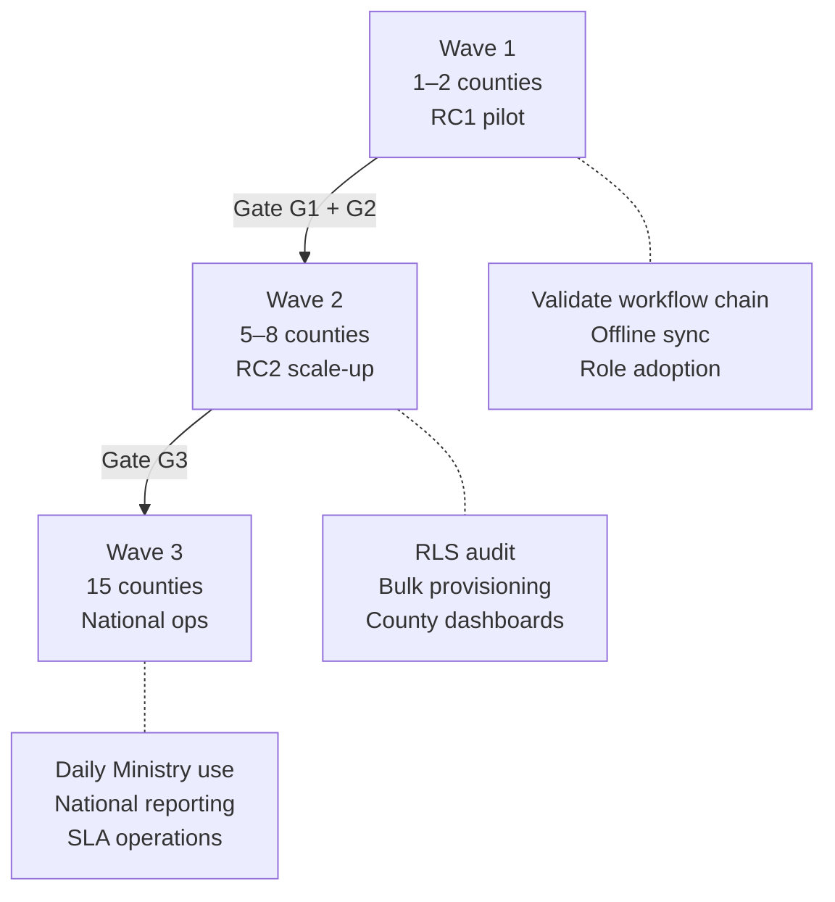

# AgriVault National Scale Guide

**Classification:** Internal — National programme board, Ministry leadership  
**Version:** 0.1.0-rc1  
**Platform:** AgriVault (`agritrace`)  
**Audience:** Programme manager, Ministry IT, county deployment leads, procurement committee, engineering vendor

**Related:** [IMPLEMENTATION_PLAYBOOK.md](./IMPLEMENTATION_PLAYBOOK.md) · [PILOT_SUCCESS_METRICS.md](./PILOT_SUCCESS_METRICS.md) · [PROCUREMENT_GUIDE.md](./PROCUREMENT_GUIDE.md) · [DATA_GOVERNANCE.md](./DATA_GOVERNANCE.md) · [../ROADMAP_POST_PILOT.md](../ROADMAP_POST_PILOT.md) · [../ARCHITECTURE.md](../ARCHITECTURE.md) · [../DATABASE.md](../DATABASE.md) · [../SECURITY.md](../SECURITY.md)

---

## Table of contents

1. [Purpose](#purpose)
2. [Scale waves overview](#scale-waves-overview)
3. [Wave 1 — Pilot counties (1–2)](#wave-1--pilot-counties-12)
4. [Wave 2 — Regional scale (5–8 counties)](#wave-2--regional-scale-58-counties)
5. [Wave 3 — National coverage (15 counties)](#wave-3--national-coverage-15-counties)
6. [Infrastructure scaling](#infrastructure-scaling)
7. [User provisioning at scale](#user-provisioning-at-scale)
8. [RLS county isolation](#rls-county-isolation)
9. [Operational readiness gates](#operational-readiness-gates)
10. [Related documents](#related-documents)

---

## Purpose

This guide defines the county-to-national expansion path for AgriVault after a successful Ministry pilot. It translates the engineering roadmap in [../ROADMAP_POST_PILOT.md](../ROADMAP_POST_PILOT.md) into programme actions: wave sequencing, infrastructure capacity, user provisioning, and multi-county data isolation.

National scale assumes RC1 pilot validation followed by RC2 hardening (Phase 1). No wave may begin without passing the gate criteria defined in [IMPLEMENTATION_PLAYBOOK.md](./IMPLEMENTATION_PLAYBOOK.md) and [PILOT_SUCCESS_METRICS.md](./PILOT_SUCCESS_METRICS.md).

---

## Scale waves overview

Liberia comprises 15 counties. AgriVault rollout follows three waves aligned with post-pilot phases.

| Wave | Counties | Timeline | RC version | Primary gate |
|------|----------|----------|------------|--------------|
| Wave 1 | 1–2 (pilot) | Weeks 0–4 | RC1 | G1 — pilot success metrics |
| Wave 2 | 5–8 | Months 3–4 | RC2 | G2 — production readiness ≥ 85 |
| Wave 3 | All 15 | Months 5–8 | RC2+ | G3 — RLS audit pass; pen test |

County selection for Wave 1 is documented in [../government/COUNTY_ROLLOUT_PLAN.md](../government/COUNTY_ROLLOUT_PLAN.md). Wave 2–3 county sequencing follows connectivity, DAO desk capacity, and CAC readiness assessments.

---

## Wave 1 — Pilot counties (1–2)

**Objective:** Validate CLAN → DAO → CAC → Ministry chain under live field conditions.

| Workstream | Actions | Owner |
|------------|---------|-------|
| Infrastructure | Single Supabase project; Vercel Pro; Mapbox standard tier | Ministry IT |
| Users | Manual provisioning per [../PILOT_ADMIN_GUIDE.md](../PILOT_ADMIN_GUIDE.md) | Pilot administrator |
| Training | Full role curriculum per [TRAINING_PROGRAM.md](./TRAINING_PROGRAM.md) | Training coordinator |
| Support | Tier 0–2 only; vendor Tier 3 on-call | County helpdesk + Ministry IT |
| Data | Single-county RLS sufficient; cross-county leakage low risk | Ministry IT |

**Capacity envelope (Wave 1):**

| Resource | Pilot estimate | Notes |
|----------|----------------|-------|
| CLAN users | 10–30 | 1–3 per district in pilot counties |
| DAO users | 4–12 | 1 per district |
| CAC users | 2–4 | 1–2 per pilot county |
| Ministry users | 3–8 | National desk + programme staff |
| Daily submissions | 20–100 | Peak during field season |
| Supabase storage | < 5 GB | Boundaries + submissions |
| Mapbox map loads | < 50,000/month | Field capture + dashboards |

**Exit criteria:** [PILOT_SUCCESS_METRICS.md](./PILOT_SUCCESS_METRICS.md) primary KPIs at target; [../PILOT_CHECKLIST.md](../PILOT_CHECKLIST.md) Phase 3 complete.

---

## Wave 2 — Regional scale (5–8 counties)

**Objective:** Expand live operations with multi-county isolation, bulk user onboarding, and county performance visibility.

| Workstream | Actions | Owner | Engineering reference |
|------------|---------|-------|----------------------|
| Security | PDF auth (TD-001); distributed rate limits (TD-002) | Ministry IT + vendor | [../TECHNICAL_DEBT.md](../TECHNICAL_DEBT.md) |
| Data model | Unified transfer model (TD-005); live-only queue mode (TD-006) | Engineering | [../WORKFLOW_ENGINE.md](../WORKFLOW_ENGINE.md) |
| RLS | Full county isolation audit before onboarding county 3 | Ministry IT | [DATA_GOVERNANCE.md](./DATA_GOVERNANCE.md) §8 |
| Admin | Bulk user import; county-scoped profiles | Pilot administrator | [../DATABASE.md](../DATABASE.md) |
| Reporting | Data-source badges on executive briefing (TD-012) | Engineering | [../data-source-inventory.md](../data-source-inventory.md) |
| Staging | Production-mirror staging environment | Ministry IT | [../DEPLOYMENT_GUIDE.md](../DEPLOYMENT_GUIDE.md) |

**Capacity envelope (Wave 2):**

| Resource | Scale estimate | Scaling action |
|----------|----------------|----------------|
| CLAN users | 80–200 | Bulk import; train-the-trainer per county |
| Daily submissions | 200–800 | Monitor Supabase connection pool |
| Supabase | Pro plan; evaluate Team at 6+ counties | Enable PITR; daily backup verification |
| Vercel | Pro; monitor function invocations | Edge Function concurrency review |
| Mapbox | 100,000–500,000 loads/month | Usage alerts; tile caching evaluation |

**New county onboarding (per county):** readiness assessment → roster → RLS verification → provisioning → train-the-trainer → shadow week → go-live. Duration: 3–4 weeks staggered; max 2 counties/month ([SUPPORT_MODEL.md](./SUPPORT_MODEL.md)).

**Success metrics (Wave 2):** 5+ counties onboarded; ≥ 500 LIVE farmer registrations; ≥ 200 approved boundaries; dashboard KPIs ≥ 80% LIVE-sourced ([../ROADMAP_POST_PILOT.md](../ROADMAP_POST_PILOT.md)).

---

## Wave 3 — National coverage (15 counties)

**Objective:** All counties operational; Ministry command center in daily use; defined SLAs in production.

| Workstream | Scope |
|------------|-------|
| Performance | Code splitting (TD-018); Lighthouse CI (TD-017) |
| Security | CSP nonces (TD-011); CAPTCHA (TD-009); penetration test |
| Compliance | Audit log export; EUDR DDS production workflow |
| Integration | MoA legacy CSV import; donor API feeds |
| Governance | Data retention policy; county HR provisioning SOP |
| Mobile | Evaluate Capacitor native wrapper if PWA limits encountered |

**Capacity envelope (Wave 3):**

| Resource | National estimate | Scaling action |
|----------|-------------------|----------------|
| CLAN users | 300–600 | County HR provisioning SOP |
| DAO users | 60–90 | 1 per district minimum |
| CAC users | 15–30 | 1–2 per county |
| Ministry users | 15–30 | Command center + programme |
| Daily submissions | 1,000–3,000 | Supabase Team or dedicated instance |
| Supabase storage | 50–200 GB | Archival policy per [DATA_GOVERNANCE.md](./DATA_GOVERNANCE.md) |
| Mapbox loads | 1–3 million/month | Dedicated budget line; offline tile cache |

**Success metrics:** All counties active; ≤ 4 hour median approval cycle; Ministry command center daily use ([../ROADMAP_POST_PILOT.md](../ROADMAP_POST_PILOT.md) Phase 3).

---

## Infrastructure scaling

### Supabase

| Tier | When | Capabilities | Cost framework |
|------|------|--------------|----------------|
| Pro | Wave 1–2 | Auth, Postgres, Edge Functions, daily backups | See [PROCUREMENT_GUIDE.md](./PROCUREMENT_GUIDE.md) |
| Pro + PITR | Wave 2 onward | Point-in-time recovery; required before county 3 | Ministry to complete |
| Team / dedicated | Wave 3 | Higher connection limits; dedicated compute | Ministry to complete |

Engineering reference: [../adr/0005-supabase-platform.md](../adr/0005-supabase-platform.md), [../DATABASE.md](../DATABASE.md).

**Scaling checklist:**

- [ ] Connection pool monitoring at 50% utilisation trigger
- [ ] Edge Function `sync-batch` concurrency tested at 2× peak load
- [ ] RLS policy count reviewed (policy complexity affects query performance)
- [ ] Backup restore drill before each wave ([DISASTER_RECOVERY_PLAN.md](./DISASTER_RECOVERY_PLAN.md))

### Vercel

| Concern | Wave 1 | Wave 2 | Wave 3 |
|---------|--------|--------|--------|
| Plan | Pro | Pro | Pro or Enterprise evaluation |
| Edge Functions | `sync-batch` proxy | Same + monitoring | Rate limit KV store (TD-002) |
| Regions | Default (iad1) | Evaluate edge proximity | Ministry to complete |
| Build CI | lint + build + test:workflow | + Playwright smoke (TD-004) | + Lighthouse budget |

Reference: [../DEPLOYMENT_GUIDE.md](../DEPLOYMENT_GUIDE.md), [../production-readiness.md](../production-readiness.md).

### Mapbox

| Concern | Mitigation | Owner |
|---------|------------|-------|
| Token exposure | Server-side tile proxy evaluation at Wave 3 | Ministry IT |
| Cost at scale | Usage alerts at 80% of monthly budget | Programme manager |
| Offline field use | PWA caches map shell; tiles require connectivity | Field lead |
| GPS capture | Token required for boundary capture ([../GIS_ARCHITECTURE.md](../GIS_ARCHITECTURE.md)) | Ministry IT |

Reference: [../adr/0004-mapbox-architecture.md](../adr/0004-mapbox-architecture.md).

**Scaling path:** Wave 1 (Supabase Pro, Vercel Pro, Mapbox Standard) → Wave 2 (+ PITR, staging, usage alerts) → Wave 3 (Team/Enterprise evaluation).

---

## User provisioning at scale

### Wave 1 — Manual provisioning

Follow [../PILOT_ADMIN_GUIDE.md](../PILOT_ADMIN_GUIDE.md):

1. Create Supabase Auth user.
2. Insert matching `profiles` row with `role`, `county_id`, `district_id`.
3. Verify role landing path.
4. Issue credentials via secure channel (not email for initial password in production).

### Wave 2 — Bulk import

| Step | Action | Owner |
|------|--------|-------|
| 1 | County HR submits roster CSV (name, email, role, county, district) | County CAC |
| 2 | Programme manager validates roster against org chart | Programme manager |
| 3 | Ministry IT runs bulk import script (RC2 deliverable) | Ministry IT |
| 4 | Users receive activation link; forced password reset on first login | Pilot administrator |
| 5 | Training certification before system access ([TRAINING_PROGRAM.md](./TRAINING_PROGRAM.md)) | Training coordinator |

**Roster validation rules:**

| Field | Requirement |
|-------|-------------|
| `email` | Unique; government domain preferred |
| `role` | Must match [../product/ROLE_CATALOG.md](../product/ROLE_CATALOG.md) |
| `county_id` | Required for county-scoped roles (CLAN, DAO, CAC) |
| `district_id` | Required for CLAN and DAO |

### Wave 3 — County HR self-service (target)

County HR provisions CLAN/DAO accounts within approved quotas. Ministry IT retains CAC and Ministry role provisioning. Documented in post-pilot SOP (Phase 3 deliverable).

---

## RLS county isolation

Row Level Security enforces that county-scoped users see only their county's operational data. National Ministry roles bypass county filters by design.

### Policy model

| Role group | RLS scope | Can see |
|------------|-----------|---------|
| CLAN / DAO | `county_id` + `district_id` match profile | Own district submissions |
| CAC | `county_id` match profile | All county submissions |
| Ministry national | No county filter (or explicit multi-county) | All counties |
| Donor (future) | Programme-scoped read | Assigned programme data only |

Engineering implementation: [../DATABASE.md](../DATABASE.md), [../SECURITY.md](../SECURITY.md), [DATA_GOVERNANCE.md](./DATA_GOVERNANCE.md) §8.

### Pre-wave RLS audit checklist

| Check | Method | Pass criteria |
|-------|--------|---------------|
| CLAN cannot read other county submissions | Test account cross-county query | Zero rows returned |
| DAO cannot approve other district items | API attempt with wrong district | 403 or empty result |
| CAC cannot modify other county profiles | Profile update attempt | Policy rejection |
| Ministry can aggregate nationally | Command center query | All counties visible |
| Service role bypass documented | Admin operations only | Audit log entry |

**Mandatory before Wave 2 county 3 activation.** Failure blocks onboarding until remediated ([RISK_REGISTER.md](./RISK_REGISTER.md) R-012).

### Staging verification

Every RLS change deploys to staging first. Staging mirrors production schema with anonymised test data. Process: [../DEPLOYMENT_GUIDE.md](../DEPLOYMENT_GUIDE.md).

---

## Operational readiness gates

| Gate | When | Criteria | Authority |
|------|------|----------|-----------|
| G1 | End of Wave 1 | Pilot KPIs at target | Steering Committee |
| G2 | Before Wave 2 | RC2 deployed; PDF auth fixed; E2E tests green; readiness ≥ 85 | Steering Committee |
| G3 | Before Wave 3 | 5 counties live; RLS audit pass; staging DR drill complete | Steering Committee + Minister briefing |
| G4 | End of Wave 3 | 15 counties; pen test pass; SLAs defined | Minister approval |

Full gate definitions: [../ROADMAP_POST_PILOT.md](../ROADMAP_POST_PILOT.md), [PROJECT_GOVERNANCE.md](./PROJECT_GOVERNANCE.md).

---

## Related documents

[../ROADMAP_POST_PILOT.md](../ROADMAP_POST_PILOT.md) · [PILOT_SUCCESS_METRICS.md](./PILOT_SUCCESS_METRICS.md) · [PROCUREMENT_GUIDE.md](./PROCUREMENT_GUIDE.md) · [TRAINING_PROGRAM.md](./TRAINING_PROGRAM.md) · [DISASTER_RECOVERY_PLAN.md](./DISASTER_RECOVERY_PLAN.md) · [PROJECT_GOVERNANCE.md](./PROJECT_GOVERNANCE.md) · [../government/COUNTY_ROLLOUT_PLAN.md](../government/COUNTY_ROLLOUT_PLAN.md) · [../TECHNICAL_DEBT.md](../TECHNICAL_DEBT.md)
