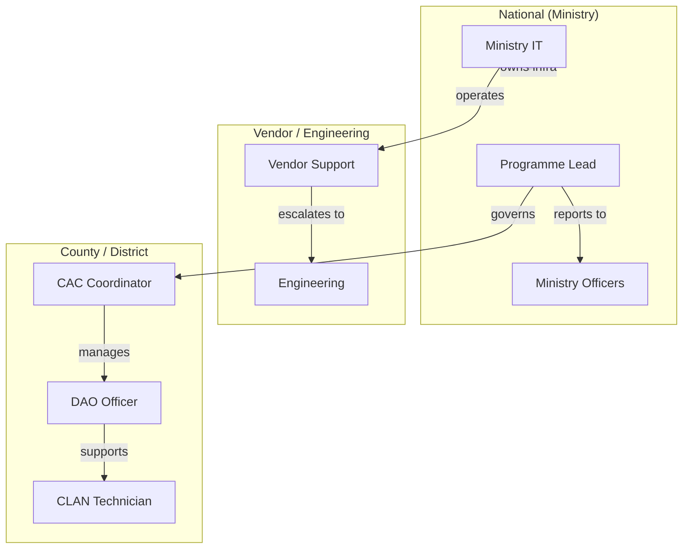
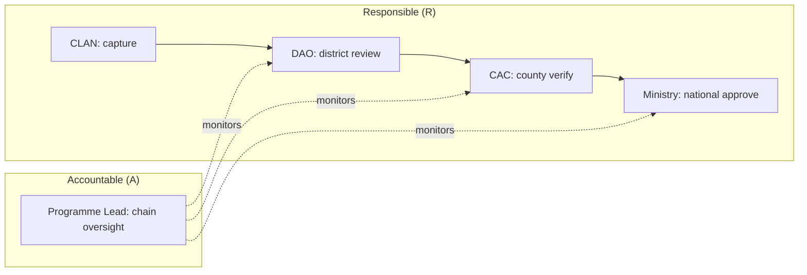
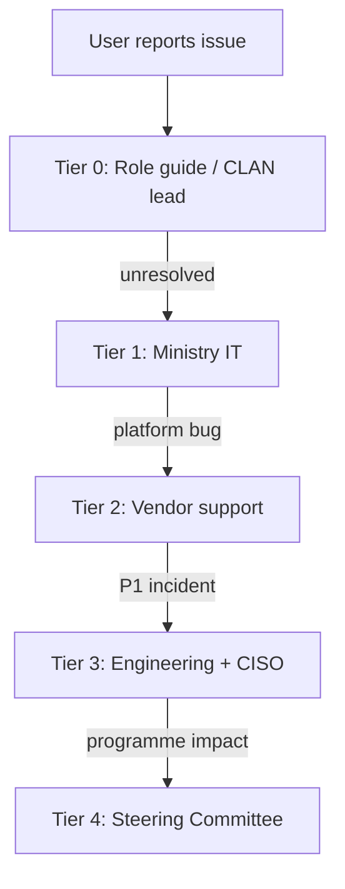

# AgriVault Operating Model

**Classification:** Internal — Operations leadership  
**Version:** 0.1.0-rc1  
**Platform:** AgriVault (`agritrace`)  
**Audience:** Ministry IT directors, programme leads, county CACs, vendor account managers, support leads

**Related:** [MINISTRY_IMPLEMENTATION_GUIDE.md](./MINISTRY_IMPLEMENTATION_GUIDE.md) · [IMPLEMENTATION_PLAYBOOK.md](./IMPLEMENTATION_PLAYBOOK.md) · [../ARCHITECTURE.md](../ARCHITECTURE.md) · [../WORKFLOW_ENGINE.md](../WORKFLOW_ENGINE.md) · [DATA_GOVERNANCE.md](./DATA_GOVERNANCE.md) · [SUPPORT_MODEL.md](./SUPPORT_MODEL.md)

---

## Table of contents

1. [Purpose](#purpose)
2. [Operating model overview](#operating-model-overview)
3. [Service ownership](#service-ownership)
4. [RACI matrix — platform operations](#raci-matrix--platform-operations)
5. [RACI matrix — workflow chain](#raci-matrix--workflow-chain)
6. [RACI matrix — data management](#raci-matrix--data-management)
7. [Operating cadence](#operating-cadence)
8. [Support tiers and escalation](#support-tiers-and-escalation)
9. [Incident management](#incident-management)
10. [Transition to business-as-usual](#transition-to-business-as-usual)
11. [Related documents](#related-documents)

---

## Purpose

This document defines who owns what in AgriVault operations — across Ministry IT, vendor, county, and national programme functions. It establishes the RACI (Responsible, Accountable, Consulted, Informed) assignments and the meeting cadence required to sustain the CLAN→DAO→CAC→Ministry chain after go-live.

The operating model is a Phase 1 deliverable in [IMPLEMENTATION_PLAYBOOK.md](./IMPLEMENTATION_PLAYBOOK.md) and must be signed before county activation per [MINISTRY_IMPLEMENTATION_GUIDE.md](./MINISTRY_IMPLEMENTATION_GUIDE.md).

---

## Operating model overview

AgriVault operations span three ownership domains:

| Domain | Scope | Primary owner |
|--------|-------|---------------|
| Platform infrastructure | Supabase, Vercel, Mapbox, Edge Functions | Ministry IT |
| Application support | Bug fixes, workflow issues, feature requests | Vendor (transitioning to Ministry IT) |
| Operational workflow | Daily review chain, field capture, data quality | County (CAC/DAO/CLAN) with national oversight |
| Programme governance | Pilot/scale decisions, budget, policy | Programme lead → Steering Committee |

---

## Service ownership

### Infrastructure services

| Service | Component | Owner | Backup | SLA (pilot) |
|---------|-----------|-------|--------|-------------|
| Application hosting | Vercel (Next.js 14) | Ministry IT | Vendor | 99.5% uptime |
| Database | Supabase PostgreSQL | Ministry IT | Vendor | 99.9% uptime |
| Authentication | Supabase Auth | Ministry IT | Vendor | 99.9% uptime |
| Offline sync | Edge Function `sync-batch` | Ministry IT | Vendor | Best effort (4h fix) |
| GIS / maps | Mapbox GL | Ministry IT | — | Token refresh annually |
| DNS / domain | Ministry IT | Vendor (setup) | Ministry IT | — |
| SSL / CSP | Vercel + Next.js middleware | Ministry IT | Vendor | — |

Reference: [../ARCHITECTURE.md](../ARCHITECTURE.md) § Deployment topology · [../DEPLOYMENT_GUIDE.md](../DEPLOYMENT_GUIDE.md)

### Application services

| Service | Function | Owner | Users affected |
|---------|----------|-------|----------------|
| Workflow engine | CLAN→DAO→CAC→Ministry approval chain | Vendor (code) / Ministry IT (ops) | All operational roles |
| Verification queue | Submission review UI | County DAO/CAC/Ministry | Reviewers |
| Offline capture | IndexedDB + PWA field forms | County CLAN (usage) / Ministry IT (infra) | CLAN technicians |
| Command center | National KPI dashboard | Ministry officers | Ministry |
| Executive briefing | PDF export | Ministry officers | Ministry leadership |
| Admin console | User management, launch readiness | Ministry IT | Admins only |

Reference: [../WORKFLOW_ENGINE.md](../WORKFLOW_ENGINE.md) · [../OFFLINE_ARCHITECTURE.md](../OFFLINE_ARCHITECTURE.md)

### Data services

| Service | Function | Owner | Policy reference |
|---------|----------|-------|------------------|
| Farmer registry | `farmers` table + RLS | County data steward | [DATA_GOVERNANCE.md](./DATA_GOVERNANCE.md) |
| Operational submissions | `operational_submissions` + workflow | County + Ministry stewards | [DATA_GOVERNANCE.md](./DATA_GOVERNANCE.md) |
| Warehouse / logistics | `warehouses`, transfer orders | Ministry logistics steward | [DATA_GOVERNANCE.md](./DATA_GOVERNANCE.md) |
| Pilot fixtures | `pilot_*` tables, canonical arrays | Programme lead | [../data-source-inventory.md](../data-source-inventory.md) |

---

## RACI matrix — platform operations

**Legend:** R = Responsible · A = Accountable · C = Consulted · I = Informed · — = Not involved

| Activity | Ministry IT | Vendor | Programme Lead | County CAC | Steering Committee |
|----------|:-----------:|:------:|:--------------:|:----------:|:------------------:|
| Supabase project management | A/R | C | I | — | I |
| Vercel deployment and env vars | A/R | C | C | — | I |
| Database migrations | A/R | R | I | — | C |
| Edge Function deployment | A/R | R | I | — | — |
| Mapbox token management | A/R | C | I | — | — |
| Security patching (deps) | C | A/R | I | — | I |
| User provisioning (Auth + profiles) | A/R | C | C | C | — |
| Launch readiness verification | A/R | C | C | — | I |
| Backup and restore | A/R | C | I | — | C |
| DR plan execution | A/R | C | C | I | I |
| Production deployment approval | A | R | C | — | I |
| Vendor contract management | C | R | A | — | I |
| Platform uptime monitoring | A/R | C | I | — | I |

---

## RACI matrix — workflow chain

| Activity | CLAN | DAO | CAC | Ministry | Programme Lead |
|----------|:----:|:---:|:---:|:--------:|:--------------:|
| Field data capture | A/R | I | I | — | I |
| Submit to workflow | R | I | I | — | — |
| DAO review (approve/reject/correct) | I | A/R | I | I | I |
| CAC verification | I | C | A/R | I | I |
| Ministry approval / escalation | I | C | C | A/R | I |
| Archive terminal submissions | — | — | — | A/R | — |
| Verification queue backlog monitoring | — | R | R | R | A |
| Workflow SLA enforcement | — | R | R | R | A |
| End-to-end chain audit | — | — | — | C | A/R |
| Process change requests | C | C | C | C | A/R |

Workflow states and transitions: [../WORKFLOW_ENGINE.md](../WORKFLOW_ENGINE.md)

---

## RACI matrix — data management

| Activity | County Steward | Ministry Steward | Programme Lead | Ministry IT | Vendor |
|----------|:--------------:|:----------------:|:--------------:|:-----------:|:------:|
| Farmer data quality review | A/R | C | I | — | — |
| Data provenance badge compliance | R | A | C | — | C |
| PILOT fixture management | C | C | A/R | — | — |
| DEMO data segregation | I | I | A/R | — | C |
| Retention policy enforcement | C | A/R | C | R | — |
| Data export for reporting | R | A | C | — | — |
| RLS policy review | C | C | I | A/R | C |
| Offline sync data reconciliation | A/R | C | I | C | C |
| Audit log review | C | A/R | C | R | — |

Full data governance policy: [DATA_GOVERNANCE.md](./DATA_GOVERNANCE.md)

---

## Operating cadence

### Meeting schedule

| Meeting | Frequency | Duration | Chair | Attendees | Output |
|---------|-----------|----------|-------|-----------|--------|
| Steering Committee | Monthly | 60 min | Minister / Deputy | Programme lead, Ministry IT, CAC reps | Decisions, gate approvals |
| Programme status | Weekly (pilot) / bi-weekly (scale) | 30 min | Programme lead | Ministry IT, vendor, CAC reps | Status report |
| Verification queue review | Daily (pilot week 1) / weekly | 15 min | Programme lead | DAO lead, CAC, Ministry officer | Backlog action items |
| CLAN sync check | Daily (field days) | 10 min | County CAC | CLAN lead | Sync success log |
| Data quality review | Monthly | 45 min | Ministry data steward | County stewards, programme lead | Quality report |
| IT ops review | Monthly | 30 min | Ministry IT | Vendor | Uptime, security, backup report |
| Vendor service review | Quarterly | 60 min | Programme lead | Ministry IT, vendor PM | SLA compliance, roadmap |

---

## Support tiers and escalation

| Tier | Scope | Owner | Response SLA | Resolution SLA |
|------|-------|-------|-------------|----------------|
| Tier 0 | Self-service (role guides, FAQ) | County CAC / CLAN lead | Immediate | — |
| Tier 1 | Login, device, PWA install issues | Ministry IT | 4 hours | 8 hours |
| Tier 2 | Workflow errors, sync failures, data issues | Vendor support | 4 hours | 24 hours |
| Tier 3 | Security incidents, data breach, platform outage | Ministry IT + vendor engineering | 1 hour | 4 hours |
| Tier 4 | Steering Committee escalation | Programme lead | 24 hours | Programme-defined |

Full support model: [SUPPORT_MODEL.md](./SUPPORT_MODEL.md)

### Escalation triggers (automatic)

| Trigger | Escalate to | Action |
|---------|-------------|--------|
| Platform unreachable > 15 min | Tier 3 | Incident declared |
| Verification queue backlog > 72h | Programme lead | Additional reviewer assigned |
| Offline sync failure rate > 20% (field day) | Tier 2 | Engineering investigation |
| Suspected data breach | Tier 3 + CISO | Incident response per [../SECURITY.md](../SECURITY.md) |
| 3+ counties report same issue | Tier 2 → Tier 3 | Patch priority elevated |

---

## Incident management

| Severity | Definition | Example | Response |
|----------|------------|---------|----------|
| P1 — Critical | Platform down or data integrity compromised | Supabase unreachable; RLS bypass | Tier 3 immediate; Steering Committee notified within 4h |
| P2 — High | Core workflow blocked for all users | Workflow API 500 errors | Tier 2 within 4h; workaround documented |
| P3 — Medium | Feature degraded for subset of users | Mapbox tiles fail in one county | Tier 2 within 8h |
| P4 — Low | Cosmetic or non-blocking issue | Badge label typo | Next release cycle |

Incident lifecycle: Detect → Triage → Assign → Resolve → Post-mortem (P1/P2 only).

DR scenarios: [DISASTER_RECOVERY_PLAN.md](./DISASTER_RECOVERY_PLAN.md) · Business continuity: [BUSINESS_CONTINUITY_PLAN.md](./BUSINESS_CONTINUITY_PLAN.md)

---

## Transition to business-as-usual

After Gate G4 (national scale complete) in [IMPLEMENTATION_PLAYBOOK.md](./IMPLEMENTATION_PLAYBOOK.md):

| Function | Pilot ownership | BAU ownership | Transition criteria |
|----------|----------------|---------------|---------------------|
| User provisioning | Vendor + programme lead | Ministry IT | Ministry IT completes 3 county onboardings independently |
| Tier 1 support | Vendor | Ministry IT | Ministry IT resolves 90% of Tier 1 tickets for 2 consecutive months |
| Training delivery | Vendor + training coordinator | Ministry training unit | Training programme self-sufficient per [TRAINING_PROGRAM.md](./TRAINING_PROGRAM.md) |
| Deployment | Vendor | Ministry IT | Ministry IT executes deployment with vendor on-call only |
| Programme governance | Programme lead | Permanent Ministry unit | Steering Committee declares programme complete |
| Data stewardship | Programme lead | Ministry data steward board | [DATA_GOVERNANCE.md](./DATA_GOVERNANCE.md) board operational |

---

## Related documents

[MINISTRY_IMPLEMENTATION_GUIDE.md](./MINISTRY_IMPLEMENTATION_GUIDE.md) · [IMPLEMENTATION_PLAYBOOK.md](./IMPLEMENTATION_PLAYBOOK.md) · [DATA_GOVERNANCE.md](./DATA_GOVERNANCE.md) · [SUPPORT_MODEL.md](./SUPPORT_MODEL.md) · [DISASTER_RECOVERY_PLAN.md](./DISASTER_RECOVERY_PLAN.md) · [../ARCHITECTURE.md](../ARCHITECTURE.md) · [../WORKFLOW_ENGINE.md](../WORKFLOW_ENGINE.md) · [../SECURITY.md](../SECURITY.md)
