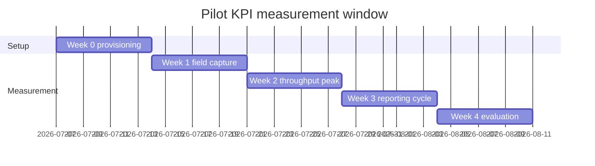
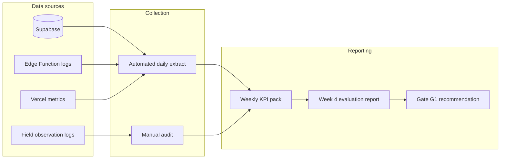

# AgriVault Pilot Success Metrics

**Classification:** Internal — PMO, evaluators, programme leadership  
**Version:** 0.1.0-rc1  
**Platform:** AgriVault (`agritrace`)  
**Audience:** Programme manager, pilot administrator, county CACs, Ministry leadership, evaluation team

**Related:** [IMPLEMENTATION_PLAYBOOK.md](./IMPLEMENTATION_PLAYBOOK.md) · [OPERATING_MODEL.md](./OPERATING_MODEL.md) · [RISK_REGISTER.md](./RISK_REGISTER.md) · [../PILOT_CHECKLIST.md](../PILOT_CHECKLIST.md) · [../ROADMAP_POST_PILOT.md](../ROADMAP_POST_PILOT.md) · [../KNOWN_LIMITATIONS.md](../KNOWN_LIMITATIONS.md) · [../production-readiness.md](../production-readiness.md)

---

## Table of contents

1. [Purpose](#purpose)
2. [Pilot scope and measurement window](#pilot-scope-and-measurement-window)
3. [Primary KPIs](#primary-kpis)
4. [Secondary KPIs](#secondary-kpis)
5. [Measurement methods](#measurement-methods)
6. [Reporting cadence and artefacts](#reporting-cadence-and-artifacts)
7. [KPI ownership matrix](#kpi-ownership-matrix)
8. [Go/no-go decision framework](#gono-go-decision-framework)
9. [Related documents](#related-documents)

---

## Purpose

This document defines the quantitative success criteria for the Ministry AgriVault pilot (RC1). Metrics align with Gate G1 in [../ROADMAP_POST_PILOT.md](../ROADMAP_POST_PILOT.md) and the evaluation framework referenced in [../government/PILOT_EVALUATION_FRAMEWORK.md](../government/PILOT_EVALUATION_FRAMEWORK.md).

Pilot success is measured on **operational reliability**, **workflow throughput**, **data provenance integrity**, and **role adoption** — not feature completeness. RC1 known limitations are accepted where documented in [../KNOWN_LIMITATIONS.md](../KNOWN_LIMITATIONS.md); KPIs account for workarounds.

---

## Pilot scope and measurement window

| Parameter | Value |
|-----------|-------|
| Duration | 4 weeks (Week 0 setup through Week 4 retrospective) |
| Counties | 1–2 pilot counties |
| Roles in scope | CLAN, DAO, CAC, Ministry national |
| Measurement start | First live CLAN submission (Week 1, Day 1) |
| Measurement end | Week 4, Friday 17:00 local time |
| Exclusions | Scheduled maintenance windows; documented connectivity outages >4 hours |



---

## Primary KPIs

These five KPIs determine the Week 4 go/no-go recommendation to the Steering Committee ([PROJECT_GOVERNANCE.md](./PROJECT_GOVERNANCE.md)).

| ID | KPI | Target | Threshold (minimum) | Owner |
|----|-----|--------|---------------------|-------|
| KPI-01 | CLAN sync success rate | ≥ 80% | ≥ 70% (triggers remediation plan) | Field lead / CLAN supervisor |
| KPI-02 | DAO review within 24 hours | ≥ 90% of submissions | ≥ 80% | County DAO lead |
| KPI-03 | Unresolved `manual_review` at week end | 0 items | 0 items (hard gate) | Pilot administrator |
| KPI-04 | Executive briefing LIVE KPI share | ≥ 50% LIVE-sourced metrics | ≥ 40% | Ministry programme lead |
| KPI-05 | End-to-end workflow completion | ≥ 75% of live submissions reach `ministry_approved` | ≥ 60% | Programme manager |

### KPI-01 — Sync success rate

**Definition:** Percentage of offline sync attempts that complete without entering `manual_review` status, excluding attempts during documented connectivity outages.

**Formula:**

```
sync_success_rate = (successful_syncs / total_sync_attempts) × 100
```

**Data sources:** Supabase `operational_submissions` sync metadata; Edge Function `sync-batch` logs; CLAN device sync status indicator.

**Notes:** Items flagged after five failed retries per [../KNOWN_LIMITATIONS.md](../KNOWN_LIMITATIONS.md) count as failures. Edge Function must be deployed before measurement begins ([../OFFLINE_ARCHITECTURE.md](../OFFLINE_ARCHITECTURE.md)).

### KPI-02 — DAO review within 24 hours

**Definition:** Percentage of live submissions that receive a DAO decision (approve, reject, or return for correction) within 24 hours of `submitted_at`.

**Formula:**

```
dao_sla_rate = (submissions_reviewed_within_24h / total_live_submissions) × 100
```

**Data sources:** `operational_submissions` workflow timestamps; DAO district dashboard queue.

**Notes:** Exclude demo/fixture items (`VRF-*` IDs, rows without valid UUID `submissionId`). See verification queue guidance in [../KNOWN_LIMITATIONS.md](../KNOWN_LIMITATIONS.md).

### KPI-03 — Zero manual review at week end

**Definition:** Count of sync queue items in `manual_review` status across all pilot CLAN devices and Supabase at Week 4 close.

**Target:** Exactly 0.

**Remediation:** DAO re-submits from district dashboard or administrator clears queue per [../CLAN_FIELD_GUIDE.md](../CLAN_FIELD_GUIDE.md).

### KPI-04 — LIVE KPI share in executive briefing

**Definition:** Percentage of KPI tiles in the Ministry executive briefing PDF sourced from LIVE data (not DEMO or blended fixtures).

**Measurement:** Manual audit of briefing output against [../data-source-inventory.md](../data-source-inventory.md) taxonomy. Cross-reference command center Data Source badges.

**Notes:** Executive briefing may blend sources without per-metric badges (RC1 limitation). Verbal LIVE/DEMO disclosure required during presentations until RC2 ([../TECHNICAL_DEBT.md](../TECHNICAL_DEBT.md) TD-012).

### KPI-05 — Workflow completion rate

**Definition:** Percentage of live submissions that traverse the full CLAN → DAO → CAC → Ministry chain to `ministry_approved` status within the pilot window.

**Formula:**

```
completion_rate = (ministry_approved_count / total_live_submissions) × 100
```

**Data sources:** Workflow state machine per [../WORKFLOW_ENGINE.md](../WORKFLOW_ENGINE.md); `operational_submissions` status history.

---

## Secondary KPIs

Secondary metrics inform scale-up planning but do not block Gate G1.

| ID | KPI | Target | Owner |
|----|-----|--------|-------|
| KPI-06 | CLAN daily active users | ≥ 80% of provisioned CLAN accounts active ≥3 days/week | Field lead |
| KPI-07 | Training certification completion | 100% of pilot users certified before Week 1 | Training coordinator |
| KPI-08 | GPS boundary capture success | ≥ 70% of attempts with accuracy ≤ 10 m | CLAN supervisor |
| KPI-09 | Support ticket resolution (Tier 1) | ≥ 90% resolved within SLA | County helpdesk |
| KPI-10 | Paper fallback incidents | ≤ 5% of total captures | Programme lead |
| KPI-11 | User satisfaction (post-pilot survey) | ≥ 4.0 / 5.0 average | Change management lead |
| KPI-12 | Infrastructure uptime | ≥ 99% (Vercel + Supabase) | Ministry IT |

---

## Measurement methods

### Automated collection

| KPI | Tool / query | Frequency |
|-----|--------------|-----------|
| KPI-01 | Supabase SQL on sync status; Edge Function log export | Daily |
| KPI-02, KPI-05 | Workflow timestamp query on `operational_submissions` | Daily |
| KPI-03 | Admin sync queue audit; `/field/sync-queue` status checks | Daily; final count Week 4 |
| KPI-12 | Vercel analytics; Supabase status page | Continuous |

### Manual collection

| KPI | Method | Frequency |
|-----|--------|-----------|
| KPI-04 | Briefing PDF audit checklist | Week 2 and Week 4 |
| KPI-07 | [TRAINING_PROGRAM.md](./TRAINING_PROGRAM.md) certification roster | Week 0 |
| KPI-10 | CAC field observation log; paper form tally | Weekly |
| KPI-11 | Structured survey (DAO, CAC, CLAN, Ministry) | Week 4 |

### Data quality controls

- Filter all KPI queries to exclude DEMO source rows (`data_source = 'demo'` or fixture IDs).
- Require valid UUID `submissionId` for workflow KPIs.
- Document connectivity outages in the pilot incident log ([../operations/INCIDENT_RESPONSE.md](../operations/INCIDENT_RESPONSE.md)).
- Programme manager validates weekly KPI pack before distribution.



---

## Reporting cadence and artefacts

| Cadence | Artefact | Audience | Owner | Contents |
|---------|----------|----------|-------|----------|
| Daily (Week 1–4) | Sync and queue snapshot | Pilot admin, field lead | Pilot administrator | KPI-01, KPI-03 counts; open blockers |
| Weekly (Mon) | Pilot KPI pack | Programme manager, Steering Committee | Programme manager | All primary KPIs; trend vs prior week |
| Week 2 | Mid-pilot checkpoint | All role leads, Ministry leadership | Programme manager | KPI dashboard; qualitative feedback |
| Week 4 | Pilot evaluation report | Steering Committee, Minister briefing | Programme manager | Full KPI scorecard; go/no-go recommendation |
| Week 4 | Retrospective minutes | PMO, engineering | Programme manager | Lessons learned; scale-up inputs |

**Distribution:** KPI packs stored in the programme document repository. Executive summary forwarded to Steering Committee per [PROJECT_GOVERNANCE.md](./PROJECT_GOVERNANCE.md) cadence.

**Escalation triggers:**

| Condition | Action | Escalate to |
|-----------|--------|-------------|
| KPI-01 < 70% for 3 consecutive days | Field support surge; Edge Function audit | Ministry IT + vendor |
| KPI-02 < 80% at Week 2 | DAO desk staffing review | County CAC |
| KPI-03 > 0 at any daily check | Same-day remediation | Pilot administrator |
| KPI-12 breach > 1 hour | Incident response per [DISASTER_RECOVERY_PLAN.md](./DISASTER_RECOVERY_PLAN.md) | Ministry IT |

---

## KPI ownership matrix

| Role | Responsibilities |
|------|------------------|
| Programme manager | Owns KPI framework; publishes weekly pack; presents Week 4 evaluation |
| Pilot administrator | Monitors KPI-03; runs Supabase queries; maintains incident log |
| Field lead | Owns KPI-01, KPI-06, KPI-08; coordinates CLAN device checks |
| County DAO lead | Owns KPI-02; ensures desk coverage during business hours |
| County CAC | Validates county-level data; reports KPI-10 paper fallback |
| Ministry programme lead | Owns KPI-04; approves executive briefing content |
| Ministry IT | Owns KPI-12; provides infrastructure metrics |
| Training coordinator | Owns KPI-07; maintains certification roster |
| Evaluation team | Independent audit of Week 4 scorecard |

RACI alignment: [OPERATING_MODEL.md](./OPERATING_MODEL.md).

---

## Go/no-go decision framework

Gate G1 ([../ROADMAP_POST_PILOT.md](../ROADMAP_POST_PILOT.md)) requires all primary KPIs at target and Steering Committee sign-off.

| Outcome | Criteria | Next step |
|---------|----------|-----------|
| **Go — scale** | All KPI-01 through KPI-05 at target; no P0 incidents | Proceed to Phase 1 hardening; initiate [NATIONAL_SCALE_GUIDE.md](./NATIONAL_SCALE_GUIDE.md) Wave 2 planning |
| **Conditional go** | KPI-01 or KPI-02 at threshold (not target); KPI-03 = 0; leadership accepts risk | 2-week remediation sprint before county expansion |
| **No-go — extend pilot** | Any primary KPI below threshold; or KPI-03 > 0 at Week 4 | Extend pilot 2 weeks; root-cause analysis per [RISK_REGISTER.md](./RISK_REGISTER.md) |
| **No-go — halt** | Repeated infrastructure failure; safety/data integrity concern | Pause rollout; Steering Committee review |

Decision recorded in Steering Committee minutes ([PROJECT_GOVERNANCE.md](./PROJECT_GOVERNANCE.md)).

---

## Related documents

| Document | Relationship |
|----------|--------------|
| [IMPLEMENTATION_PLAYBOOK.md](./IMPLEMENTATION_PLAYBOOK.md) | Phase 2 pilot deliverables and gate criteria |
| [NATIONAL_SCALE_GUIDE.md](./NATIONAL_SCALE_GUIDE.md) | Scale-up metrics beyond pilot |
| [TRAINING_PROGRAM.md](./TRAINING_PROGRAM.md) | KPI-07 certification requirements |
| [CHANGE_MANAGEMENT.md](./CHANGE_MANAGEMENT.md) | KPI-10 paper fallback tracking |
| [SUPPORT_MODEL.md](./SUPPORT_MODEL.md) | KPI-09 support SLA alignment |
| [../PILOT_CHECKLIST.md](../PILOT_CHECKLIST.md) | Pre-launch and during-pilot verification |
| [../CLAN_FIELD_GUIDE.md](../CLAN_FIELD_GUIDE.md) | Field procedures affecting KPI-01 |
| [../DAO_GUIDE.md](../DAO_GUIDE.md) | DAO review procedures affecting KPI-02 |
| [../WORKFLOW_ENGINE.md](../WORKFLOW_ENGINE.md) | Workflow states for KPI-05 |
| [../OFFLINE_ARCHITECTURE.md](../OFFLINE_ARCHITECTURE.md) | Sync architecture for KPI-01 |
