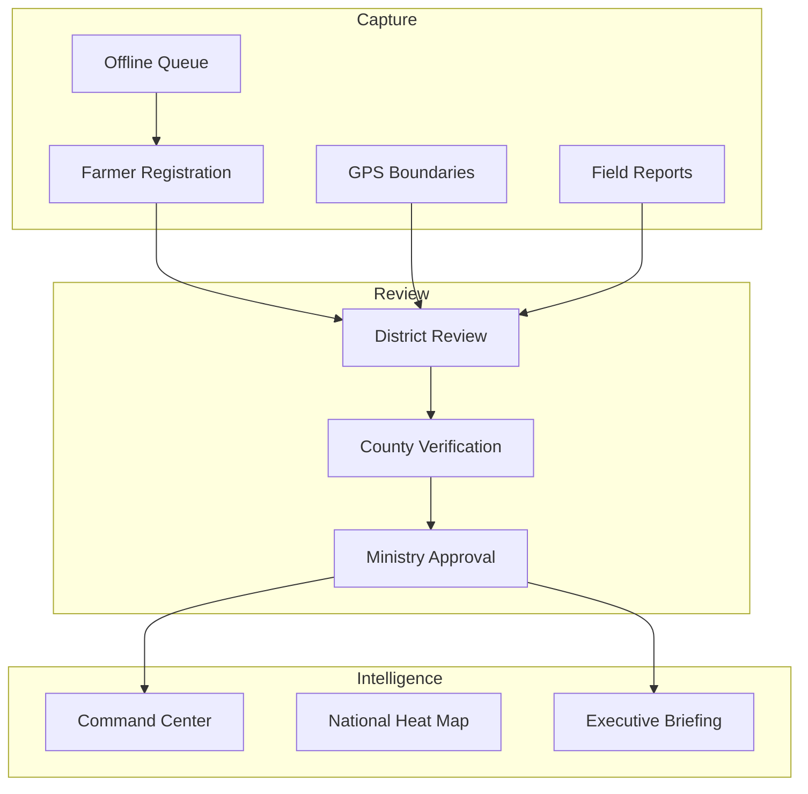

# AgriVault Platform Overview

**Classification:** Internal / Partner  
**Version:** 0.1.0-rc1  
**Audience:** Programme sponsors, implementation partners, procurement committees

---

## Executive summary

AgriVault is the Ministry of Agriculture's national operations platform for capturing, verifying, and reporting agricultural field data across Liberia. It connects field technicians (CLAN), district officers (DAO), county coordinators (CAC), and Ministry national staff in a single auditable workflow — from farmer registration and GPS boundary capture through multi-level approval to cabinet-ready reporting.

Release Candidate 1 (RC1) is approved for Ministry pilot deployment in controlled county environments. National scale requires completion of post-pilot hardening documented in [../TECHNICAL_DEBT.md](../TECHNICAL_DEBT.md) and [NATIONAL_SCALE_GUIDE.md](./NATIONAL_SCALE_GUIDE.md).

---

## Platform scope

| In scope (RC1) | Out of scope (RC1) |
|----------------|-------------------|
| Farmer registration and registry | Payment processing |
| GPS farm boundary capture | SMS gateway (planned post-pilot) |
| Field inspections and pest reports | Native mobile app stores |
| CLAN → DAO → CAC → Ministry approval chain | Full EUDR export chain automation |
| Offline field capture (PWA + IndexedDB) | Multi-country deployment |
| Executive briefing PDF export | Public citizen portal |
| National command center and heat maps | AI operational assistant (disabled) |
| Warehouse and transfer tracking | Legacy system bi-directional sync |
| Rice and cocoa programme modules | |

---

## Capability map

---

## Technology foundation

| Layer | Technology | Reference |
|-------|------------|-----------|
| Application | Next.js 14, React 18 | [../ARCHITECTURE.md](../ARCHITECTURE.md) |
| Data platform | Supabase PostgreSQL + Auth | [../DATABASE.md](../DATABASE.md) |
| Workflow | Finite-state engine, 11 submission types | [../WORKFLOW_ENGINE.md](../WORKFLOW_ENGINE.md) |
| Offline | IndexedDB + PWA + Edge Function | [../OFFLINE_ARCHITECTURE.md](../OFFLINE_ARCHITECTURE.md) |
| GIS | Mapbox GL | [../GIS_ARCHITECTURE.md](../GIS_ARCHITECTURE.md) |
| Security | CSP, RLS, role gates | [../SECURITY.md](../SECURITY.md) |

---

## Operational chain

| Stage | Role | Primary surface |
|-------|------|---------------|
| Capture | CLAN Technician | `/field/mobile`, `/field/boundary-capture` |
| District review | DAO Officer | `/district-dashboard`, `/verification-queue` |
| County verify | CAC Coordinator | `/county-dashboard`, CaoApprovalQueues |
| National approve | Ministry Officer | `/command-center`, `/verification-queue` |

Role guides: [../CLAN_FIELD_GUIDE.md](../CLAN_FIELD_GUIDE.md) · [../DAO_GUIDE.md](../DAO_GUIDE.md) · [../CAC_GUIDE.md](../CAC_GUIDE.md) · [../MINISTRY_GUIDE.md](../MINISTRY_GUIDE.md)

---

## Data provenance

All operational surfaces disclose data source via badges: **LIVE**, **PILOT**, **OFFLINE**, **DEMO**. No silent fallback between sources. See [../data-source-inventory.md](../data-source-inventory.md) and [DATA_GOVERNANCE.md](./DATA_GOVERNANCE.md).

---

## RC1 readiness summary

| Dimension | Score | Verdict |
|-----------|-------|---------|
| Pilot readiness | 85/100 | Go |
| Production readiness | 76/100 | Conditional |
| Overall RC1 | 78/100 | Pilot approved |

Source: [../RELEASE_NOTES_RC1.md](../RELEASE_NOTES_RC1.md)

---

## Implementation path

| Phase | Duration | Document |
|-------|----------|----------|
| Pilot (1–2 counties) | Weeks 1–4 | [IMPLEMENTATION_PLAYBOOK.md](./IMPLEMENTATION_PLAYBOOK.md) |
| Hardening | Weeks 5–8 | [../ROADMAP_POST_PILOT.md](../ROADMAP_POST_PILOT.md) |
| County scale (5–8) | Months 3–4 | [NATIONAL_SCALE_GUIDE.md](./NATIONAL_SCALE_GUIDE.md) |
| National (15 counties) | Months 5–8 | [../government/COUNTY_ROLLOUT_PLAN.md](../government/COUNTY_ROLLOUT_PLAN.md) |

---

## Related documents

[MINISTRY_IMPLEMENTATION_GUIDE.md](./MINISTRY_IMPLEMENTATION_GUIDE.md) · [OPERATING_MODEL.md](./OPERATING_MODEL.md) · [../product/VISION.md](../product/VISION.md)
