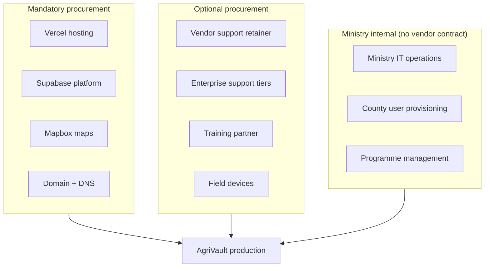

# AgriVault Procurement Guide

**Classification:** Internal — Procurement committees, Ministry finance  
**Version:** 0.1.0-rc1  
**Platform:** AgriVault (`agritrace`)  
**Audience:** Procurement committee, Ministry IT, programme manager, legal counsel, vendor evaluation team

**Related:** [NATIONAL_SCALE_GUIDE.md](./NATIONAL_SCALE_GUIDE.md) · [PROJECT_GOVERNANCE.md](./PROJECT_GOVERNANCE.md) · [../government/PROCUREMENT_PACKAGE.md](../government/PROCUREMENT_PACKAGE.md) · [../ARCHITECTURE.md](../ARCHITECTURE.md) · [../DEPLOYMENT_GUIDE.md](../DEPLOYMENT_GUIDE.md) · [../SECURITY.md](../SECURITY.md)

---

## Table of contents

1. [Purpose](#purpose)
2. [Procurement scope](#procurement-scope)
3. [Software licensing model](#software-licensing-model)
4. [Vendor and service categories](#vendor-and-service-categories)
5. [Evaluation criteria](#evaluation-criteria)
6. [Three-year TCO framework](#three-year-tco-framework)
7. [Contracting considerations](#contracting-considerations)
8. [Procurement timeline alignment](#procurement-timeline-alignment)
9. [Related documents](#related-documents)

---

## Purpose

This guide defines what the Ministry must procure to operate AgriVault from pilot through national scale. It supports procurement committee evaluation without prescribing final contract values — cost ranges are marked **Ministry to complete** pending vendor quotes, user counts, and scale wave timing defined in [NATIONAL_SCALE_GUIDE.md](./NATIONAL_SCALE_GUIDE.md).

AgriVault RC1 is a **private government application**. Open-source components are used under permissive licenses; the assembled platform is not redistributed as open source.

---

## Procurement scope

### In scope

| Category | Item | Required from | Wave |
|----------|------|---------------|------|
| Hosting | Vercel (Next.js application, Edge Functions, CDN) | Wave 1 | Mandatory |
| Database | Supabase (Auth, Postgres, Edge Functions, storage) | Wave 1 | Mandatory |
| Maps | Mapbox (tiles, geocoding, static maps) | Wave 1 | Mandatory |
| Domain | Production hostname + TLS certificate | Wave 1 | Mandatory |
| Support (optional) | Vendor engineering retainer | Wave 1 | Recommended |
| Support (optional) | Supabase/Vercel enterprise support tiers | Wave 3 | Evaluate |
| Training (optional) | External training delivery partner | Wave 2 | Optional |
| Devices (optional) | Field smartphones/tablets for CLAN | Wave 1 | County budget |

### Out of scope (RC1)

| Item | Rationale |
|------|-----------|
| On-premises servers | Cloud-native architecture per [../adr/0005-supabase-platform.md](../adr/0005-supabase-platform.md) |
| Custom GIS server | Mapbox SaaS per [../adr/0004-mapbox-architecture.md](../adr/0004-mapbox-architecture.md) |
| Microsoft / Google enterprise suites | Not required for platform operation |
| AI/LLM API services | AiAssistant disabled for pilot ([../KNOWN_LIMITATIONS.md](../KNOWN_LIMITATIONS.md)) |

---

## Software licensing model

### Application code (AgriVault / agritrace)

| Aspect | Detail |
|--------|--------|
| Ownership | Ministry of Agriculture (upon contract completion — Ministry to confirm IP terms) |
| Distribution | Private; not published to public npm or GitHub |
| Third-party OSS | Next.js (MIT), React (MIT), Supabase client (Apache 2.0), Mapbox GL (BSD), Tailwind (MIT) |
| Compliance | Maintain `package.json` license audit; no GPL dependencies in production bundle |
| Audit | Annual OSS compliance review recommended at Wave 3 |

### SaaS subscriptions

All production SaaS accounts must be registered to **Ministry of Agriculture** billing entity, not vendor personal accounts.

| Service | License type | Key management |
|---------|--------------|----------------|
| Vercel | Subscription (Pro / Enterprise) | Ministry IT owns team; vendor deploy access time-limited |
| Supabase | Subscription (Pro / Team) | Ministry IT owns project; service role key restricted |
| Mapbox | Usage-based token | Ministry IT owns token; rotate on staff change |

Reference: [../SECURITY.md](../SECURITY.md) credential management.

---

## Vendor and service categories

### 1. Hosting — Vercel

**Function:** Hosts Next.js 14 application, serverless API routes, Edge Function proxy, static assets, PWA service worker.

| Evaluation factor | Requirement |
|-------------------|-------------|
| Plan | Pro minimum for production; Enterprise evaluation at Wave 3 |
| Regions | Confirm latency to Liberia (default US East) |
| Build minutes | Sufficient for CI on every deploy |
| Environment variables | Ministry IT admin access; audit log |
| SLA | Match [../operations/SERVICE_LEVEL_OBJECTIVES.md](../operations/SERVICE_LEVEL_OBJECTIVES.md) targets |

Reference: [../DEPLOYMENT_GUIDE.md](../DEPLOYMENT_GUIDE.md).

### 2. Database — Supabase

**Function:** PostgreSQL database, authentication, Row Level Security, Edge Function runtime (`sync-batch`), file storage.

| Evaluation factor | Requirement |
|-------------------|-------------|
| Plan | Pro for Wave 1–2; Team evaluation for Wave 3 |
| PITR | Enabled before Wave 2 county 3 ([DISASTER_RECOVERY_PLAN.md](./DISASTER_RECOVERY_PLAN.md)) |
| Backups | Daily automated; restore drill documented |
| Data residency | Confirm Supabase region; Ministry to complete legal review |
| RLS | County isolation verified ([NATIONAL_SCALE_GUIDE.md](./NATIONAL_SCALE_GUIDE.md)) |

Reference: [../DATABASE.md](../DATABASE.md), [../adr/0005-supabase-platform.md](../adr/0005-supabase-platform.md).

### 3. Maps — Mapbox

**Function:** Operational maps, GPS boundary capture, geocoding, GIS intelligence surfaces.

| Evaluation factor | Requirement |
|-------------------|-------------|
| Token type | Public token with URL restrictions for client; secret token for server if proxied |
| Usage tier | Standard for pilot; scale tier based on projected map loads |
| Offline | PWA caches shell; tiles require connectivity ([../OFFLINE_ARCHITECTURE.md](../OFFLINE_ARCHITECTURE.md)) |
| Alternatives | No RC1 alternative; migration cost high — treat as strategic dependency |

Reference: [../GIS_ARCHITECTURE.md](../GIS_ARCHITECTURE.md), [../adr/0004-mapbox-architecture.md](../adr/0004-mapbox-architecture.md).

### 4. Optional — Vendor engineering support

**Function:** Bug fixes, RC releases, security patches, scale-up engineering, on-call escalation (Tier 3).

| Evaluation factor | Requirement |
|-------------------|-------------|
| Retainer model | Fixed monthly hours + incident surge pricing (Ministry to complete) |
| SLA | Response times per [SUPPORT_MODEL.md](./SUPPORT_MODEL.md) |
| Knowledge transfer | Documented handoff to Ministry IT by Wave 3 |
| Source access | Ministry retains code repository access |
| Exit clause | 90-day transition support on contract termination |

Alignment: [OPERATING_MODEL.md](./OPERATING_MODEL.md) vendor transition plan.

---

## Evaluation criteria

Procurement committee scoring framework (weights adjustable by committee):

| Criterion | Weight | Scoring guidance |
|-----------|--------|------------------|
| Total cost of ownership (3-year) | 25% | Complete TCO worksheet; lowest compliant bid |
| Security and compliance | 20% | RLS, auth, backup, data residency, pen test readiness |
| Offline/field suitability | 15% | PWA, sync architecture, low-bandwidth performance |
| Scalability to 15 counties | 15% | Infrastructure headroom; bulk provisioning |
| Support and SLA | 10% | Tier 3 response; Liberian business hours coverage |
| Knowledge transfer | 10% | Ministry IT self-sufficiency roadmap |
| Reference / track record | 5% | Government or agriculture sector deployments |

**Mandatory pass/fail gates (any failure disqualifies):**

- [ ] All SaaS billing assignable to Ministry entity
- [ ] No vendor lock-in clause preventing Ministry code ownership
- [ ] Supabase PITR available on selected plan or upgrade path
- [ ] Mapbox token manageable by Ministry IT without vendor intervention
- [ ] Documented DR plan acceptance ([DISASTER_RECOVERY_PLAN.md](./DISASTER_RECOVERY_PLAN.md))
- [ ] OSS license compliance attestation

---

## Three-year TCO framework

Complete all **Ministry to complete** cells with vendor quotes before contract award. Ranges below reflect order-of-magnitude planning bands only — not commitments.

### Year 1 (Pilot + hardening)

| Line item | Unit | Qty (est.) | Cost range (USD) | Notes |
|-----------|------|------------|------------------|-------|
| Vercel Pro | Annual subscription | 1 | Ministry to complete | Includes build minutes, bandwidth |
| Supabase Pro | Annual subscription | 1 | Ministry to complete | Auth + DB + Edge Functions |
| Mapbox Standard | Monthly usage | 12 months | Ministry to complete | Pilot map load estimate: 50K–100K/month |
| Domain + DNS | Annual | 1 | Ministry to complete | `.gov.lr` or approved domain |
| Vendor support retainer | Monthly × 12 | Optional | Ministry to complete | Recommended for RC1–RC2 |
| Training delivery | Per cohort | 4 role groups | Ministry to complete | See [TRAINING_PROGRAM.md](./TRAINING_PROGRAM.md) |
| Field devices | Per CLAN unit | 10–30 | Ministry to complete | County capital budget if applicable |
| **Year 1 subtotal** | | | **Ministry to complete** | |

### Year 2 (Regional scale — 5–8 counties)

| Line item | Unit | Qty (est.) | Cost range (USD) | Notes |
|-----------|------|------------|------------------|-------|
| Vercel Pro | Annual | 1 | Ministry to complete | Evaluate Enterprise at 6+ counties |
| Supabase Pro + PITR | Annual | 1 | Ministry to complete | PITR add-on required |
| Mapbox scale tier | Monthly usage | 12 months | Ministry to complete | 100K–500K loads/month |
| Staging environment | Annual | 1 | Ministry to complete | Mirror production schema |
| Vendor support retainer | Monthly × 12 | 1 | Ministry to complete | Reduced if Ministry IT capable |
| County helpdesk | FTE × counties | 2–5 | Ministry to complete | Internal staff cost |
| **Year 2 subtotal** | | | **Ministry to complete** | |

### Year 3 (National — 15 counties)

| Line item | Unit | Qty (est.) | Cost range (USD) | Notes |
|-----------|------|------------|------------------|-------|
| Vercel Pro / Enterprise | Annual | 1 | Ministry to complete | Enterprise if SLA requires |
| Supabase Team | Annual | 1 | Ministry to complete | Higher connection limits |
| Mapbox Enterprise eval | Annual | 1 | Ministry to complete | 1–3M loads/month |
| Penetration test | One-time | 1 | Ministry to complete | Pre-GA requirement |
| Ministry IT FTE | Annual | 1–2 | Ministry to complete | Platform operations |
| **Year 3 subtotal** | | | **Ministry to complete** | |

### TCO summary template

| Year | Infrastructure SaaS | Vendor support | Internal staff | Devices / other | **Annual total** |
|------|--------------------|--------------------|----------------|-----------------|------------------|
| Year 1 | Ministry to complete | Ministry to complete | Ministry to complete | Ministry to complete | **Ministry to complete** |
| Year 2 | Ministry to complete | Ministry to complete | Ministry to complete | Ministry to complete | **Ministry to complete** |
| Year 3 | Ministry to complete | Ministry to complete | Ministry to complete | Ministry to complete | **Ministry to complete** |
| **3-year TCO** | | | | | **Ministry to complete** |

**Cost drivers to monitor:**

| Driver | Trigger | Action |
|--------|---------|--------|
| Mapbox map loads | > 80% monthly quota | Tile caching; usage review ([NATIONAL_SCALE_GUIDE.md](./NATIONAL_SCALE_GUIDE.md)) |
| Supabase storage | > 50 GB | Archival policy ([DATA_GOVERNANCE.md](./DATA_GOVERNANCE.md)) |
| Vercel bandwidth | > 100 GB/month | CDN optimisation; asset audit |
| Edge Function invocations | Sync failures increase retries | Sync reliability programme |

---

## Contracting considerations

| Topic | Recommendation |
|-------|----------------|
| Data ownership | Ministry owns all operational data; vendor has no licence to use farmer PII |
| Data residency | Contract must specify Supabase region; cross-border transfer per [../government/DATA_SHARING_FRAMEWORK.md](../government/DATA_SHARING_FRAMEWORK.md) |
| Exit / portability | Postgres dump export rights; 90-day transition assistance |
| Security incidents | 24-hour notification obligation; cooperate with [../operations/INCIDENT_RESPONSE.md](../operations/INCIDENT_RESPONSE.md) |
| Sub-processors | Vercel, Supabase, Mapbox listed; notification of changes |
| Payment | Align with government fiscal year; USD billing typical for SaaS |
| IP | Ministry owns customisations; OSS components remain under original licenses |

Legal review: [../government/LEGAL_AND_COMPLIANCE.md](../government/LEGAL_AND_COMPLIANCE.md). Timeline aligns with [IMPLEMENTATION_PLAYBOOK.md](./IMPLEMENTATION_PLAYBOOK.md) Phase 1 (RFP at Week −8, award at Week −4).

---

## Related documents

[../government/PROCUREMENT_PACKAGE.md](../government/PROCUREMENT_PACKAGE.md) · [NATIONAL_SCALE_GUIDE.md](./NATIONAL_SCALE_GUIDE.md) · [DISASTER_RECOVERY_PLAN.md](./DISASTER_RECOVERY_PLAN.md) · [../production-readiness.md](../production-readiness.md) · [../ARCHITECTURE.md](../ARCHITECTURE.md)
