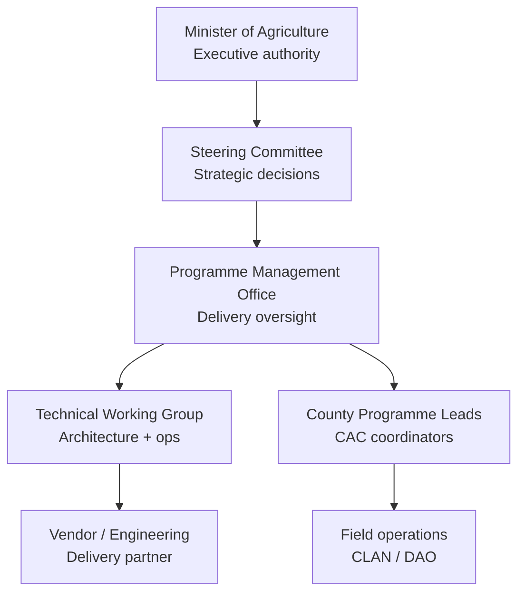
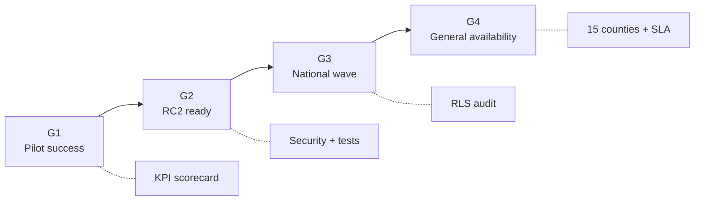

# AgriVault Project Governance

**Classification:** Internal — Steering Committee, PMO, Ministry leadership  
**Version:** 0.1.0-rc1  
**Platform:** AgriVault (`agritrace`)  
**Audience:** Steering Committee members, programme manager, Ministry IT director, county representatives, vendor account manager

**Related:** [../government/NATIONAL_GOVERNANCE_MODEL.md](../government/NATIONAL_GOVERNANCE_MODEL.md) · [OPERATING_MODEL.md](./OPERATING_MODEL.md) · [IMPLEMENTATION_PLAYBOOK.md](./IMPLEMENTATION_PLAYBOOK.md) · [PILOT_SUCCESS_METRICS.md](./PILOT_SUCCESS_METRICS.md) · [RISK_REGISTER.md](./RISK_REGISTER.md) · [../ROADMAP_POST_PILOT.md](../ROADMAP_POST_PILOT.md)

---

## Table of contents

1. [Purpose](#purpose)
2. [Governance hierarchy](#governance-hierarchy)
3. [Steering Committee](#steering-committee)
4. [Programme Management Office (PMO)](#programme-management-office-pmo)
5. [Technical Working Group (TWG)](#technical-working-group-twg)
6. [Meeting cadence](#meeting-cadence)
7. [Decision rights matrix](#decision-rights-matrix)
8. [Escalation to Minister](#escalation-to-minister)
9. [Gate reviews and approvals](#gate-reviews-and-approvals)
10. [Related documents](#related-documents)

---

## Purpose

This document defines project governance for the AgriVault Ministry programme — from RC1 pilot through national scale. It establishes decision bodies, meeting rhythms, and escalation paths.

National policy alignment: [../government/NATIONAL_GOVERNANCE_MODEL.md](../government/NATIONAL_GOVERNANCE_MODEL.md). Day-to-day operations: [OPERATING_MODEL.md](./OPERATING_MODEL.md).

---

## Governance hierarchy

| Body | Focus | Authority level |
|------|-------|-----------------|
| Minister | Cabinet accountability; national policy | Final escalation |
| Steering Committee | Budget, scope, go/no-go gates | Strategic |
| PMO | Schedule, risks, KPIs, coordination | Tactical |
| TWG | Technical standards, security, releases | Advisory + operational |
| County leads | County rollout, training, Tier 1 support | County operational |

---

## Steering Committee

### Composition

| Seat | Role | Voting |
|------|------|--------|
| Chair | Permanent Secretary or delegate | Yes |
| Programme sponsor | Director, MoA ICT or programme director | Yes |
| Ministry operations | Senior Ministry agriculture officer | Yes |
| County representative | Rotating pilot county CAC (6-month term) | Yes |
| Ministry IT | IT director or delegate | Yes |
| Finance | Ministry budget officer | Advisory |
| Vendor | Account manager (non-voting at budget decisions) | Advisory |
| Donor observer | If applicable | Observer |

Quorum: 4 voting members including Chair and Programme sponsor.

### Responsibilities

| Area | Steering Committee authority |
|------|------------------------------|
| Pilot go/no-go (Gate G1) | Approve / reject / extend |
| Scale-up authorisation (G2, G3) | Approve county waves |
| Budget allocation | Approve TCO tranches per [PROCUREMENT_GUIDE.md](./PROCUREMENT_GUIDE.md) |
| Risk acceptance | Accept Critical residual risks from [RISK_REGISTER.md](./RISK_REGISTER.md) |
| Scope change | Approve features outside [../ROADMAP_POST_PILOT.md](../ROADMAP_POST_PILOT.md) |
| Vendor contract | Recommend award; Minister sign-off per procurement rules |

### Steering Committee outputs

| Output | Frequency |
|--------|-----------|
| Gate decision minutes | At each gate |
| Budget approval memo | Annual + wave triggers |
| Risk acceptance register | Quarterly |
| Programme health summary | Monthly |

---

## Programme Management Office (PMO)

### Composition

| Role | Responsibility |
|------|----------------|
| Programme manager (lead) | Single point of accountability for delivery |
| Pilot administrator | User provisioning, KPI data collection |
| Training coordinator | Certification roster, TTT programme |
| Change management lead | Adoption, communications |
| County liaison | County readiness assessments |

### PMO responsibilities

| Function | Deliverables |
|----------|--------------|
| Plan management | [IMPLEMENTATION_PLAYBOOK.md](./IMPLEMENTATION_PLAYBOOK.md) phase tracking |
| KPI reporting | Weekly pack per [PILOT_SUCCESS_METRICS.md](./PILOT_SUCCESS_METRICS.md) |
| Risk management | [RISK_REGISTER.md](./RISK_REGISTER.md) maintenance |
| Stakeholder comms | Steering papers, county updates |
| Gate preparation | Evidence packs for G1–G4 |
| Vendor coordination | Sprint reviews, SLA tracking |

PMO reports to Steering Committee Chair. Escalates blockers within 48 hours of identification.

---

## Technical Working Group (TWG)

### Composition

| Role | Organisation |
|------|--------------|
| TWG chair | Ministry IT director |
| Platform engineer | Ministry IT |
| Security lead | Ministry IT |
| Vendor tech lead | Vendor engineering |
| Data steward | Ministry data steward ([DATA_GOVERNANCE.md](./DATA_GOVERNANCE.md)) |
| Field tech liaison | Field lead (CLAN supervisor) |

### Responsibilities

| Area | TWG authority |
|------|---------------|
| Release approval | Recommend deploy/rollback to Ministry IT |
| Security exceptions | Recommend acceptance; SC approves Critical |
| RLS policy changes | Review before production |
| DR drills | Schedule and report per [DISASTER_RECOVERY_PLAN.md](./DISASTER_RECOVERY_PLAN.md) |
| Technical debt prioritisation | Align with [../TECHNICAL_DEBT.md](../TECHNICAL_DEBT.md) and roadmap |
| Architecture changes | Review against [../ARCHITECTURE.md](../ARCHITECTURE.md) and ADRs |

TWG does **not** approve budget or county rollout — escalates to PMO / Steering Committee.

---

## Meeting cadence

| Meeting | Frequency | Chair | Participants | Duration | Outputs |
|---------|-----------|-------|--------------|----------|---------|
| Steering Committee | Monthly; ad hoc at gates | PS or delegate | SC members | 2 hours | Decisions, minutes |
| PMO standup | Weekly | Programme manager | PMO team | 30 min | Action log |
| TWG | Bi-weekly | Ministry IT | TWG members | 1 hour | Tech decision log |
| County sync | Bi-weekly (pilot); monthly (scale) | County liaison | CAC, DAO lead | 1 hour | County status |
| KPI review | Weekly (pilot) | Programme manager | PMO + field lead | 45 min | KPI pack |
| Vendor sprint review | Bi-weekly | Vendor AM | TWG + PMO | 1 hour | Sprint notes |
| Risk review | Monthly | Programme manager | PMO + Ministry IT | 1 hour | Updated risk register |
| Retrospective | End of each phase | Programme manager | All role leads | 2 hours | Lessons learned |

---

## Decision rights matrix

| Decision | CLAN/DAO/CAC | County CAC | PMO | TWG | Steering Committee | Minister |
|----------|--------------|------------|-----|-----|-------------------|----------|
| Daily workflow actions | R | — | I | — | — | — |
| Paper fallback activation | I | R/A | I | — | — | — |
| County user provisioning | I | R | A | C | — | — |
| Training schedule | C | R | A | — | I | — |
| Production deploy | — | I | C | R | A | — |
| P1 incident BCP activation | I | R | A | R | I | I |
| Pilot extension | — | C | R | C | A | I |
| Scale to next wave | — | C | R | C | A | I |
| Budget release | — | — | R | — | A | A |
| RLS policy change | — | — | C | R | A | — |
| Vendor contract renewal | — | — | R | C | A | A |
| National policy change | — | — | C | C | R | A |

**Legend:** R = Responsible, A = Accountable, C = Consulted, I = Informed

RACI detail: [OPERATING_MODEL.md](./OPERATING_MODEL.md).

---

## Escalation to Minister

Escalation to the Minister of Agriculture is reserved for decisions beyond Steering Committee authority or requiring political accountability.

### Mandatory escalation triggers

| Trigger | Escalation path | Timeline |
|---------|-----------------|----------|
| P1 outage > 8 hours | IT → PMO → SC Chair → Minister | Within 1 hour of 8 h mark |
| Confirmed PII data breach | IT → PMO → SC Chair → Minister | Within 4 hours |
| Pilot no-go recommendation | PMO → SC → Minister briefing | Gate G1 session |
| National rollout authorisation (Gate G3) | SC → Minister approval | Before Wave 3 |
| Budget overrun > 15% | PMO → SC → Minister | Within 5 business days |
| Critical risk score ≥ 20 unmitigated | PMO → SC → Minister | Within 48 hours |

### Escalation format (Minister briefing note)

| Section | Content |
|---------|---------|
| Situation | What happened; scope (counties, users, data) |
| Impact | Operational, reputational, farmer impact |
| Actions taken | DR/BCP steps; communications |
| Decision required | Specific ask (approve spend, extend pilot, public statement) |
| Recommendation | PMO / SC recommended course |

Template alignment: [../government/MINISTER_BRIEFING.md](../government/MINISTER_BRIEFING.md).

### Non-escalation

Routine KPI variance, Tier 1 support issues, and scheduled maintenance do not require Minister notification. Document in PMO weekly report only.

---

## Gate reviews and approvals

Gate definitions: [../ROADMAP_POST_PILOT.md](../ROADMAP_POST_PILOT.md), [NATIONAL_SCALE_GUIDE.md](./NATIONAL_SCALE_GUIDE.md).

| Gate | Timing | Evidence pack contents | Decision authority |
|------|--------|------------------------|-------------------|
| **G1** | Pilot Week 4 | [PILOT_SUCCESS_METRICS.md](./PILOT_SUCCESS_METRICS.md) scorecard; retrospective; risk register | Steering Committee |
| **G2** | Phase 1 complete | RC2 deployed; E2E green; readiness ≥ 85; DR drill log | Steering Committee |
| **G3** | Before Wave 3 | 5 counties live; RLS audit; pen test plan | SC + Minister |
| **G4** | Phase 3 complete | 15 counties; SLA operational; GA criteria | Minister |

### Gate meeting agenda (standard)

1. PMO evidence presentation (30 min)
2. TWG technical assessment (15 min)
3. County representative feedback (15 min)
4. Risk register review (15 min)
5. Decision: Go / Conditional go / No-go (15 min)
6. Action items and owners (15 min)

---

## Related documents

[../government/NATIONAL_GOVERNANCE_MODEL.md](../government/NATIONAL_GOVERNANCE_MODEL.md) · [OPERATING_MODEL.md](./OPERATING_MODEL.md) · [IMPLEMENTATION_PLAYBOOK.md](./IMPLEMENTATION_PLAYBOOK.md) · [PILOT_SUCCESS_METRICS.md](./PILOT_SUCCESS_METRICS.md) · [RISK_REGISTER.md](./RISK_REGISTER.md) · [NATIONAL_SCALE_GUIDE.md](./NATIONAL_SCALE_GUIDE.md) · [../ROADMAP_POST_PILOT.md](../ROADMAP_POST_PILOT.md)
