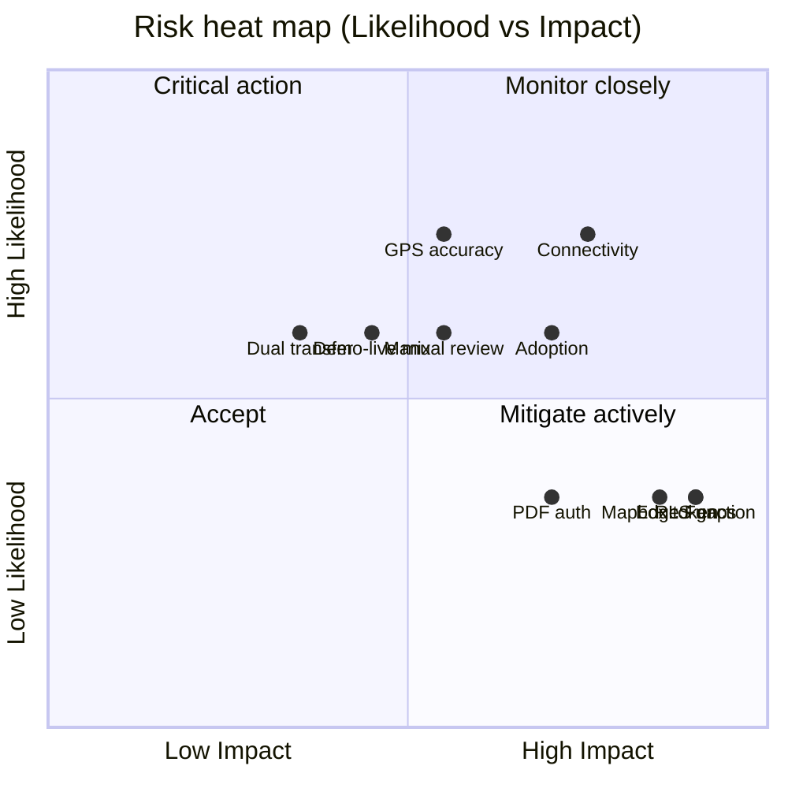

# AgriVault Risk Register

**Classification:** Internal — PMO, risk owners, Steering Committee  
**Version:** 0.1.0-rc1  
**Platform:** AgriVault (`agritrace`)  
**Audience:** Programme manager, Ministry IT, county CACs, vendor delivery manager, Steering Committee

**Related:** [PILOT_SUCCESS_METRICS.md](./PILOT_SUCCESS_METRICS.md) · [NATIONAL_SCALE_GUIDE.md](./NATIONAL_SCALE_GUIDE.md) · [DISASTER_RECOVERY_PLAN.md](./DISASTER_RECOVERY_PLAN.md) · [BUSINESS_CONTINUITY_PLAN.md](./BUSINESS_CONTINUITY_PLAN.md) · [../KNOWN_LIMITATIONS.md](../KNOWN_LIMITATIONS.md) · [../TECHNICAL_DEBT.md](../TECHNICAL_DEBT.md) · [../ROADMAP_POST_PILOT.md](../ROADMAP_POST_PILOT.md)

---

## Table of contents

1. [Purpose](#purpose)
2. [Risk assessment methodology](#risk-assessment-methodology)
3. [Risk matrix legend](#risk-matrix-legend)
4. [Risk register](#risk-register)
5. [Risk heat map](#risk-heat-map)
6. [Review cadence](#review-cadence)
7. [Related documents](#related-documents)

---

## Purpose

This register tracks programme-level risks for the AgriVault Ministry pilot and scale-up. Risks derive from RC1 known limitations ([../KNOWN_LIMITATIONS.md](../KNOWN_LIMITATIONS.md)), architecture constraints, operational dependencies, and adoption factors.

Each risk has an owner accountable for mitigation. Residual risk after mitigation is accepted by the Steering Committee at gate reviews ([PROJECT_GOVERNANCE.md](./PROJECT_GOVERNANCE.md)).

---

## Risk assessment methodology

| Factor | Scale | Definition |
|--------|-------|------------|
| **Likelihood (L)** | 1–5 | 1 = rare; 3 = possible; 5 = almost certain |
| **Impact (I)** | 1–5 | 1 = negligible; 3 = moderate programme delay; 5 = pilot failure / data breach |
| **Risk score** | L × I | Priority band assignment |

Sources: [../KNOWN_LIMITATIONS.md](../KNOWN_LIMITATIONS.md), [../TECHNICAL_DEBT.md](../TECHNICAL_DEBT.md), [CHANGE_MANAGEMENT.md](./CHANGE_MANAGEMENT.md), field readiness assessments.

---

## Risk matrix legend

| Score | Band | Response |
|-------|------|----------|
| 1–4 | Low | Monitor; accept |
| 5–9 | Medium | Mitigate; report monthly |
| 10–15 | High | Active mitigation; report weekly |
| 16–25 | Critical | Escalate to Steering Committee; executive action |

|  | Impact 1 | Impact 2 | Impact 3 | Impact 4 | Impact 5 |
|--|----------|----------|----------|----------|----------|
| **L 5** | 5 M | 10 H | 15 H | 20 C | 25 C |
| **L 4** | 4 L | 8 M | 12 H | 16 C | 20 C |
| **L 3** | 3 L | 6 M | 9 M | 12 H | 15 H |
| **L 2** | 2 L | 4 L | 6 M | 8 M | 10 H |
| **L 1** | 1 L | 2 L | 3 L | 4 L | 5 M |

---

## Risk register

| ID | Risk | L | I | Score | Band | Mitigation | Owner | Status |
|----|------|---|---|-------|------|------------|-------|--------|
| R-001 | Rural connectivity prevents CLAN sync | 4 | 4 | 16 | Critical | Offline-first PWA; sync monitoring; KPI-01 tracking; field week scheduling around known outages | Field lead | Active |
| R-002 | Edge Function `sync-batch` unavailable | 2 | 5 | 10 | High | Pre-pilot deployment verification; Supabase log monitoring; DR plan for function redeploy | Ministry IT | Active |
| R-003 | Mapbox token missing or expired | 2 | 5 | 10 | High | Token in launch checklist; staging test before field week; procurement renewal calendar | Ministry IT | Active |
| R-004 | Sync items reach `manual_review` (5 retries) | 3 | 3 | 9 | Medium | CLAN training on reconnect; DAO re-submit procedure; KPI-03 zero target | Pilot administrator | Active |
| R-005 | Low user adoption; CLAN avoids PWA | 3 | 4 | 12 | High | Change management; device clinic; paper fallback logging ≤ 5%; supervisor field visits | Programme manager | Active |
| R-006 | DAO review SLA breach (> 24 h) | 3 | 3 | 9 | Medium | DAO desk staffing; KPI-02 weekly tracking; CAC escalation | County DAO lead | Active |
| R-007 | Demo/fixture items actioned as live | 3 | 3 | 9 | Medium | Training on UUID `submissionId`; LIVE badge; TD-006 live-only queue post-pilot | Training coordinator | Active |
| R-008 | Dual transfer model causes conflicting totals | 3 | 2 | 6 | Medium | Use one authoritative surface per report; TD-005 unified model in RC2 | Programme manager | Accepted |
| R-009 | Verification queue merges demo and live data | 4 | 2 | 8 | Medium | Data Source badge training; prioritise LIVE rows; RC2 live-only mode | County CAC | Active |
| R-010 | Unauthenticated PDF report routes exploited | 2 | 4 | 8 | Medium | Do not publish URLs; network restriction; TD-001 auth fix in RC2 | Ministry IT | Accepted |
| R-011 | Supabase auth bypass if env vars unset | 1 | 5 | 5 | Medium | Launch readiness gate; never deploy without env vars | Ministry IT | Mitigated |
| R-012 | RLS county isolation failure at multi-county scale | 2 | 5 | 10 | High | RLS audit before county 3; staging tests ([NATIONAL_SCALE_GUIDE.md](./NATIONAL_SCALE_GUIDE.md)) | Ministry IT | Planned |
| R-013 | CLAN post-login landing mismatch causes confusion | 4 | 2 | 8 | Medium | Bookmark training; TD-003 fix in RC2 | Training coordinator | Active |
| R-014 | Workspace role switcher UI-only misleads demos | 3 | 2 | 6 | Medium | Train sign-in per role; do not rely on switcher for permissions | Training coordinator | Accepted |
| R-015 | GPS accuracy poor under tree cover | 4 | 3 | 12 | High | Open-area capture training; re-capture procedure; 10 m threshold warnings | Field lead | Active |
| R-016 | Heavy dashboard pages slow on low bandwidth | 3 | 3 | 9 | Medium | Wi-Fi pre-load; PWA shell cache; TD-018 code splitting at scale | Ministry IT | Active |
| R-017 | Partial rate limiting allows API abuse | 2 | 3 | 6 | Medium | Log monitoring; TD-002 distributed limits in RC2 | Ministry IT | Accepted |
| R-018 | No automated E2E/RLS tests; regression undetected | 3 | 3 | 9 | Medium | Manual QA per [../PILOT_CHECKLIST.md](../PILOT_CHECKLIST.md); TD-004 Playwright in RC2 | Vendor engineering | Active |
| R-019 | Executive briefing blends LIVE/DEMO without badges | 3 | 3 | 9 | Medium | Verbal disclaimer; command center cross-check; TD-012 in RC2 | Ministry programme lead | Active |
| R-020 | Donor/inventory forms lack workflow audit trail | 2 | 2 | 4 | Low | Use transfer confirmation workflow; TD-008 bridge post-pilot | Programme manager | Accepted |
| R-021 | Supabase regional outage | 1 | 5 | 5 | Medium | DR plan; BCP offline field ops; PITR at Wave 2 | Ministry IT | Planned |
| R-022 | Vercel platform outage | 1 | 5 | 5 | Medium | DR plan; status page monitoring; BCP paper fallback | Ministry IT | Planned |
| R-023 | Political pressure for premature national rollout | 2 | 4 | 8 | Medium | Gate criteria in [../ROADMAP_POST_PILOT.md](../ROADMAP_POST_PILOT.md); KPI evidence pack | Programme manager | Active |
| R-024 | Vendor contract lapse without Ministry IT readiness | 2 | 4 | 8 | Medium | Knowledge transfer plan; [OPERATING_MODEL.md](./OPERATING_MODEL.md) transition | Programme manager | Planned |
| R-025 | Field device theft or loss exposes cached data | 2 | 3 | 6 | Medium | Device PIN policy; remote session revoke; minimal PII in IndexedDB | County CAC | Active |

---

## Risk heat map

### Top risks by score (pilot phase)

| Rank | ID | Risk | Score | Immediate action |
|------|-----|------|-------|------------------|
| 1 | R-001 | Rural connectivity | 16 | Offline training; sync KPI daily |
| 2 | R-005 | Low adoption | 12 | Change management surge |
| 3 | R-015 | GPS accuracy | 12 | Field practicum Day 2 |
| 4 | R-002 | Edge Function failure | 10 | Pre-flight deploy check |
| 5 | R-003 | Mapbox token | 10 | Token in Week 0 checklist |
| 6 | R-012 | RLS isolation | 10 | Defer multi-county until audit |

---

## Review cadence

| Review | Frequency | Participants | Output |
|--------|-----------|--------------|--------|
| Risk standup | Weekly (pilot) | Programme manager, Ministry IT, field lead | Updated status column |
| Steering Committee | Monthly / at gates | Committee members | Accept / escalate top risks |
| Post-incident | After P1 | DR team + programme manager | New or updated risk entry |
| Scale-up review | Before each wave | PMO + [NATIONAL_SCALE_GUIDE.md](./NATIONAL_SCALE_GUIDE.md) owners | Wave-specific risk addendum |

**Escalation:** Any Critical band (score ≥ 16) or new data integrity risk → Steering Committee within 48 hours ([PROJECT_GOVERNANCE.md](./PROJECT_GOVERNANCE.md)).

**Closure:** Risk closed when mitigation verified and residual score ≤ 4, or explicitly accepted by Steering Committee with documented rationale.

---

## Related documents

| Document | Relationship |
|----------|--------------|
| [../KNOWN_LIMITATIONS.md](../KNOWN_LIMITATIONS.md) | Primary risk source |
| [../TECHNICAL_DEBT.md](../TECHNICAL_DEBT.md) | Mitigation backlog items |
| [PILOT_SUCCESS_METRICS.md](./PILOT_SUCCESS_METRICS.md) | KPI-linked risk indicators |
| [DISASTER_RECOVERY_PLAN.md](./DISASTER_RECOVERY_PLAN.md) | R-002, R-021, R-022 response |
| [BUSINESS_CONTINUITY_PLAN.md](./BUSINESS_CONTINUITY_PLAN.md) | R-001, R-005 continuity |
| [CHANGE_MANAGEMENT.md](./CHANGE_MANAGEMENT.md) | R-005 adoption mitigations |
| [NATIONAL_SCALE_GUIDE.md](./NATIONAL_SCALE_GUIDE.md) | R-012 scale triggers |
| [IMPLEMENTATION_PLAYBOOK.md](./IMPLEMENTATION_PLAYBOOK.md) | Gate-linked risk review |
| [../ROADMAP_POST_PILOT.md](../ROADMAP_POST_PILOT.md) | Phase-aligned mitigations |
| [../SECURITY.md](../SECURITY.md) | R-010, R-011, R-017 security context |
