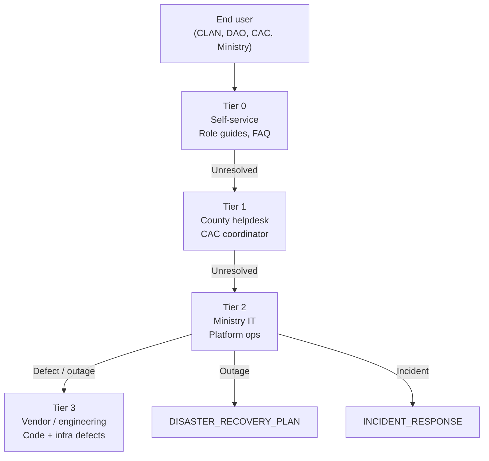
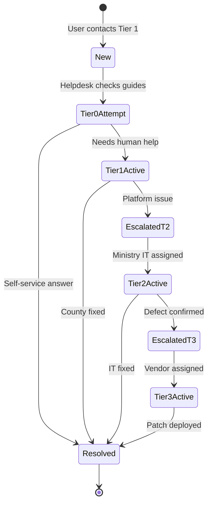

# AgriVault Support Model

**Classification:** Internal — Support leads, county operations, Ministry IT  
**Version:** 0.1.0-rc1  
**Platform:** AgriVault (`agritrace`)  
**Audience:** County helpdesk leads, Ministry IT support, programme manager, vendor support manager, CAC coordinators

**Related:** [OPERATING_MODEL.md](./OPERATING_MODEL.md) · [TRAINING_PROGRAM.md](./TRAINING_PROGRAM.md) · [../operations/SERVICE_LEVEL_OBJECTIVES.md](../operations/SERVICE_LEVEL_OBJECTIVES.md) · [../operations/SUPPORT_ESCALATION.md](../operations/SUPPORT_ESCALATION.md) · [../operations/INCIDENT_RESPONSE.md](../operations/INCIDENT_RESPONSE.md) · [DISASTER_RECOVERY_PLAN.md](./DISASTER_RECOVERY_PLAN.md)

---

## Table of contents

1. [Purpose](#purpose)
2. [Support model overview](#support-model-overview)
3. [Tier 0 — Self-service](#tier-0--self-service)
4. [Tier 1 — County helpdesk](#tier-1--county-helpdesk)
5. [Tier 2 — Ministry IT](#tier-2--ministry-it)
6. [Tier 3 — Vendor / engineering](#tier-3--vendor--engineering)
7. [Support hours and coverage](#support-hours-and-coverage)
8. [SLA summary](#sla-summary)
9. [Ticket lifecycle](#ticket-lifecycle)
10. [Escalation matrix](#escalation-matrix)
11. [Related documents](#related-documents)

---

## Purpose

This document defines the four-tier support structure for AgriVault operations. It bridges county field support (CLAN/DAO daily issues) with national IT operations and vendor engineering escalation.

SLA targets align with [../operations/SERVICE_LEVEL_OBJECTIVES.md](../operations/SERVICE_LEVEL_OBJECTIVES.md). Escalation procedures detail is in [../operations/SUPPORT_ESCALATION.md](../operations/SUPPORT_ESCALATION.md).

---

## Support model overview

| Tier | Name | Scope | Typical resolver |
|------|------|-------|------------------|
| 0 | Self-service | How-to, role procedures, known workarounds | User (guided) |
| 1 | County helpdesk | Account issues, training gaps, device/PWA setup | CAC coordinator |
| 2 | Ministry IT | Platform config, provisioning, outage triage | Ministry IT desk |
| 3 | Vendor / engineering | Application bugs, security patches, RC releases | Vendor on-call |

RACI: [OPERATING_MODEL.md](./OPERATING_MODEL.md) §8.

---

## Tier 0 — Self-service

**Objective:** Resolve common questions without ticket creation. Target: ≥ 40% of user questions self-resolved by Wave 2.

### Resources

| Resource | Audience | Location |
|----------|----------|----------|
| CLAN Field Guide | CLAN technicians | [../CLAN_FIELD_GUIDE.md](../CLAN_FIELD_GUIDE.md) |
| DAO Guide | District officers | [../DAO_GUIDE.md](../DAO_GUIDE.md) |
| CAC Guide | County coordinators | [../CAC_GUIDE.md](../CAC_GUIDE.md) |
| Ministry Guide | National staff | [../MINISTRY_GUIDE.md](../MINISTRY_GUIDE.md) |
| Pilot Admin Guide | Administrators | [../PILOT_ADMIN_GUIDE.md](../PILOT_ADMIN_GUIDE.md) |
| Known Limitations | All (workarounds) | [../KNOWN_LIMITATIONS.md](../KNOWN_LIMITATIONS.md) |
| Demo Script | Trainers | [../DEMO_SCRIPT.md](../DEMO_SCRIPT.md) |
| Training Program | Certification | [TRAINING_PROGRAM.md](./TRAINING_PROGRAM.md) |

### Tier 0 topic index

| Topic | First resource | Common workaround |
|-------|----------------|-------------------|
| PWA install | CLAN Field Guide § Login | CAC device clinic |
| Offline sync pending | CLAN Field Guide § Offline | Check topbar Sync Status |
| Wrong landing page after login | KNOWN_LIMITATIONS § Auth | Navigate to role workspace bookmark |
| Demo vs LIVE queue items | KNOWN_LIMITATIONS § Workflow | Action only UUID submissions |
| Map not loading | KNOWN_LIMITATIONS § GIS | Verify Mapbox token configured |
| PDF export | Ministry Guide | Use authenticated executive briefing route |
| Role permissions | [../product/PERMISSIONS_MATRIX.md](../product/PERMISSIONS_MATRIX.md) | Sign in with correct role account |

### Tier 0 channels

Printed role guides, county WhatsApp tips group, and `/admin/launch-readiness` for IT checks. Password resets and security incidents are **not** Tier 0 — escalate to Tier 1 or 2.

---

## Tier 1 — County helpdesk

**Objective:** First human contact for county users. Resolve training, access, and device issues within county SLA.

### Responsibilities

| Category | Examples | Action |
|----------|----------|--------|
| Access | Forgotten password, locked account | Reset via Ministry IT request form |
| Device | PWA not installing, GPS disabled | Device clinic; settings guide |
| Training | User unsure of workflow step | Reference role guide; schedule refresher |
| Data entry | Form validation errors | Coach user; escalate if platform bug |
| Offline | Sync stuck (not `manual_review`) | Guide reconnect; check connectivity |
| Adoption | User avoiding system | Change management per [CHANGE_MANAGEMENT.md](./CHANGE_MANAGEMENT.md) |

### County helpdesk roster

| Role | Responsibility |
|------|----------------|
| CAC coordinator | Primary Tier 1 contact for county |
| DAO lead | Backup during CAC absence |
| Field lead | CLAN-specific device support |

### Tier 1 SLA

Full targets: [../operations/SERVICE_LEVEL_OBJECTIVES.md](../operations/SERVICE_LEVEL_OBJECTIVES.md).

| Priority | Definition | Response | Resolution target |
|----------|------------|----------|-------------------|
| P3 — Low | How-to; non-blocking | 1 business day | 3 business days |
| P2 — Medium | User blocked from daily work | 4 business hours | 1 business day |
| P1 — High | Multiple users blocked in county | 1 business hour | 4 business hours |

**Business hours (Tier 1):** Monday–Friday, 08:00–17:00 local time (county office hours).

**Ticket logging:** County helpdesk maintains shared log (spreadsheet or ticket tool — Ministry to complete tool selection).

---

## Tier 2 — Ministry IT

**Objective:** Platform operations, user provisioning, outage triage, security event initial response.

### Responsibilities

| Category | Examples | Reference |
|----------|----------|-----------|
| Provisioning | New users, role changes, county assignment | [../PILOT_ADMIN_GUIDE.md](../PILOT_ADMIN_GUIDE.md) |
| Configuration | Environment variables, Mapbox token, Edge Function | [../DEPLOYMENT_GUIDE.md](../DEPLOYMENT_GUIDE.md) |
| Outage triage | Vercel/Supabase down, sync-batch failure | [DISASTER_RECOVERY_PLAN.md](./DISASTER_RECOVERY_PLAN.md) |
| Security | Suspected unauthorised access, token leak | [../operations/INCIDENT_RESPONSE.md](../operations/INCIDENT_RESPONSE.md) |
| Monitoring | Uptime, error rates, sync failure trends | [../operations/MONITORING.md](../operations/MONITORING.md) |
| Release | Deploy approval, rollback decision | [../operations/RELEASE_PROCESS.md](../operations/RELEASE_PROCESS.md) |

### Tier 2 SLA

| Priority | Definition | Response | Resolution target |
|----------|------------|----------|-------------------|
| P1 — Critical | Production down; all counties affected | 30 minutes | 4 hours (RTO per DR plan) |
| P2 — High | Single county degraded; sync failing | 1 hour | 8 business hours |
| P3 — Medium | Non-production; single user provisioning | 4 business hours | 2 business days |
| P4 — Low | Enhancement request; documentation | 2 business days | Backlog |

**Business hours (Tier 2):** Monday–Friday, 08:00–18:00 GMT.

**After-hours P1:** On-call rotation per [../operations/ON_CALL_GUIDE.md](../operations/ON_CALL_GUIDE.md) (Wave 2 onward).

---

## Tier 3 — Vendor / engineering

**Objective:** Resolve application defects, deliver RC patches, support Ministry IT on complex infrastructure issues.

### Responsibilities

| Category | Examples |
|----------|----------|
| Defect fixes | Workflow API errors, role gate bugs, UI regressions |
| Security patches | TD items from [../TECHNICAL_DEBT.md](../TECHNICAL_DEBT.md) |
| RC releases | RC2 hardening, scale-up features |
| Architecture | RLS policy design review, performance optimisation |
| DR support | Assisted restore, post-incident root cause |

### Tier 3 SLA (contractual — Ministry to complete in vendor SOW)

| Priority | Definition | Response | Resolution target |
|----------|------------|----------|-------------------|
| P1 — Critical | Production down; no Ministry IT workaround | 1 hour | 8 hours |
| P2 — High | Major feature broken; workaround exists | 4 business hours | 5 business days |
| P3 — Medium | Minor defect; low user impact | 2 business days | Next RC cycle |
| P4 — Low | Enhancement | 5 business days | Roadmap prioritisation |

**Coverage:** Vendor business hours minimum; P1 on-call for Wave 1 pilot (recommended in [PROCUREMENT_GUIDE.md](./PROCUREMENT_GUIDE.md)).

**Knowledge transfer:** Vendor documents all Tier 3 resolutions in runbook format for Ministry IT absorption by Wave 3.

---

## Support hours and coverage

| Tier | Hours | Coverage model | Pilot | Wave 2 | Wave 3 |
|------|-------|----------------|-------|--------|--------|
| 0 | 24/7 (guides always available) | Self-service | ✓ | ✓ | ✓ |
| 1 | Mon–Fri 08:00–17:00 local | County staff | ✓ | ✓ | ✓ |
| 2 | Mon–Fri 08:00–18:00 GMT | Ministry IT desk | ✓ | ✓ + on-call P1 | ✓ + on-call |
| 3 | Contract-defined | Vendor retainer | Recommended | ✓ | ✓ reduced |

**Coverage summary:** Tier 1 county desk 08:00–17:00 local; Tier 2 Ministry IT 08:00–18:00 GMT (+ on-call P1 at Wave 2); Tier 3 vendor per contract.

---

## SLA summary

Consolidated view — authoritative detail in [../operations/SERVICE_LEVEL_OBJECTIVES.md](../operations/SERVICE_LEVEL_OBJECTIVES.md).

| Metric | Target | Measurement |
|--------|--------|-------------|
| Platform availability | ≥ 99.0% monthly (excl. planned maintenance) | Vercel + Supabase uptime |
| Tier 1 first response (P2) | ≤ 4 business hours | Ticket timestamps |
| Tier 2 first response (P1) | ≤ 30 minutes | Incident log |
| Tier 3 first response (P1) | ≤ 1 hour | Vendor ticket system |
| Tier 1 resolution (P2) | ≤ 1 business day | Ticket closure |
| User satisfaction (support) | ≥ 4.0 / 5.0 | Post-ticket survey (Wave 2+) |

**SLA exclusions:** Planned maintenance (48-hour notice); force majeure; user device failures.

---

## Ticket lifecycle

### Required ticket fields

| Field | Purpose |
|-------|---------|
| Ticket ID | Unique reference |
| Reporter role | CLAN / DAO / CAC / Ministry |
| County | County isolation for Tier 2 routing |
| Priority | P1–P4 per tier definitions |
| Category | Access / device / workflow / outage / other |
| Tier | Current handling tier |
| Linked incident | If P1 outage |

---

## Escalation matrix

| From | To | Trigger | Notification |
|------|-----|---------|--------------|
| User | Tier 1 | Any issue after Tier 0 attempt | County helpdesk channel |
| Tier 1 | Tier 2 | Provisioning, config, suspected outage | Ministry IT ticket |
| Tier 2 | Tier 3 | Confirmed application defect | Vendor ticket + programme manager |
| Tier 2 | DR team | P1 outage > 30 min | [DISASTER_RECOVERY_PLAN.md](./DISASTER_RECOVERY_PLAN.md) |
| Any | Programme manager | SLA breach; repeated county failure | Steering Committee item |
| Programme manager | Minister | P1 > 4 hours; data integrity concern | [PROJECT_GOVERNANCE.md](./PROJECT_GOVERNANCE.md) |

**Pilot shortcut:** During Wave 1, Tier 1 and Tier 2 may be combined with vendor Tier 3 on-call.

---

## Related documents

[../operations/SERVICE_LEVEL_OBJECTIVES.md](../operations/SERVICE_LEVEL_OBJECTIVES.md) · [../operations/SUPPORT_ESCALATION.md](../operations/SUPPORT_ESCALATION.md) · [../operations/INCIDENT_RESPONSE.md](../operations/INCIDENT_RESPONSE.md) · [OPERATING_MODEL.md](./OPERATING_MODEL.md) · [TRAINING_PROGRAM.md](./TRAINING_PROGRAM.md) · [BUSINESS_CONTINUITY_PLAN.md](./BUSINESS_CONTINUITY_PLAN.md)
