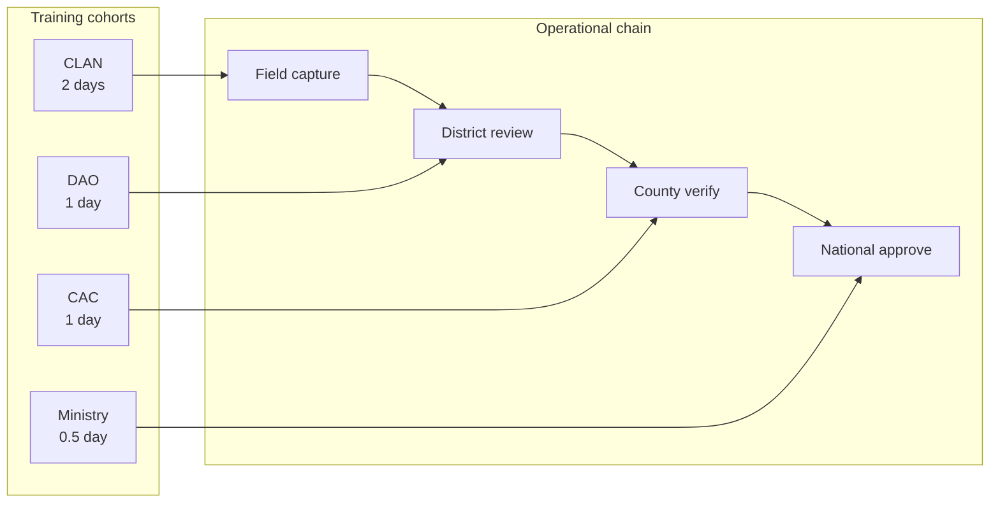

# AgriVault Training Program

**Classification:** Internal — Training coordinators, county CACs, programme managers  
**Version:** 0.1.0-rc1  
**Platform:** AgriVault (`agritrace`)  
**Audience:** Training coordinator, county trainers, CAC coordinators, DAO leads, Ministry programme staff

**Related:** [CHANGE_MANAGEMENT.md](./CHANGE_MANAGEMENT.md) · [SUPPORT_MODEL.md](./SUPPORT_MODEL.md) · [IMPLEMENTATION_PLAYBOOK.md](./IMPLEMENTATION_PLAYBOOK.md) · [../CLAN_FIELD_GUIDE.md](../CLAN_FIELD_GUIDE.md) · [../DAO_GUIDE.md](../DAO_GUIDE.md) · [../CAC_GUIDE.md](../CAC_GUIDE.md) · [../MINISTRY_GUIDE.md](../MINISTRY_GUIDE.md) · [../DEMO_SCRIPT.md](../DEMO_SCRIPT.md)

---

## Table of contents

1. [Purpose](#purpose)
2. [Training principles](#training-principles)
3. [Curriculum overview](#curriculum-overview)
4. [CLAN — 2-day programme](#clan--2-day-programme)
5. [DAO — 1-day programme](#dao--1-day-programme)
6. [CAC — 1-day programme](#cac--1-day-programme)
7. [Ministry — 0.5-day programme](#ministry--05-day-programme)
8. [Certification checklist](#certification-checklist)
9. [Train-the-trainer programme](#train-the-trainer-programme)
10. [Pilot training schedule](#pilot-training-schedule)
11. [Related documents](#related-documents)

---

## Purpose

This document defines the AgriVault training curriculum, certification requirements, and train-the-trainer model for pilot and national scale deployment. All pilot users must be certified before Week 1 live operations ([PILOT_SUCCESS_METRICS.md](./PILOT_SUCCESS_METRICS.md) KPI-07).

Training materials derive from role guides and the demo script. Engineering concepts reference [../WORKFLOW_ENGINE.md](../WORKFLOW_ENGINE.md) and [../OFFLINE_ARCHITECTURE.md](../OFFLINE_ARCHITECTURE.md) at appropriate depth per audience.

---

## Training principles

| Principle | Application |
|-----------|-------------|
| Role-specific | Each cohort trains only on routes and actions their role performs |
| Hands-on | ≥ 60% session time on live or demo environment |
| Offline-first for CLAN | Day 2 CLAN session includes airplane-mode exercise |
| LIVE vs DEMO disclosure | All cohorts learn Data Source badge interpretation |
| Certification gate | No production access without signed checklist |
| Local language | English primary; county dialect Q&A encouraged (Wave 2+: local language materials) |

Adoption strategy: [CHANGE_MANAGEMENT.md](./CHANGE_MANAGEMENT.md).

---

## Curriculum overview

| Role | Duration | Format | Max class size | Primary guide |
|------|----------|--------|----------------|---------------|
| CLAN (`clan_technician`, `field_agent`) | 2 days | Classroom + field walk | 12 | [../CLAN_FIELD_GUIDE.md](../CLAN_FIELD_GUIDE.md) |
| DAO (`dao_officer`, `district_officer`) | 1 day | Classroom + desk simulation | 16 | [../DAO_GUIDE.md](../DAO_GUIDE.md) |
| CAC (`county_agriculture_coordinator`) | 1 day | Classroom + county dashboard | 12 | [../CAC_GUIDE.md](../CAC_GUIDE.md) |
| Ministry (`ministry_officer`, `ministry_admin`) | 0.5 day | Briefing + command center | 20 | [../MINISTRY_GUIDE.md](../MINISTRY_GUIDE.md) |
| Pilot administrator | 1 day (add-on) | Admin provisioning | 4 | [../PILOT_ADMIN_GUIDE.md](../PILOT_ADMIN_GUIDE.md) |
| Trainers (TTT) | 1 day | Train-the-trainer | 8 | This document §9 |

---

## CLAN — 2-day programme

**Objective:** CLAN technicians can install PWA, capture offline, sync submissions, and register farmers with GPS boundaries.

### Day 1 — Classroom (8 hours)

| Module | Duration | Topics | Practical exercise |
|--------|----------|--------|-------------------|
| M1 — Platform overview | 45 min | CLAN→DAO→CAC→Ministry chain; LIVE/DEMO badges | Trace one submission on whiteboard |
| M2 — Login and PWA | 60 min | Login, install, home routes (`/field/mobile`, `/workspace/clan`) | Each trainee installs PWA on device |
| M3 — Farmer registration | 90 min | `/farmers`, required fields, validation | Register 2 demo farmers |
| M4 — Daily field report | 60 min | `/field/mobile`, activity types, photos | Submit 1 demo field report |
| M5 — GPS boundary | 90 min | `/field/boundary-capture`, accuracy threshold (10 m) | Walk boundary in training plot |
| M6 — Known limitations | 45 min | Landing page workaround; demo queue items | Bookmark correct routes |
| M7 — Day 1 assessment | 30 min | Written quiz (10 questions) | Pass ≥ 80% |

Reference: [../CLAN_FIELD_GUIDE.md](../CLAN_FIELD_GUIDE.md), [../GIS_ARCHITECTURE.md](../GIS_ARCHITECTURE.md), [../KNOWN_LIMITATIONS.md](../KNOWN_LIMITATIONS.md) § Auth, GIS.

### Day 2 — Field practicum (8 hours)

| Module | Duration | Topics | Practical exercise |
|--------|----------|--------|-------------------|
| M8 — Offline capture | 120 min | IndexedDB drafts; topbar Sync Status | Capture 3 items in airplane mode |
| M9 — Sync and retry | 90 min | Reconnect sync; `manual_review` awareness | Sync all pending; verify in DAO queue |
| M10 — Field scenarios | 120 min | Poor GPS; connectivity loss; farmer absent | Scenario rotation in pairs |
| M11 — Support paths | 30 min | Tier 0 guides; county helpdesk contact | [SUPPORT_MODEL.md](./SUPPORT_MODEL.md) |
| M12 — Certification | 60 min | Practical demonstration to trainer | Certification checklist §8 |

**Trainer notes:** Confirm Mapbox token active before M5. Confirm Edge Function deployed before M9 ([../OFFLINE_ARCHITECTURE.md](../OFFLINE_ARCHITECTURE.md)).

---

## DAO — 1-day programme

**Objective:** DAO officers can review, approve, reject, and return CLAN submissions within 24-hour SLA.

| Module | Duration | Topics | Practical exercise |
|--------|----------|--------|-------------------|
| M1 — Chain position | 30 min | DAO role; 24-hour SLA ([PILOT_SUCCESS_METRICS.md](./PILOT_SUCCESS_METRICS.md)) | — |
| M2 — District dashboard | 60 min | Queue navigation; filters; pending count | Locate assigned submissions |
| M3 — Review workflow | 90 min | Approve, reject, return for correction | Process 5 demo + 2 live items |
| M4 — LIVE vs demo queue | 45 min | UUID `submissionId`; VRF fixtures | Identify non-actionable demo rows |
| M5 — Data quality | 60 min | Registration flags; boundary review | Reject 1 incomplete submission |
| M6 — Manual review recovery | 30 min | Re-submit failed sync items | Clear 1 `manual_review` scenario |
| M7 — Certification | 45 min | Desk simulation | Certification checklist §8 |

Reference: [../DAO_GUIDE.md](../DAO_GUIDE.md), [../WORKFLOW_ENGINE.md](../WORKFLOW_ENGINE.md), [../KNOWN_LIMITATIONS.md](../KNOWN_LIMITATIONS.md) § Workflow.

---

## CAC — 1-day programme

**Objective:** CAC coordinators verify county-level submissions, manage county dashboard, and serve as Tier 1 helpdesk.

| Module | Duration | Topics | Practical exercise |
|--------|----------|--------|-------------------|
| M1 — County oversight | 30 min | CAC in approval chain; county scope | — |
| M2 — County dashboard | 60 min | KPI tiles; Data Source badges; trends | Interpret county metrics |
| M3 — Approval queues | 90 min | `CaoApprovalQueues`; county verify actions | Approve 3 live submissions |
| M4 — Demo item awareness | 30 min | Demo-only items do not persist | Skip non-UUID items |
| M5 — County helpdesk | 60 min | Tier 1 support; device clinic | [SUPPORT_MODEL.md](./SUPPORT_MODEL.md) |
| M6 — Paper fallback | 30 min | When and how; logging incidents | [CHANGE_MANAGEMENT.md](./CHANGE_MANAGEMENT.md) |
| M7 — Certification | 45 min | Queue + helpdesk simulation | Certification checklist §8 |

Reference: [../CAC_GUIDE.md](../CAC_GUIDE.md), [../operations/SOP_CAC.md](../operations/SOP_CAC.md).

---

## Ministry — 0.5-day programme

**Objective:** Ministry staff use command center, generate executive briefing, and understand national KPI reporting.

| Module | Duration | Topics | Practical exercise |
|--------|----------|--------|-------------------|
| M1 — National overview | 30 min | Platform vision; pilot scope | [../product/VISION.md](../product/VISION.md) |
| M2 — Command center | 60 min | National dashboard; county drill-down | Navigate 2 pilot counties |
| M3 — Executive briefing | 45 min | PDF generation; LIVE/DEMO disclaimer | Generate 1 briefing |
| M4 — Governance | 30 min | Steering Committee; KPI reporting | [PROJECT_GOVERNANCE.md](./PROJECT_GOVERNANCE.md) |
| M5 — Certification | 15 min | Briefing walkthrough | Certification checklist §8 |

Reference: [../MINISTRY_GUIDE.md](../MINISTRY_GUIDE.md), [../DEMO_SCRIPT.md](../DEMO_SCRIPT.md) Ministry segment.

---

## Certification checklist

Each user must complete the checklist below before production access. Trainer signs; CAC coordinator countersigns for county roles.

### CLAN certification

| # | Competency | Demonstrated | Trainer initial | Date |
|---|------------|--------------|-----------------|------|
| C1 | Installs PWA on assigned device | ☐ | | |
| C2 | Logs in and navigates to `/field/mobile` | ☐ | | |
| C3 | Registers farmer with required fields | ☐ | | |
| C4 | Captures GPS boundary with ≤ 10 m accuracy | ☐ | | |
| C5 | Submits daily field report | ☐ | | |
| C6 | Captures data offline (airplane mode) | ☐ | | |
| C7 | Syncs pending items on reconnect | ☐ | | |
| C8 | Identifies LIVE vs DEMO badge | ☐ | | |
| C9 | Knows county helpdesk contact | ☐ | | |
| C10 | Day 1 quiz ≥ 80% | ☐ | | |

### DAO certification

| # | Competency | Demonstrated | Trainer initial | Date |
|---|------------|--------------|-----------------|------|
| D1 | Navigates district dashboard queue | ☐ | | |
| D2 | Approves valid submission | ☐ | | |
| D3 | Returns submission for correction | ☐ | | |
| D4 | Rejects incomplete submission with reason | ☐ | | |
| D5 | Distinguishes LIVE vs demo queue items | ☐ | | |
| D6 | Handles `manual_review` re-submission | ☐ | | |
| D7 | Understands 24-hour review SLA | ☐ | | |

### CAC certification

| # | Competency | Demonstrated | Trainer initial | Date |
|---|------------|--------------|-----------------|------|
| A1 | Navigates county dashboard | ☐ | | |
| A2 | Completes county verification on live item | ☐ | | |
| A3 | Skips non-persistent demo items | ☐ | | |
| A4 | Provides Tier 1 helpdesk support | ☐ | | |
| A5 | Logs paper fallback incident | ☐ | | |

### Ministry certification

| # | Competency | Demonstrated | Trainer initial | Date |
|---|------------|--------------|-----------------|------|
| M1 | Navigates command center | ☐ | | |
| M2 | Generates executive briefing PDF | ☐ | | |
| M3 | Verbalises LIVE/DEMO disclaimer | ☐ | | |
| M4 | Knows KPI reporting cadence | ☐ | | |

**Roster maintenance:** Training coordinator maintains master certification roster. KPI-07 tracks 100% completion ([PILOT_SUCCESS_METRICS.md](./PILOT_SUCCESS_METRICS.md)).

---

## Train-the-trainer programme

**Objective:** Build county capacity to deliver CLAN and DAO training without vendor presence at Wave 2 scale.

### TTT eligibility

| Requirement | Detail |
|-------------|--------|
| Role | CAC coordinator or designated senior DAO |
| Prerequisite | Certified in own role + completed full CLAN or DAO programme as observer |
| Language | Fluent in county working language and English |
| Device | Own smartphone capable of running PWA |

### TTT curriculum (1 day)

| Module | Duration | Content |
|--------|----------|---------|
| T1 — Adult learning | 60 min | Facilitation; hands-on ratio; common mistakes |
| T2 — Demo environment | 60 min | Demo accounts; seed data; LIVE/DEMO disclosure script |
| T3 — CLAN co-delivery | 120 min | Co-teach Day 1 modules with master trainer |
| T4 — DAO co-delivery | 60 min | Co-teach DAO modules |
| T5 — Assessment | 60 min | Grade quiz; administer certification checklist |
| T6 — Materials kit | 30 min | Printed guides; troubleshooting card; escalation contacts |

### Trainer materials kit

| Item | Source |
|------|--------|
| Printed CLAN Field Guide | [../CLAN_FIELD_GUIDE.md](../CLAN_FIELD_GUIDE.md) |
| Printed DAO Guide | [../DAO_GUIDE.md](../DAO_GUIDE.md) |
| Demo script | [../DEMO_SCRIPT.md](../DEMO_SCRIPT.md) |
| Troubleshooting card | [SUPPORT_MODEL.md](./SUPPORT_MODEL.md) Tier 0 index |
| Certification forms | This document §8 |
| Known limitations summary | [../KNOWN_LIMITATIONS.md](../KNOWN_LIMITATIONS.md) one-pager |

**Quality assurance:** Master trainer observes first solo delivery per county trainer. Programme manager samples 1 session per county at Wave 2.

---

## Pilot training schedule

Aligned with [IMPLEMENTATION_PLAYBOOK.md](./IMPLEMENTATION_PLAYBOOK.md) Phase 1 (Week −2 to 0).

| Week | Activity | Participants | Owner |
|------|----------|--------------|-------|
| Week −3 | TTT master session | 2 county trainers + programme staff | Training coordinator |
| Week −2 | CLAN Day 1 + 2 | All pilot CLAN | County trainer |
| Week −2 | DAO 1-day | All pilot DAO | County trainer |
| Week −1 | CAC 1-day | All pilot CAC | Training coordinator |
| Week −1 | Ministry 0.5-day | Ministry pilot users | Programme manager |
| Week 0 | Refresher (optional) | Any uncertified users | County trainer |

**Environment:** Staging URL with demo accounts; production access only after certification.

---

## Related documents

[../CLAN_FIELD_GUIDE.md](../CLAN_FIELD_GUIDE.md) · [../DAO_GUIDE.md](../DAO_GUIDE.md) · [../CAC_GUIDE.md](../CAC_GUIDE.md) · [../MINISTRY_GUIDE.md](../MINISTRY_GUIDE.md) · [CHANGE_MANAGEMENT.md](./CHANGE_MANAGEMENT.md) · [PILOT_SUCCESS_METRICS.md](./PILOT_SUCCESS_METRICS.md) · [../operations/SOP_FIELD_OPERATIONS.md](../operations/SOP_FIELD_OPERATIONS.md)
