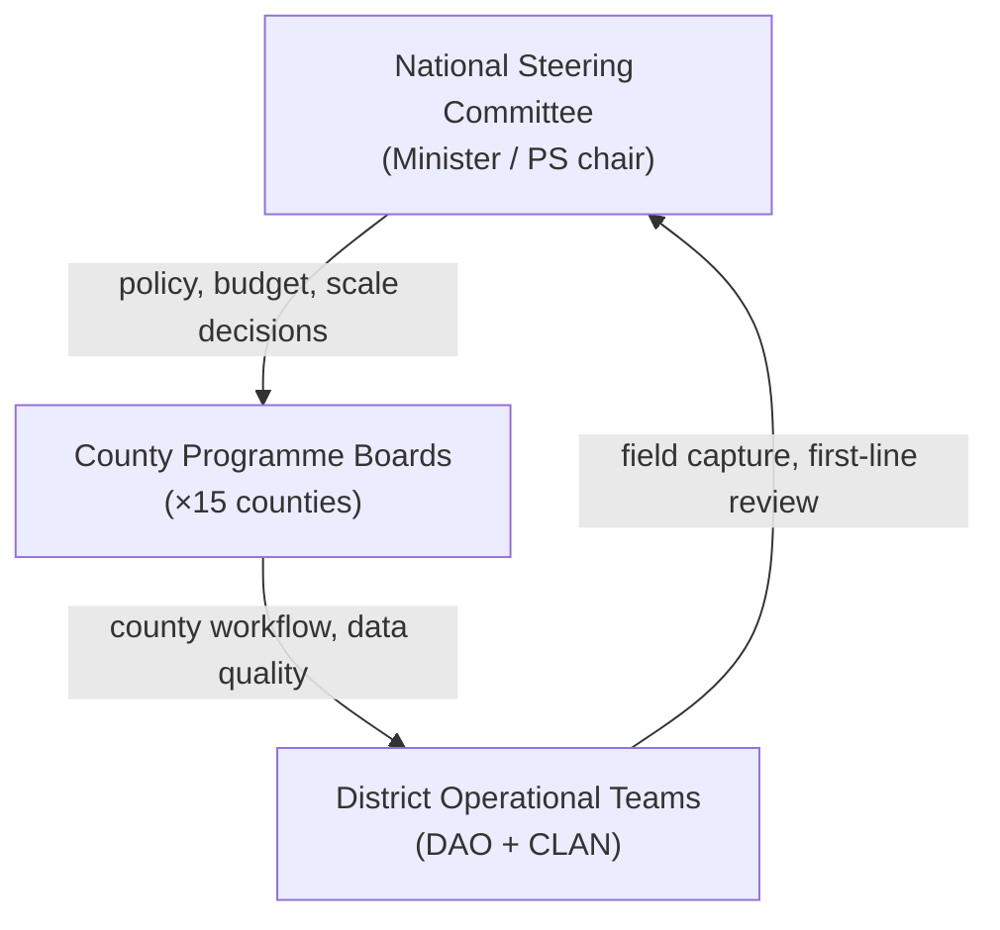

# Cabinet Memorandum — AgriVault National Agricultural Operations Platform

**Classification:** Cabinet-in-Confidence  
**Reference:** MOA/CAB/2026/AV-001  
**Date:** July 2026  
**From:** Honourable Minister of Agriculture  
**To:** Council of Ministers  
**Subject:** Approval to pilot and procure AgriVault — Ministry digital operations platform

**Related:** [MINISTER_BRIEFING.md](./MINISTER_BRIEFING.md) · [../product/VISION.md](../product/VISION.md) · [../business/IMPLEMENTATION_PLAYBOOK.md](../business/IMPLEMENTATION_PLAYBOOK.md)

---

## Table of contents

1. [Background](#background)
2. [Proposal](#proposal)
3. [Financial implications](#financial-implications)
4. [Implementation plan](#implementation-plan)
5. [Legal and compliance considerations](#legal-and-compliance-considerations)
6. [Recommendation](#recommendation)
7. [Annexes](#annexes)

---

## Background

### National context

The Government of Liberia has committed to digital transformation of public service delivery. Agricultural programmes — rice intensification, cocoa rehabilitation, input distribution, and pest surveillance — require accurate farmer registries, GPS-verified farm boundaries, and auditable approval chains. Current practice relies on paper registers, informal communication, and manually assembled reports. This limits programme effectiveness, donor accountability, and readiness for export compliance frameworks including the EU Deforestation Regulation (EUDR).

### Current state

| Area | Status |
|------|--------|
| Farmer registration | County-level paper registers; no national digital registry |
| Farm boundaries | Limited GPS capture; no verified geospatial database |
| Approval workflow | Physical signatures and phone-based coordination |
| Cabinet reporting | Manual aggregation from county submissions |
| Donor reporting | Disconnected from field operational data |
| Offline operations | No standard digital tool for field staff without connectivity |

### AgriVault development status

The Ministry, with technical partners, has developed AgriVault (`agritrace`) Release Candidate 1 (0.1.0-rc1). RC1 delivers:

- End-to-end CLAN → DAO → CAC → Ministry approval workflow (11 submission types)
- Offline-first progressive web application for field capture
- GPS boundary capture via Mapbox integration
- National command center and executive briefing PDF export
- Role-based access control across 18 operational roles
- Production HTTP security hardening (CSP, rate limiting, audit logging)

RC1 is approved for **controlled Ministry pilot deployment**. National scale requires post-pilot hardening documented in the programme roadmap.

Vision and strategic outcomes: [../product/VISION.md](../product/VISION.md).

---

## Proposal

### Objective

Establish AgriVault as the Ministry of Agriculture's system of record for field operations — beginning with a two-county pilot in Q3 2026, followed by hardening (Q4 2026) and phased national rollout (Q1 2027 onward).

### Scope of pilot

| Element | Detail |
|---------|--------|
| Platform | AgriVault RC1 (SaaS-hosted Next.js application, Supabase database) |
| Pilot counties | Bong and Lofa *(subject to Ministry confirmation)* |
| Duration | Four weeks live operations + four weeks evaluation |
| Users | CLAN technicians, DAO officers, CAC coordinators, Ministry officers |
| Programmes | Rice and cocoa modules; farmer registration; boundary capture |
| Donor visibility | Read-only `donor_observer` accounts per [DONOR_GUIDE.md](./DONOR_GUIDE.md) |

### Governance structure

Three-tier governance as defined in [NATIONAL_GOVERNANCE_MODEL.md](./NATIONAL_GOVERNANCE_MODEL.md):

### Out of scope (pilot phase)

- Payment processing and financial systems integration
- Citizen self-service registration without CLAN verification
- Full EUDR export chain automation (partial capability in RC1)
- Multi-ministry platform expansion
- Unrestricted public production deployment

Platform scope boundary: [../business/PLATFORM_OVERVIEW.md](../business/PLATFORM_OVERVIEW.md).

---

## Financial implications

### Framework cost categories

Cabinet is requested to note the following **framework cost categories**. Detailed estimates will be submitted through PPCC procurement processes. Figures below are indicative planning ranges for Cabinet awareness; final amounts subject to competitive procurement.

| Category | Description | Indicative annual range (USD) | Funding source |
|----------|-------------|-------------------------------|----------------|
| SaaS hosting | Vercel application hosting (production + staging) | 2,400 – 6,000 | Ministry IT budget / donor |
| Database platform | Supabase PostgreSQL, Auth, Edge Functions | 3,600 – 12,000 | Ministry IT budget / donor |
| Maps API | Mapbox GL tokens and usage | 1,200 – 4,800 | Ministry IT budget |
| Implementation services | Deployment, configuration, integration | 40,000 – 80,000 (Year 1) | Donor / capital budget |
| Training | Role-based curriculum, county workshops | 15,000 – 30,000 (Year 1) | Programme budget |
| Support and maintenance | Tiered support, security patches | 24,000 – 48,000 (annual) | Recurrent budget |

### Multi-year projection (framework)

| Phase | Period | Primary expenditure |
|-------|--------|---------------------|
| Pilot | Q3 2026 | Hosting setup, implementation (pilot scope), training |
| Hardening | Q4 2026 | Security remediation, performance, process refinement |
| Scale Wave 1–2 | Q1–Q2 2027 | County onboarding, device procurement, expanded licensing |
| Scale Wave 3–4 | Q3 2027 onward | National coverage, BAU support contract |

Procurement detail and evaluation matrix: [PROCUREMENT_PACKAGE.md](./PROCUREMENT_PACKAGE.md).  
Business procurement guide: [../business/PROCUREMENT_GUIDE.md](../business/PROCUREMENT_GUIDE.md).

### Budgetary authority requested

Cabinet is requested to:

1. Authorise the Ministry to proceed with PPCC-compliant procurement for the categories above within approved programme and donor funding envelopes.
2. Note that donor co-financing may offset Year 1 implementation and training costs, subject to bilateral agreements.
3. Direct the Ministry of Finance and Development Planning to align AgriVault recurrent hosting costs with the Ministry IT budget line from FY 2027/28.

---

## Implementation plan

### Timeline summary

| Quarter | Phase | Key deliverables |
|---------|-------|------------------|
| Q3 2026 | Pilot | Bong + Lofa go-live; 4-week operations; evaluation |
| Q4 2026 | Hardening | Security fixes; production readiness ≥ 85/100; process refinement |
| Q1 2027 | Scale Wave 1 | 3–5 additional counties; operating model BAU |
| Q2 2027 | Scale Wave 2 | 5–8 counties; donor reporting standardised |
| Q3 2027+ | Scale Waves 3–4 | Remaining counties per readiness criteria |

Full Gantt-style timeline: [IMPLEMENTATION_TIMELINE.md](./IMPLEMENTATION_TIMELINE.md).  
County rollout: [COUNTY_ROLLOUT_PLAN.md](./COUNTY_ROLLOUT_PLAN.md).  
Implementation methodology: [../business/IMPLEMENTATION_PLAYBOOK.md](../business/IMPLEMENTATION_PLAYBOOK.md).

### Decision gates

| Gate | Criteria | Approving body |
|------|----------|----------------|
| G1 | Infrastructure, roster, training ready | Steering Committee |
| G2 | Pilot evaluation pass (≥70% weighted score) | Steering Committee + Minister |
| G3 | Production readiness ≥ 85/100 | Ministry IT + Steering Committee |
| G4 | Scale wave county readiness confirmed | Steering Committee |

Evaluation framework: [PILOT_EVALUATION_FRAMEWORK.md](./PILOT_EVALUATION_FRAMEWORK.md).

### Key dependencies

| Dependency | Owner | Status |
|------------|-------|--------|
| Supabase and Vercel provisioning | Ministry IT | In progress |
| County user roster (CLAN, DAO, CAC) | County CACs | Pending confirmation |
| Device inventory (tablets/phones) | County administration | Pending |
| Data steward appointments | Programme lead | Pending |
| Donor data-sharing MOUs | Programme office | Draft |

---

## Legal and compliance considerations

| Area | Approach | Reference |
|------|----------|-----------|
| Data protection | Classification-based access; RLS; farmer PII restricted | [DATA_SHARING_FRAMEWORK.md](./DATA_SHARING_FRAMEWORK.md) |
| Audit requirements | Workflow action log; audit tools for compliance officers | [LEGAL_AND_COMPLIANCE.md](./LEGAL_AND_COMPLIANCE.md) |
| EUDR reporting | Partial DDS export in RC1; full chain post-pilot | [LEGAL_AND_COMPLIANCE.md](./LEGAL_AND_COMPLIANCE.md) § EUDR |
| Terms of use | Ministry-issued user terms for all platform accounts | [LEGAL_AND_COMPLIANCE.md](./LEGAL_AND_COMPLIANCE.md) § Terms |
| Open source | Third-party licence compliance documented | [LEGAL_AND_COMPLIANCE.md](./LEGAL_AND_COMPLIANCE.md) § Open source |

---

## Recommendation

The Honourable Minister of Agriculture recommends that Cabinet:

1. **Approve** the pilot deployment of AgriVault RC1 in Bong and Lofa counties during Q3 2026.
2. **Authorise** the Ministry to proceed with PPCC-compliant procurement for hosting, database, maps API, implementation services, training, and support as set out in [PROCUREMENT_PACKAGE.md](./PROCUREMENT_PACKAGE.md).
3. **Endorse** the three-tier national governance model in [NATIONAL_GOVERNANCE_MODEL.md](./NATIONAL_GOVERNANCE_MODEL.md).
4. **Note** the financial framework in Section 3 and direct alignment with Ministry and donor budget envelopes.
5. **Direct** the Ministry Programme Office to report pilot evaluation outcomes to Cabinet via the Steering Committee at the conclusion of Q3 2026.

---

## Annexes

| Annex | Document |
|-------|----------|
| A | [MINISTER_BRIEFING.md](./MINISTER_BRIEFING.md) |
| B | [PROCUREMENT_PACKAGE.md](./PROCUREMENT_PACKAGE.md) |
| C | [COUNTY_ROLLOUT_PLAN.md](./COUNTY_ROLLOUT_PLAN.md) |
| D | [PILOT_EVALUATION_FRAMEWORK.md](./PILOT_EVALUATION_FRAMEWORK.md) |
| E | [DATA_SHARING_FRAMEWORK.md](./DATA_SHARING_FRAMEWORK.md) |
| F | [LEGAL_AND_COMPLIANCE.md](./LEGAL_AND_COMPLIANCE.md) |
| G | [../product/VISION.md](../product/VISION.md) |
| H | [../business/PLATFORM_OVERVIEW.md](../business/PLATFORM_OVERVIEW.md) |

---

*Submitted for the consideration of the Council of Ministers · Ministry of Agriculture, Republic of Liberia · July 2026*
