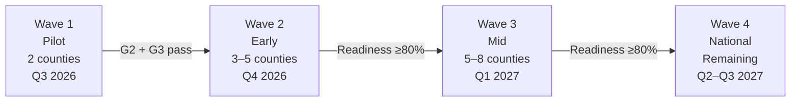
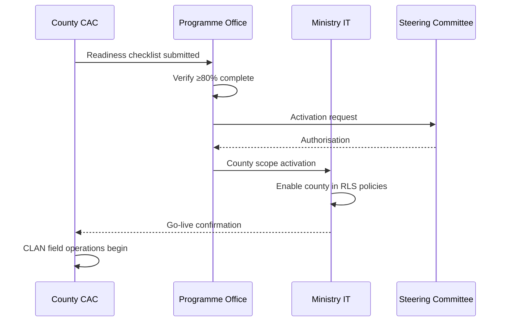

# AgriVault County Rollout Plan

**Classification:** Internal — County deployment  
**Platform:** AgriVault (`agritrace`) · Release Candidate 1 (0.1.0-rc1)  
**Date:** July 2026  
**Audience:** County deployment leads, CAC coordinators, Steering Committee, Permanent Secretary

**Related:** [IMPLEMENTATION_TIMELINE.md](./IMPLEMENTATION_TIMELINE.md) · [../business/NATIONAL_SCALE_GUIDE.md](../business/NATIONAL_SCALE_GUIDE.md) · [../business/MINISTRY_IMPLEMENTATION_GUIDE.md](../business/MINISTRY_IMPLEMENTATION_GUIDE.md) · [../product/VISION.md](../product/VISION.md)

---

## Table of contents

1. [Purpose](#purpose)
2. [Rollout strategy](#rollout-strategy)
3. [Wave 1 — Pilot counties](#wave-1--pilot-counties)
4. [Wave 2 — Early expansion](#wave-2--early-expansion)
5. [Wave 3 — Mid expansion](#wave-3--mid-expansion)
6. [Wave 4 — National coverage](#wave-4--national-coverage)
7. [County readiness checklist](#county-readiness-checklist)
8. [County activation procedure](#county-activation-procedure)
9. [Rollback and suspension](#rollback-and-suspension)
10. [Reporting and oversight](#reporting-and-oversight)

---

## Purpose

This plan defines the phased county rollout of AgriVault from the Wave 1 pilot through national coverage across Liberia's 15 counties. Each wave has explicit selection criteria, readiness requirements, and activation procedures. No county may go live until it passes the readiness checklist and receives Steering Committee authorisation.

---

## Rollout strategy

AgriVault deploys in four waves over 12–18 months. Each wave builds operational capacity before the next expansion.

| Wave | Target counties | Timing | Prerequisite |
|------|-----------------|--------|--------------|
| 1 | 2 (pilot) | Q3 2026 | G1 — Prepare complete |
| 2 | 3–5 | Q4 2026 | G2 + G3 — Pilot pass + hardening |
| 3 | 5–8 | Q1 2027 | Wave 2 operational ≥4 weeks |
| 4 | Remaining | Q2–Q3 2027 | Wave 3 operational ≥4 weeks |

---

## Wave 1 — Pilot counties

### Designated pilot counties *(Ministry to confirm)*

| County | Rationale (provisional) | Districts in scope | CAC lead |
|--------|-------------------------|-------------------|----------|
| **Bong** | Central location; mixed rice/cocoa; existing programme presence | TBD by CAC | TBD |
| **Lofa** | Northern belt; rice intensification focus; connectivity challenge tests offline | TBD by CAC | TBD |

> **Action required:** The Steering Committee must confirm final pilot county selection via written memo before Gate G1. Placeholder counties above reflect programme office recommendation pending Minister approval.

### Wave 1 objectives

| Objective | Success indicator |
|-----------|-------------------|
| Validate CLAN → DAO → CAC → Ministry chain | ≥100 submissions through full approval |
| Test offline capture in low-connectivity areas | ≥90% sync success rate |
| Establish county data steward function | Steward appointed and active |
| Train all four role groups | 100% roster trained |
| Produce pilot evaluation data | Evaluation report complete |

Pilot checklist: [../PILOT_CHECKLIST.md](../PILOT_CHECKLIST.md).

### Wave 1 user roster (minimum)

| Role | Bong (min.) | Lofa (min.) |
|------|-------------|-------------|
| CLAN technician | 4 | 4 |
| DAO officer | 2 | 2 |
| CAC coordinator | 1 | 1 |
| County officer | 1 | 1 |
| Ministry liaison | 1 (shared) | 1 (shared) |

---

## Wave 2 — Early expansion

### Selection criteria

Counties nominated for Wave 2 must meet **all** mandatory criteria and **≥3 of 5** preferred criteria.

**Mandatory criteria (all required):**

| # | Criterion | Verification |
|---|-----------|--------------|
| M1 | Active CAC coordinator appointed | HR record |
| M2 | ≥2 DAO officers identified and available | Roster signed by CAC |
| M3 | ≥4 CLAN technicians with suitable devices | Device inventory |
| M4 | County data steward designated | [DATA_SHARING_FRAMEWORK.md](./DATA_SHARING_FRAMEWORK.md) roster |
| M5 | Steering Committee written nomination | Nomination memo |

**Preferred criteria (≥3 of 5):**

| # | Criterion | Weight |
|---|-----------|--------|
| P1 | Existing donor programme alignment (rice, cocoa) | High |
| P2 | Prior digital pilot experience | Medium |
| P3 | Road access for training delivery | Medium |
| P4 | Warehouse or input distribution node | Medium |
| P5 | Connectivity infrastructure (cell coverage ≥60% of districts) | High |

### Indicative Wave 2 counties *(subject to criteria assessment)*

| County | Programme alignment | Notes |
|--------|---------------------|-------|
| Nimba | Rice, cocoa | Large farmer population |
| Grand Bassa | Rice | Coastal logistics |
| Margibi | Rice | Proximity to Monrovia support |
| Bomi | Cocoa | EUDR readiness priority |
| Grand Gedeh | Rice | Eastern corridor |

Final Wave 2 selection: Steering Committee decision after G3 (November 2026).

---

## Wave 3 — Mid expansion

### Selection criteria

Wave 3 counties must pass the [County readiness checklist](#county-readiness-checklist) at ≥80% and demonstrate:

| Criterion | Threshold |
|-----------|-----------|
| Wave 2 neighbouring county operational | At least one adjacent county live ≥4 weeks |
| Training capacity | CAC can host district-level training |
| Support escalation path | Tier 1 county support contact designated |
| Data quality baseline | Zero open P1 data quality issues in adjacent wave |

### Indicative Wave 3 scope

5–8 counties from remaining pool: Cape Mount, Gbarpolu, Grand Cape Mount, Grand Kru, Maryland, Montserrado (districts outside Monrovia), River Cess, River Gee, Sinoe.

Montserrado deployment is scoped to **district agricultural offices only** — not Monrovia urban administrative functions.

---

## Wave 4 — National coverage

### Objective

Complete coverage of all 15 counties by Q3 2027.

### Wave 4 criteria

| Criterion | Detail |
|-----------|--------|
| All prior waves stable | No county suspended in prior 8 weeks |
| National support model active | [../business/SUPPORT_MODEL.md](../business/SUPPORT_MODEL.md) Tier 2 operational |
| Production readiness maintained | ≥85/100 on quarterly assessment |
| BAU operating model signed | [../business/OPERATING_MODEL.md](../business/OPERATING_MODEL.md) transition complete |

---

## County readiness checklist

Each county must complete this checklist before activation. Minimum pass threshold: **≥80% of items checked**.

### Governance and leadership

| # | Item | Owner | ☐ |
|---|------|-------|---|
| G-01 | CAC coordinator appointed and briefed | County administration | |
| G-02 | County programme board constituted | CAC | |
| G-03 | District operational teams identified (all districts) | DAO lead | |
| G-04 | County data steward designated | CAC | |
| G-05 | Steering Committee activation authorisation received | Programme office | |

### Personnel and roster

| # | Item | Owner | ☐ |
|---|------|-------|---|
| P-01 | CLAN technician roster complete (≥4 per county) | CAC | |
| P-02 | DAO officer roster complete (≥2 per county) | CAC | |
| P-03 | All users have valid Ministry email addresses | Ministry IT | |
| P-04 | Supabase Auth accounts created | Ministry IT | |
| P-05 | Profile rows match role assignments | Ministry IT | |
| P-06 | Role landing paths verified for each user | Ministry IT | |

### Training and change management

| # | Item | Owner | ☐ |
|---|------|-------|---|
| T-01 | CLAN field training completed | Training coordinator | |
| T-02 | DAO review training completed | Training coordinator | |
| T-03 | CAC verification training completed | Training coordinator | |
| T-04 | SOPs distributed in local language (where applicable) | CAC | |
| T-05 | Change management briefing delivered | Programme lead | |

Reference: [../business/CHANGE_MANAGEMENT.md](../business/CHANGE_MANAGEMENT.md) · [../business/TRAINING_PROGRAM.md](../business/TRAINING_PROGRAM.md).

### Infrastructure and devices

| # | Item | Owner | ☐ |
|---|------|-------|---|
| I-01 | Field devices procured (tablet or smartphone) | County admin | |
| I-02 | Devices meet minimum spec (Android 10+, 3GB RAM) | Ministry IT | |
| I-03 | Mobile data or Wi-Fi available at DAO office | County admin | |
| I-04 | Offline smoke test passed on ≥2 devices | CLAN lead | |
| I-05 | Mapbox token validated on field devices | Ministry IT | |

### Data and compliance

| # | Item | Owner | ☐ |
|---|------|-------|---|
| D-01 | County scope configured in platform | Ministry IT | |
| D-02 | Data steward acknowledged governance policy | Data steward | |
| D-03 | Terms of use signed by all users | CAC | |
| D-04 | Pilot fixture data cleared (non-pilot counties) | Ministry IT | |
| D-05 | Baseline farmer count established (pre-registration) | CAC | |

Reference: [DATA_SHARING_FRAMEWORK.md](./DATA_SHARING_FRAMEWORK.md) · [../business/DATA_GOVERNANCE.md](../business/DATA_GOVERNANCE.md).

---

## County activation procedure

| Step | Action | Owner | SLA |
|------|--------|-------|-----|
| 1 | Submit completed readiness checklist | CAC | — |
| 2 | Programme office verification | Programme office | 5 business days |
| 3 | Steering Committee authorisation (Waves 2–4) | Steering Committee | 10 business days |
| 4 | County scope activation in platform | Ministry IT | 2 business days |
| 5 | Go-live notification to county users | CAC | Same day |
| 6 | First-week support monitoring | Vendor + Ministry IT | 5 business days |

---

## Rollback and suspension

A county may be suspended if:

| Trigger | Action |
|---------|--------|
| P1 security incident | Immediate suspension; Ministry IT |
| Data integrity breach | Suspension pending steward investigation |
| <50% CLAN adoption after 4 weeks | Remedial training; extension before suspension |
| Repeated workflow bypass attempts | Account suspension; audit review |

Suspension procedure: [../business/BUSINESS_CONTINUITY_PLAN.md](../business/BUSINESS_CONTINUITY_PLAN.md).

---

## Reporting and oversight

| Report | Frequency | Owner |
|--------|-----------|-------|
| County activation status | Weekly (during rollout) | Programme office |
| Readiness checklist completion | Per county | CAC |
| Wave progress dashboard | Monthly | Programme lead |
| Scale authorisation memo | Per gate | Steering Committee |

Governance model: [NATIONAL_GOVERNANCE_MODEL.md](./NATIONAL_GOVERNANCE_MODEL.md).

---

*AgriVault — Ministry of Agriculture, Republic of Liberia · RC1 · July 2026*
