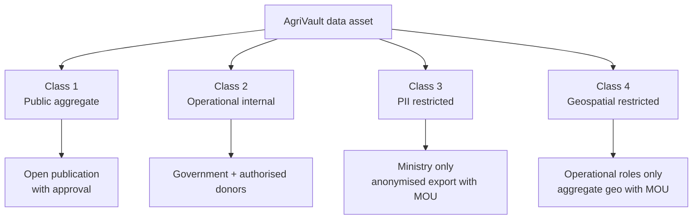
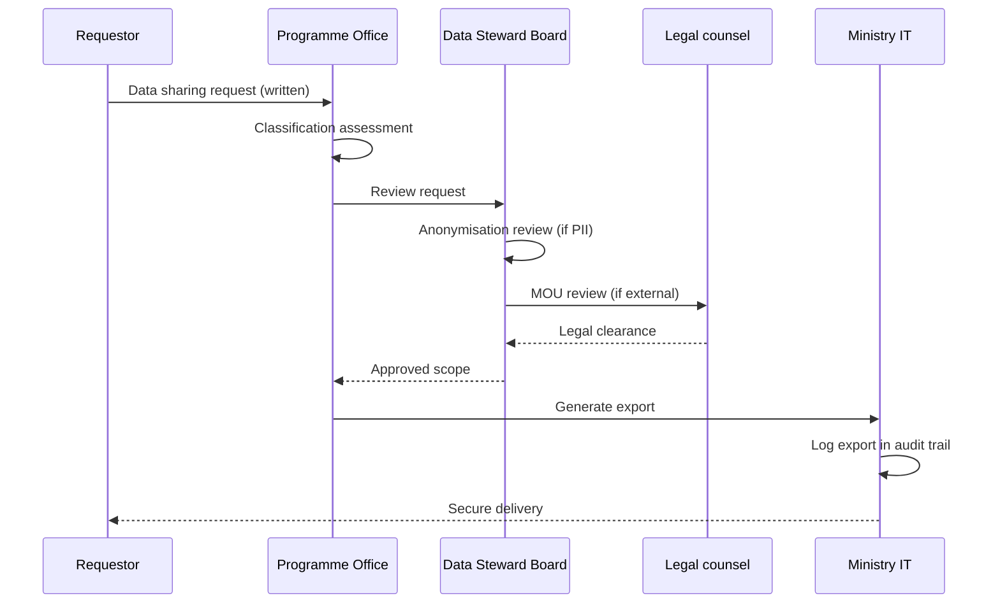

# AgriVault Data Sharing Framework

**Classification:** Internal — Data sharing agreements  
**Platform:** AgriVault (`agritrace`) · Release Candidate 1 (0.1.0-rc1)  
**Date:** July 2026  
**Audience:** Data Steward Board, legal counsel, donor agencies, county data stewards, Ministry IT

**Related:** [DONOR_GUIDE.md](./DONOR_GUIDE.md) · [../business/DATA_GOVERNANCE.md](../business/DATA_GOVERNANCE.md) · [LEGAL_AND_COMPLIANCE.md](./LEGAL_AND_COMPLIANCE.md) · [../product/VISION.md](../product/VISION.md) · [../SECURITY.md](../SECURITY.md)

---

## Table of contents

1. [Purpose](#purpose)
2. [Framework principles](#framework-principles)
3. [Data classification](#data-classification)
4. [Access by classification](#access-by-classification)
5. [Role-based access summary](#role-based-access-summary)
6. [Donor access agreements](#donor-access-agreements)
7. [Farmer data protection](#farmer-data-protection)
8. [Export and sharing procedures](#export-and-sharing-procedures)
9. [Cross-border and third-party sharing](#cross-border-and-third-party-sharing)
10. [Governance and review](#governance-and-review)

---

## Purpose

This framework establishes the Ministry of Agriculture's policy for classifying, accessing, and sharing AgriVault operational data. It protects farmer personally identifiable information (PII), enables legitimate donor programme transparency, and ensures all sharing occurs under written agreement with audit trail.

Engineering implementation: [../business/DATA_GOVERNANCE.md](../business/DATA_GOVERNANCE.md) · [../DATABASE.md](../DATABASE.md) § Row Level Security.

---

## Framework principles

| Principle | Statement |
|-----------|-----------|
| Ministry ownership | All operational data is property of the Republic of Liberia |
| Purpose limitation | Data shared only for stated programme purpose |
| Minimum necessary | Share the least data required for the stated purpose |
| Classification first | No sharing without classification review |
| No silent disclosure | All exports logged; provenance badges on shared aggregates |
| Farmer dignity | PII treated as restricted unless anonymised |
| Revocation | Ministry may revoke access on policy or security grounds |

Product principle alignment: [../product/PRODUCT_PRINCIPLES.md](../product/PRODUCT_PRINCIPLES.md) Principles 5, 6, 8, 9.

---

## Data classification

AgriVault data is classified into four tiers:

### Class 1 — Public aggregate

| Attribute | Detail |
|-----------|--------|
| Definition | Non-identifiable statistical summaries suitable for public release |
| Examples | County farmer registration totals; national programme KPIs; approval funnel counts |
| PII content | None — must be aggregated to prevent re-identification |
| Publication | Ministry communications approval |
| Retention | Indefinite (public record) |

### Class 2 — Operational internal

| Attribute | Detail |
|-----------|--------|
| Definition | Programme operational data visible to government roles and authorised donors |
| Examples | Submission status by county; workflow stage counts; programme module metrics |
| PII content | None at individual record level in default donor view |
| Access | Government operational roles; `donor_observer` (read-only) |
| Retention | Per [../business/DATA_GOVERNANCE.md](../business/DATA_GOVERNANCE.md) retention schedule |

### Class 3 — PII restricted

| Attribute | Detail |
|-----------|--------|
| Definition | Data identifying individual farmers or field staff |
| Examples | Farmer name, phone, national ID, photo; CLAN contact details |
| PII content | Direct identifiers |
| Access | Ministry operational roles with county scope; **not** available to donors via platform |
| Retention | Active programme + 7 years; then anonymise or archive |
| Export | Requires MOU, anonymisation review, and Data Steward Board approval |

### Class 4 — Geospatial restricted

| Attribute | Detail |
|-----------|--------|
| Definition | Precise location data enabling farm or household identification |
| Examples | GPS boundary GeoJSON; plot coordinates; field visitOrders |
| PII content | Quasi-identifier (location) |
| Access | CLAN, DAO, CAC, Ministry GIS roles only |
| Donor access | Aggregate hectare counts only; no raw coordinates without MOU |
| EUDR context | Compliance indicators exportable; raw polygons require bilateral agreement |

---

## Access by classification

| Class | Public | Government ops | Donor observer | Auditor | External (MOU) |
|-------|--------|----------------|----------------|---------|----------------|
| 1 — Public aggregate | ✅ | ✅ | ✅ | ✅ | ✅ |
| 2 — Operational internal | ❌ | ✅ | 👁 Read-only | 👁 | 🔶 Scoped |
| 3 — PII restricted | ❌ | 🔶 County-scoped | ❌ | 👁 Audit only | 🔶 Anonymised only |
| 4 — Geospatial restricted | ❌ | 🔶 Role-scoped | ❌ | ❌ | 🔶 Aggregate only |

---

## Role-based access summary

| Role | Class 1 | Class 2 | Class 3 | Class 4 |
|------|---------|---------|---------|---------|
| `clan_technician` | ✅ | 🔶 Own submissions | 🔶 Own county farmers | 🔶 Capture only |
| `dao_officer` | ✅ | ✅ County scope | ✅ County scope | ✅ County scope |
| `county_agriculture_coordinator` | ✅ | ✅ County scope | ✅ County scope | ✅ County scope |
| `ministry_officer` | ✅ | ✅ National | ✅ National | ✅ National |
| `donor_observer` | ✅ | 👁 Dashboard | ❌ | ❌ |
| `auditor` | ✅ | 👁 | 👁 Audit trail | ❌ |
| `super_admin` | ✅ | ✅ | ✅ | ✅ |

Full permissions matrix: [../product/PERMISSIONS_MATRIX.md](../product/PERMISSIONS_MATRIX.md).

---

## Donor access agreements

### Default donor access (no MOU beyond programme participation)

- Donor dashboard (`/donor-dashboard`) — Class 1 and Class 2 aggregates
- Read-only workflow visibility — submission counts and stages (no PII)
- Monthly programme summary PDF — Class 1

### Extended donor access (requires MOU)

| Data element | Class | MOU requirement |
|--------------|-------|-----------------|
| Anonymised farmer registration extract | 3 (anonymised) | Bilateral MOU + DSB approval |
| Rice production records (anonymised) | 2/3 | Programme-specific MOU |
| Cocoa EUDR compliance indicators | 2/4 (aggregate) | EUDR programme MOU |
| Quarterly audit sample | 2 | Audit cooperation MOU |

### MOU minimum clauses

| Clause | Content |
|--------|---------|
| Purpose | Specific programme monitoring or evaluation |
| Data schedule | Attached classification table |
| Access method | Platform account and/or secure export |
| Personnel | Named individuals; no credential sharing |
| Retention | Maximum period; destruction certificate |
| Re-identification | Prohibited |
| Sub-sharing | Prohibited without written Ministry consent |
| Audit | Ministry right to audit donor data handling |
| Termination | 30-day access revocation; data return/destruction |
| Governing law | Republic of Liberia |

Legal template guidance: [LEGAL_AND_COMPLIANCE.md](./LEGAL_AND_COMPLIANCE.md) § Donor access agreements.

---

## Farmer data protection

### Collection principles

| Principle | Implementation |
|-----------|----------------|
| Informed purpose | Farmers informed that data supports government programmes |
| CLAN verification | No self-registration without field verification |
| Minimum collection | Only fields required for programme delivery |
| Accuracy | DAO/CAC review chain validates submissions |
| Correction rights | Farmers may request corrections via CLAN or DAO |

### Technical protections

| Control | Detail |
|---------|--------|
| Row Level Security | County-scoped farmer records in PostgreSQL |
| Middleware gates | Route-level role enforcement |
| No public API | Farmer PII not exposed via public endpoints |
| Audit logging | All profile access logged |
| Encryption in transit | HTTPS/TLS 1.2+ |
| Encryption at rest | Supabase platform default |

Security reference: [../SECURITY.md](../SECURITY.md).

### Prohibited uses

Farmer data collected through AgriVault must **not** be used for:

- Commercial sale or licensing to third parties
- Political campaigning or voter identification
- Credit scoring or insurance underwriting (without separate legal basis)
- Law enforcement purposes (without judicial process)
- Donor marketing or publicity identifying individual farmers (without consent)

---

## Export and sharing procedures

| Step | Owner | SLA |
|------|-------|-----|
| Request submission | Requestor | — |
| Classification assessment | Programme office | 3 business days |
| Data Steward Board review | DSB | 5 business days |
| Legal review (if external) | Legal counsel | 5 business days |
| Export generation | Ministry IT | 2 business days |
| Delivery and acknowledgement | Programme office | 1 business day |

---

## Cross-border and third-party sharing

| Scenario | Policy |
|----------|--------|
| Donor headquarters (outside Liberia) | Permitted under MOU with data localisation acknowledgment |
| Cloud infrastructure (Supabase, Vercel) | Processor agreement; Africa-preferred region where available |
| Research institutions | MOU + ethics review + anonymisation |
| International compliance (EUDR) | Aggregate compliance indicators only; raw geo under bilateral agreement |
| Sub-contractors | Ministry approval required; same classification obligations |

---

## Governance and review

| Activity | Body | Frequency |
|----------|------|-----------|
| Classification policy review | Data Steward Board | Annual |
| Donor access audit | Ministry auditor | Semi-annual |
| MOU compliance check | Programme office | Per MOU anniversary |
| Farmer complaint review | County board → Ministry | As received |
| Framework amendment | Steering Committee | As needed |

Data Steward Board composition: [../business/DATA_GOVERNANCE.md](../business/DATA_GOVERNANCE.md) § Governance structure.

National governance: [NATIONAL_GOVERNANCE_MODEL.md](./NATIONAL_GOVERNANCE_MODEL.md).

---

*AgriVault — Ministry of Agriculture, Republic of Liberia · RC1 · July 2026*
