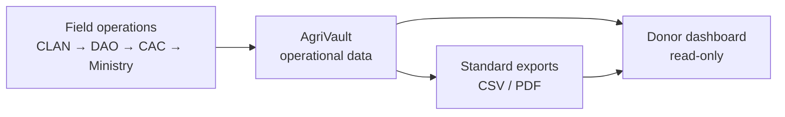
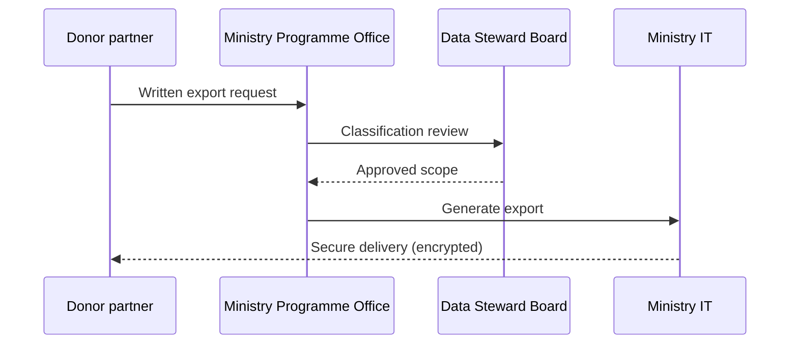

# AgriVault Donor and Development Partner Guide

**Classification:** Partner — Restricted operational visibility  
**Platform:** AgriVault (`agritrace`) · Release Candidate 1 (0.1.0-rc1)  
**Date:** July 2026  
**Audience:** Bilateral and multilateral donor agencies, development partners, programme funders

**Related:** [DATA_SHARING_FRAMEWORK.md](./DATA_SHARING_FRAMEWORK.md) · [../product/VISION.md](../product/VISION.md) · [../product/PERMISSIONS_MATRIX.md](../product/PERMISSIONS_MATRIX.md) · [../business/DATA_GOVERNANCE.md](../business/DATA_GOVERNANCE.md)

---

## Table of contents

1. [Purpose](#purpose)
2. [Programme alignment](#programme-alignment)
3. [Donor access model](#donor-access-model)
4. [What donors can see](#what-donors-can-see)
5. [What donors cannot do](#what-donors-cannot-do)
6. [Reporting exports](#reporting-exports)
7. [Data sharing boundaries](#data-sharing-boundaries)
8. [Account provisioning](#account-provisioning)
9. [Reporting cadence](#reporting-cadence)
10. [Contacts and escalation](#contacts-and-escalation)

---

## Purpose

This guide defines how development partners may observe AgriVault programme operations under Ministry authority. AgriVault is the Ministry of Agriculture's system of record for field operations. Donor access is **read-only by design** — partners gain transparency into programme delivery without write access to workflow, farmer records, or approval actions.

The Ministry commits to programme-aligned reporting through standardised exports while protecting farmer personally identifiable information (PII) and preserving government decision authority over all operational workflows.

---

## Programme alignment

AgriVault supports donor programme visibility across the agricultural value chain:

| Programme area | AgriVault module | Donor visibility |
|----------------|------------------|------------------|
| Farmer registration | Registry, field capture | Aggregate counts; anonymised samples |
| Rice intensification | Rice production records | Programme KPIs by county |
| Cocoa rehabilitation | Cocoa module, boundaries | Plot counts; EUDR readiness indicators |
| Input distribution | Distribution submissions | Distribution volumes (aggregate) |
| Pest surveillance | Pest report submissions | Incident counts by district |
| Warehouse logistics | Inventory, transfers | National aggregate (where authorised) |

Strategic alignment with national digital transformation principles: [../product/VISION.md](../product/VISION.md) § Alignment with national digital transformation.

---

## Donor access model

### Roles

AgriVault provides two donor-facing roles. Both are **strictly read-only** with no workflow mutation capability.

| Role | Platform ID | Primary surface | Intended use |
|------|-------------|-----------------|--------------|
| Donor observer | `donor_observer` | `/donor-dashboard` | Programme monitoring, audit support |
| Donor partner | `donor_partner` | `/donor-dashboard` | Programme co-management visibility |

Authorisation matrix (excerpt):

| Capability | `donor_observer` | `donor_partner` |
|------------|-------------------|-----------------|
| Capture / submit | ❌ | ❌ |
| Review DAO | 👁 Read-only | 👁 Read-only |
| Review CAC | 👁 Read-only | 👁 Read-only |
| Review Ministry | 👁 Read-only | 👁 Read-only |
| GIS / maps | ❌ | ❌ |
| Inventory | ❌ | ❌ |
| Reports hub | ❌ | ❌ |
| Admin console | ❌ | ❌ |
| Audit read | 👁 Limited | 👁 Limited |

Full matrix: [../product/PERMISSIONS_MATRIX.md](../product/PERMISSIONS_MATRIX.md) § Master matrix.

### Enforcement

Donor read-only access is enforced at four layers:

1. **Middleware** — route prefix gates block operational workspaces
2. **Application** — workflow permission checks deny all mutations
3. **PostgreSQL RLS** — row-level policies scope read access
4. **UI** — donor dashboard surfaces exclude action buttons

Donors **cannot** approve, reject, escalate, or archive workflow submissions under any circumstance.

---

## What donors can see

### Donor dashboard

Authenticated donor accounts access `/donor-dashboard`, which presents:

| Surface | Content | Data class |
|---------|---------|------------|
| Programme overview | Registration counts, approval pipeline status | Public aggregate |
| County breakdown | Submissions by county (pilot counties first) | Operational internal |
| Approval funnel | Submissions by workflow stage | Operational internal |
| Data source notice | LIVE / PILOT / OFFLINE / DEMO provenance badges | Metadata |
| Recent activity | Anonymised submission summaries | Operational internal |

### Workflow visibility (read-only)

Donors may **view** (not act on) workflow queues at DAO, CAC, and Ministry stages:

- Submission type and status
- County and district assignment
- Timestamps and stage history
- Data source classification

Donors may **not** view individual farmer names, national ID numbers, phone numbers, or precise GPS coordinates unless explicitly authorised under a bilateral data-sharing agreement (see [DATA_SHARING_FRAMEWORK.md](./DATA_SHARING_FRAMEWORK.md)).

### Audit trail (limited)

Donors with audit read capability may view:

- Workflow action log (who acted, when, what transition)
- Data source provenance metadata
- Aggregate compliance indicators

Donors may **not** access the full auditor console (`/audit-tools`) unless granted `auditor` role under separate Ministry authorisation.

---

## What donors cannot do

The following actions are **explicitly prohibited** for all donor accounts:

| Prohibited action | Rationale |
|-------------------|-----------|
| Submit operational records | Preserves CLAN capture integrity |
| Approve, reject, or escalate workflows | Government decision authority |
| Edit farmer registry records | PII protection; steward accountability |
| Access admin console | Platform configuration is Ministry IT only |
| Export raw PII datasets | Requires MOU and anonymisation review |
| Create or modify user accounts | Identity management is Ministry IT only |
| Access GIS intelligence or geo-registry | Geospatial data restricted to operational roles |
| Trigger offline sync or batch operations | Infrastructure operations are Ministry IT only |

Any request for expanded access must be submitted in writing to the Ministry Programme Office and reviewed under [DATA_SHARING_FRAMEWORK.md](./DATA_SHARING_FRAMEWORK.md).

---

## Reporting exports

### Available export channels

| Export | Format | Access | Content |
|--------|--------|--------|---------|
| Donor programme summary | PDF / CSV | Donor dashboard | Aggregate KPIs by county and programme |
| Executive briefing | PDF | Ministry-initiated share | Cabinet-ready programme snapshot |
| Workflow status report | CSV | Ministry-initiated share | Submission counts by type and stage |
| Rice programme report | CSV | Bilateral agreement | Production records (anonymised) |
| Cocoa/EUDR indicator report | PDF | Bilateral agreement | Plot compliance indicators (no raw coordinates) |

### Export request process

1. Donor submits written request specifying data elements, period, and intended use.
2. Ministry Programme Office reviews against [DATA_SHARING_FRAMEWORK.md](./DATA_SHARING_FRAMEWORK.md).
3. Data Steward Board confirms classification and anonymisation requirements.
4. Ministry IT generates export and delivers via secure channel.
5. Donor acknowledges data use restrictions in existing or new MOU.

Standard reporting cadence aligns with [../business/OPERATING_MODEL.md](../business/OPERATING_MODEL.md) § Operating cadence.

---

## Data sharing boundaries

### Classification summary

| Class | Donor access | Example |
|-------|--------------|---------|
| Public aggregate | ✅ Default dashboard | County registration totals |
| Operational internal | 🔶 Scoped read-only | Workflow stage counts |
| PII restricted | ❌ Not via platform | Farmer name, phone, national ID |
| Geospatial restricted | ❌ Not via platform | Raw GPS coordinates, boundary GeoJSON |

Full framework: [DATA_SHARING_FRAMEWORK.md](./DATA_SHARING_FRAMEWORK.md).

### Bilateral agreements

Donor access beyond default dashboard visibility requires:

- Signed Memorandum of Understanding (MOU) with the Ministry of Agriculture
- Data classification schedule attached
- Purpose limitation clause (programme monitoring only)
- Retention and destruction schedule
- Prohibition on re-identification of anonymised records

Template guidance: [LEGAL_AND_COMPLIANCE.md](./LEGAL_AND_COMPLIANCE.md) § Donor access agreements.

### Farmer data protection

The Ministry applies the following non-negotiable principles:

1. Farmer PII is collected for programme delivery, not commercial use.
2. Donors receive aggregate or anonymised data unless explicit MOU authorises otherwise.
3. No donor account may browse individual farmer profiles.
4. All donor data access is logged in the platform audit trail.

Data governance policy: [../business/DATA_GOVERNANCE.md](../business/DATA_GOVERNANCE.md).

---

## Account provisioning

| Step | Owner | Detail |
|------|-------|--------|
| 1 | Donor agency | Nominate up to 3 observer accounts per programme |
| 2 | Ministry Programme Office | Verify programme alignment and MOU status |
| 3 | Ministry IT | Create `donor_observer` accounts in Supabase Auth |
| 4 | Ministry IT | Assign county scope (pilot counties initially) |
| 5 | Donor agency | Complete platform terms of use acknowledgement |

Account credentials are issued individually. Shared accounts are prohibited.

---

## Reporting cadence

| Report | Frequency | Delivery |
|--------|-----------|----------|
| Dashboard self-service | Continuous | `/donor-dashboard` |
| Programme summary PDF | Monthly | Ministry email / secure portal |
| Quarterly programme review | Quarterly | Steering Committee meeting |
| Pilot evaluation report | End Q3 2026 | Written report + presentation |
| Annual data governance review | Annual | Data Steward Board |

Pilot success metrics alignment: [../business/PILOT_SUCCESS_METRICS.md](../business/PILOT_SUCCESS_METRICS.md).

---

## Contacts and escalation

| Function | Contact |
|----------|---------|
| Programme alignment | Ministry Programme Office |
| Data sharing requests | Ministry Data Steward |
| Technical access issues | Ministry IT helpdesk |
| Policy / MOU | Permanent Secretary's office |

Escalation path: Donor liaison → Programme lead → Permanent Secretary → Honourable Minister.

---

*AgriVault — Ministry of Agriculture, Republic of Liberia · RC1 · Partner document · July 2026*
