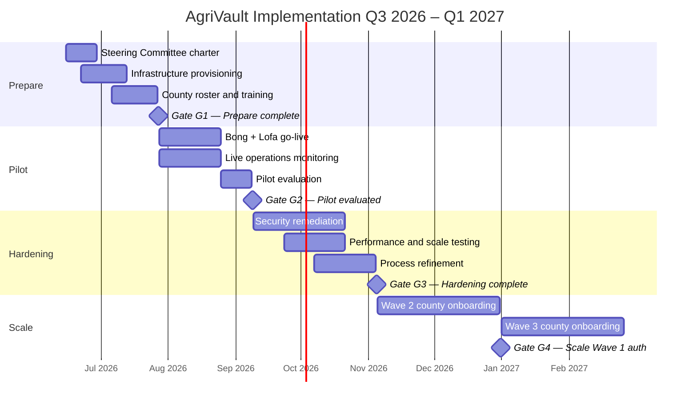
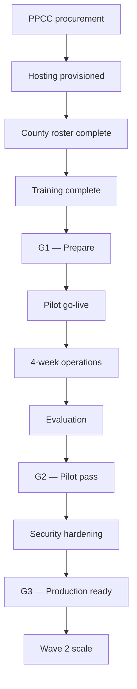

# AgriVault Implementation Timeline

**Classification:** Internal — Programme management  
**Platform:** AgriVault (`agritrace`) · Release Candidate 1 (0.1.0-rc1)  
**Horizon:** Q3 2026 – Q1 2027 (with extension to Q3 2027)  
**Audience:** Programme managers, Steering Committee, county deployment leads

**Related:** [../business/IMPLEMENTATION_PLAYBOOK.md](../business/IMPLEMENTATION_PLAYBOOK.md) · [COUNTY_ROLLOUT_PLAN.md](./COUNTY_ROLLOUT_PLAN.md) · [../product/VISION.md](../product/VISION.md) · [../product/ROADMAP.md](../product/ROADMAP.md)

---

## Table of contents

1. [Purpose](#purpose)
2. [Timeline overview](#timeline-overview)
3. [Gantt schedule — Q3 2026 to Q1 2027](#gantt-schedule--q3-2026-to-q1-2027)
4. [Phase detail](#phase-detail)
5. [Decision gates](#decision-gates)
6. [Dependencies and critical path](#dependencies-and-critical-path)
7. [Resource allocation](#resource-allocation)
8. [Reporting milestones](#reporting-milestones)

---

## Purpose

This document presents the Ministry-approved implementation timeline for AgriVault from pilot launch through the first national scale wave. It translates the four-phase implementation playbook into a quarter-by-quarter Gantt-style schedule for Steering Committee oversight and county planning.

---

## Timeline overview

---

## Gantt schedule — Q3 2026 to Q1 2027

### Master schedule table

| ID | Workstream | Activity | Start | End | Duration | Owner | Gate |
|----|------------|----------|-------|-----|----------|-------|------|
| **PREPARE** | | | | | | | |
| P-01 | Governance | Steering Committee charter and kickoff | 15 Jun 2026 | 28 Jun 2026 | 2 wk | Programme lead | — |
| P-02 | Governance | National governance model ratification | 15 Jun 2026 | 05 Jul 2026 | 3 wk | Permanent Secretary | — |
| P-03 | Procurement | Framework procurement initiation (PPCC) | 01 Jul 2026 | 31 Aug 2026 | 8 wk | Procurement unit | — |
| P-04 | Infrastructure | Supabase project provisioning | 22 Jun 2026 | 06 Jul 2026 | 2 wk | Ministry IT | — |
| P-05 | Infrastructure | Vercel deployment (staging + prod) | 29 Jun 2026 | 13 Jul 2026 | 2 wk | Ministry IT / vendor | — |
| P-06 | Infrastructure | Edge Function `sync-batch` deploy | 06 Jul 2026 | 13 Jul 2026 | 1 wk | Ministry IT | — |
| P-07 | County | Pilot county confirmation (Bong, Lofa) | 22 Jun 2026 | 06 Jul 2026 | 2 wk | Steering Committee | — |
| P-08 | County | User roster finalisation (CLAN, DAO, CAC) | 06 Jul 2026 | 20 Jul 2026 | 2 wk | County CACs | — |
| P-09 | Data | Data steward appointments | 06 Jul 2026 | 20 Jul 2026 | 2 wk | Programme lead | — |
| P-10 | Training | Role-based training (4 groups) | 13 Jul 2026 | 27 Jul 2026 | 2 wk | Training coordinator | — |
| P-11 | Testing | Staging end-to-end workflow test | 20 Jul 2026 | 27 Jul 2026 | 1 wk | Vendor + programme | — |
| P-12 | Gate | **G1 — Prepare complete** | — | **27 Jul 2026** | — | Steering Committee | **G1** |
| **PILOT** | | | | | | | |
| PL-01 | Deployment | Bong county go-live | 28 Jul 2026 | 28 Jul 2026 | 1 d | County CAC | G1 |
| PL-02 | Deployment | Lofa county go-live | 28 Jul 2026 | 28 Jul 2026 | 1 d | County CAC | G1 |
| PL-03 | Operations | Live field capture (CLAN) | 28 Jul 2026 | 24 Aug 2026 | 4 wk | CLAN leads | — |
| PL-04 | Operations | DAO review cycle | 28 Jul 2026 | 24 Aug 2026 | 4 wk | DAO officers | — |
| PL-05 | Operations | CAC verification cycle | 28 Jul 2026 | 24 Aug 2026 | 4 wk | CAC coordinators | — |
| PL-06 | Operations | Ministry approval and command center | 28 Jul 2026 | 24 Aug 2026 | 4 wk | Ministry officers | — |
| PL-07 | Donor | Donor observer accounts activated | 04 Aug 2026 | 04 Aug 2026 | 1 d | Ministry IT | — |
| PL-08 | Support | Tier 1 support (pilot SLA) | 28 Jul 2026 | 24 Aug 2026 | 4 wk | Vendor / Ministry IT | — |
| PL-09 | Evaluation | Pilot data collection | 28 Jul 2026 | 24 Aug 2026 | 4 wk | Evaluation team | — |
| PL-10 | Evaluation | Scoring and report drafting | 25 Aug 2026 | 07 Sep 2026 | 2 wk | Evaluation team | — |
| PL-11 | Gate | **G2 — Pilot evaluated** | — | **08 Sep 2026** | — | Minister + Steering | **G2** |
| **HARDENING** | | | | | | | |
| H-01 | Security | Post-pilot security remediation | 09 Sep 2026 | 21 Oct 2026 | 6 wk | Vendor / Ministry IT | G2 |
| H-02 | Security | Penetration test and remediation | 23 Sep 2026 | 04 Nov 2026 | 6 wk | External auditor | — |
| H-03 | Performance | Load testing (500+ concurrent users) | 07 Oct 2026 | 21 Oct 2026 | 2 wk | Ministry IT | — |
| H-04 | Data | Data quality remediation (pilot counties) | 09 Sep 2026 | 21 Oct 2026 | 6 wk | County stewards | — |
| H-05 | Process | SOP refinement from pilot feedback | 09 Sep 2026 | 04 Nov 2026 | 8 wk | Programme lead | — |
| H-06 | Compliance | Legal and compliance review | 07 Oct 2026 | 04 Nov 2026 | 4 wk | Legal counsel | — |
| H-07 | Readiness | Production readiness assessment | 28 Oct 2026 | 04 Nov 2026 | 1 wk | Ministry IT | — |
| H-08 | Gate | **G3 — Hardening complete (≥85/100)** | — | **04 Nov 2026** | — | Steering Committee | **G3** |
| **SCALE WAVE 1–2** | | | | | | | |
| S-01 | Scale | Wave 2 county selection (3–5 counties) | 05 Nov 2026 | 19 Nov 2026 | 2 wk | Steering Committee | G3 |
| S-02 | Scale | Wave 2 readiness assessment | 05 Nov 2026 | 03 Dec 2026 | 4 wk | County CACs | — |
| S-03 | Scale | Wave 2 training and provisioning | 01 Dec 2026 | 15 Jan 2027 | 6 wk | Training coordinator | — |
| S-04 | Scale | Wave 2 go-live | 15 Jan 2027 | 15 Jan 2027 | 1 d | County CACs | — |
| S-05 | Scale | Wave 3 county selection | 01 Jan 2027 | 15 Jan 2027 | 2 wk | Steering Committee | — |
| S-06 | Scale | Wave 3 readiness and training | 15 Jan 2027 | 15 Mar 2027 | 8 wk | County CACs | — |
| S-07 | Scale | Wave 3 go-live | 15 Mar 2027 | 15 Mar 2027 | 1 d | County CACs | — |
| S-08 | Gate | **G4 — Scale Wave 1 authorised** | — | **31 Dec 2026** | — | Steering Committee | **G4** |

---

## Phase detail

### Phase 1 — Prepare (Weeks −4 to 0)

**Objective:** Infrastructure, governance, and county readiness before production data entry.

| Deliverable | Reference |
|-------------|-----------|
| Supabase + Vercel live | [../DEPLOYMENT_GUIDE.md](../DEPLOYMENT_GUIDE.md) |
| County selection memo | [COUNTY_ROLLOUT_PLAN.md](./COUNTY_ROLLOUT_PLAN.md) |
| Operating model signed | [../business/OPERATING_MODEL.md](../business/OPERATING_MODEL.md) |
| Training complete | [../business/TRAINING_PROGRAM.md](../business/TRAINING_PROGRAM.md) |

### Phase 2 — Pilot (Weeks 1–4)

**Objective:** Validate CLAN → DAO → CAC → Ministry chain under live conditions in Bong and Lofa.

| KPI target | Threshold |
|------------|-----------|
| Registry completeness (pilot commodities) | ≥60% of target farmers |
| Approval cycle time (median) | ≤72 hours |
| Offline sync success rate | ≥90% |
| Critical workflow defects | Zero P1 open at evaluation |

KPI definitions: [../business/PILOT_SUCCESS_METRICS.md](../business/PILOT_SUCCESS_METRICS.md).

### Phase 3 — Hardening (Weeks 5–12)

**Objective:** Remediate security gaps, achieve production readiness ≥ 85/100, refine SOPs.

| Workstream | Key output |
|------------|------------|
| Security | Pen test remediation; RLS audit |
| Performance | Load test report |
| Data quality | Steward reconciliation complete |
| Compliance | Legal sign-off |

Technical debt tracker: [../TECHNICAL_DEBT.md](../TECHNICAL_DEBT.md).  
Post-pilot roadmap: [../ROADMAP_POST_PILOT.md](../ROADMAP_POST_PILOT.md).

### Phase 4 — Scale Waves 1–2 (Q4 2026 – Q1 2027)

**Objective:** Expand to 3–5 counties (Wave 2) and 5–8 counties (Wave 3) per readiness criteria.

County rollout detail: [COUNTY_ROLLOUT_PLAN.md](./COUNTY_ROLLOUT_PLAN.md).  
National scale guide: [../business/NATIONAL_SCALE_GUIDE.md](../business/NATIONAL_SCALE_GUIDE.md).

---

## Decision gates

| Gate | Date | Approving body | Pass criteria |
|------|------|----------------|---------------|
| G1 | 27 Jul 2026 | Steering Committee | All P1 deliverables; staging E2E pass; launch readiness green |
| G2 | 08 Sep 2026 | Minister + Steering Committee | Evaluation score ≥70%; zero open P1 defects |
| G3 | 04 Nov 2026 | Steering Committee | Production readiness ≥85/100; legal review complete |
| G4 | 31 Dec 2026 | Steering Committee | Wave 2 counties pass readiness checklist |

Evaluation framework: [PILOT_EVALUATION_FRAMEWORK.md](./PILOT_EVALUATION_FRAMEWORK.md).

---

## Dependencies and critical path

**Critical path:** Procurement → Infrastructure → Roster → Training → G1 → Pilot → Evaluation → G2 → Hardening → G3 → Scale.

| Dependency | Risk if delayed | Mitigation |
|------------|-----------------|------------|
| PPCC procurement | Hosting not funded | Donor bridge funding; phased scope |
| Device procurement | CLAN cannot capture offline | Ministry device loan pool |
| County roster | Users not provisioned | Escalate to Permanent Secretary |
| Training | Low adoption | Extend prepare phase (max 2 weeks) |

Risk register: [../business/RISK_REGISTER.md](../business/RISK_REGISTER.md).

---

## Resource allocation

| Role | Prepare | Pilot | Hardening | Scale |
|------|---------|-------|-----------|-------|
| Programme lead | Full-time | Full-time | 50% | 50% |
| Ministry IT | Full-time | 50% | Full-time | 50% |
| Vendor engineering | Full-time | Full-time | Full-time | 50% |
| County CAC (×2 pilot) | 50% | Full-time | 25% | 25% |
| Training coordinator | Full-time | 50% | 25% | Full-time |
| Evaluation team | — | 50% | 25% | — |

---

## Reporting milestones

| Date | Report | Audience |
|------|--------|----------|
| 27 Jul 2026 | G1 readiness report | Steering Committee |
| 24 Aug 2026 | Pilot mid-point status | Programme lead |
| 08 Sep 2026 | Pilot evaluation report | Minister + Cabinet |
| 04 Nov 2026 | Hardening completion report | Steering Committee |
| 31 Dec 2026 | Scale Wave 1 authorisation memo | Steering Committee |
| 31 Mar 2027 | Q1 2027 scale status | Permanent Secretary |

---

*AgriVault — Ministry of Agriculture, Republic of Liberia · RC1 · July 2026*
