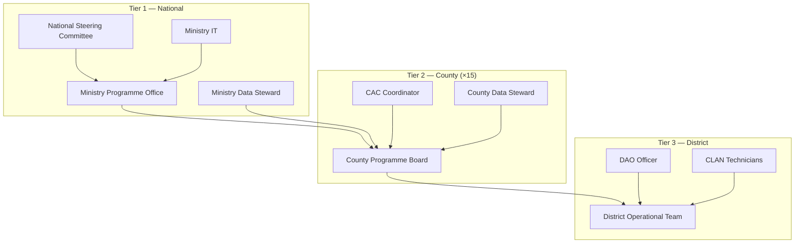
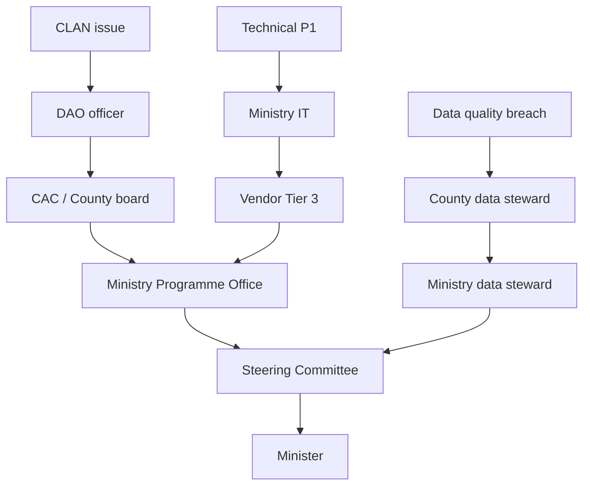

# AgriVault National Governance Model

**Classification:** Internal — Governance board  
**Platform:** AgriVault (`agritrace`) · Release Candidate 1 (0.1.0-rc1)  
**Date:** July 2026  
**Audience:** National Steering Committee, county programme boards, district operational teams, Permanent Secretary, Honourable Minister

**Related:** [../business/PROJECT_GOVERNANCE.md](../business/PROJECT_GOVERNANCE.md) · [../business/OPERATING_MODEL.md](../business/OPERATING_MODEL.md) · [../product/VISION.md](../product/VISION.md) · [DATA_SHARING_FRAMEWORK.md](./DATA_SHARING_FRAMEWORK.md)

---

## Table of contents

1. [Purpose](#purpose)
2. [Governance principles](#governance-principles)
3. [Three-tier structure](#three-tier-structure)
4. [Tier 1 — National Steering Committee](#tier-1--national-steering-committee)
5. [Tier 2 — County programme boards](#tier-2--county-programme-boards)
6. [Tier 3 — District operational teams](#tier-3--district-operational-teams)
7. [Decision rights matrix](#decision-rights-matrix)
8. [Escalation paths](#escalation-paths)
9. [Meeting cadence](#meeting-cadence)
10. [Governance lifecycle](#governance-lifecycle)

---

## Purpose

This document establishes the three-tier governance model for AgriVault national operations. It defines composition, decision rights, and escalation paths for the National Steering Committee, county programme boards, and district operational teams — ensuring clear accountability from field capture to cabinet reporting.

---

## Governance principles

| Principle | Application |
|-----------|-------------|
| Government ownership | Ministry of Agriculture owns platform policy and operational data |
| Subsidiarity | Decisions made at the lowest competent tier |
| Auditability | All workflow actions logged; governance decisions documented |
| Data stewardship | County stewards accountable for local data quality |
| Donor transparency | Read-only partner access; no workflow authority |
| Phased scale | No county activation without readiness and Steering Committee approval |

Product principles alignment: [../product/PRODUCT_PRINCIPLES.md](../product/PRODUCT_PRINCIPLES.md).

---

## Three-tier structure

| Tier | Body | Geography | Primary function |
|------|------|-----------|------------------|
| 1 | National Steering Committee | National | Policy, budget, scale authorisation |
| 2 | County programme board | County (×15) | County workflow, data quality, activation |
| 3 | District operational team | District | Field capture, first-line review |

---

## Tier 1 — National Steering Committee

### Composition

| Member | Role | Voting |
|--------|------|--------|
| Honourable Minister of Agriculture | Chair | Yes |
| Permanent Secretary | Vice-chair | Yes |
| Programme lead (AgriVault) | Secretary | Yes |
| Ministry IT director | Member | Yes |
| Ministry data steward | Member | Yes |
| Two county CAC representatives (rotating) | Member | Yes |
| Donor liaison (non-voting) | Observer | No |
| Legal counsel (as needed) | Advisor | No |

### Responsibilities

| Area | Authority |
|------|-----------|
| Pilot and scale authorisation | Approve county waves; Gate G1–G4 decisions |
| Budget and procurement | Endorse procurement package; approve donor co-financing |
| Policy | Approve data sharing framework; terms of use |
| Performance | Review pilot evaluation; approve go/no-go |
| Risk | Review risk register; approve mitigation plans |
| Vendor oversight | Approve SLA changes; contract extensions |

### Decisions reserved for Tier 1

- National rollout wave authorisation
- Pilot go/no-go (Gate G2)
- Production readiness certification (Gate G3)
- Data classification policy changes
- Donor MOU approval
- County suspension or reinstatement
- Platform scope changes (new modules)

Reference: [CABINET_BRIEF.md](./CABINET_BRIEF.md) · [../business/PROJECT_GOVERNANCE.md](../business/PROJECT_GOVERNANCE.md).

---

## Tier 2 — County programme boards

### Composition

| Member | Role |
|--------|------|
| County Agriculture Coordinator (CAC) | Chair |
| County data steward | Member |
| DAO lead (senior district officer) | Member |
| CLAN lead (senior field technician) | Member |
| County administrator representative | Member |
| Ministry liaison (non-voting) | Observer |

### Responsibilities

| Area | Authority |
|------|-----------|
| County activation | Submit readiness checklist; request go-live |
| Roster management | Maintain CLAN, DAO, CAC user roster |
| Data quality | County steward reconciliation; quality remediation |
| Training | Coordinate county training delivery |
| Local SOP | Adapt national SOPs to county context (within policy) |
| Escalation | Escalate P1 incidents to Tier 1 |

### Decisions reserved for Tier 2

- District team assignments
- County training schedule
- Local change management activities
- County data quality remediation plans
- Tier 1 support escalation initiation
- County-level user account suspension (pending Tier 1 review)

County rollout: [COUNTY_ROLLOUT_PLAN.md](./COUNTY_ROLLOUT_PLAN.md).

---

## Tier 3 — District operational teams

### Composition

| Member | Role |
|--------|------|
| DAO officer | Team lead |
| CLAN technicians (2–6 per district) | Field operators |
| CAC coordinator (as needed) | Escalation contact |

### Responsibilities

| Area | Authority |
|------|-----------|
| Field capture | Farmer registration; boundary capture; field reports |
| First-line review | DAO approve, reject, request corrections |
| Offline sync | Reconcile offline queue; report sync failures |
| Local support | Peer support for CLAN technicians |
| Escalation | Escalate blocked submissions to county board |

### Decisions reserved for Tier 3

- Daily workflow prioritisation
- Field visit scheduling
- Correction request details
- Local device allocation among CLAN
- First-line data quality checks

Operational chain: CLAN → DAO → CAC → Ministry. Detail: [../business/OPERATING_MODEL.md](../business/OPERATING_MODEL.md).

---

## Decision rights matrix

| Decision | Tier 1 | Tier 2 | Tier 3 | Notes |
|----------|--------|--------|--------|-------|
| County go-live authorisation | **A** | R | I | Tier 2 submits readiness |
| User account creation | C | R | I | Ministry IT executes |
| Workflow approve/reject | I | C | **R** (DAO) | CAC and Ministry at higher stages |
| Data classification change | **A** | C | I | Data Steward Board advises |
| Donor data export | **A** | C | I | MOU required |
| Training curriculum change | **A** | C | I | National standard |
| P1 incident response | **A** | R | I | Tier 2 initiates |
| County suspension | **A** | R | I | Tier 1 only |
| Budget reallocation | **A** | I | I | Cabinet if significant |
| Vendor SLA change | **A** | I | I | Procurement involved |
| Local SOP adaptation | C | **A** | R | Within national policy |
| Daily submission prioritisation | I | C | **A** | Field operations |

**Legend:** **A** = Accountable (final decision) · **R** = Responsible (executes) · **C** = Consulted · **I** = Informed

---

## Escalation paths

| Escalation type | Initiated by | First responder | Target resolution |
|-----------------|--------------|-----------------|-------------------|
| Workflow blocked >72h | CLAN / DAO | CAC | 24 hours |
| Offline sync failure (batch) | CLAN | Ministry IT | 4 hours |
| P1 platform defect | Any user | Ministry IT → Vendor | 4 hours |
| Data integrity concern | Data steward | Ministry data steward | 48 hours |
| Security incident | Any user | Ministry IT | Immediate |
| Policy dispute | County board | Programme office | 5 business days |

Support tiers: [../business/SUPPORT_MODEL.md](../business/SUPPORT_MODEL.md).

---

## Meeting cadence

| Meeting | Tier | Frequency | Chair | Quorum |
|---------|------|-----------|-------|--------|
| Steering Committee | 1 | Monthly (pilot: bi-weekly) | Minister / PS | 50% + chair |
| Programme office standup | 1 | Weekly | Programme lead | Programme team |
| County programme board | 2 | Bi-weekly | CAC | CAC + data steward |
| District operational review | 3 | Weekly | DAO lead | DAO + ≥1 CLAN |
| Data Steward Board | 1–2 | Quarterly | Ministry data steward | Ministry + 2 county stewards |
| Donor programme review | 1 | Quarterly | Programme lead | Steering + donors |

---

## Governance lifecycle

| Phase | Tier 1 focus | Tier 2 focus | Tier 3 focus |
|-------|--------------|--------------|--------------|
| Prepare | Charter; procurement; county selection | Roster; training plan | Device prep |
| Pilot | Gate G2; evaluation review | Daily operations; data quality | Field capture |
| Hardening | Gate G3; security sign-off | Remediation support | SOP refinement |
| Scale | Wave authorisation; BAU transition | County activation | Expanded operations |
| BAU | Quarterly review; policy updates | Monthly quality review | Continuous operations |

Transition to BAU: [../business/OPERATING_MODEL.md](../business/OPERATING_MODEL.md) § Transition to business-as-usual.

---

*AgriVault — Ministry of Agriculture, Republic of Liberia · RC1 · July 2026*
