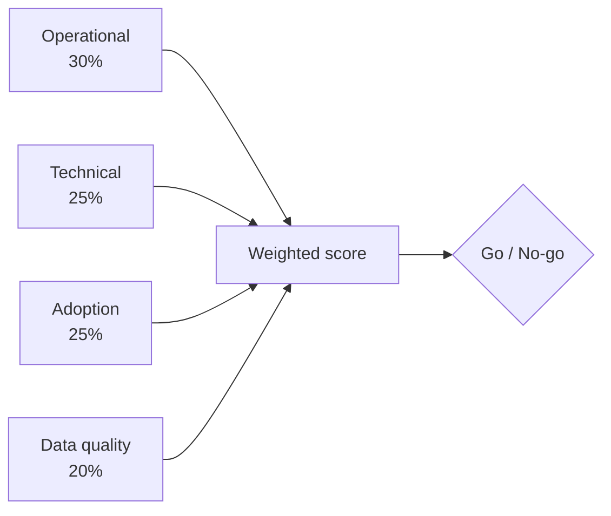
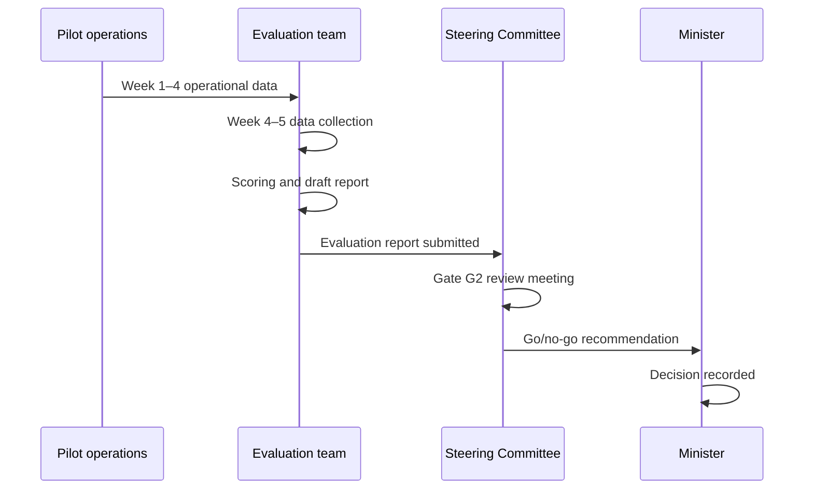

# AgriVault Pilot Evaluation Framework

**Classification:** Internal — Evaluation teams  
**Platform:** AgriVault (`agritrace`) · Release Candidate 1 (0.1.0-rc1)  
**Date:** July 2026  
**Audience:** Pilot evaluation team, Steering Committee, Minister, Permanent Secretary, donor observers (summary only)

**Related:** [../business/PILOT_SUCCESS_METRICS.md](../business/PILOT_SUCCESS_METRICS.md) · [PILOT_CHECKLIST.md](../PILOT_CHECKLIST.md) · [../business/IMPLEMENTATION_PLAYBOOK.md](../business/IMPLEMENTATION_PLAYBOOK.md) · [../product/VISION.md](../product/VISION.md)

---

## Table of contents

1. [Purpose](#purpose)
2. [Evaluation scope](#evaluation-scope)
3. [Evaluation dimensions](#evaluation-dimensions)
4. [Scoring rubric](#scoring-rubric)
5. [Data collection methods](#data-collection-methods)
6. [Go/no-go criteria](#gono-go-criteria)
7. [Evaluation process](#evaluation-process)
8. [Reporting template](#reporting-template)
9. [Post-evaluation actions](#post-evaluation-actions)

---

## Purpose

This framework defines how the Ministry evaluates AgriVault RC1 pilot performance in Bong and Lofa counties. The evaluation produces a weighted score across four dimensions — operational, technical, adoption, and data quality — and a formal go/no-go recommendation for the hardening and scale phases.

Detailed KPI definitions and measurement methods: [../business/PILOT_SUCCESS_METRICS.md](../business/PILOT_SUCCESS_METRICS.md).

---

## Evaluation scope

| Element | Detail |
|---------|--------|
| Pilot period | 4 weeks live operations (Q3 2026) |
| Pilot counties | Bong, Lofa *(Ministry to confirm)* |
| Platform version | AgriVault 0.1.0-rc1 |
| Evaluation period | 2 weeks post-pilot (data collection + scoring) |
| Evaluating body | Pilot evaluation team (independent of vendor delivery) |
| Approving body | Steering Committee + Honourable Minister |



---

## Evaluation dimensions

### Dimension 1 — Operational effectiveness (30%)

Measures whether the CLAN → DAO → CAC → Ministry workflow functions under live field conditions.

| Indicator | Target | Weight within dimension |
|-----------|--------|-------------------------|
| Submissions completing full approval chain | ≥100 submissions | 25% |
| Median approval cycle time (submit → ministry_approved) | ≤72 hours | 25% |
| DAO review backlog (median age) | ≤48 hours | 15% |
| CAC verification backlog (median age) | ≤48 hours | 15% |
| Workflow rejection rate (with documented reason) | ≤20% | 10% |
| Executive briefing PDF generated from live data | Yes | 10% |

Operational chain reference: [../WORKFLOW_ENGINE.md](../WORKFLOW_ENGINE.md).

### Dimension 2 — Technical reliability (25%)

Measures platform stability, security posture, and offline capability.

| Indicator | Target | Weight within dimension |
|-----------|--------|-------------------------|
| Platform uptime during pilot | ≥99.5% | 20% |
| Offline sync success rate (excl. connectivity outages) | ≥90% | 25% |
| P1 defects open at evaluation close | 0 | 25% |
| P2 defects open at evaluation close | ≤3 | 10% |
| Security checklist compliance | ≥90% | 10% |
| API error rate (5xx) | ≤0.5% | 10% |

Technical reference: [../RELEASE_NOTES_RC1.md](../RELEASE_NOTES_RC1.md) · [../SECURITY.md](../SECURITY.md).

### Dimension 3 — User adoption (25%)

Measures whether field and office staff use the platform as intended.

| Indicator | Target | Weight within dimension |
|-----------|--------|-------------------------|
| CLAN active users (≥1 submission/week) | ≥80% of roster | 25% |
| DAO active reviewers (≥1 action/week) | ≥90% of roster | 20% |
| CAC active verifiers (≥1 action/week) | 100% of roster | 15% |
| Training completion rate | 100% | 15% |
| User satisfaction survey (≥4/5 average) | ≥70% respondents | 15% |
| Paper register fallback incidents | ≤2 per county | 10% |

Change management reference: [../business/CHANGE_MANAGEMENT.md](../business/CHANGE_MANAGEMENT.md).

### Dimension 4 — Data quality (20%)

Measures accuracy, completeness, and provenance of operational data.

| Indicator | Target | Weight within dimension |
|-----------|--------|-------------------------|
| Farmer records with required fields complete | ≥95% | 25% |
| Boundary submissions with valid GPS polygon | ≥90% | 25% |
| Duplicate farmer records detected | ≤2% | 15% |
| LIVE source proportion in command center KPIs | ≥80% | 15% |
| Data steward reconciliation completed | Yes (both counties) | 10% |
| Provenance badge accuracy (no silent fallback) | 100% | 10% |

Data governance reference: [../business/DATA_GOVERNANCE.md](../business/DATA_GOVERNANCE.md).

---

## Scoring rubric

Each indicator is scored on a 5-point scale. Dimension scores are weighted averages. Overall score is the weighted sum of dimension scores.

### 5-point scale

| Score | Label | Definition |
|-------|-------|------------|
| 5 | Exceeds | Target met with ≥20% margin |
| 4 | Meets | Target met |
| 3 | Partial | Target missed by ≤20% |
| 2 | Below | Target missed by 21–50% |
| 1 | Fail | Target missed by >50% or not measured |

### Dimension score calculation

```
Dimension score = Σ (indicator score / 5 × indicator weight within dimension) × 100
```

### Overall weighted score

| Dimension | Weight | Example score | Weighted |
|-----------|--------|---------------|----------|
| Operational | 30% | 80 | 24.0 |
| Technical | 25% | 88 | 22.0 |
| Adoption | 25% | 72 | 18.0 |
| Data quality | 20% | 76 | 15.2 |
| **Total** | **100%** | | **79.2** |

### Score interpretation

| Overall score | Rating | Recommendation |
|---------------|--------|----------------|
| ≥85 | Excellent | Proceed to hardening; accelerate scale timeline |
| 70–84 | Satisfactory | Proceed to hardening; address gaps in Q4 |
| 55–69 | Marginal | Conditional proceed; remedial plan required |
| <55 | Unsatisfactory | No-go; root cause review and re-pilot |

---

## Data collection methods

| Method | Source | Owner | Timing |
|--------|--------|-------|--------|
| Platform analytics | Supabase queries; command center | Ministry IT | Weekly during pilot |
| Workflow audit log | `workflow_actions` table | Evaluation team | End of pilot |
| Offline sync logs | Edge Function logs; CLAN reports | Ministry IT | Weekly |
| User survey | Structured questionnaire (4 role groups) | Evaluation team | Week 4 |
| Interviews | CAC, DAO, CLAN focus groups (2 per county) | Evaluation team | Week 4–5 |
| Device audit | Field device inspection | County CAC | Week 3 |
| Data steward report | County reconciliation | Data stewards | Week 4 |
| Support ticket analysis | Tier 1/2 ticket log | Vendor / Ministry IT | End of pilot |

Survey template and query scripts: [../business/PILOT_SUCCESS_METRICS.md](../business/PILOT_SUCCESS_METRICS.md).

---

## Go/no-go criteria

### Go — Proceed to hardening (Gate G2 pass)

**All mandatory criteria must be met** AND **overall weighted score ≥70**.

| # | Mandatory criterion |
|---|---------------------|
| M1 | Zero open P1 defects |
| M2 | ≥100 submissions through full approval chain |
| M3 | No security incident classified above LOW |
| M4 | Both counties completed data steward reconciliation |
| M5 | Steering Committee evaluation report received |

### Conditional go

Overall score 55–69 OR one mandatory criterion missed by ≤10% margin:

- Remedial plan approved by Steering Committee
- Extended pilot (max 2 weeks) or targeted hardening before scale
- Minister written approval required

### No-go — Do not proceed to hardening

Any of:

| Trigger | Action |
|---------|--------|
| Overall score <55 | Root cause review; re-pilot planning |
| P1 security incident | Immediate suspension; security audit |
| <50% CLAN adoption | Change management overhaul; re-pilot |
| Data integrity breach | Steward investigation; legal review |
| Workflow engine failure (>24h outage) | Vendor remediation; re-pilot |

No-go triggers escalation to Permanent Secretary and Honourable Minister within 48 hours.

---

## Evaluation process



| Week | Activity |
|------|----------|
| Pilot Week 1 | Baseline metrics captured |
| Pilot Week 2 | Mid-point check (informal) |
| Pilot Week 3 | Device and data quality audit |
| Pilot Week 4 | User surveys and focus groups |
| Eval Week 1 | Data aggregation and scoring |
| Eval Week 2 | Draft report; Steering Committee review |
| Eval Week 2 + 2 days | Minister decision; Gate G2 recorded |

---

## Reporting template

The evaluation report must include:

| Section | Content |
|---------|---------|
| 1. Executive summary | Overall score, recommendation, key findings |
| 2. Methodology | Data sources, period, limitations |
| 3. Dimension scores | Table with indicator-level detail |
| 4. County comparison | Bong vs Lofa breakdown |
| 5. User feedback summary | Survey and interview themes |
| 6. Defect and incident log | P1/P2/P3 classification |
| 7. Go/no-go recommendation | With conditions if applicable |
| 8. Remedial actions | Prioritised list for hardening phase |
| 9. Annexes | Raw data tables, survey results |

Report distribution: Steering Committee, Permanent Secretary, Honourable Minister, donor partners (summary section only per [DONOR_GUIDE.md](./DONOR_GUIDE.md)).

---

## Post-evaluation actions

| Outcome | Next step | Reference |
|---------|-----------|-----------|
| Go | Begin hardening phase | [IMPLEMENTATION_TIMELINE.md](./IMPLEMENTATION_TIMELINE.md) |
| Conditional go | Approve remedial plan; set re-review date | [../business/RISK_REGISTER.md](../business/RISK_REGISTER.md) |
| No-go | Root cause report; re-pilot planning | [../business/IMPLEMENTATION_PLAYBOOK.md](../business/IMPLEMENTATION_PLAYBOOK.md) |

KPI baseline for scale phase: Update [../business/PILOT_SUCCESS_METRICS.md](../business/PILOT_SUCCESS_METRICS.md) with pilot actuals.

---

*AgriVault — Ministry of Agriculture, Republic of Liberia · RC1 · July 2026*
