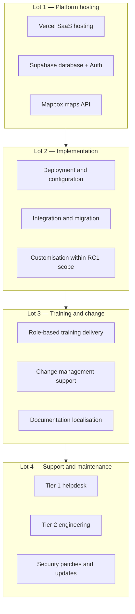

# AgriVault Procurement Package

**Classification:** Internal — Procurement committees  
**Platform:** AgriVault (`agritrace`) · Release Candidate 1 (0.1.0-rc1)  
**Date:** July 2026  
**Audience:** Public Procurement and Concessions Commission (PPCC) committees, Ministry procurement unit, Permanent Secretary

**Related:** [CABINET_BRIEF.md](./CABINET_BRIEF.md) · [../business/PROCUREMENT_GUIDE.md](../business/PROCUREMENT_GUIDE.md) · [../business/PLATFORM_OVERVIEW.md](../business/PLATFORM_OVERVIEW.md) · [../ARCHITECTURE.md](../ARCHITECTURE.md)

---

## Table of contents

1. [Purpose](#purpose)
2. [Procurement context](#procurement-context)
3. [Scope of supply](#scope-of-supply)
4. [Lot structure](#lot-structure)
5. [Technical specifications](#technical-specifications)
6. [Evaluation criteria matrix](#evaluation-criteria-matrix)
7. [Contract terms framework](#contract-terms-framework)
8. [Submission requirements](#submission-requirements)
9. [Timeline and process](#timeline-and-process)
10. [Annexes](#annexes)

---

## Purpose

This document defines the procurement package for AgriVault national deployment — covering SaaS hosting, database platform, maps API, implementation services, training, and ongoing support. It is intended for PPCC-compliant competitive procurement or framework agreement establishment under Ministry of Agriculture authority.

---

## Procurement context

| Element | Detail |
|---------|--------|
| Contracting authority | Ministry of Agriculture, Republic of Liberia |
| Programme | AgriVault National Agricultural Operations Platform |
| Current status | RC1 developed; pilot-ready; vendor-assisted deployment |
| Procurement type | Framework agreement (recommended) or single tender |
| Duration | Initial 3-year term with 2-year extension option |
| Funding | Ministry IT budget; donor co-financing (subject to bilateral agreements) |

Cabinet financial framework: [CABINET_BRIEF.md](./CABINET_BRIEF.md) § Financial implications.

---

## Scope of supply

### Supply categories overview

---

## Lot structure

| Lot | Description | Contract type | Initial term |
|-----|-------------|---------------|--------------|
| **Lot 1** | Platform hosting and licensing | SaaS subscription | 3 years |
| **Lot 2** | Implementation services | Fixed-price + T&M cap | 12 months |
| **Lot 3** | Training and change management | Fixed-price per county | 18 months |
| **Lot 4** | Support and maintenance | Annual SLA contract | 3 years |

Lots may be procured individually or as a consolidated package at PPCC discretion.

---

## Technical specifications

### Lot 1 — Platform hosting

| Component | Requirement | Reference |
|-----------|-------------|-----------|
| Application hosting | Next.js 14 compatible; Node.js 18+; HTTPS; CDN | [../ARCHITECTURE.md](../ARCHITECTURE.md) |
| Database | PostgreSQL 15+; Row Level Security; Auth; Edge Functions | [../DATABASE.md](../DATABASE.md) |
| Offline sync | Edge Function deployment for batch sync | [../OFFLINE_ARCHITECTURE.md](../OFFLINE_ARCHITECTURE.md) |
| Maps | Mapbox GL JS; token management; geospatial API | [../GIS_ARCHITECTURE.md](../GIS_ARCHITECTURE.md) |
| Security | CSP; rate limiting; audit logging; SSL/TLS 1.2+ | [../SECURITY.md](../SECURITY.md) |
| Availability | ≥99.5% uptime (pilot); ≥99.9% (post-hardening) | SLA in contract |
| Data residency | Configurable region; Africa-preferred where available | Contract schedule |
| Backup | Daily automated backup; 30-day retention minimum | Contract schedule |

### Lot 2 — Implementation services

| Deliverable | Acceptance criteria |
|-------------|---------------------|
| Production deployment | `/admin/launch-readiness` green |
| Staging environment | Mirror of production configuration |
| Database migrations | All migrations applied; RLS verified |
| Environment configuration | All required env vars documented and set |
| County scope setup | Pilot counties configured in RLS |
| User provisioning support | Bulk import of county rosters |
| End-to-end test | Full CLAN → DAO → CAC → Ministry chain on staging |
| Handover documentation | Operations runbook delivered |

Implementation methodology: [../business/IMPLEMENTATION_PLAYBOOK.md](../business/IMPLEMENTATION_PLAYBOOK.md).

### Lot 3 — Training and change management

| Deliverable | Audience | Minimum sessions |
|-------------|----------|------------------|
| CLAN field capture training | CLAN technicians | 2 days per county |
| DAO review training | DAO officers | 1 day per county |
| CAC verification training | CAC coordinators | 1 day per county |
| Ministry national training | Ministry officers | 1 day (central) |
| Train-the-trainer | County trainers | 3 days (central) |
| Change management workshops | All role groups | 0.5 day per county |

Curriculum reference: [../business/TRAINING_PROGRAM.md](../business/TRAINING_PROGRAM.md).

### Lot 4 — Support and maintenance

| Tier | Scope | Response SLA |
|------|-------|----------------|
| Tier 1 | User access, password reset, basic navigation | 4 business hours |
| Tier 2 | Workflow defects, sync failures, data issues | 1 business day |
| Tier 3 | Security incidents, platform outage | 4 hours (P1) |
| Preventive | Security patches, dependency updates | Monthly cycle |

Support model: [../business/SUPPORT_MODEL.md](../business/SUPPORT_MODEL.md).

---

## Evaluation criteria matrix

### Weighting summary

| Criterion | Weight | Lot applicability |
|-----------|--------|-------------------|
| Technical compliance | 30% | All lots |
| Implementation experience | 20% | Lots 2, 3, 4 |
| Price | 25% | All lots |
| Local capacity and knowledge transfer | 15% | Lots 2, 3, 4 |
| Sustainability and exit strategy | 10% | All lots |

### Detailed scoring matrix

| # | Criterion | Max score | Scoring guide |
|---|-----------|-----------|---------------|
| **T1** | Platform architecture compliance | 15 | 0 = non-compliant; 15 = full RC1 stack support demonstrated |
| **T2** | Security and data protection | 10 | 0 = no RLS/CSP; 10 = full alignment with [../SECURITY.md](../SECURITY.md) |
| **T3** | Offline and field capability | 5 | 0 = no offline; 5 = PWA + IndexedDB + sync demonstrated |
| **I1** | Government SaaS deployment experience | 10 | 0 = none; 10 = ≥2 comparable government deployments |
| **I2** | Liberia or West Africa presence | 5 | 0 = none; 5 = local team or partner |
| **I3** | Proposed team qualifications | 5 | 0 = unqualified; 5 = certified senior engineers |
| **P1** | Total cost of ownership (3-year) | 15 | Lowest price = 15; others proportional |
| **P2** | Cost transparency and predictability | 10 | 0 = opaque pricing; 10 = fixed + capped T&M |
| **L1** | Local training delivery capacity | 8 | 0 = fly-in only; 8 = Liberian trainers proposed |
| **L2** | Knowledge transfer plan | 7 | 0 = none; 7 = documented Ministry IT handover |
| **S1** | Source code and exit strategy | 5 | 0 = vendor lock-in; 5 = documented exit / source escrow |
| **S2** | Open source compliance | 5 | 0 = no licence audit; 5 = full third-party audit |

**Minimum qualifying score:** 70/100 overall; no criterion below 50% of its maximum.

### Pass/fail requirements (mandatory)

| Requirement | Consequence if not met |
|-------------|------------------------|
| Supabase-compatible PostgreSQL with RLS | Disqualification |
| HTTPS with CSP support | Disqualification |
| Offline sync capability | Disqualification |
| Liberian data protection commitment | Disqualification |
| PPCC registration (if applicable) | Disqualification |

---

## Contract terms framework

| Term | Requirement |
|------|-------------|
| Intellectual property | Ministry owns operational data; vendor retains platform code unless otherwise agreed |
| Data ownership | All farmer and operational data is Ministry property |
| Confidentiality | Vendor NDA; no sub-contractor data access without approval |
| Audit rights | Ministry may audit vendor security and data handling annually |
| Exit clause | 90-day transition period; data export in standard formats |
| Liability | Cap at contract value; exceptions for data breach negligence |
| Force majeure | Standard PPCC clause |
| Payment | Milestone-based (Lot 2); subscription (Lot 1, 4); per-county (Lot 3) |
| Performance bonds | 10% of Lot 2 value (if PPCC requires) |

Legal framework: [LEGAL_AND_COMPLIANCE.md](./LEGAL_AND_COMPLIANCE.md).

---

## Submission requirements

Bidders must submit:

| # | Document | Required |
|---|----------|----------|
| 1 | Company registration and PPCC certificate | Yes |
| 2 | Technical proposal addressing all Lot specifications | Yes |
| 3 | Financial proposal with 3-year TCO breakdown | Yes |
| 4 | Team CVs and organogram | Yes |
| 5 | Reference projects (≥2 government SaaS) | Yes |
| 6 | Security and data protection statement | Yes |
| 7 | Knowledge transfer plan | Yes (Lots 2–4) |
| 8 | Open source licence compliance statement | Yes |

---

## Timeline and process

| Phase | Activity | Duration | Target |
|-------|----------|----------|--------|
| 1 | Procurement notice publication | — | Jul 2026 |
| 2 | Pre-bid conference | 1 day | Aug 2026 |
| 3 | Bid submission period | 21 days | Aug–Sep 2026 |
| 4 | Technical evaluation | 14 days | Sep 2026 |
| 5 | Financial evaluation | 7 days | Sep 2026 |
| 6 | Award recommendation | 7 days | Oct 2026 |
| 7 | Contract negotiation and signing | 14 days | Oct 2026 |
| 8 | Lot 1 provisioning begins | — | Oct 2026 |

Aligned with [IMPLEMENTATION_TIMELINE.md](./IMPLEMENTATION_TIMELINE.md) — procurement on critical path for G1.

---

## Annexes

| Annex | Reference |
|-------|-----------|
| A | Technical architecture — [../ARCHITECTURE.md](../ARCHITECTURE.md) |
| B | Security requirements — [../SECURITY.md](../SECURITY.md) |
| C | Deployment guide — [../DEPLOYMENT_GUIDE.md](../DEPLOYMENT_GUIDE.md) |
| D | Implementation playbook — [../business/IMPLEMENTATION_PLAYBOOK.md](../business/IMPLEMENTATION_PLAYBOOK.md) |
| E | Platform overview — [../business/PLATFORM_OVERVIEW.md](../business/PLATFORM_OVERVIEW.md) |
| F | Product vision — [../product/VISION.md](../product/VISION.md) |

---

*AgriVault — Ministry of Agriculture, Republic of Liberia · RC1 · Procurement document · July 2026*
