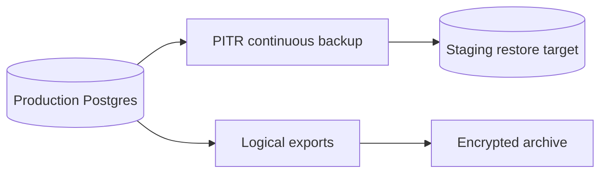
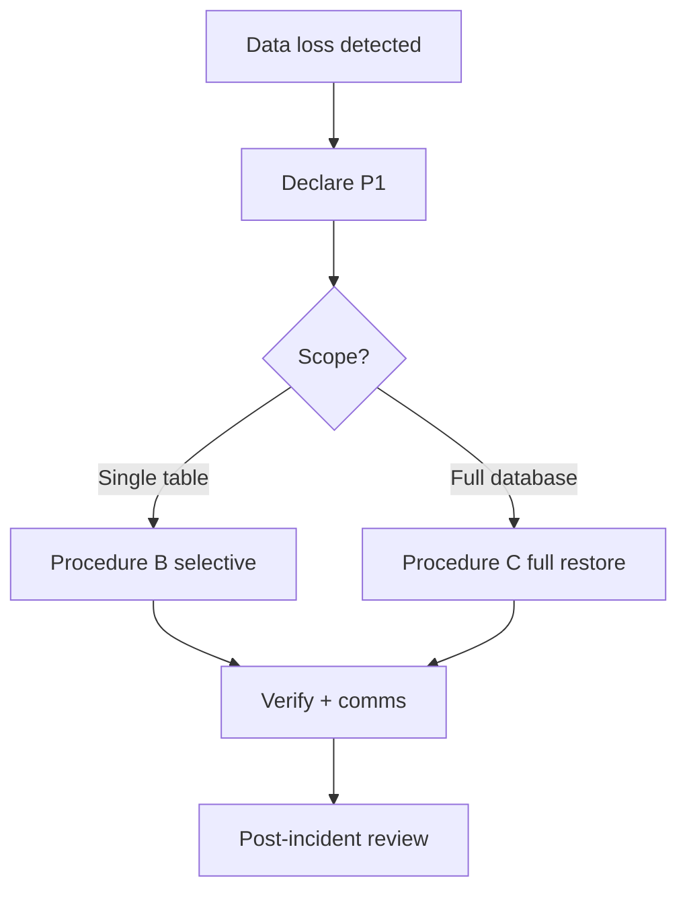

# AgriVault Backup and Restore

**Version:** 0.1.0-rc1  
**Audience:** Ministry IT, database administrators, vendor engineering  
**Related:** [DATABASE.md](../DATABASE.md) · [DEPLOYMENT_GUIDE.md](../DEPLOYMENT_GUIDE.md) · [SECURITY.md](../SECURITY.md) · [../business/DATA_GOVERNANCE.md](../business/DATA_GOVERNANCE.md)

---

## Table of contents

1. [Backup strategy overview](#backup-strategy-overview)
2. [Supabase point-in-time recovery (PITR)](#supabase-point-in-time-recovery-pitr)
3. [Export procedures](#export-procedures)
4. [Restore procedures](#restore-procedures)
5. [Restore test cadence](#restore-test-cadence)
6. [Roles and responsibilities](#roles-and-responsibilities)
7. [Related documents](#related-documents)

---

## Backup strategy overview

AgriVault stores all operational data in **Supabase PostgreSQL**. Backups protect farmer registry, workflow submissions, warehouse records, and audit trails defined in [DATABASE.md](../DATABASE.md).



| Backup type | RPO | RTO (pilot) | Owner |
|-------------|-----|-------------|-------|
| Supabase PITR | ≤ 24h (plan-dependent; verify in dashboard) | 4–8 hours | Ministry IT |
| Logical SQL export | Last export timestamp | 8–24 hours | Ministry IT |
| Vercel deployment | Git commit SHA | 30 min (rollback) | Ministry IT |
| Edge Function code | Git + Supabase deploy history | 1 hour | Vendor |

DR programme context: [DISASTER_RECOVERY_PLAN.md](../business/DISASTER_RECOVERY_PLAN.md) · [OPERATING_MODEL.md](../business/OPERATING_MODEL.md)

---

## Supabase point-in-time recovery (PITR)

### Prerequisites

| Requirement | Verification |
|-------------|--------------|
| Supabase Pro plan or higher with PITR enabled | Project Settings → Database → Backups |
| Ministry IT has org admin access | Access review monthly |
| Staging project available for test restores | Separate Supabase project recommended |
| Migration history documented | [DATABASE.md](../DATABASE.md) § Migration history |

### PITR capabilities

| Feature | Detail |
|---------|--------|
| Recovery window | Per Supabase plan (typically 7 days; confirm in dashboard) |
| Granularity | Point-in-time to second within window |
| Scope | Full database cluster |
| Excludes | Auth users stored in Auth schema — verify Auth backup separately |

### When to use PITR

| Scenario | Recommended approach |
|----------|---------------------|
| Accidental DELETE on production table | PITR to staging → selective row restore |
| Bad migration applied | PITR before migration timestamp OR forward fix migration |
| RLS policy error caused mass lockout | Forward fix preferred; PITR if data corrupted |
| Full region loss | New Supabase project + PITR restore (DR plan) |

**Declare P1** if production restore required during pilot hours. Follow [INCIDENT_RESPONSE.md](./INCIDENT_RESPONSE.md).

---

## Export procedures

Logical exports supplement PITR for reporting, audit, and offline archive per [DATA_GOVERNANCE.md](../business/DATA_GOVERNANCE.md).

### Scheduled exports (monthly minimum)

| Export | Method | Storage | Encryption |
|--------|--------|---------|------------|
| Full schema + data | Supabase dashboard → Database backup OR `pg_dump` | Ministry encrypted storage | AES-256 at rest |
| Critical tables only | SQL `\copy` or dashboard CSV | Same | Same |
| Auth user list | Supabase Auth export (admin) | Restricted vault | Required |

### Critical tables (pilot)

| Table | Reason |
|-------|--------|
| `profiles` | User roles and county scope |
| `farmers` | Registry of record |
| `operational_submissions` | Workflow chain |
| `workflow_actions` | Audit trail |
| `plots`, `farmer_visits` | Field capture |
| `warehouses`, `warehouse_transfer_orders` | Logistics |

### Export procedure checklist

- [ ] Announce maintenance window if export impacts performance (large dumps)
- [ ] Record export timestamp (UTC) in ops log
- [ ] Verify dump file checksum
- [ ] Store in Ministry-approved location — **never** commit to Git
- [ ] Restrict access to Ministry IT + data steward
- [ ] Retention: per [DATA_GOVERNANCE.md](../business/DATA_GOVERNANCE.md) (pilot: 12 months minimum)

### On-demand export (incident or audit)

1. Programme lead or data steward requests export ticket
2. Ministry IT executes export within 24h (audit) or 4h (incident)
3. Redact PII if export is for vendor debug — use county-scoped subset only
4. Log request ID and approver name

---

## Restore procedures

### Procedure A — PITR to staging (preferred test path)

| Step | Action |
|------|--------|
| 1 | Identify target recovery timestamp (UTC) |
| 2 | Supabase dashboard → Database → Backups → Restore to new project or staging |
| 3 | Apply any migrations newer than recovery point if doing forward-only test |
| 4 | Update staging env vars in Vercel preview ([DEPLOYMENT_GUIDE.md](../DEPLOYMENT_GUIDE.md)) |
| 5 | Run smoke tests: login, verification queue, sync-batch to staging |
| 6 | Document results in restore test log |

### Procedure B — Selective table restore

| Step | Action |
|------|--------|
| 1 | PITR restore to **temporary** staging project |
| 2 | Export affected rows from staging |
| 3 | Validate row counts and county scope |
| 4 | Insert into production with transaction + programme lead approval |
| 5 | Verify RLS policies still enforce county isolation ([SECURITY.md](../SECURITY.md)) |

### Procedure C — Production full restore (last resort)

| Step | Action |
|------|--------|
| 1 | Declare P1; incident commander assigned |
| 2 | Notify programme lead and county CACs — platform read-only or down |
| 3 | Execute PITR restore per Supabase runbook |
| 4 | Redeploy application at known-good commit ([RELEASE_PROCESS.md](./RELEASE_PROCESS.md)) |
| 5 | Redeploy `sync-batch` Edge Function |
| 6 | Full smoke test per [DEPLOYMENT_GUIDE.md](../DEPLOYMENT_GUIDE.md) |
| 7 | Confirm CLAN devices can re-sync without data loss (client_id idempotency) |
| 8 | PIR within 5 business days |



### Application rollback (non-database)

If only application regression (no DB corruption):

```bash
# Vercel dashboard → Deployments → Promote previous production
# OR git revert + redeploy per RELEASE_PROCESS.md
```

Does not replace database restore when data was mutated incorrectly.

---

## Restore test cadence

| Test type | Frequency | Environment | Success criteria |
|-----------|-----------|-------------|------------------|
| PITR restore drill | **Quarterly** | Staging project | Login + workflow query succeeds |
| Logical export integrity | **Monthly** | Offline archive | Dump restores to local/staging |
| Edge Function redeploy | **Monthly** | Staging | sync-batch smoke passes |
| Rollback drill | **Quarterly** | Production (off-hours) | Previous Vercel deploy promoted in < 30 min |

### Restore test log template

| Field | Value |
|-------|-------|
| Test date | |
| Test type | PITR / Export / Rollback |
| Recovery point | Timestamp UTC |
| Executor | Ministry IT name |
| Duration | Start → end |
| Tables verified | |
| Smoke test result | Pass / Fail |
| Issues found | |
| Next test due | |

### Pilot minimum (RC1)

Before Ministry go-live:

- [ ] One successful PITR restore to staging documented
- [ ] One monthly export completed and checksum verified
- [ ] Restore test log linked in monthly IT ops review ([RUNBOOK.md](./RUNBOOK.md))

---

## Roles and responsibilities

| Activity | Ministry IT | Vendor | Programme lead | Data steward |
|----------|:-----------:|:------:|:--------------:|:------------:|
| Enable PITR | A/R | C | I | I |
| Monthly export | A/R | C | I | C |
| Restore execution | A/R | R | C | C |
| Restore approval (production) | A | C | R | C |
| Restore test scheduling | A/R | C | I | I |
| PIR after restore incident | R | R | A | C |

Legend: R = Responsible, A = Accountable, C = Consulted, I = Informed

---

## Related documents

| Document | Topic |
|----------|-------|
| [DATABASE.md](../DATABASE.md) | Schema, migrations, RLS |
| [INCIDENT_RESPONSE.md](./INCIDENT_RESPONSE.md) | P1 restore incidents |
| [ON_CALL_GUIDE.md](./ON_CALL_GUIDE.md) | Escalation during restore |
| [RELEASE_PROCESS.md](./RELEASE_PROCESS.md) | Application rollback |
| [../OFFLINE_ARCHITECTURE.md](../OFFLINE_ARCHITECTURE.md) | sync-batch idempotency |
| [../business/DISASTER_RECOVERY_PLAN.md](../business/DISASTER_RECOVERY_PLAN.md) | DR scenarios |
