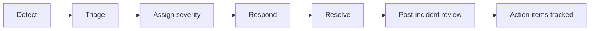
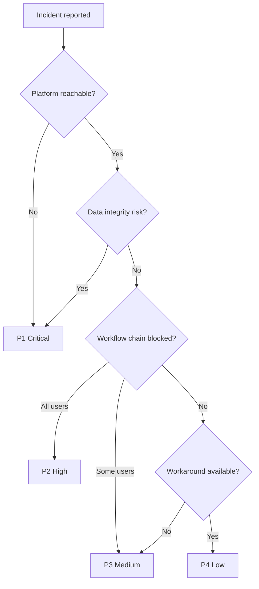
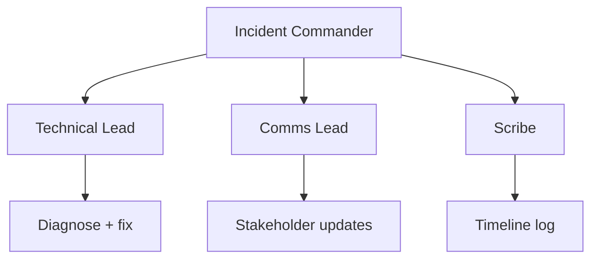

# AgriVault Incident Response

**Version:** 0.1.0-rc1  
**Audience:** Ministry IT, vendor engineering, programme lead, on-call responders  
**Related:** [SECURITY.md](../SECURITY.md) · [MONITORING.md](./MONITORING.md) · [ON_CALL_GUIDE.md](./ON_CALL_GUIDE.md) · [../business/OPERATING_MODEL.md](../business/OPERATING_MODEL.md)

---

## Table of contents

1. [Incident lifecycle](#incident-lifecycle)
2. [Severity definitions (P1–P4)](#severity-definitions-p1p4)
3. [Response times](#response-times)
4. [War room protocol](#war-room-protocol)
5. [Communication templates](#communication-templates)
6. [Post-incident review template](#post-incident-review-template)
7. [Related documents](#related-documents)

---

## Incident lifecycle



| Phase | Owner | Output |
|-------|-------|--------|
| Detect | Monitoring, users, on-call | Alert or ticket opened |
| Triage | On-call engineer | Severity assigned; war room if P1/P2 |
| Assign | Incident commander | Roles: IC, comms, scribe, resolver |
| Resolve | Engineering + Ministry IT | Service restored; workaround documented |
| Post-incident | Incident commander | PIR completed within 5 business days (P1/P2) |

Security incidents follow additional steps in [SECURITY.md](../SECURITY.md). Data breach scenarios reference [DATA_GOVERNANCE.md](../business/DATA_GOVERNANCE.md).

---

## Severity definitions (P1–P4)

| Severity | Definition | User impact | Examples |
|----------|------------|-------------|----------|
| **P1 — Critical** | Platform unavailable or data integrity at risk | All or most users blocked; potential data loss | Supabase unreachable; suspected RLS bypass; production deploy breaks all logins |
| **P2 — High** | Core workflow blocked for majority of operational users | CLAN→Ministry chain stopped; no workaround | Workflow API 500 on all transitions; sync-batch down on field day |
| **P3 — Medium** | Feature degraded for subset of users or roles | Workaround exists; partial county impact | Mapbox tiles fail in one county; PDF export fails; single role cannot approve |
| **P4 — Low** | Cosmetic or non-blocking defect | No operational blockage | Badge label typo; non-critical UI layout issue; demo fixture display |

### Severity decision tree



| Severity | Declare incident? | War room? | Steering Committee notify? |
|----------|-------------------|-----------|----------------------------|
| P1 | Yes — immediately | Yes | Within 4 hours |
| P2 | Yes | Yes (virtual) | If unresolved > 24h |
| P3 | Ticket only | Optional | No |
| P4 | Backlog | No | No |

---

## Response times

SLAs align with [SERVICE_LEVEL_OBJECTIVES.md](./SERVICE_LEVEL_OBJECTIVES.md) and [SUPPORT_ESCALATION.md](./SUPPORT_ESCALATION.md).

| Severity | Acknowledge | First response | Target resolution | Update cadence |
|----------|-------------|----------------|-------------------|----------------|
| P1 | 15 min | 30 min | 4 hours | Every 30 min |
| P2 | 1 hour | 2 hours | 24 hours | Every 2 hours |
| P3 | 4 hours | 8 hours | 5 business days | Daily |
| P4 | 1 business day | 2 business days | Next release | Weekly |

**Pilot vs national target:** During RC1 pilot, P1 resolution target is 4 hours. National scale target (post-pilot) is 2 hours for P1 with 24/7 on-call.

| Role | P1/P2 responsibility |
|------|---------------------|
| Incident commander (IC) | Ministry IT lead or designated vendor PM |
| Technical lead | Vendor engineering on-call |
| Communications | Programme lead or Ministry comms |
| Scribe | Rotating ops staff — timeline in shared doc |
| County liaison | CAC rep if field operations affected |

Escalation path: [ON_CALL_GUIDE.md](./ON_CALL_GUIDE.md)

---

## War room protocol

Activate for all P1 incidents and P2 incidents expected to exceed 2 hours.

### Activation checklist

- [ ] Incident commander assigned and announced in `#agrivault-incidents` (or equivalent channel)
- [ ] Severity and one-line impact statement posted
- [ ] War room bridge link shared (video + chat)
- [ ] Scribe document opened with timestamped timeline
- [ ] On-call engineer joined; vendor engineering paged if P1
- [ ] Status page or stakeholder email draft prepared (programme lead approval)

### War room roles



### During the incident

| Rule | Detail |
|------|--------|
| Single voice | Only IC announces severity changes and ETAs externally |
| No blame | Focus on restoration; defer root-cause debate to PIR |
| Preserve evidence | Save logs with `x-request-id`, deploy SHA, Supabase metrics |
| Workaround first | Document manual process if chain can continue (e.g., paper + later sync) |
| Change freeze | No unrelated production deploys until IC clears |

### Stand-down criteria

- [ ] Service restored and verified via [DEPLOYMENT_GUIDE.md](../DEPLOYMENT_GUIDE.md) smoke tests
- [ ] Monitoring green for 30 minutes (P1) or 15 minutes (P2)
- [ ] Stakeholder all-clear sent
- [ ] PIR scheduled within 5 business days (P1/P2)

---

## Communication templates

### Initial notification (P1/P2)

```
Subject: [P1|P2] AgriVault incident — <one-line impact>

Severity: P1 / P2
Start time: <UTC + local>
Impact: <who cannot do what>
Current status: Investigating / Identified / Mitigating / Resolved
Incident commander: <name>
Next update: <time>
War room: <link if P1>
```

### Status update (during incident)

```
Update #<n> — <timestamp>
Status: <Investigating|Mitigating|Monitoring|Resolved>
Actions taken: <bullet list>
Current hypothesis: <brief>
Next steps: <brief>
ETA: <honest estimate or "unknown">
```

### Resolution notice

```
Subject: [RESOLVED] AgriVault incident — <title>

Resolved at: <time>
Duration: <minutes/hours>
Root cause (preliminary): <one sentence>
User action required: <none | re-sync | re-login>
PIR scheduled: <date>
```

County-facing guidance for field impact: [SOP_FIELD_OPERATIONS.md](./SOP_FIELD_OPERATIONS.md) § Error handling.

---

## Post-incident review template

Required for **P1 and P2** within **5 business days**. Optional for recurring P3.

| Section | Content |
|---------|---------|
| Header | ID `INC-YYYY-MM-DD-###`, severity, duration, IC, review date |
| Summary | One paragraph: impact, resolution |
| Timeline | UTC table: detect → triage → war room → fix → verify → close |
| Impact | Users/counties, data impact, queue delay, SLO breach ([SERVICE_LEVEL_OBJECTIVES.md](./SERVICE_LEVEL_OBJECTIVES.md)) |
| Root cause | Trigger vs root cause vs contributing factors (5 Whys) |
| Retrospective | What went well / poorly (detection, comms, rollback) |
| Action items | ID, action, owner, due — tag Prevent / Detect / Respond / Recover |
| Sign-off | IC, Ministry IT, vendor lead, programme lead |

Store PIR in programme incident archive. Link actions to [RELEASE_PROCESS.md](./RELEASE_PROCESS.md).

---

## Related documents

| Document | Topic |
|----------|-------|
| [ON_CALL_GUIDE.md](./ON_CALL_GUIDE.md) | Rotation and escalation |
| [MONITORING.md](./MONITORING.md) | Alert thresholds |
| [SUPPORT_ESCALATION.md](./SUPPORT_ESCALATION.md) | Tier 0–3 paths |
| [BACKUP_RESTORE.md](./BACKUP_RESTORE.md) | Data recovery incidents |
| [../business/DISASTER_RECOVERY_PLAN.md](../business/DISASTER_RECOVERY_PLAN.md) | DR scenarios |
| [../KNOWN_LIMITATIONS.md](../KNOWN_LIMITATIONS.md) | RC1 known gaps |
