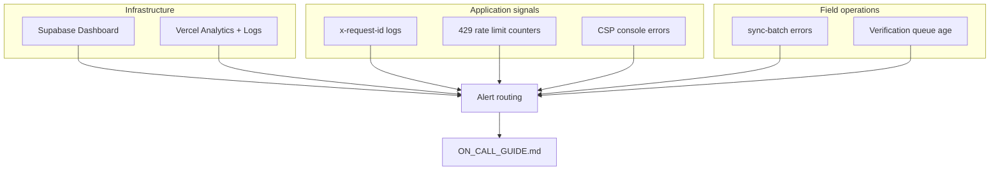
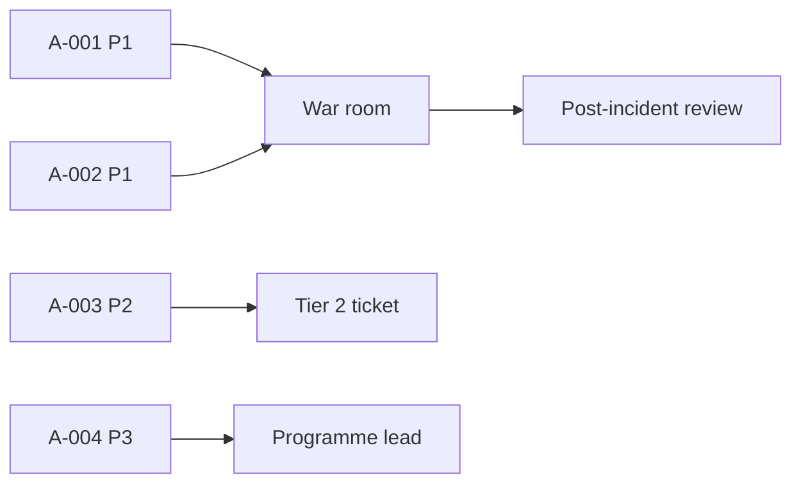

# AgriVault Monitoring Guide

**Version:** 0.1.0-rc1  
**Audience:** Ministry IT, vendor engineering, on-call responders  
**Related:** [SECURITY.md](../SECURITY.md) · [DEPLOYMENT_GUIDE.md](../DEPLOYMENT_GUIDE.md) · [RUNBOOK.md](./RUNBOOK.md) · [SERVICE_LEVEL_OBJECTIVES.md](./SERVICE_LEVEL_OBJECTIVES.md)

---

## Table of contents

1. [Monitoring overview](#monitoring-overview)
2. [Supabase dashboard](#supabase-dashboard)
3. [Vercel analytics and logs](#vercel-analytics-and-logs)
4. [Request correlation (x-request-id)](#request-correlation-x-request-id)
5. [Sync-batch Edge Function](#sync-batch-edge-function)
6. [Rate limiting (429)](#rate-limiting-429)
7. [Content Security Policy (CSP)](#content-security-policy-csp)
8. [Alert thresholds summary](#alert-thresholds-summary)
9. [Related documents](#related-documents)

---

## Monitoring overview

AgriVault RC1 monitoring spans three planes: **infrastructure** (Supabase, Vercel), **application** (API errors, workflow throughput), and **field operations** (offline sync, queue aging). No single dashboard covers all layers — operators combine vendor consoles with in-app surfaces.

| Signal source | Primary owner | Review cadence |
|---------------|---------------|----------------|
| Supabase health | Ministry IT | Daily |
| Vercel deployment + analytics | Ministry IT | Daily |
| Structured API logs | Vendor engineering | On incident + weekly |
| Edge Function logs | Ministry IT | Daily (field days) |
| In-app queues | Programme lead / DAO / CAC | Daily |

Reference: [production-readiness.md](../production-readiness.md) · [OPERATING_MODEL.md](../business/OPERATING_MODEL.md)

---

## Supabase dashboard

**URL:** Supabase project → Dashboard  
**Owner:** Ministry IT

### What to monitor

| Metric | Location | Healthy baseline | Warning | Critical |
|--------|----------|------------------|---------|----------|
| Database status | Project home | Operational | Degraded | Unavailable |
| Active connections | Database → Reports | < 60% of plan limit | > 80% | > 95% |
| Auth sign-ins | Auth → Logs | Steady pilot pattern | Spike of failures | Mass lockout |
| Edge Function invocations | Edge Functions → `sync-batch` | Success > 95% | Success 80–95% | Success < 80% |
| Edge Function errors | Edge Functions → Logs | 0 sustained 5xx | 5xx > 1% / 1h | 5xx > 5% / 15m |
| Disk usage | Settings → Usage | < 70% | 70–85% | > 85% |
| API latency (PostgREST) | Logs | p95 < 500ms | p95 500ms–2s | p95 > 2s |

### Supabase checklist (daily)

- [ ] Project status green; no schema drift vs [DATABASE.md](../DATABASE.md)
- [ ] No RLS policy error spike; service role limited to Edge Functions ([SECURITY.md](../SECURITY.md))

---

## Vercel analytics and logs

**URL:** Vercel project → Analytics, Logs, Deployments  
**Owner:** Ministry IT

### What to monitor

| Metric | Location | Healthy baseline | Warning | Critical |
|--------|----------|------------------|---------|----------|
| Production uptime | Deployments | 200 on `/login` | Intermittent 5xx | Sustained 5xx > 5m |
| Build status | Latest deployment | Ready | Error (preview) | Error (production) |
| Function duration | Logs → `/api/*` | p95 < 3s | p95 3–10s | p95 > 10s or timeouts |
| 4xx rate | Analytics | Stable | Spike on `/login` | Auth-wide 401 spike |
| 5xx rate | Analytics | < 0.1% | 0.1–1% | > 1% sustained |

### Deployment correlation

After each production deploy, verify:

1. Deployment commit matches approved release ([RELEASE_PROCESS.md](./RELEASE_PROCESS.md))
2. Environment variables unchanged ([DEPLOYMENT_GUIDE.md](../DEPLOYMENT_GUIDE.md))
3. Smoke test: login → `/command-center` → `/map` → workflow approve path

---

## Request correlation (x-request-id)

Every middleware response and API route includes `x-request-id` for log correlation.

| Layer | Implementation | Log field |
|-------|----------------|-----------|
| Middleware | Generates or propagates UUID | Response header |
| API routes | `beginApiRequest()` / `apiHeaders()` | `"requestId"` in JSON logs |
| Client debugging | Browser Network tab → Response Headers | Copy UUID for ticket |

**Investigation workflow:** capture header → search Vercel logs → correlate Supabase Edge Function timestamp → attach to Tier 2 ticket. Declare incident if P1/P2 ([INCIDENT_RESPONSE.md](./INCIDENT_RESPONSE.md)).

| Step | Action |
|------|--------|
| 1 | Capture `x-request-id` from browser or `curl -I` |
| 2 | Search Vercel function logs for the UUID |
| 3 | Match timestamp to Supabase Edge Function / Postgres logs |
| 4 | Attach ID to support ticket for Tier 2 handoff |

Reference: [API_GUIDE.md](../API_GUIDE.md) · [ARCHITECTURE.md](../ARCHITECTURE.md) § Request context

---

## Sync-batch Edge Function

**Function:** `supabase/functions/sync-batch/index.ts`  
**Purpose:** Idempotent offline queue upsert for farmers, plots, production records

### What to monitor

| Signal | Source | Warning | Critical |
|--------|--------|---------|----------|
| HTTP 5xx responses | Supabase Edge Function logs | > 5 failures / hour | > 20 failures / hour |
| HTTP 401/403 | Edge Function logs | Any sustained pattern | All CLAN devices failing auth |
| Payload validation errors | Function stderr | > 10% of batch | > 30% of batch |
| Pending queue never clears | `/field/sync-queue` in-app | Single device > 24h | County-wide on field day |
| Duplicate client_id conflicts | Postgres logs | Investigate | Data integrity review |

### Field-day sync SLO

| Window | Target | Measurement |
|--------|--------|-------------|
| Per field day | ≥ 80% CLAN devices sync to zero pending | CAC daily sync log |
| Per week | ≥ 95% batches succeed on first attempt | Edge Function success rate |

See [OFFLINE_ARCHITECTURE.md](../OFFLINE_ARCHITECTURE.md) and [SOP_FIELD_OPERATIONS.md](./SOP_FIELD_OPERATIONS.md).

---

## Rate limiting (429)

In-process rate limiting protects five API routes. Limits are per-instance (Vercel serverless).

| Route | Limit (RC1) | User impact |
|-------|-------------|-------------|
| `/api/demo-inquiry` | 10 req / min / IP | Public form blocked briefly |
| Protected API routes | Per [SECURITY.md](../SECURITY.md) | Retry after 60s |

### What to monitor

| Signal | Warning | Critical |
|--------|---------|----------|
| 429 rate on any route | > 5% of requests / 1h | > 20% / 15m (possible abuse or misconfigured client) |
| 429 on authenticated workflow routes | Any sustained | Workflow blocked for reviewers |
| Rate limit headers present | Missing on limited routes | Configuration regression |

**Smoke test (monthly):** Submit 11 demo-inquiry requests within 1 minute — 11th must return 429. See [DEPLOYMENT_GUIDE.md](../DEPLOYMENT_GUIDE.md) § Smoke tests.

User guidance: wait 60 seconds and retry ([CLAN_FIELD_GUIDE.md](../CLAN_FIELD_GUIDE.md), [DAO_GUIDE.md](../DAO_GUIDE.md)).

---

## Content Security Policy (CSP)

CSP is enforced via Next.js middleware. Violations appear in browser DevTools console, not server logs.

### What to monitor

| Violation type | Typical cause | Action |
|----------------|---------------|--------|
| `connect-src` blocked | Mapbox or Supabase domain missing | Verify `next.config.mjs` deployed |
| `script-src` blocked | Third-party script not allowlisted | Review dependency; update CSP |
| `img-src` blocked | Map tiles or avatar URL | Add Mapbox CDN to policy |
| `worker-src` blocked | Service worker scope | PWA install regression |

### CSP monitoring checklist (weekly)

- [ ] `/login` — no console CSP errors
- [ ] `/map` — Mapbox tiles load
- [ ] `/field/boundary-capture` — Geolocation + map render
- [ ] PWA install flow — service worker registers
- [ ] Supabase Auth redirect — no blocked connections

Reference: [SECURITY.md](../SECURITY.md) § Content Security Policy · [production-readiness.md](../production-readiness.md)

---

## Alert thresholds summary

| Alert ID | Condition | Severity | Notify | Response SLA |
|----------|-----------|----------|--------|--------------|
| A-001 | Production 5xx > 1% for 15m | P1 | On-call + programme lead | 15 min |
| A-002 | Supabase database unavailable | P1 | On-call + Ministry IT director | 15 min |
| A-003 | sync-batch success < 80% / 1h | P2 | Vendor Tier 2 | 4 h |
| A-004 | Verification queue oldest > 72h | P3 | Programme lead | 8 h |
| A-005 | 429 spike > 20% / 15m | P3 | Ministry IT | 8 h |
| A-006 | CSP violations reported by 2+ counties | P3 | Vendor engineering | 8 h |
| A-007 | Disk usage > 85% | P2 | Ministry IT | 4 h |
| A-008 | Auth failure spike > 50% / 30m | P2 | Ministry IT | 4 h |

Alert routing: [ON_CALL_GUIDE.md](./ON_CALL_GUIDE.md) · [INCIDENT_RESPONSE.md](./INCIDENT_RESPONSE.md) · [SUPPORT_ESCALATION.md](./SUPPORT_ESCALATION.md)

---

## Related documents

| Document | Topic |
|----------|-------|
| [RUNBOOK.md](./RUNBOOK.md) | Daily/weekly/monthly procedures |
| [SERVICE_LEVEL_OBJECTIVES.md](./SERVICE_LEVEL_OBJECTIVES.md) | SLO targets and measurement |
| [BACKUP_RESTORE.md](./BACKUP_RESTORE.md) | Database recovery monitoring |
| [../OFFLINE_ARCHITECTURE.md](../OFFLINE_ARCHITECTURE.md) | Sync pipeline detail |
| [../business/OPERATING_MODEL.md](../business/OPERATING_MODEL.md) | Ownership and cadence |
