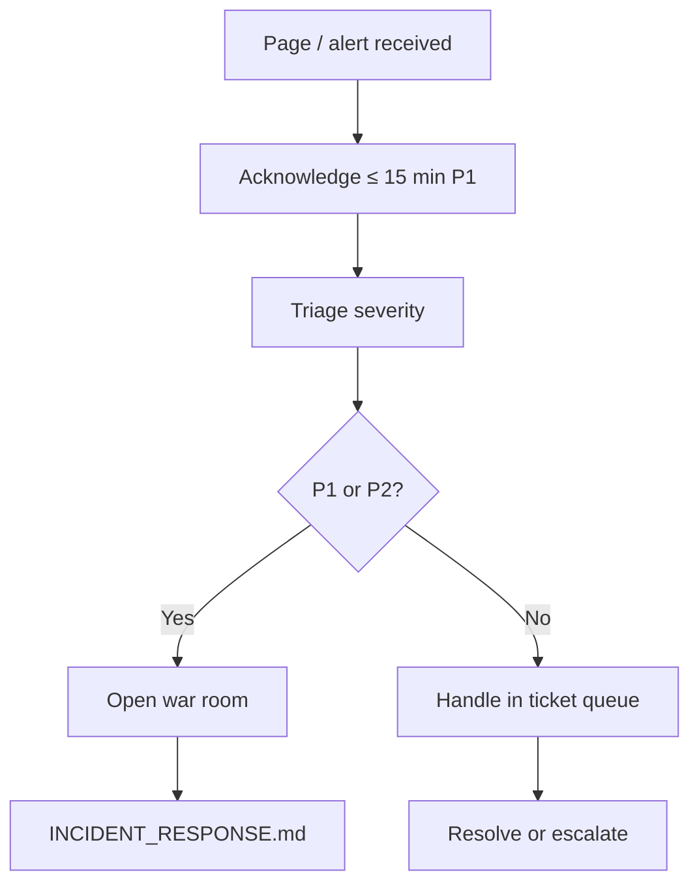
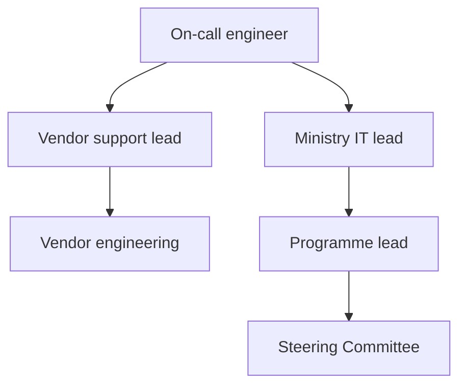

# AgriVault On-Call Guide

**Version:** 0.1.0-rc1  
**Audience:** Ministry IT, vendor engineering, programme lead  
**Related:** [INCIDENT_RESPONSE.md](./INCIDENT_RESPONSE.md) · [MONITORING.md](./MONITORING.md) · [SUPPORT_ESCALATION.md](./SUPPORT_ESCALATION.md) · [../business/OPERATING_MODEL.md](../business/OPERATING_MODEL.md)

---

## Table of contents

1. [On-call scope](#on-call-scope)
2. [Rotation schedule](#rotation-schedule)
3. [Handoff checklist](#handoff-checklist)
4. [Contact tree](#contact-tree)
5. [When to escalate](#when-to-escalate)
6. [On-call responsibilities](#on-call-responsibilities)
7. [Related documents](#related-documents)

---

## On-call scope

On-call covers **Tier 3** platform incidents: production outages, security events, data integrity concerns, and P1/P2 escalations from Tier 2 support.



| In scope | Out of scope (route elsewhere) |
|----------|----------------------------------|
| Vercel / Supabase outages | CLAN device setup (Tier 0–1) |
| sync-batch failures at scale | Individual workflow data correction (DAO/CAC) |
| Auth-wide failures | Training requests |
| Suspected security breach | Feature requests |
| Production rollback decisions | County queue backlog without platform fault |

Pilot coverage: **business hours primary + extended hours on field days**. National scale adds 24/7 rotation per [SERVICE_LEVEL_OBJECTIVES.md](./SERVICE_LEVEL_OBJECTIVES.md).

---

## Rotation schedule

### Pilot phase (RC1)

| Week | Primary on-call | Secondary (backup) | Escalation |
|------|-----------------|--------------------|------------|
| Odd | Ministry IT engineer | Vendor support lead | Vendor engineering manager |
| Even | Vendor support lead | Ministry IT engineer | Ministry IT director |

**Rotation rules**

- Handoff every **Monday 08:00 local** (Africa/Monrovia)
- Minimum **2 qualified responders** per shift
- Field-day weeks: extend coverage to **06:00–20:00 local**
- Holiday coverage planned **2 weeks ahead**

### Calendar requirements

| Item | Detail |
|------|--------|
| Paging tool | Ministry IT-approved (email + SMS minimum) |
| Shared calendar | `AgriVault On-Call` with primary + secondary |
| Runbook link | This guide + [RUNBOOK.md](./RUNBOOK.md) pinned in channel |
| Access | Vercel, Supabase dashboard, GitHub deploy rights |

### Qualification

On-call engineers must have:

- [ ] Completed AgriVault deployment walkthrough ([DEPLOYMENT_GUIDE.md](../DEPLOYMENT_GUIDE.md))
- [ ] Executed staging smoke test independently
- [ ] Read [SECURITY.md](../SECURITY.md) and [INCIDENT_RESPONSE.md](./INCIDENT_RESPONSE.md)
- [ ] Access to production env vars (Ministry IT vault — never in chat)

---

## Handoff checklist

Complete **outgoing → incoming** handoff every rotation change.

### Outgoing on-call (30 min before end of shift)

- [ ] All open P1/P2 incidents summarized with current status
- [ ] Open Tier 3 tickets listed with owner and next action
- [ ] Monitoring anomalies noted (429 spikes, sync-batch errors, queue aging)
- [ ] Pending production deploys or change requests flagged
- [ ] `x-request-id` references attached to unresolved error tickets
- [ ] Handoff message posted in `#agrivault-ops` with template below

### Incoming on-call

- [ ] Acknowledged handoff in channel
- [ ] Paging tool tested (test page or confirm routing)
- [ ] Vercel + Supabase dashboards accessible
- [ ] [MONITORING.md](./MONITORING.md) alert thresholds reviewed
- [ ] Contact tree current (see below)

### Handoff message template

```
On-call handoff — <date>
Outgoing: <name> → Incoming: <name>

Open incidents: <none | list>
Open Tier 3 tickets: <count + links>
Monitoring notes: <sync-batch / 429 / CSP / none>
Scheduled changes: <none | describe>
Field day this week: <yes/no>
```

---

## Contact tree



### Contact table (pilot)

| Role | Responsibility | Contact method | When to contact |
|------|----------------|----------------|-----------------|
| Primary on-call | First responder | Pager + phone | All Tier 3 pages |
| Secondary on-call | Backup if primary unreachable | Pager + phone | Primary no ACK in 15 min |
| Ministry IT lead | Escalation, access, comms approval | Phone + email | P1 unresolved > 1h |
| Vendor engineering | Code fix, rollback, Edge Function | Slack + phone | P1/P2 technical |
| Programme lead | Stakeholder comms, county coordination | Phone + email | P1; field-day sync crisis |
| County CAC lead | Field liaison | Phone | Field-wide sync failure |
| CISO / security | Data breach | Phone | Suspected breach only |

**Do not** post service role keys, passwords, or PII in incident channels. Use Ministry IT secret vault.

Store live phone numbers in the programme **internal contact sheet** (not in this repo).

---

## When to escalate

### Escalate to secondary on-call

| Condition | Timeframe |
|-----------|-----------|
| Primary does not ACK page | 15 minutes |
| Primary unavailable | Immediately |
| Incident complexity exceeds single engineer | When identified |

### Escalate to Ministry IT lead + vendor engineering

| Condition | Severity |
|-----------|----------|
| Production down | P1 |
| Data integrity suspected | P1 |
| Cannot rollback within 30 min | P1/P2 |
| sync-batch failure > 50% CLAN devices | P2 |
| Security anomaly (RLS, auth bypass) | P1 |

### Escalate to programme lead

| Condition | Action |
|-----------|--------|
| P1 declared | Notify within 30 min |
| Field day sync failure county-wide | Coordinate county comms |
| Incident > 4h unresolved | Steering prep |
| User-facing workaround needed | Approve messaging |

### Escalate to Steering Committee

| Condition | Timing |
|-----------|--------|
| P1 lasting > 4 hours | Per [INCIDENT_RESPONSE.md](./INCIDENT_RESPONSE.md) |
| Confirmed data breach | Immediate |
| Pilot go/no-go impact | Programme lead discretion |

Automatic triggers from [OPERATING_MODEL.md](../business/OPERATING_MODEL.md):

| Trigger | Escalate to |
|---------|-------------|
| Platform unreachable > 15 min | Tier 3 — war room |
| 3+ counties same issue | Tier 2 → Tier 3 |
| Suspected data breach | Tier 3 + CISO |

---

## On-call responsibilities

### First 15 minutes (any page)

1. ACK the page
2. Assign preliminary severity (P1–P4)
3. Open incident ticket with timestamp
4. Check Vercel deployment status and Supabase health
5. Post initial status to `#agrivault-incidents`
6. If P1/P2 — assume incident commander role or assign

### Common runbook shortcuts

| Symptom | First action | Doc |
|---------|--------------|-----|
| All routes 500 | Check latest Vercel deploy; rollback if recent | [RELEASE_PROCESS.md](./RELEASE_PROCESS.md) |
| Login loop | Verify Supabase env vars on Vercel | [DEPLOYMENT_GUIDE.md](../DEPLOYMENT_GUIDE.md) |
| Sync stuck | Check Edge Function logs for `sync-batch` | [MONITORING.md](./MONITORING.md) |
| Maps blank | CSP / Mapbox token | [SECURITY.md](../SECURITY.md) |
| Workflow 500 | Capture `x-request-id`; check API logs | [API_GUIDE.md](../API_GUIDE.md) |

### After resolution

- [ ] Confirm monitoring green per stand-down criteria
- [ ] Update incident ticket to Resolved
- [ ] Schedule PIR if P1/P2 ([INCIDENT_RESPONSE.md](./INCIDENT_RESPONSE.md))
- [ ] Log entry in weekly ops review

### On-call wellbeing

- Maximum **7 consecutive days** primary rotation (pilot)
- **Comp time** or swap documented for overnight P1 pages
- No on-call during approved leave without trained backup confirmed

---

## Related documents

| Document | Topic |
|----------|-------|
| [INCIDENT_RESPONSE.md](./INCIDENT_RESPONSE.md) | Severity, war room, PIR |
| [RUNBOOK.md](./RUNBOOK.md) | Daily operational checks |
| [MONITORING.md](./MONITORING.md) | What to watch |
| [SUPPORT_ESCALATION.md](./SUPPORT_ESCALATION.md) | Tier 0–3 model |
| [BACKUP_RESTORE.md](./BACKUP_RESTORE.md) | Database recovery |
| [../business/OPERATING_MODEL.md](../business/OPERATING_MODEL.md) | RACI and ownership |
