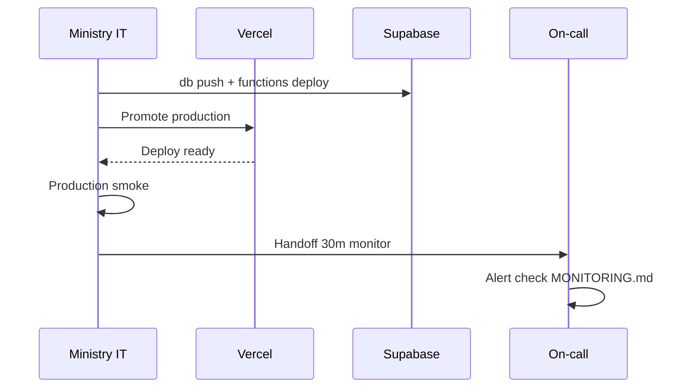

# AgriVault Release Process

**Version:** 0.1.0-rc1
**Audience:** Ministry IT, vendor engineering, programme lead
**Related:** [DEPLOYMENT_GUIDE.md](../DEPLOYMENT_GUIDE.md) · [RELEASE_NOTES_RC1.md](../RELEASE_NOTES_RC1.md) · [SECURITY.md](../SECURITY.md) · [RUNBOOK.md](./RUNBOOK.md)

---

## Table of contents

1. [Release overview](#release-overview)
2. [Pre-release gate (lint / build / test)](#pre-release-gate-lint--build--test)
3. [Staging deployment and smoke](#staging-deployment-and-smoke)
4. [Production promotion](#production-promotion)
5. [Rollback procedure](#rollback-procedure)
6. [Release checklist](#release-checklist)
7. [Related documents](#related-documents)

---

## Release overview

AgriVault RC1 releases flow through **Git → CI gate → Vercel preview (staging) → production promote**. Database migrations and Edge Functions deploy separately via Supabase CLI.


| Release type | Approval | Typical window |
|--------------|----------|----------------|
| RC / pilot patch | Ministry IT + programme lead | Off-peak; not on field days if avoidable |
| Hotfix (P1/P2) | Ministry IT + incident commander | Immediate |
| Database migration | Ministry IT + vendor DBA review | Maintenance window |

Current release: [RELEASE_NOTES_RC1.md](../RELEASE_NOTES_RC1.md) — version **0.1.0-rc1**

---

## Pre-release gate (lint / build / test)

All three commands must pass before any production promotion. These gates verified RC1 on 2026-07-03.

### Required commands

```bash
cd agritrace
npm run lint
npm run build
npm run test:workflow
```

| Gate | Pass criteria | Failure action |
|------|---------------|----------------|
| `npm run lint` | Zero errors | Fix lint; no `--no-verify` bypass |
| `npm run build` | 150 routes compile | Fix build errors; check env in CI |
| `npm run test:workflow` | 29/29 checks (RC1 baseline) | Fix workflow FSM regression |

### CI integration

| Stage | Trigger | Blocks merge? |
|-------|---------|---------------|
| Lint | PR to `main` | Yes |
| Build | PR to `main` | Yes |
| test:workflow | PR to `main` | Yes |

Local verification is mandatory even when CI passes — CI env may differ from production env vars.

### Additional pre-release reviews

| Review | Owner | Required for |
|--------|-------|--------------|
| Security diff | Vendor + Ministry IT | Auth, RLS, CSP, rate limit changes |
| Migration review | Ministry IT | Any `supabase/migrations/*.sql` |
| Release notes draft | Vendor PM | User-visible changes |
| Known limitations update | Programme lead | New gaps discovered |

Reference: [production-readiness.md](../production-readiness.md) · [KNOWN_LIMITATIONS.md](../KNOWN_LIMITATIONS.md)

---

## Staging deployment and smoke

### Staging environment

| Component | Staging target |
|-----------|----------------|
| Next.js app | Vercel preview deployment OR dedicated staging project |
| Supabase | Staging project (recommended) or production with feature flag off |
| Edge Functions | Deploy to staging Supabase first |

Configure staging env vars per [DEPLOYMENT_GUIDE.md](../DEPLOYMENT_GUIDE.md). Staging must **never** use production service role keys on developer laptops.

### Database and Edge Function staging steps

```bash
# Migrations (staging project)
supabase db push

# Edge Function
supabase functions deploy sync-batch
```

### Staging smoke test matrix

| # | Step | Expected | Doc reference |
|---|------|----------|---------------|
| 1 | Login `unique Ministry presenter account` | `/command-center` | [MINISTRY_GUIDE.md](../MINISTRY_GUIDE.md) |
| 2 | Login `unique DAO presenter account` | `/district-dashboard` | [DAO_GUIDE.md](../DAO_GUIDE.md) |
| 3 | `/map` | Mapbox tiles; no CSP errors | [SECURITY.md](../SECURITY.md) |
| 4 | `/verification-queue` as DAO | Workflow buttons enabled | [WORKFLOW_ENGINE.md](../WORKFLOW_ENGINE.md) |
| 5 | CLAN field report submit | Appears in DAO queue | [CLAN_FIELD_GUIDE.md](../CLAN_FIELD_GUIDE.md) |
| 6 | DAO → CAC → Ministry approve | `ministry_approved` | End-to-end chain |
| 7 | Executive briefing PDF | Download succeeds (authenticated) | [SOP_CAC.md](./SOP_CAC.md) |
| 8 | PWA install from `/login` | Home screen install works | [SOP_FIELD_OPERATIONS.md](./SOP_FIELD_OPERATIONS.md) |
| 9 | Offline capture → sync | Pending count → 0 | [OFFLINE_ARCHITECTURE.md](../OFFLINE_ARCHITECTURE.md) |
| 10 | Data source badges + rate limit + request ID | LIVE/PILOT visible; 11th demo-inquiry → 429; `x-request-id` on `/login` | [DEPLOYMENT_GUIDE.md](../DEPLOYMENT_GUIDE.md) |

**Staging sign-off:** Ministry IT records pass/fail in release ticket before production promote.

---

## Production promotion

### Promotion steps

| Step | Action | Owner |
|------|--------|-------|
| 1 | Confirm staging smoke 10/10 pass | Ministry IT |
| 2 | Confirm no open P1/P2 incidents | On-call |
| 3 | Notify `#agrivault-ops` — deploy window start | Release manager |
| 4 | Apply migrations to production (if any) | Ministry IT |
| 5 | Deploy Edge Functions to production (if changed) | Ministry IT |
| 6 | Promote Vercel deployment to Production | Ministry IT |
| 7 | Run production smoke (subset: steps 1–4, 11–12) | Ministry IT |
| 8 | Monitor 30 min — Vercel 5xx, sync-batch logs | On-call |
| 9 | Update [RELEASE_NOTES_RC1.md](../RELEASE_NOTES_RC1.md) or append patch notes | Vendor PM |
| 10 | Close release ticket | Release manager |

### Production promotion rules

- **No deploy on active field days** unless hotfix for P1/P2
- **Freeze window:** 24h before steering committee briefing
- **Dual control:** Migrations require second reviewer from Ministry IT
- **Commit traceability:** Production deploy SHA tagged in release ticket



---

## Rollback procedure

### When to rollback

| Condition | Action |
|-----------|--------|
| Production smoke fails post-promote | Immediate Vercel rollback |
| P1 incident caused by deploy | Rollback + declare incident |
| Migration caused data corruption | PITR — see [BACKUP_RESTORE.md](./BACKUP_RESTORE.md) — not simple rollback |

### Application rollback (Vercel)

| Step | Action |
|------|--------|
| 1 | Vercel → Deployments → select last known-good production |
| 2 | Promote to Production |
| 3 | Verify smoke steps 1–4 within 15 minutes |
| 4 | Post status to incident channel |
| 5 | Root-cause fix in new forward deploy — do not re-promote broken SHA |

**Target RTO:** 30 minutes for application rollback ([SERVICE_LEVEL_OBJECTIVES.md](./SERVICE_LEVEL_OBJECTIVES.md)).

### Migration rollback

Forward-fix preferred. Write compensating migration rather than reversing applied SQL unless PITR restore is required.

| Scenario | Approach |
|----------|----------|
| Migration added column | Leave column; fix app to ignore if needed |
| Migration broke RLS | Emergency policy fix migration |
| Migration corrupted data | PITR to staging → selective restore |

### Edge Function rollback

```bash
git checkout <known-good-sha> -- supabase/functions/sync-batch/
supabase functions deploy sync-batch
```

Verify with CLAN sync smoke immediately.

---

## Release checklist

### Pre-release

- [ ] PR approved by Ministry IT and vendor lead
- [ ] `npm run lint && npm run build && npm run test:workflow` pass locally and in CI
- [ ] Release notes updated
- [ ] Migrations reviewed against [DATABASE.md](../DATABASE.md)
- [ ] Staging smoke 10/10 pass documented
- [ ] Field-day calendar checked — deploy window approved

### Production

- [ ] Migrations applied (if any)
- [ ] Edge Functions deployed (if changed)
- [ ] Vercel production promote complete
- [ ] Production smoke pass
- [ ] 30-minute monitoring clear
- [ ] [PILOT_CHECKLIST.md](../PILOT_CHECKLIST.md) updated if launch-impacting

### Post-release

- [ ] Release ticket closed with deploy SHA
- [ ] Known limitations doc updated if applicable
- [ ] County CAC notified if user-visible change
- [ ] Weekly ops review includes release summary

---

## Related documents

| Document | Topic |
|----------|-------|
| [DEPLOYMENT_GUIDE.md](../DEPLOYMENT_GUIDE.md) | Env vars, CLI commands |
| [RELEASE_NOTES_RC1.md](../RELEASE_NOTES_RC1.md) | RC1 scope and verification |
| [INCIDENT_RESPONSE.md](./INCIDENT_RESPONSE.md) | Hotfix incidents |
| [BACKUP_RESTORE.md](./BACKUP_RESTORE.md) | Database recovery |
| [../business/OPERATING_MODEL.md](../business/OPERATING_MODEL.md) | Deployment RACI |
