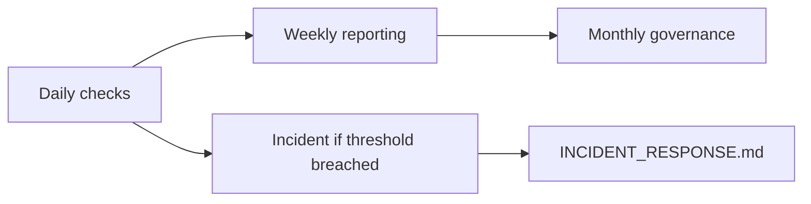
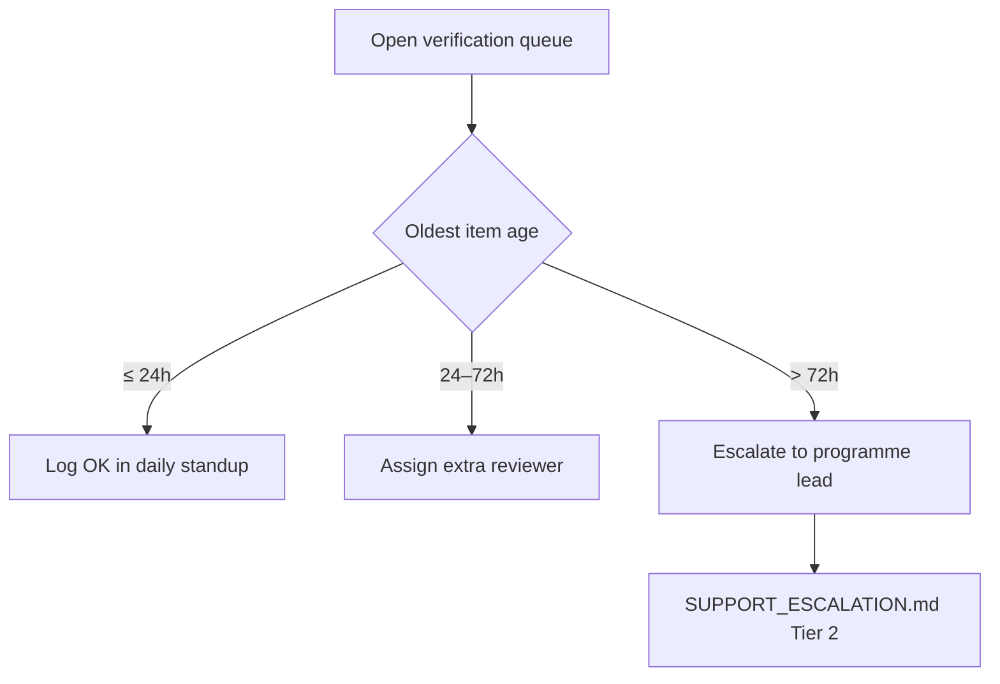

# AgriVault Operations Runbook

**Version:** 0.1.0-rc1  
**Audience:** Ministry IT, vendor ops, programme lead, county CAC leads  
**Related:** [DEPLOYMENT_GUIDE.md](../DEPLOYMENT_GUIDE.md) · [MONITORING.md](./MONITORING.md) · [../business/OPERATING_MODEL.md](../business/OPERATING_MODEL.md) · [../PILOT_CHECKLIST.md](../PILOT_CHECKLIST.md)

---

## Table of contents

1. [Purpose](#purpose)
2. [Daily operations](#daily-operations)
3. [Weekly operations](#weekly-operations)
4. [Monthly operations](#monthly-operations)
5. [Escalation quick reference](#escalation-quick-reference)
6. [Related documents](#related-documents)

---

## Purpose

This runbook defines the recurring operational tasks required to keep AgriVault RC1 healthy during the Ministry pilot. Tasks align with the operating cadence in [OPERATING_MODEL.md](../business/OPERATING_MODEL.md) and the launch checklist in [PILOT_CHECKLIST.md](../PILOT_CHECKLIST.md).



| Cadence | Owner (primary) | Backup | Duration |
|---------|-----------------|--------|----------|
| Daily | Ministry IT + county CAC | Vendor support | 15–30 min |
| Weekly | Programme lead | Ministry IT | 45 min |
| Monthly | Ministry IT + data steward | Vendor | 2 hours |

---

## Daily operations

Run every field day during pilot week 1; otherwise weekdays only unless an incident is active.

### 1. Sync health check

**Owner:** County CAC (field days) · Ministry IT (platform view)

| Step | Action | Pass criteria |
|------|--------|---------------|
| 1 | Open `/field/sync-queue` as CLAN lead or `/field-agents` as DAO/CAC | All active CLAN devices show sync within last 24h |
| 2 | Review Supabase Edge Function logs for `sync-batch` | No sustained 5xx errors in last 24h |
| 3 | Spot-check 2 CLAN devices — pending badge count | Pending count = 0 after reconnect |
| 4 | Confirm `x-request-id` present on failed sync API calls (if any) | IDs captured for Tier 2 ticket |

Reference: [OFFLINE_ARCHITECTURE.md](../OFFLINE_ARCHITECTURE.md) · [CLAN_FIELD_GUIDE.md](../CLAN_FIELD_GUIDE.md)

**Daily sync health checklist**

- [ ] CLAN sync success rate ≥ 80% (field day) or no county reports total failure
- [ ] `sync-batch` Edge Function deployed and responding (see [DEPLOYMENT_GUIDE.md](../DEPLOYMENT_GUIDE.md))
- [ ] No county blocked by 429 rate limits on sync paths
- [ ] Sync failures logged with device ID, county, and timestamp

### 2. Queue backlog review

**Owner:** Programme lead · DAO/CAC reviewers

| Queue | Route | Warning threshold | Critical threshold |
|-------|-------|-------------------|---------------------|
| DAO review | `/verification-queue?status=dao_review` | > 24 items | > 48 items or oldest > 48h |
| CAC review | `/county-dashboard` (CaoApprovalQueues) | > 16 items | > 32 items or oldest > 72h |
| Ministry review | `/verification-queue?status=ministry_review` | > 8 items | > 16 items or oldest > 72h |
| Escalated | `/verification-queue?status=escalated` | Any item > 24h | Any item > 48h |



**Daily queue checklist**

- [ ] Verification queue opened by DAO lead before 10:00 local
- [ ] Items in `dao_review` processed or assigned before EOD
- [ ] Escalated items have owner comment in workflow thread
- [ ] Programme lead notified if any queue exceeds warning threshold

Role guides: [DAO_GUIDE.md](../DAO_GUIDE.md) · [CAC_GUIDE.md](../CAC_GUIDE.md) · [MINISTRY_GUIDE.md](../MINISTRY_GUIDE.md)

### 3. Platform health (Ministry IT)

| Check | Where | Pass criteria |
|-------|-------|---------------|
| Vercel deployment | Vercel dashboard → Production | Latest deploy healthy; no rollback pending |
| Supabase status | Supabase dashboard → Project health | Database + Auth green |
| Login smoke | `/login` → demo or prod user | Redirect to role home within 5s |
| Map load | `/map` | Mapbox tiles render; no CSP console errors |
| API rate limits | Vercel logs / structured JSON | No spike of 429 on protected routes |

See [MONITORING.md](./MONITORING.md) for alert thresholds and [SECURITY.md](../SECURITY.md) for CSP and rate-limit configuration.

**Daily platform checklist**

- [ ] Production URL reachable from Monrovia and pilot county networks
- [ ] No P1/P2 incidents open (see [INCIDENT_RESPONSE.md](./INCIDENT_RESPONSE.md))
- [ ] Environment variables unchanged since last verified deploy
- [ ] Structured logs reviewed for new error patterns

---

## Weekly operations

**Owner:** Programme lead · **When:** Every Monday (pilot) or bi-weekly at scale

### Executive PDF and pilot metrics

| Task | Action | Output |
|------|--------|--------|
| KPI snapshot | Open `/command-center` and `/national-operations` | Screenshot or exported metrics |
| County roll-up | Review each active county dashboard | County comparison table |
| Executive briefing | Generate PDF from `/executive-briefing` | PDF archived to programme share |
| Workflow throughput | Count submissions by status (LIVE source) | Weekly throughput report |
| Sync reliability | Aggregate CLAN sync success by county | Sync reliability % |
| Open incidents | Review closed P2+ from prior week | Post-mortem links attached |

**Weekly checklist**

- [ ] Executive briefing PDF generated and shared with steering stakeholders
- [ ] Pilot metrics table updated (farmers registered, submissions approved, sync rate)
- [ ] Verification queue aging report — no item > 72h without assigned owner
- [ ] Programme status meeting held (30 min per [OPERATING_MODEL.md](../business/OPERATING_MODEL.md))
- [ ] Vendor service ticket summary reviewed (Tier 1–2)
- [ ] [RELEASE_NOTES_RC1.md](../RELEASE_NOTES_RC1.md) known limitations re-checked if user-reported

### Build gate verification (pre-release weeks only)

When a release candidate is staged:

```bash
npm run lint && npm run build && npm run test:workflow
```

All three must pass before production promote. See [RELEASE_PROCESS.md](./RELEASE_PROCESS.md).

---

## Monthly operations

**Owner:** Ministry IT · Ministry data steward · Programme lead

### User audit

| Step | Action | Reference |
|------|--------|-----------|
| 1 | Export Auth users from Supabase dashboard | Match against active pilot roster |
| 2 | Compare `profiles` table roles to intended assignments | [PERMISSIONS_MATRIX.md](../product/PERMISSIONS_MATRIX.md) |
| 3 | Disable accounts for departed staff within 24h of offboarding | [SECURITY.md](../SECURITY.md) § Authentication |
| 4 | Verify demo accounts (`demo-*@agritrace.demo`) not used in production counties | [PILOT_ADMIN_GUIDE.md](../PILOT_ADMIN_GUIDE.md) |
| 5 | Review admin console `/admin` access list | Ministry IT + super_admin only |

**Monthly user audit checklist**

- [ ] All active users have correct `user_role` and county scope
- [ ] No orphaned profiles (Auth user without profile row)
- [ ] Service role key rotation reviewed (if policy requires)
- [ ] Access review signed by Ministry IT and programme lead

### Supabase and infrastructure review

| Area | Review item | Action if failed |
|------|-------------|------------------|
| Database | Migration history vs `supabase/migrations/` | Apply pending migrations per [DATABASE.md](../DATABASE.md) |
| RLS | Spot-check county isolation with test accounts | Open security ticket |
| Backups | PITR window and last restore test | See [BACKUP_RESTORE.md](./BACKUP_RESTORE.md) |
| Edge Functions | `sync-batch` version matches deployed app | Redeploy per [DEPLOYMENT_GUIDE.md](../DEPLOYMENT_GUIDE.md) |
| Storage | Bucket policies unchanged | Audit log review |
| Usage | Connection count, disk, egress trends | Capacity plan update |

**Monthly infrastructure checklist**

- [ ] IT ops review meeting completed (30 min)
- [ ] Backup restore test documented (quarterly minimum; monthly review of status)
- [ ] Security dependency review scheduled with vendor
- [ ] [DATA_GOVERNANCE.md](../business/DATA_GOVERNANCE.md) retention policies confirmed
- [ ] SLO report generated — see [SERVICE_LEVEL_OBJECTIVES.md](./SERVICE_LEVEL_OBJECTIVES.md)

---

## Escalation quick reference

| Condition | Escalate to | Document |
|-----------|-------------|----------|
| Platform down > 15 min | Tier 3 — on-call | [ON_CALL_GUIDE.md](./ON_CALL_GUIDE.md) |
| Sync failure rate > 20% (field day) | Tier 2 — vendor | [SUPPORT_ESCALATION.md](./SUPPORT_ESCALATION.md) |
| Queue backlog > 72h | Programme lead | [OPERATING_MODEL.md](../business/OPERATING_MODEL.md) |
| Suspected data breach | Tier 3 + CISO | [SECURITY.md](../SECURITY.md) |

---

## Related documents

| Document | Topic |
|----------|-------|
| [MONITORING.md](./MONITORING.md) | Observability and alerts |
| [INCIDENT_RESPONSE.md](./INCIDENT_RESPONSE.md) | Incident severity and war room |
| [ON_CALL_GUIDE.md](./ON_CALL_GUIDE.md) | Rotation and handoff |
| [SOP_FIELD_OPERATIONS.md](./SOP_FIELD_OPERATIONS.md) | CLAN daily SOP |
| [SOP_DAO.md](./SOP_DAO.md) | DAO desk SOP |
| [SOP_CAC.md](./SOP_CAC.md) | CAC desk SOP |
| [SOP_MINISTRY.md](./SOP_MINISTRY.md) | Ministry command center SOP |
| [../WORKFLOW_ENGINE.md](../WORKFLOW_ENGINE.md) | Workflow states and transitions |
