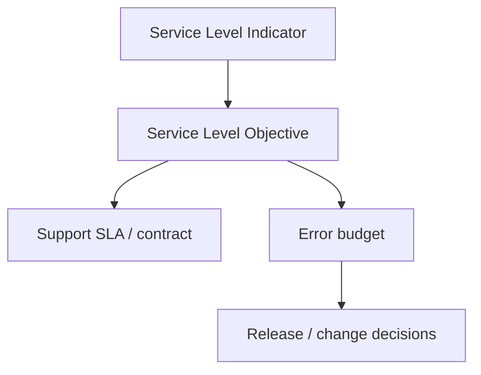
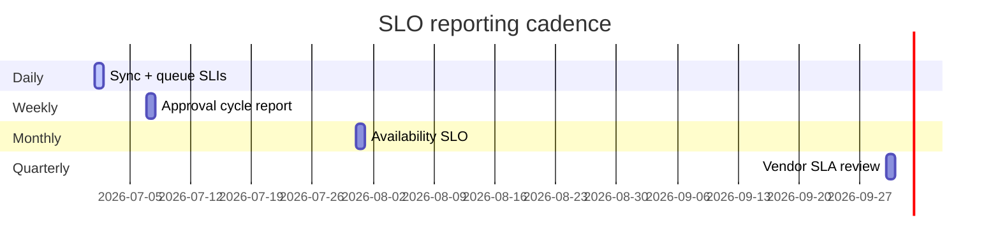

# AgriVault Service Level Objectives

**Version:** 0.1.0-rc1  
**Audience:** Programme lead, Ministry IT, vendor PM, steering committee  
**Related:** [MONITORING.md](./MONITORING.md) · [SUPPORT_ESCALATION.md](./SUPPORT_ESCALATION.md) · [../business/OPERATING_MODEL.md](../business/OPERATING_MODEL.md) · [RUNBOOK.md](./RUNBOOK.md)

---

## Table of contents

1. [SLO framework](#slo-framework)
2. [Availability objectives](#availability-objectives)
3. [Sync success SLO](#sync-success-slo)
4. [Approval cycle SLO](#approval-cycle-slo)
5. [Measurement windows](#measurement-windows)
6. [Error budgets and review](#error-budgets-and-review)
7. [Related documents](#related-documents)

---

## SLO framework

Service Level Objectives (SLOs) define measurable targets for AgriVault pilot and national scale. They complement SLAs in [SUPPORT_ESCALATION.md](./SUPPORT_ESCALATION.md) by specifying **how success is measured**, not just response times.



| Term | Definition |
|------|------------|
| SLI | Quantitative measure (e.g., successful HTTP 200 rate) |
| SLO | Target percentage or threshold over a window |
| SLA | Committed response/resolution with consequences |
| Error budget | 100% − SLO; consumed by incidents and degradation |

Governance: monthly IT ops review ([RUNBOOK.md](./RUNBOOK.md)) · quarterly vendor review ([OPERATING_MODEL.md](../business/OPERATING_MODEL.md))

---

## Availability objectives

### Pilot phase (RC1)

| Service | SLO target | Measurement SLI | Exclusions |
|---------|------------|-----------------|------------|
| Application (Vercel) | **99.5%** monthly uptime | Successful `/login` probe + dashboard 200 rate | Scheduled maintenance (≤ 4h/month, announced) |
| Database (Supabase) | **99.9%** monthly uptime | Supabase health + PostgREST availability | Supabase platform incidents (tracked separately) |
| Authentication | **99.9%** | Successful sign-in completion rate | User credential errors |
| Edge Function `sync-batch` | **99.0%** | Invocation success rate | Client payload validation failures (4xx) |

### National scale target (post-pilot)

| Service | SLO target | Notes |
|---------|------------|-------|
| Application | **99.9%** | 24/7 on-call required |
| Database | **99.95%** | Multi-region review |
| Authentication | **99.95%** | SSO integration phase |
| sync-batch | **99.5%** | Higher volume; autoscaling review |

Reference infrastructure ownership: [OPERATING_MODEL.md](../business/OPERATING_MODEL.md) § Service ownership

### Availability calculation

```
Uptime % = (Total minutes − Downtime minutes) / Total minutes × 100

Downtime minute: probe fails OR > 5% of users report unreachable (confirmed P1)
```

| Probe | Frequency | Source |
|-------|-----------|--------|
| `/login` HTTP 200 | 5 min | Vercel / external monitor |
| Supabase DB ping | 5 min | Supabase dashboard |
| Workflow API sample | 15 min | Authenticated synthetic check (staging-derived) |

---

## Sync success SLO

Offline sync is critical for CLAN field operations ([OFFLINE_ARCHITECTURE.md](../OFFLINE_ARCHITECTURE.md)).

### SLIs

| SLI | Formula |
|-----|---------|
| Batch success rate | Successful `sync-batch` invocations / total invocations |
| Device clear rate | CLAN devices reaching pending=0 same day / active field devices |
| First-attempt success | Batches succeeding without retry / total batches |

### SLO targets

| Metric | Pilot SLO | National target | Window |
|--------|-------------|-----------------|--------|
| Batch success rate | ≥ **95%** | ≥ **99%** | Rolling 7 days |
| Device clear rate (field days) | ≥ **80%** same day | ≥ **90%** | Per field day |
| First-attempt success | ≥ **90%** | ≥ **95%** | Rolling 7 days |
| Max pending age (any device) | ≤ **24h** | ≤ **12h** | Continuous |

### Breach response

| Consumption | Action |
|-------------|--------|
| Error budget > 50% consumed in week | Tier 2 investigation |
| Device clear rate < 80% on field day | County CAC + programme lead same day |
| Batch success < 90% for 1h | P2 incident candidate ([INCIDENT_RESPONSE.md](./INCIDENT_RESPONSE.md)) |
| Batch success < 80% for 15m | P1 incident — page on-call |

Monitoring: [MONITORING.md](./MONITORING.md) § sync-batch · [SOP_FIELD_OPERATIONS.md](./SOP_FIELD_OPERATIONS.md)

---

## Approval cycle SLO

Workflow throughput measures operational chain health ([WORKFLOW_ENGINE.md](../WORKFLOW_ENGINE.md)).

### Cycle definition

**Approval cycle time** = timestamp(`submitted`) → timestamp(`ministry_approved` or terminal state)

Intermediate stages:

| Stage | Status transition | Responsible role |
|-------|-------------------|------------------|
| DAO review | → `dao_approved` | DAO |
| CAC review | → `cac_approved` | CAC |
| Ministry review | → `ministry_approved` | Ministry |

### SLO targets (pilot)

| Metric | Target | Measurement window |
|--------|--------|-------------------|
| DAO stage median time | ≤ **24 hours** | Rolling 14 days |
| CAC stage median time | ≤ **24 hours** | Rolling 14 days |
| Ministry stage median time | ≤ **48 hours** | Rolling 14 days |
| End-to-end median (LIVE submissions) | ≤ **72 hours** | Rolling 14 days |
| Queue max age (any stage) | ≤ **72 hours** | Continuous |
| Escalated item first action | ≤ **24 hours** | Per item |

### National target (post-pilot)

| Metric | Target |
|--------|--------|
| End-to-end median | ≤ **48 hours** |
| Queue max age | ≤ **48 hours** |
| Escalated first action | ≤ **12 hours** |

### Operational vs platform SLO

| Delay cause | Owner | Escalation |
|-------------|-------|------------|
| Reviewer backlog | Programme lead / CAC | [SOP_DAO.md](./SOP_DAO.md) — surge staffing |
| Workflow API failure | Vendor Tier 2 | [SUPPORT_ESCALATION.md](./SUPPORT_ESCALATION.md) |
| Platform outage | On-call Tier 3 | [INCIDENT_RESPONSE.md](./INCIDENT_RESPONSE.md) |

Only platform-caused delays consume **availability error budget**. Reviewer backlog tracked separately in programme KPIs.

---

## Measurement windows

### Window types

| Window | Use | Report |
|--------|-----|--------|
| Rolling 24h | Incident detection, on-call | Real-time dashboard |
| Rolling 7 days | Sync SLO, API error rate | Weekly programme status |
| Rolling 14 days | Approval cycle medians | Weekly executive summary |
| Calendar month | Availability SLO, SLA compliance | Monthly IT ops review |
| Calendar quarter | Vendor SLA, error budget reset | Steering committee |



### Data sources

| SLO | Primary source | Secondary |
|-----|----------------|-----------|
| Availability | Vercel analytics + synthetic probe | User reports (P1 confirmation) |
| Sync success | Supabase Edge Function logs | CAC field-day sync log |
| Approval cycle | `operational_submissions` + `workflow_actions` | `/verification-queue` aging export |
| Auth success | Supabase Auth logs | Tier 1 ticket volume |

Query patterns: [DATABASE.md](../DATABASE.md) · command center KPIs ([MINISTRY_GUIDE.md](../MINISTRY_GUIDE.md))

### Reporting template (monthly)

| SLO | Target | Actual | Error budget remaining | Trend |
|-----|--------|--------|------------------------|-------|
| App availability | 99.5% | | | ↑↓→ |
| DB availability | 99.9% | | | |
| Sync batch success | 95% | | | |
| E2E approval median | 72h | | | |

---

## Error budgets and review

### Error budget policy (pilot)

| SLO | Monthly budget | If exhausted |
|-----|----------------|--------------|
| App 99.5% | ~216 min downtime | Change freeze until root cause addressed |
| Sync 95% / 7d | 5% failed batches | No optional releases; Tier 2 priority |
| Approval 72h median | 10% submissions may exceed | Programme lead staffing review (not IT freeze) |

### Review meetings

| Meeting | SLO topics |
|---------|------------|
| Weekly programme status | Sync + queue aging |
| Monthly IT ops | Availability + error budget |
| Quarterly vendor review | SLA vs SLO compliance, national target readiness |

Improvements feeding [ROADMAP_POST_PILOT.md](../ROADMAP_POST_PILOT.md) when SLOs consistently met for 2 consecutive months.

---

## Related documents

| Document | Topic |
|----------|-------|
| [MONITORING.md](./MONITORING.md) | Alert thresholds |
| [SUPPORT_ESCALATION.md](./SUPPORT_ESCALATION.md) | Response SLAs |
| [RUNBOOK.md](./RUNBOOK.md) | Daily/weekly checks |
| [INCIDENT_RESPONSE.md](./INCIDENT_RESPONSE.md) | SLO breach incidents |
| [../business/OPERATING_MODEL.md](../business/OPERATING_MODEL.md) | Ownership |
| [../RELEASE_NOTES_RC1.md](../RELEASE_NOTES_RC1.md) | RC1 baseline metrics |
