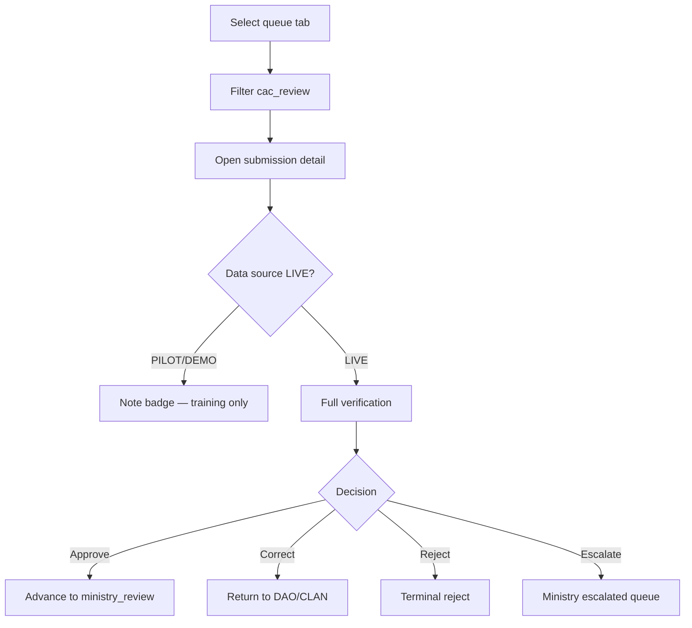

# SOP — CAC Desk Operations

**Version:** 0.1.0-rc1  
**Audience:** County Agriculture Coordinators (CAC), county officers  
**Related:** [CAC_GUIDE.md](../CAC_GUIDE.md) · [SOP_DAO.md](./SOP_DAO.md) · [SOP_MINISTRY.md](./SOP_MINISTRY.md) · [../business/OPERATING_MODEL.md](../business/OPERATING_MODEL.md)

---

## Table of contents

1. [Purpose and scope](#purpose-and-scope)
2. [CAC desk overview](#cac-desk-overview)
3. [Morning queue review SOP](#morning-queue-review-sop)
4. [CaoApprovalQueues procedure](#caoapprovalqueues-procedure)
5. [County KPI review SOP](#county-kpi-review-sop)
6. [Executive briefing preparation SOP](#executive-briefing-preparation-sop)
7. [End-of-day SOP](#end-of-day-sop)
8. [Related documents](#related-documents)

---

## Purpose and scope

This SOP defines daily procedures for **County Agriculture Coordinators** verifying DAO-approved submissions, managing county approval queues, and preparing leadership briefings during AgriVault RC1.

| Role codes | Primary route | Accountable for |
|------------|---------------|-----------------|
| `county_agriculture_coordinator` | `/county-dashboard` | County verification SLA |
| `county_officer` | `/workspace/cac` | Same |

Reference: [CAC_GUIDE.md](../CAC_GUIDE.md) · [DATA_GOVERNANCE.md](../business/DATA_GOVERNANCE.md)

---

## CAC desk overview

### Workspace map

| Surface | Route | Purpose |
|---------|-------|---------|
| County dashboard | `/county-dashboard` | KPIs + **CaoApprovalQueues** |
| Verification queue | `/verification-queue` | Cross-district escalations |
| Executive briefing | `/executive-briefing` | Leadership narrative + PDF |
| Food security | `/food-security` | County indicators |
| Field agents | `/field-agents` | CLAN oversight (county-wide) |
| Reporting | `/reporting/workspace?tab=cac` | County summary |

### CAC daily timeline (pilot)

| Time | Activity | Duration |
|------|----------|----------|
| 08:00 | Morning queue + KPI review | 45 min |
| 09:00–16:00 | Approvals + district oversight | Continuous |
| Thursday | Executive briefing prep (if scheduled) | 60 min |
| 16:30 | End-of-day county flush | 30 min |

---

## Morning queue review SOP

**Owner:** CAC coordinator · **Deadline:** 10:00 local

### Step-by-step

| Step | Action | Pass criteria |
|------|--------|---------------|
| 1 | Login → `/county-dashboard` | County KPIs load |
| 2 | Open **CaoApprovalQueues** — all tabs scanned | `cac_review` count noted |
| 3 | Process oldest `cac_review` items first | Aging > 24h prioritized |
| 4 | Open `/verification-queue` | Escalated/cross-district items assigned |
| 5 | Review `/alerts` | Pest and warehouse signals acknowledged |
| 6 | Check `/field-agents` | County CLAN sync health |
| 7 | Read-only scan `/district-dashboard` | DAO backlog not blocking county flow |

### Morning checklist

- [ ] CaoApprovalQueues — no tab ignored (all submission types reviewed)
- [ ] Escalated items from DAO have CAC owner comment
- [ ] Food security indicators reviewed if alert threshold breached
- [ ] Sync failures escalated per [SOP_FIELD_OPERATIONS.md](./SOP_FIELD_OPERATIONS.md)
- [ ] Items > 72h escalated to programme lead ([RUNBOOK.md](./RUNBOOK.md))

---

## CaoApprovalQueues procedure

**Location:** Embedded in `/county-dashboard` — primary CAC approval surface ([CAC_GUIDE.md](../CAC_GUIDE.md)).

### Queue tabs

| Tab | Submission focus | Review priority |
|-----|------------------|-----------------|
| Farmer registration | New farmer registrations | High — blocks downstream |
| Farm inspection | Field inspection reports | Medium |
| Subsidy verification | Input distribution confirmations | High during distribution season |
| Pest/disease alert | Pest escalations from CLAN/DAO | Urgent — same day |
| Harvest report | Production records | Medium |
| Warehouse / transfer | Logistics submissions | High if stock critical |
| Field report | Daily CLAN activity | Medium |
| GPS boundary | Plot boundary captures | Medium — verify map |

### Tab processing SOP

### Approval actions

| Action | Result | Requirement |
|--------|--------|-------------|
| Approve | → `cac_approved` → `ministry_review` | County scope validated |
| Request corrections | → prior stage with comment | Specific guidance |
| Reject | → `rejected` | Documented reason |
| Escalate | → `escalated` | Policy or cross-county issue |
| Comment | Thread only | Coordination |

### Cross-tab discipline

- Process **Pest/disease alert** tab first on days with active alerts
- Do not batch-approve without opening detail — audit trail requirement ([WORKFLOW_ENGINE.md](../WORKFLOW_ENGINE.md))
- LIVE vs PILOT badges must be acknowledged before approve

---

## County KPI review SOP

**Frequency:** Daily morning + weekly deep dive (Monday)

### Daily KPI scan (`/county-dashboard`)

| KPI area | Action if abnormal |
|----------|-------------------|
| Submissions pending CAC | Assign surge reviewer if > 16 items |
| DAO districts with backlog | Call DAO leads — [SOP_DAO.md](./SOP_DAO.md) |
| CLAN sync rate | Field day follow-up with CLAN leads |
| Food security indicators | `/food-security` drill-down |
| Warehouse stock alerts | Coordinate with Ministry logistics |

### Weekly county KPI deep dive

| Metric | Source | Output |
|--------|--------|--------|
| Submissions approved (week) | County dashboard + reporting tab | Weekly county table |
| Median CAC review time | Workflow timestamps | Compare to 24h SLO |
| CLAN sync success rate | Field agent + CAC log | % per district |
| Escalation count | Verification queue | Root cause notes |
| Data quality flags | `/compliance` | Steward review items |

Targets: [SERVICE_LEVEL_OBJECTIVES.md](./SERVICE_LEVEL_OBJECTIVES.md) · Report in weekly programme meeting ([OPERATING_MODEL.md](../business/OPERATING_MODEL.md))

---

## Executive briefing preparation SOP

**Route:** `/executive-briefing` · **Frequency:** Weekly or before steering meetings

### Preparation timeline

| When | Action |
|------|--------|
| T-2 days | Confirm briefing audience and date |
| T-1 day | Draft narrative sections in executive briefing UI |
| T-0 morning | Final KPI refresh from county dashboard |
| T-0 | Export PDF and distribute |

### Briefing content checklist

- [ ] County name and reporting period in header
- [ ] Farmer registration progress (LIVE data only for official stats)
- [ ] Submission throughput by type (table)
- [ ] Pest/disease highlights if any
- [ ] Food security summary
- [ ] Open escalations and risks
- [ ] Data source badges explained (LIVE vs PILOT)
- [ ] Next week priorities

### PDF export procedure

| Step | Action |
|------|--------|
| 1 | Login — PDF requires authenticated session ([SECURITY.md](../SECURITY.md)) |
| 2 | Open `/executive-briefing` |
| 3 | Complete all narrative sections |
| 4 | Click export (topbar or page action) |
| 5 | Verify PDF downloads — check county name and date |
| 6 | Archive to programme share; attach to weekly status email |

Export failure → Tier 2 with `x-request-id` ([SUPPORT_ESCALATION.md](./SUPPORT_ESCALATION.md))

Weekly executive PDF also tracked in [RUNBOOK.md](./RUNBOOK.md) § Weekly operations.

---

## End-of-day SOP

| Step | Action |
|------|--------|
| 1 | Confirm **no items in `cac_review`** without deferral comment |
| 2 | Export executive PDF if leadership review next morning |
| 3 | Update `/reporting/workspace?tab=cac` summary |
| 4 | Handoff escalated items to Ministry if overnight coverage needed |
| 5 | Log county sync check for field days |

### End-of-day checklist

- [ ] CaoApprovalQueues — all tabs at zero `cac_review` or documented exception
- [ ] DAO districts notified of returned corrections
- [ ] Weekly KPI draft updated (Monday EOD)
- [ ] Programme lead informed if queue SLO at risk

---

## Related documents

| Document | Topic |
|----------|-------|
| [CAC_GUIDE.md](../CAC_GUIDE.md) | Full role guide |
| [SOP_DAO.md](./SOP_DAO.md) | Upstream DAO SOP |
| [SOP_MINISTRY.md](./SOP_MINISTRY.md) | Downstream Ministry SOP |
| [SOP_FIELD_OPERATIONS.md](./SOP_FIELD_OPERATIONS.md) | CLAN field SOP |
| [RUNBOOK.md](./RUNBOOK.md) | Weekly PDF ops |
| [SERVICE_LEVEL_OBJECTIVES.md](./SERVICE_LEVEL_OBJECTIVES.md) | Approval SLOs |
| [../business/DATA_GOVERNANCE.md](../business/DATA_GOVERNANCE.md) | County data stewardship |
