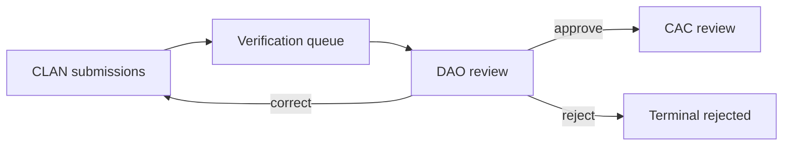
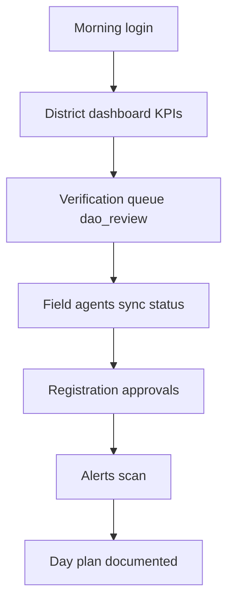

# SOP — DAO Desk Operations

**Version:** 0.1.0-rc1  
**Audience:** District Agriculture Officers (DAO), district officers  
**Related:** [DAO_GUIDE.md](../DAO_GUIDE.md) · [WORKFLOW_ENGINE.md](../WORKFLOW_ENGINE.md) · [SOP_FIELD_OPERATIONS.md](./SOP_FIELD_OPERATIONS.md) · [SOP_CAC.md](./SOP_CAC.md)

---

## Table of contents

1. [Purpose and scope](#purpose-and-scope)
2. [DAO desk overview](#dao-desk-overview)
3. [Morning queue review SOP](#morning-queue-review-sop)
4. [Approve / reject / correct procedure](#approve--reject--correct-procedure)
5. [Field agent monitoring SOP](#field-agent-monitoring-sop)
6. [End-of-day SOP](#end-of-day-sop)
7. [Escalation and SLAs](#escalation-and-slas)
8. [Related documents](#related-documents)

---

## Purpose and scope

This SOP defines daily desk procedures for **District Agriculture Officers** reviewing CLAN submissions and advancing the workflow chain during AgriVault RC1 pilot.

| Role codes | Primary route | Accountable for |
|------------|---------------|-----------------|
| `dao_officer` | `/district-dashboard` | District review SLA |
| `district_officer` | `/workspace/dao` | Same |

Reference: [DAO_GUIDE.md](../DAO_GUIDE.md) · [PERMISSIONS_MATRIX.md](../product/PERMISSIONS_MATRIX.md)

---

## DAO desk overview

### Workspace map

| Surface | Route | Daily use |
|---------|-------|-----------|
| District dashboard | `/district-dashboard` | KPIs, district forms |
| Verification queue | `/verification-queue` | Primary review surface |
| Field agents | `/field-agents` | CLAN activity monitoring |
| Registration approvals | `/registration-approvals` | Flagged farmers |
| Reporting | `/reporting/workspace?tab=dao` | District summary |

### DAO daily timeline (pilot)

| Time | Activity | Duration |
|------|----------|----------|
| 08:00 | Morning queue review | 30 min |
| 09:00–16:00 | Review + district forms + field follow-up | Continuous |
| 16:30 | End-of-day flush | 20 min |

Cadence aligns with [RUNBOOK.md](./RUNBOOK.md) verification queue checks.

---

## Morning queue review SOP

**Owner:** DAO officer · **Deadline:** 10:00 local

### Step-by-step

| Step | Action | Pass criteria |
|------|--------|---------------|
| 1 | Login → confirm landing on `/district-dashboard` | Session valid |
| 2 | Review overnight KPI cards | No unexpected anomaly alerts |
| 3 | Open `/verification-queue` | Filter `dao_review` status |
| 4 | Sort by oldest first | Address aging > 24h first |
| 5 | Open `/field-agents` | All CLAN synced within 24h |
| 6 | Check `/registration-approvals` | Flagged items assigned |
| 7 | Scan `/alerts` | Pest escalations acknowledged |

### Morning checklist

- [ ] Queue filtered to district scope (RLS enforced — [SECURITY.md](../SECURITY.md))
- [ ] Oldest `dao_review` item identified and assigned
- [ ] CLAN sync failures from prior day escalated to CAC if unresolved
- [ ] Items > 48h flagged to programme lead ([SERVICE_LEVEL_OBJECTIVES.md](./SERVICE_LEVEL_OBJECTIVES.md))

---

## Approve / reject / correct procedure

All actions occur in **`/verification-queue`** unless using district dashboard forms for DAO-originated submissions.

### Review discipline

| Step | Action |
|------|--------|
| 1 | Open submission detail — verify Data Source badge (LIVE vs PILOT) |
| 2 | Validate farmer identity, county, district match district scope |
| 3 | Check GPS/boundary plausibility on map preview |
| 4 | Read CLAN notes and attachments |
| 5 | Select action with mandatory comment on reject/correct |

### Action matrix

| Action | Workflow result | When to use |
|--------|-----------------|-------------|
| **Approve** | → `dao_approved` → `cac_review` | Data complete and accurate |
| **Request corrections** | → `dao_corrections_requested` → CLAN | Missing fields, GPS retry needed |
| **Reject** | → `rejected` (terminal) | Invalid duplicate, fraud, out of scope |
| **Escalate** | → `escalated` | Policy decision above district level |
| **Comment** | No status change | Coordination note for CAC/Ministry |

### Correction request SOP

| Step | Action |
|------|--------|
| 1 | Select **Request corrections** |
| 2 | Comment: specific fields to fix (not "please fix") |
| 3 | Notify CLAN via county channel if urgent |
| 4 | Track return — item reappears in `dao_review` after CLAN resubmit |
| 5 | Target re-review within **24h** of CLAN resubmit |

### Reject SOP

- Requires supervisor comment (programme policy)
- CLAN notified through county CAC
- Rejected items do not advance — archived at terminal state

Workflow FSM detail: [WORKFLOW_ENGINE.md](../WORKFLOW_ENGINE.md)

---

## Field agent monitoring SOP

**Route:** `/field-agents` · **Frequency:** Morning + mid-day on field days

### Monitoring checklist

| Check | Healthy | Action if unhealthy |
|-------|---------|-------------------|
| Last sync timestamp | < 24h | Contact CLAN technician |
| Pending queue count | 0 after field day | [SOP_FIELD_OPERATIONS.md](./SOP_FIELD_OPERATIONS.md) sync SOP |
| Submissions today | Matches field plan | Verify assignments |
| Offline indicator stuck | Resolves after sync | Tier 1 device ticket |
| Zero activity on field day | CLAN deployed | Call CLAN lead |

### Field day coordination

| Time | DAO action |
|------|------------|
| 07:30 | Confirm CLAN roster active (with CAC) |
| 12:00 | Spot-check 2 CLAN sync statuses |
| 17:00 | Verify all CLAN pending = 0 or ticket open |

County-wide sync failure (> 20% devices) → Tier 2 ([SUPPORT_ESCALATION.md](./SUPPORT_ESCALATION.md))

---

## End-of-day SOP

**Deadline:** Close of business · **Owner:** DAO officer

| Step | Action |
|------|--------|
| 1 | Process remaining `dao_review` items or document deferral reason |
| 2 | Complete district dashboard forms started today |
| 3 | Flush DAO workflow queue (offline corrections if applicable) |
| 4 | Review `/reporting/workspace?tab=dao` summary |
| 5 | Confirm **zero items stuck in `dao_review`** without owner comment |

### End-of-day checklist

- [ ] No `dao_review` item older than 24h without comment
- [ ] Corrections requested items tracked with CLAN
- [ ] Escalated items have Ministry/CAC visibility
- [ ] District summary metrics recorded for weekly programme report
- [ ] Handoff note to CAC if items advance overnight

---

## Escalation and SLAs

| Metric | Pilot target | Escalate to |
|--------|--------------|-------------|
| DAO stage median review time | ≤ 24h | CAC coordinator |
| Oldest `dao_review` item | ≤ 48h | Programme lead |
| CLAN correction turnaround | ≤ 48h | CAC + CLAN lead |
| Workflow button failure | Immediate ticket | Tier 2 with `x-request-id` |

| Issue type | Tier | Doc |
|------------|------|-----|
| Login / access | Tier 1 | [SUPPORT_ESCALATION.md](./SUPPORT_ESCALATION.md) |
| Workflow API error | Tier 2 | [MONITORING.md](./MONITORING.md) |
| Platform outage | Tier 3 | [ON_CALL_GUIDE.md](./ON_CALL_GUIDE.md) |

Operating model RACI: [OPERATING_MODEL.md](../business/OPERATING_MODEL.md) § Workflow chain

---

## Related documents

| Document | Topic |
|----------|-------|
| [DAO_GUIDE.md](../DAO_GUIDE.md) | Full role guide |
| [SOP_FIELD_OPERATIONS.md](./SOP_FIELD_OPERATIONS.md) | Upstream CLAN SOP |
| [SOP_CAC.md](./SOP_CAC.md) | Downstream CAC SOP |
| [RUNBOOK.md](./RUNBOOK.md) | Daily queue ops |
| [SERVICE_LEVEL_OBJECTIVES.md](./SERVICE_LEVEL_OBJECTIVES.md) | Approval cycle SLO |
| [../SECURITY.md](../SECURITY.md) | RLS and county scope |
