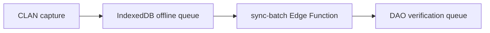
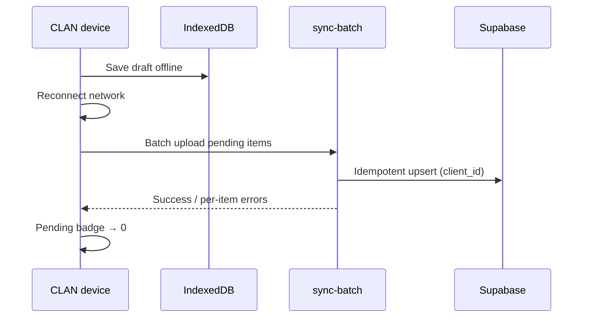

# SOP — CLAN Field Operations

**Version:** 0.1.0-rc1  
**Audience:** CLAN technicians, field agents, county CAC leads  
**Related:** [CLAN_FIELD_GUIDE.md](../CLAN_FIELD_GUIDE.md) · [OFFLINE_ARCHITECTURE.md](../OFFLINE_ARCHITECTURE.md) · [SUPPORT_ESCALATION.md](./SUPPORT_ESCALATION.md) · [../business/OPERATING_MODEL.md](../business/OPERATING_MODEL.md)

---

## Table of contents

1. [Purpose and scope](#purpose-and-scope)
2. [Daily SOP overview](#daily-sop-overview)
3. [PWA installation procedure](#pwa-installation-procedure)
4. [Field capture procedure](#field-capture-procedure)
5. [Sync procedure](#sync-procedure)
6. [Error handling](#error-handling)
7. [Daily checklist](#daily-checklist)
8. [Related documents](#related-documents)

---

## Purpose and scope

This Standard Operating Procedure (SOP) defines the daily field workflow for **CLAN** (Clan Agriculture Crops Technicians) during the AgriVault RC1 pilot. It operationalizes [CLAN_FIELD_GUIDE.md](../CLAN_FIELD_GUIDE.md) for repeatable county execution.

| Role | Routes | Accountability |
|------|--------|----------------|
| `clan_technician` | `/field/*`, `/workspace/clan` | Field capture quality |
| `field_agent` | Same as CLAN | Same |
| County CAC | `/field-agents` | Sync oversight |

Chain context: CLAN → DAO → CAC → Ministry ([WORKFLOW_ENGINE.md](../WORKFLOW_ENGINE.md))

---

## Daily SOP overview

### Start of day (before leaving for field)

| Step | Action | Verification |
|------|--------|--------------|
| 1 | Open installed PWA (not browser tab) | AgriVault icon on home screen |
| 2 | Login at `/login` if session expired | Lands on `/field/mobile` |
| 3 | Check connectivity indicator in topbar | Online preferred for morning sync |
| 4 | Open `/field/sync-queue` | Pending count = 0 before departure |
| 5 | Review `/field/mobile` assignments | Today's farmers/plots identified |

**Time budget:** 10 minutes · **Owner:** CLAN technician

### In the field

| Step | Action | Route |
|------|--------|-------|
| 1 | Register or look up farmer | `/farmers` |
| 2 | Capture GPS boundary (if assigned) | `/field/boundary-capture?farmer=<uuid>` |
| 3 | Submit daily field report | `/field/mobile` |
| 4 | Log pest/disease if observed | `/field/pest-reports` |
| 5 | Complete inspections if queued | `/field/inspections` |

Offline capture is **expected** — drafts save to IndexedDB automatically ([OFFLINE_ARCHITECTURE.md](../OFFLINE_ARCHITECTURE.md)).

### End of day

| Step | Action | Verification |
|------|--------|--------------|
| 1 | Return to connectivity | Topbar shows Online |
| 2 | Open sync — topbar badge or `/field/sync-queue` | Trigger batch upload |
| 3 | Wait for pending count = 0 | All items synced or error flagged |
| 4 | Confirm drafts tab | `/reporting/workspace?tab=drafts` |
| 5 | Report sync failures to CLAN lead | Tier 0 → Tier 1 if device-wide |

---

## PWA installation procedure

Install **once per device** before first field day. See [CLAN_FIELD_GUIDE.md](../CLAN_FIELD_GUIDE.md) § Login.

### Android (Chrome)

| Step | Action |
|------|--------|
| 1 | Open AgriVault URL in Chrome |
| 2 | Navigate to `/login` |
| 3 | Tap **Install for Offline Use** |
| 4 | Confirm **Add to Home screen** |
| 5 | Launch from home screen icon — verify standalone mode (no browser URL bar) |

### iOS (Safari)

| Step | Action |
|------|--------|
| 1 | Open AgriVault URL in Safari |
| 2 | Tap Share → **Add to Home Screen** |
| 3 | Launch from icon |
| 4 | Allow location when prompted (boundary capture) |

### Installation verification checklist

- [ ] App opens from home screen icon
- [ ] Offline banner appears when airplane mode enabled
- [ ] Test draft saves offline and appears in sync queue when online
- [ ] Device registered with county CAC field roster

Install issues → Tier 1 ([SUPPORT_ESCALATION.md](./SUPPORT_ESCALATION.md) CAT-DEVICE)

---

## Field capture procedure

### Farmer registration

| Step | Action | Data quality rule |
|------|--------|-------------------|
| 1 | Search existing farmers first | Avoid duplicates |
| 2 | Complete required fields | Name, county, district match assignment |
| 3 | Submit form | Creates domain record + `operational_submission` |
| 4 | Note submission appears in sync queue if offline | Wait for sync before boundary capture if farmer UUID needed |

### GPS boundary capture

| Step | Action |
|------|--------|
| 1 | Enable device location services |
| 2 | Open `/field/boundary-capture?farmer=<uuid>` |
| 3 | Walk perimeter — mark corners |
| 4 | Review polygon on map preview |
| 5 | Submit — queues to IndexedDB if offline |

Reference: [GIS_ARCHITECTURE.md](../GIS_ARCHITECTURE.md)

### Field report (daily)

| Step | Action |
|------|--------|
| 1 | Open `/field/mobile` |
| 2 | Select farmer/plot context |
| 3 | Enter activity, observations, GPS stamp |
| 4 | Submit — advances to DAO queue after sync |

---

## Sync procedure

Sync uploads offline queue via **`sync-batch`** Edge Function ([DEPLOYMENT_GUIDE.md](../DEPLOYMENT_GUIDE.md)).

### Sync steps

| Step | Action |
|------|--------|
| 1 | Confirm **Online** in topbar |
| 2 | Tap sync indicator or visit `/field/sync-queue` |
| 3 | Do not close app until batch completes |
| 4 | If errors — note message; retry once after 60s |
| 5 | If still failing — screenshot + report to CLAN lead |

### Sync SLO (county target)

≥ 80% of field devices clear pending same day ([SERVICE_LEVEL_OBJECTIVES.md](./SERVICE_LEVEL_OBJECTIVES.md)). CAC logs daily sync check per [RUNBOOK.md](./RUNBOOK.md).

---

## Error handling

| Symptom | Likely cause | CLAN action | Escalate |
|---------|--------------|-------------|----------|
| Pending never clears | No connectivity / sync-batch down | Retry when online; check signal | CLAN lead → Tier 2 if county-wide |
| Login loop | Session expired / wrong password | Re-login; reset via admin | Tier 1 CAT-AUTH |
| Map blank | Offline tiles / CSP | Continue capture; sync later | Tier 1 if online |
| 429 Too Many Requests | Rate limit | Wait 60s; retry | Tier 2 if repeated |
| Form validation error | Missing required field | Correct and resubmit | Tier 0 |
| Duplicate farmer | Existing record | Search first; merge via DAO | DAO correction request |
| GPS inaccurate | Device sensor | Re-walk boundary; note in report | — |
| App not installed | Browser-only session | Complete PWA install SOP | Tier 1 |

### Error reporting minimum

Include in ticket: device model, OS, browser, county, timestamp, screenshot, pending queue count.

Security concerns → Tier 3 immediately ([SECURITY.md](../SECURITY.md))

---

## Daily checklist

**CLAN technician — end of field day**

- [ ] All assigned captures attempted
- [ ] Sync queue pending = 0 (or errors reported)
- [ ] Field reports submitted for each visit
- [ ] Pest reports filed if applicable
- [ ] Device charged for next field day
- [ ] PWA launched from home screen (not stale browser tab)

**County CAC — field day oversight**

- [ ] `/field-agents` reviewed — all CLAN synced within 24h
- [ ] Sync failures logged in county daily standup
- [ ] Tier 2 ticket opened if > 20% devices fail sync
- [ ] Backup connectivity plan active if primary network poor ([PILOT_CHECKLIST.md](../PILOT_CHECKLIST.md))

---

## Related documents

| Document | Topic |
|----------|-------|
| [CLAN_FIELD_GUIDE.md](../CLAN_FIELD_GUIDE.md) | Full role guide |
| [SOP_DAO.md](./SOP_DAO.md) | Downstream DAO review |
| [RUNBOOK.md](./RUNBOOK.md) | Ops sync health check |
| [MONITORING.md](./MONITORING.md) | sync-batch alerts |
| [../SECURITY.md](../SECURITY.md) | Rate limits, CSP |
| [../PILOT_CHECKLIST.md](../PILOT_CHECKLIST.md) | Device readiness |
