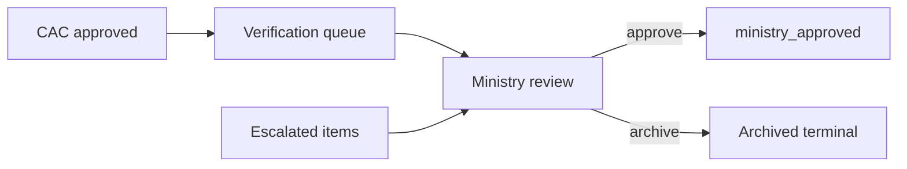
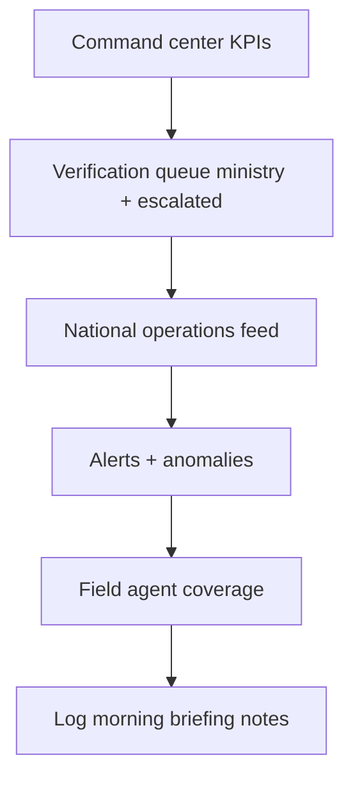

# SOP — Ministry Command Center Operations

**Version:** 0.1.0-rc1  
**Audience:** Ministry national staff, ministry officers, ministry admins  
**Related:** [MINISTRY_GUIDE.md](../MINISTRY_GUIDE.md) · [SOP_CAC.md](./SOP_CAC.md) · [../business/MINISTRY_IMPLEMENTATION_GUIDE.md](../business/MINISTRY_IMPLEMENTATION_GUIDE.md) · [../business/OPERATING_MODEL.md](../business/OPERATING_MODEL.md)

---

## Table of contents

1. [Purpose and scope](#purpose-and-scope)
2. [Command center overview](#command-center-overview)
3. [Daily command center review SOP](#daily-command-center-review-sop)
4. [Escalation handling SOP](#escalation-handling-sop)
5. [Executive PDF export SOP](#executive-pdf-export-sop)
6. [Archive procedure SOP](#archive-procedure-sop)
7. [Weekly and monthly duties](#weekly-and-monthly-duties)
8. [Related documents](#related-documents)

---

## Purpose and scope

This SOP defines national desk procedures for **Ministry staff** operating the AgriVault command center during RC1 pilot — monitoring nationwide KPIs, resolving escalations, producing executive reports, and archiving terminal workflow records.

| Role codes | Primary route | Accountable for |
|------------|---------------|-----------------|
| `ministry_officer` | `/command-center` | National review SLA |
| `ministry_admin` | `/admin` | User + config governance |
| `government_officer` | `/national-operations` | Operational intelligence |
| `super_admin` / `admin` | `/admin` | Platform admin (limited) |

Reference: [MINISTRY_GUIDE.md](../MINISTRY_GUIDE.md) · [PLATFORM_OVERVIEW.md](../business/PLATFORM_OVERVIEW.md)

---

## Command center overview

### National workspace map

| Surface | Route | Purpose |
|---------|-------|---------|
| Command center | `/command-center` | Primary KPI dashboard |
| Ministry workspace | `/workspace/ministry` | Quick links hub |
| National operations | `/national-operations` | Cross-county feed |
| Verification queue | `/verification-queue` | Ministry + escalated review |
| Executive briefing | `/executive-briefing` | Cabinet narrative + PDF |
| Field agents | `/field-agents` | National CLAN coverage |
| Admin console | `/admin` | User provisioning (admins) |
| Activity center | `/activity` | System activity feed |

### Ministry daily timeline (pilot)

| Time | Activity | Duration |
|------|----------|----------|
| 08:00 | Morning briefing — command center | 45 min |
| 09:00–17:00 | Approvals, escalations, logistics review | Continuous |
| Friday 15:00 | National executive PDF (weekly) | 60 min |
| EOD | Archive + status update | 30 min |

---

## Daily command center review SOP

**Owner:** Ministry duty officer · **Deadline:** 09:30 local

### Morning briefing steps

| Step | Action | Pass criteria |
|------|--------|---------------|
| 1 | Open `/command-center` | KPIs load; Data Source badges visible |
| 2 | Review national submission counts (LIVE vs PILOT) | PILOT not mixed into official totals |
| 3 | Open `/verification-queue` — filter `ministry_review` + `escalated` | Oldest item age noted |
| 4 | Scan `/national-operations` | County anomalies flagged |
| 5 | Review `/alerts` and `/compliance/anomalies` | Priority flags assigned owners |
| 6 | Check `/field-agents` | National CLAN coverage acceptable |
| 7 | Scan `/field/sync-queue` (national view) | No multi-county sync crisis |
| 8 | Review `/inventory`, `/transfers` if logistics active | Stock alerts acknowledged |

### Morning checklist

- [ ] Command center KPIs compared to prior day (trend note)
- [ ] All `escalated` items have Ministry owner within 24h ([SERVICE_LEVEL_OBJECTIVES.md](./SERVICE_LEVEL_OBJECTIVES.md))
- [ ] No open P1/P2 platform incidents ([INCIDENT_RESPONSE.md](./INCIDENT_RESPONSE.md))
- [ ] Data source disclosure correct on dashboards ([data-source-inventory.md](../data-source-inventory.md))
- [ ] Steering stakeholders notified if national KPI threshold breached

---

## Escalation handling SOP

Escalated items arrive from DAO/CAC when policy, cross-county, or high-severity issues exceed county authority.

### Escalation intake

| Step | Action |
|------|--------|
| 1 | Filter `/verification-queue` → `escalated` |
| 2 | Read full workflow thread — DAO and CAC comments |
| 3 | Verify submission type and affected counties |
| 4 | Assign Ministry owner in comment |
| 5 | Target first action within **24h** (pilot SLO) |

### Escalation decision matrix

| Situation | Ministry action | Follow-up |
|-----------|-----------------|-----------|
| Cross-county pest outbreak | Approve + notify programme lead | National alert if needed |
| Policy exception request | Approve/reject with formal comment | Steering if precedent-setting |
| Data integrity concern | Hold — Tier 2 investigation | Tier 3 if confirmed |
| County dispute | Mediate via programme lead | Document in workflow thread |
| Logistics emergency | Coordinate warehouse transfer approval | Ministry logistics steward |

### Platform vs operational escalation

| Type | Route | Doc |
|------|-------|-----|
| Workflow data issue | Tier 2 vendor | [SUPPORT_ESCALATION.md](./SUPPORT_ESCALATION.md) |
| Multi-county platform outage | Tier 3 on-call | [ON_CALL_GUIDE.md](./ON_CALL_GUIDE.md) |
| Verification backlog (no platform fault) | Programme lead staffing | [OPERATING_MODEL.md](../business/OPERATING_MODEL.md) |
| Security incident | Tier 3 + CISO | [SECURITY.md](../SECURITY.md) |

---

## Executive PDF export SOP

**Routes:** `/executive-briefing` · topbar export action  
**Frequency:** Weekly (minimum) · Ad hoc before steering meetings

### National briefing procedure

| Step | Action |
|------|--------|
| 1 | Confirm authenticated session (export returns 401 if not — [DEPLOYMENT_GUIDE.md](../DEPLOYMENT_GUIDE.md)) |
| 2 | Open `/executive-briefing` |
| 3 | Refresh KPI sections from command center data |
| 4 | Complete narrative: national summary, county highlights, risks |
| 5 | Mark PILOT/DEMO data clearly — official stats LIVE only |
| 6 | Export PDF |
| 7 | Verify filename, date, page count |
| 8 | Distribute to programme lead and steering distribution list |
| 9 | Archive copy in Ministry document store |

### National PDF content checklist

- [ ] Reporting period and generation timestamp
- [ ] National farmer registration and submission totals (LIVE)
- [ ] County comparison table
- [ ] Escalation summary (open/closed)
- [ ] Food security and logistics highlights
- [ ] Platform status note (incidents if any)
- [ ] Known limitations reference if user-impacting ([KNOWN_LIMITATIONS.md](../KNOWN_LIMITATIONS.md))

Weekly PDF tracked in [RUNBOOK.md](./RUNBOOK.md) § Weekly operations.

---

## Archive procedure SOP

Terminal workflow items require Ministry archive action for long-term record hygiene ([WORKFLOW_ENGINE.md](../WORKFLOW_ENGINE.md)).

### When to archive

| Status | Archive eligible? |
|--------|---------------------|
| `ministry_approved` | Yes — after verification period (pilot: 7 days) |
| `rejected` | Yes — after 7 days |
| `escalated` resolved | Yes — after final Ministry action |
| Active review states | **No** |

### Archive steps

| Step | Action |
|------|--------|
| 1 | Open item in `/verification-queue` |
| 2 | Confirm terminal status and no pending corrections |
| 3 | Select **Archive** action |
| 4 | Confirm audit trail complete (all workflow_actions present) |
| 5 | Verify item removed from active queue views |

### Archive checklist (weekly)

- [ ] All `ministry_approved` items > 7 days archived or scheduled
- [ ] Rejected items archived per retention policy
- [ ] Archive count logged for monthly data governance review
- [ ] No archive of items under Tier 2 investigation

Retention policy: [DATA_GOVERNANCE.md](../business/DATA_GOVERNANCE.md) · Backup: [BACKUP_RESTORE.md](./BACKUP_RESTORE.md)

---

## Weekly and monthly duties

### Weekly (Ministry duty officer)

| Task | Reference |
|------|-----------|
| National executive PDF | This doc § Executive PDF |
| Pilot status update | [PILOT_CHECKLIST.md](../PILOT_CHECKLIST.md) |
| Verification queue aging report | [RUNBOOK.md](./RUNBOOK.md) |
| Coordinate with CAC weekly KPIs | [SOP_CAC.md](./SOP_CAC.md) |
| Review closed P2+ incidents | [INCIDENT_RESPONSE.md](./INCIDENT_RESPONSE.md) |

### Monthly (Ministry IT + programme lead)

| Task | Reference |
|------|-----------|
| User audit | [RUNBOOK.md](./RUNBOOK.md) § Monthly |
| SLO report to steering | [SERVICE_LEVEL_OBJECTIVES.md](./SERVICE_LEVEL_OBJECTIVES.md) |
| RLS and data governance review | [DATA_GOVERNANCE.md](../business/DATA_GOVERNANCE.md) |
| Release readiness if deploy planned | [RELEASE_PROCESS.md](./RELEASE_PROCESS.md) |

Daily → weekly PDF/status → monthly audit/SLO → steering committee ([RUNBOOK.md](./RUNBOOK.md)).

---

## Related documents

| Document | Topic |
|----------|-------|
| [MINISTRY_GUIDE.md](../MINISTRY_GUIDE.md) | Full role guide |
| [SOP_CAC.md](./SOP_CAC.md) | Upstream CAC SOP |
| [RUNBOOK.md](./RUNBOOK.md) | Ops cadence |
| [MONITORING.md](./MONITORING.md) | Platform monitoring |
| [RELEASE_NOTES_RC1.md](../RELEASE_NOTES_RC1.md) | RC1 scope |
| [../business/MINISTRY_IMPLEMENTATION_GUIDE.md](../business/MINISTRY_IMPLEMENTATION_GUIDE.md) | National rollout |
| [../DEPLOYMENT_GUIDE.md](../DEPLOYMENT_GUIDE.md) | Infrastructure |
| [../SECURITY.md](../SECURITY.md) | Auth and RLS |
