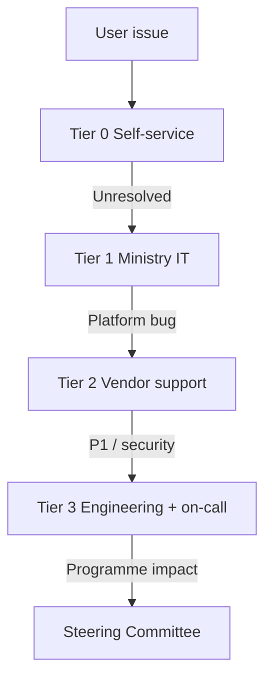
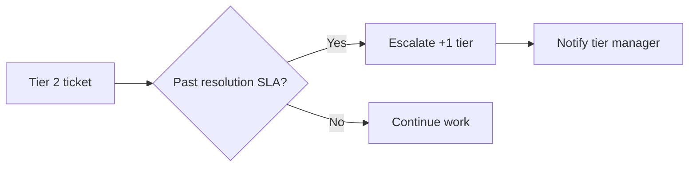

# AgriVault Support Escalation

**Version:** 0.1.0-rc1  
**Audience:** County CAC leads, Ministry IT, vendor support, programme lead  
**Related:** [ON_CALL_GUIDE.md](./ON_CALL_GUIDE.md) · [INCIDENT_RESPONSE.md](./INCIDENT_RESPONSE.md) · [../business/OPERATING_MODEL.md](../business/OPERATING_MODEL.md) · [../business/SUPPORT_MODEL.md](../business/SUPPORT_MODEL.md)

---

## Table of contents

1. [Support model overview](#support-model-overview)
2. [Tier 0–3 escalation paths](#tier-03-escalation-paths)
3. [Ticket categories](#ticket-categories)
4. [SLA reference](#sla-reference)
5. [Escalation procedures](#escalation-procedures)
6. [Ticket templates](#ticket-templates)
7. [Related documents](#related-documents)

---

## Support model overview

AgriVault pilot support follows a four-tier model defined in [OPERATING_MODEL.md](../business/OPERATING_MODEL.md). Tier 0 is self-service at county level; Tier 3 engages on-call engineering for platform incidents.

| Tier | Scope | Primary owner | Channel |
|------|-------|---------------|---------|
| Tier 0 | Role guides, FAQ, CLAN lead peer help | County CAC / CLAN lead | In-county |
| Tier 1 | Login, device, PWA, account provisioning | Ministry IT | Helpdesk email / ticket |
| Tier 2 | Workflow errors, sync failures, data issues | Vendor support | Vendor portal + Slack |
| Tier 3 | Outages, security, data integrity | Ministry IT + vendor engineering | Pager + war room |
| Tier 4 | Programme-level decisions | Programme lead → Steering | Formal escalation |

Full business context: [SUPPORT_MODEL.md](../business/SUPPORT_MODEL.md) · [CHANGE_MANAGEMENT.md](../business/CHANGE_MANAGEMENT.md)

---

## Tier 0–3 escalation paths

### Tier 0 — Self-service

**Goal:** Resolve without IT ticket within 15 minutes.

| Resource | Use for |
|----------|---------|
| [CLAN_FIELD_GUIDE.md](../CLAN_FIELD_GUIDE.md) | Field capture, PWA, sync |
| [DAO_GUIDE.md](../DAO_GUIDE.md) | Verification queue, district forms |
| [CAC_GUIDE.md](../CAC_GUIDE.md) | CaoApprovalQueues, executive briefing |
| [MINISTRY_GUIDE.md](../MINISTRY_GUIDE.md) | Command center, national approvals |
| [PILOT_ADMIN_GUIDE.md](../PILOT_ADMIN_GUIDE.md) | User provisioning, admin console |
| [SOP_FIELD_OPERATIONS.md](./SOP_FIELD_OPERATIONS.md) | CLAN daily procedures |

**Tier 0 checklist before escalating**

- [ ] User reviewed role-specific guide
- [ ] Browser refresh / re-login attempted
- [ ] Connectivity confirmed (online/offline indicator)
- [ ] Issue reproduced on second device or browser
- [ ] CLAN lead or CAC consulted

### Tier 1 — Ministry IT

| Issue type | Examples | Required info |
|------------|----------|---------------|
| Authentication | Cannot login, password reset, session loop | Email, role, screenshot |
| Account | Wrong county scope, missing profile | User email, intended county |
| Device / PWA | Install fails, home screen icon missing | Device OS, browser |
| Access | 403 on expected route | URL, role from `/admin` or profile |

Escalate to Tier 2 if: issue persists after account fix AND affects workflow or sync.

### Tier 2 — Vendor support

| Issue type | Examples | Required info |
|------------|----------|---------------|
| Workflow | Approve button fails, wrong status transition | Submission UUID, `x-request-id` |
| Sync | Pending queue never clears | Device ID, county, Edge Function timestamp |
| Data | Missing submission, duplicate record | `client_id`, farmer UUID |
| Maps / GIS | Tiles blank (not token) | Console CSP errors, county |
| API | 500 on workflow action | Request ID, steps to reproduce |

Reference: [WORKFLOW_ENGINE.md](../WORKFLOW_ENGINE.md) · [OFFLINE_ARCHITECTURE.md](../OFFLINE_ARCHITECTURE.md)

### Tier 3 — Engineering / on-call

| Trigger | Automatic? |
|---------|------------|
| Platform unreachable > 15 min | Yes |
| Suspected data breach | Yes |
| 3+ counties same platform issue | Yes |
| sync-batch failure > 20% field day | Yes |
| P1/P2 declared | Yes |

Route: [ON_CALL_GUIDE.md](./ON_CALL_GUIDE.md) · [INCIDENT_RESPONSE.md](./INCIDENT_RESPONSE.md)

---

## Ticket categories

Use one primary category per ticket for reporting.

| Category ID | Name | Default tier | Typical resolver |
|-------------|------|--------------|------------------|
| CAT-AUTH | Authentication and access | Tier 1 | Ministry IT |
| CAT-DEVICE | Device and PWA | Tier 0–1 | Ministry IT / CLAN lead |
| CAT-SYNC | Offline sync and sync-batch | Tier 2 | Vendor engineering |
| CAT-WF | Workflow and verification queue | Tier 2 | Vendor support |
| CAT-DATA | Data quality and corrections | Tier 2 | Vendor + county steward |
| CAT-GIS | Maps and boundary capture | Tier 1–2 | Ministry IT / vendor |
| CAT-API | API errors and rate limits | Tier 2 | Vendor engineering |
| CAT-SEC | Security and CSP | Tier 3 | Ministry IT + CISO |
| CAT-OUT | Platform outage | Tier 3 | On-call |
| CAT-TRAIN | Training and documentation | Tier 0 | County CAC |
| CAT-FEAT | Feature request | Tier 4 backlog | Programme lead |

### Priority mapping

| Ticket priority | Maps to incident | Response SLA |
|-----------------|------------------|--------------|
| Urgent | P1/P2 | Tier 3 path |
| High | P3 | Tier 2 — 4h response |
| Normal | P4 | Tier 1–2 — 8h response |
| Low | — | Next release / training |

---

## SLA reference

Pilot SLAs (RC1). National targets in [SERVICE_LEVEL_OBJECTIVES.md](./SERVICE_LEVEL_OBJECTIVES.md).

| Tier | Response SLA | Resolution SLA | Coverage hours |
|------|--------------|----------------|----------------|
| Tier 0 | Immediate | — | Field hours |
| Tier 1 | 4 hours | 8 hours | Business hours |
| Tier 2 | 4 hours | 24 hours | Business hours + field-day extension |
| Tier 3 | 1 hour | 4 hours (P1) | On-call schedule |
| Tier 4 | 24 hours | Programme-defined | Steering cadence |

### SLA by ticket category (Tier 1–2)

| Category | First response | Target resolution |
|----------|----------------|-------------------|
| CAT-AUTH | 4h | 8h |
| CAT-DEVICE | 4h | 8h |
| CAT-SYNC | 4h | 24h |
| CAT-WF | 4h | 24h |
| CAT-DATA | 8h | 48h |
| CAT-GIS | 4h | 24h |
| CAT-API | 4h | 24h |
| CAT-SEC | 1h | 4h |
| CAT-OUT | 15 min | 4h |

### SLA exclusions

- Scheduled maintenance (announced 48h ahead)
- User-caused issues (wrong credentials after 3 reminders)
- Third-party outages (Supabase, Vercel, Mapbox) — measured separately
- Force majeure

---

## Escalation procedures

### Manual escalation (Tier 1 → 2)

1. Tier 1 documents reproduction steps and user role
2. Attach `x-request-id` if API involved
3. Reassign to vendor support queue with CAT-* label
4. Notify county CAC if field operations blocked

### Manual escalation (Tier 2 → 3)

1. Vendor support confirms not user error or config
2. Assign severity P1–P3 per [INCIDENT_RESPONSE.md](./INCIDENT_RESPONSE.md)
3. Page on-call if P1/P2
4. Open war room if criteria met

### Automatic escalation triggers

| Trigger | Action | Owner notified |
|---------|--------|----------------|
| Ticket open > 2× resolution SLA | Auto-escalate +1 tier | Tier manager |
| 3+ tickets same CAT-* in 24h | Group incident candidate | Programme lead |
| Verification queue > 72h | Programme lead assigns reviewers | Not Tier 3 unless platform fault |
| 429 spike | Tier 2 engineering | Ministry IT |

### County escalation (operational, not IT)

Workflow backlog without platform fault:

1. DAO lead → CAC coordinator
2. CAC → Programme lead (if > 72h aging)
3. Programme lead assigns surge reviewers

See [SOP_DAO.md](./SOP_DAO.md) · [SOP_CAC.md](./SOP_CAC.md)

---

## Ticket templates

| Tier | Required fields |
|------|-----------------|
| Tier 1 | `[CAT-*]` title, user email, role, county, URL, steps, expected vs actual, screenshot, Tier 0 guide tried |
| Tier 2 | Submission UUID, `x-request-id`, timestamp UTC, device/browser, repro rate, staging repro yes/no |
| Tier 3 | `INCIDENT P1/P2` title, commander, bridge link, impact counties/roles, start UTC, last good deploy SHA |

---

## Related documents

| Document | Topic |
|----------|-------|
| [ON_CALL_GUIDE.md](./ON_CALL_GUIDE.md) | Tier 3 paging |
| [INCIDENT_RESPONSE.md](./INCIDENT_RESPONSE.md) | Severity and war room |
| [SERVICE_LEVEL_OBJECTIVES.md](./SERVICE_LEVEL_OBJECTIVES.md) | Availability SLOs |
| [RUNBOOK.md](./RUNBOOK.md) | Daily ops escalation triggers |
| [../SECURITY.md](../SECURITY.md) | Security incident path |
| [../PILOT_CHECKLIST.md](../PILOT_CHECKLIST.md) | Launch support readiness |
