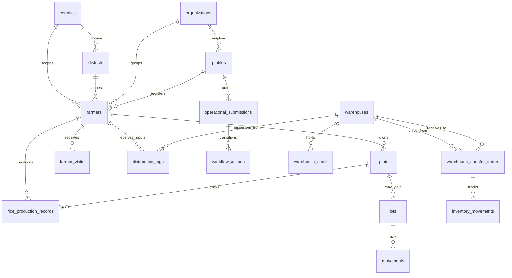

# AgriVault Entity Catalog

**Version:** 1.0 · 2026-07-03  
**Source of truth:** `src/lib/supabase/types.ts` · `supabase/migrations/*.sql`  
**Related:** [../DATABASE.md](../DATABASE.md) · [../WORKFLOW_ENGINE.md](../WORKFLOW_ENGINE.md) · [../ARCHITECTURE.md](../ARCHITECTURE.md) · [PRODUCT_PRINCIPLES.md](./PRODUCT_PRINCIPLES.md)

---

## Table of contents

1. [Overview](#overview)
2. [Entity relationship diagram](#entity-relationship-diagram)
3. [Geographic reference entities](#geographic-reference-entities)
4. [Identity and organization](#identity-and-organization)
5. [Farmer registry entities](#farmer-registry-entities)
6. [Production entities](#production-entities)
7. [Workflow entities](#workflow-entities)
8. [Inventory and logistics entities](#inventory-and-logistics-entities)
9. [Entity × workflow type matrix](#entity--workflow-type-matrix)
10. [Provenance and audit](#provenance-and-audit)
11. [TypeScript mapping](#typescript-mapping)

---

## Overview

AgriVault's operational data model centres on **farmers and their plots**, linked through an **approval workflow** to national reporting. Physical programme delivery (inputs, harvest, warehouse transfers) connects back to the same registry so every distribution is traceable to a verified farmer record.

Design principles from [PRODUCT_PRINCIPLES.md](./PRODUCT_PRINCIPLES.md):

- Every entity has provenance (`registered_by`, `recorded_by`, `created_by`)
- Workflow mutations produce append-only `workflow_actions`
- Domain tables are authoritative; `operational_submissions` is the audit wrapper

Full schema reference: [../DATABASE.md](../DATABASE.md)

---

## Entity relationship diagram

---

## Geographic reference entities

### County

| Attribute | Detail |
|-----------|--------|
| **Table** | `counties` |
| **Purpose** | Canonical county reference for RLS scope, workflow county binding, and dashboard aggregation |
| **Key fields** | `id` (UUID), `name`, `code` |
| **Relationships** | Parent of `districts`; referenced by text `county` on farmers, plots, profiles, submissions |
| **Workflow link** | `operational_submissions.county` must match reviewer `profiles.county` for county-bound stages |

### District

| Attribute | Detail |
|-----------|--------|
| **Table** | `districts` |
| **Purpose** | Sub-county administrative unit; scopes DAO officers and field assignments |
| **Key fields** | `id` (UUID), `county_id` (FK → counties), `name` |
| **Relationships** | Child of `counties`; referenced by text `district` on farmers, plots, profiles, submissions |
| **Workflow link** | `operational_submissions.district` provides finer scope; DAO desk filters by district |

| County / District usage | Column type | Example |
|-------------------------|-------------|---------|
| Reference tables | UUID FK | `districts.county_id` |
| Operational scope | Text (denormalized) | `farmers.county = 'Bong'` |
| Profile scope | Text | `profiles.district = 'Salala'` |

---

## Identity and organization

### Profile

| Attribute | Detail |
|-----------|--------|
| **Table** | `profiles` |
| **TypeScript** | `Profile` in `types.ts` |
| **Purpose** | Authenticated user identity linked 1:1 to `auth.users`; carries role and geographic scope |
| **Key fields** | `id`, `email`, `full_name`, `role` (`UserRole`), `organization_id`, `county`, `district`, `phone`, `is_active`, `deactivated_at`, `created_at` |
| **Relationships** | FK → `organizations`; referenced as `registered_by`, `recorded_by`, `actor_id`, `visited_by` across domain tables |
| **Workflow link** | `operational_submissions.actor_id`; `workflow_actions.actor_id`; role determines `workflowStageForRole()` |

### Organization

| Attribute | Detail |
|-----------|--------|
| **Table** | `organizations` |
| **TypeScript** | `Organization` |
| **Purpose** | Cooperatives, exporters, government bodies, NGOs, and certifiers |
| **Key fields** | `id`, `name`, `type` (`OrgType`), `country`, `county`, `contact_name`, `contact_phone`, `license_number`, `created_at` |
| **Relationships** | Parent of `profiles`, `farmers`, `lots`; optional scope on `operational_submissions.organization_id` |
| **Workflow link** | Submissions may carry `organization_id` for cooperative-scoped programmes |

| `OrgType` values | Typical roles |
|------------------|---------------|
| `cooperative` | `cooperative_manager`, member farmers |
| `exporter` | `exporter` |
| `government` | Ministry, DAO, CAC staff |
| `ngo` | Donor programmes |
| `certifier` | Compliance auditors |

---

## Farmer registry entities

### Farmer

| Attribute | Detail |
|-----------|--------|
| **Table** | `farmers` |
| **TypeScript** | `Farmer` |
| **Purpose** | National farmer registry — system of record for programme eligibility |
| **Key fields** | `id`, `client_id` (offline dedupe), `full_name`, `national_id`, `phone`, `gender`, `organization_id`, `county`, `district`, `village`, `latitude`, `longitude`, `registration_date`, `registered_by`, `notes`, `created_at` |
| **Relationships** | Parent of `plots`, `farmer_visits`, `rice_production_records`, `distribution_logs`; referenced in submission `metadata.entity_refs.farmer_id` |
| **Workflow link** | Submission type `farmer_registration` via `ensureOperationalSubmission()` after `RegisterFarmerForm` |

| Field category | Fields | Notes |
|----------------|--------|-------|
| Identity | `full_name`, `national_id`, `phone`, `gender` | `national_id` optional in pilot |
| Location | `county`, `district`, `village`, `latitude`, `longitude` | County required for RLS |
| Provenance | `registered_by`, `registration_date`, `client_id` | `client_id` enables offline idempotent sync |
| Grouping | `organization_id` | Links to cooperative |

### Plot

| Attribute | Detail |
|-----------|--------|
| **Table** | `plots` |
| **TypeScript** | `Plot` |
| **Purpose** | Farm parcel with GPS boundary, commodity, and deforestation check status |
| **Key fields** | `id`, `client_id`, `farmer_id`, `commodity`, `area_hectares`, `polygon_geojson`, `center_latitude`, `center_longitude`, `land_tenure`, `water_source`, `years_farming_plot`, `participated_programmes`, `planting_year`, `deforestation_check_status`, `deforestation_check_date`, `deforestation_check_notes`, `county`, `district`, `village`, `registered_by`, `created_at` |
| **Relationships** | Child of `farmer`; parent of `rice_production_records`; may link to `lots` |
| **Workflow link** | Submission type `farm_boundary` (dedupe key `farm_boundary:{plot_client_id}`) |

| `deforestation_check_status` | Meaning |
|------------------------------|---------|
| `pending` | Not yet reviewed |
| `clear` | No deforestation concern |
| `flagged` | Requires DAO/CAC follow-up |

### FarmerVisit

| Attribute | Detail |
|-----------|--------|
| **Table** | `farmer_visits` |
| **TypeScript** | No dedicated interface — row shape from migrations |
| **Purpose** | Field inspection visit record; stores operational boundary capture during visits |
| **Key fields** | `id`, `farmer_id`, `visited_by`, `visited_at`, `notes`, `gps_latitude`, `gps_longitude`, `verification_status`, `boundary_geometry` (GeoJSON), `boundary_points`, `boundary_area_ha`, `boundary_captured_at` |
| **Relationships** | Child of `farmer`; `visited_by` → `profiles` |
| **Workflow link** | Boundary data feeds `farm_boundary` submissions; inspection visits link to `field_inspection` submission type |

| `verification_status` | Meaning |
|-----------------------|---------|
| `pending` | Awaiting DAO review |
| `verified` | Confirmed by district officer |
| `flagged` | Data quality issue |

---

## Production entities

### RiceProductionRecord

| Attribute | Detail |
|-----------|--------|
| **Table** | `rice_production_records` |
| **TypeScript** | `RiceProductionRecord` |
| **Purpose** | Seasonal harvest and yield data for rice programme reporting and food security analytics |
| **Key fields** | `id`, `client_id`, `farmer_id`, `plot_id`, `season`, `planting_date`, `expected_yield_kg`, `actual_yield_kg`, `post_harvest_loss_kg`, `post_harvest_loss_cause`, `storage_location_id`, `market_destination`, `farm_gate_price_usd`, `county`, `district`, `water_source`, `years_farming_plot`, `recorded_by`, `recorded_at`, `notes` |
| **Relationships** | Child of `farmer` and optional `plot`; `storage_location_id` → `warehouses` or `locations` |
| **Workflow link** | Submission type `harvest_report` via `DaoProductionEstimateForm` |

### Lot

| Attribute | Detail |
|-----------|--------|
| **Table** | `lots` |
| **TypeScript** | `Lot` |
| **Purpose** | Commodity lot (primarily cocoa) for export chain traceability |
| **Key fields** | `id`, `lot_code`, `commodity`, `origin_location_id`, `organization_id`, `weight_kg_in`, `weight_kg_current`, `moisture_content`, `quality_grade`, `status`, `season`, `farmer_group_ids`, `compliance_status`, `export_approval_status`, `created_by`, `created_at` |
| **Relationships** | Child of `locations`/`organizations`; parent of `movements` |
| **Workflow link** | Export approval is commodity-specific; not the national operational submission chain |

### Movement

| Attribute | Detail |
|-----------|--------|
| **Table** | `movements` |
| **TypeScript** | `Movement` |
| **Purpose** | Physical movement of a lot between locations with weight reconciliation |
| **Key fields** | `id`, `client_id`, `lot_id`, `from_location_id`, `to_location_id`, `weight_kg_dispatched`, `weight_kg_received`, `weight_variance_kg`, `dispatched_at`, `received_at`, `transport_mode`, `vehicle_id`, `driver_name`, `dispatched_by`, `received_by`, `status`, `variance_review_status`, `notes`, `created_at` |
| **Relationships** | Child of `lot`; FK to `locations` |
| **Workflow link** | Variance review is lot-chain specific; may spawn `discrepancy_issues` |

---

## Workflow entities

### OperationalSubmission

| Attribute | Detail |
|-----------|--------|
| **Table** | `operational_submissions` |
| **TypeScript** | `OperationalSubmission` in `src/lib/workflow/types.ts` |
| **Purpose** | Primary workflow entity — one auditable record per operational event requiring CLAN → DAO → CAC → Ministry approval |
| **Key fields** | `id`, `reference_code`, `submission_type`, `title`, `summary`, `status` (`workflow_status`), `actor_id`, `organization_id`, `county`, `district`, `current_assignee_id`, `metadata` (jsonb), `created_at`, `updated_at` |
| **Relationships** | Parent of `workflow_actions`, `workflow_comments`, `workflow_assignments`, `workflow_notifications` |
| **Workflow link** | **Is** the workflow record — see [../WORKFLOW_ENGINE.md](../WORKFLOW_ENGINE.md) |

| `metadata` keys | Purpose |
|-----------------|---------|
| `dedupe_key` | Prevents duplicate submissions on offline re-sync |
| `entity_refs` | Links to domain rows (`farmer_id`, `plot_id`, etc.) |
| `payload_snapshot` | Immutable capture of form data at submission time |

| `workflow_status` values | Stage owner |
|--------------------------|-------------|
| `draft`, `submitted` | Author / DAO |
| `dao_review`, `dao_approved`, `dao_corrections_requested` | DAO |
| `cac_review`, `cac_approved`, `cac_corrections_requested` | CAC |
| `ministry_review`, `ministry_approved` | Ministry |
| `rejected`, `escalated`, `archived` | Terminal / escalation |

### WorkflowAction

| Attribute | Detail |
|-----------|--------|
| **Table** | `workflow_actions` |
| **TypeScript** | `WorkflowActionRecord` |
| **Purpose** | Append-only ledger of every state transition and review decision |
| **Key fields** | `id`, `submission_id`, `actor_id`, `action`, `from_status`, `to_status`, `county`, `district`, `note`, `metadata`, `created_at` |
| **Relationships** | Child of `operational_submissions`; `actor_id` → `profiles` |
| **Workflow link** | Implements [PRODUCT_PRINCIPLES.md](./PRODUCT_PRINCIPLES.md) Principle 1 — every approval is reconstructable |

| `WorkflowAction` values | Effect |
|-------------------------|--------|
| `submit` | Enters review pipeline |
| `approve` | Advances to next stage |
| `reject` | Terminal rejection |
| `request_corrections` | Returns to author |
| `escalate` | Jumps to Ministry attention |
| `assign_reviewer` | Sets `current_assignee_id` |
| `comment` | Thread note — no status change |
| `archive` | Terminal archive from approved/rejected |

---

## Inventory and logistics entities

### Warehouse

| Attribute | Detail |
|-----------|--------|
| **Table** | `warehouses` |
| **TypeScript** | Row from migrations (no dedicated interface in `types.ts`) |
| **Purpose** | Physical storage facility for inputs, seed, and harvested commodity |
| **Key fields** | `id`, `code`, `name`, `county`, `capacity_kg`, `latitude`, `longitude`, `is_active`, `created_at` |
| **Relationships** | Parent of `warehouse_stock`, `distribution_logs`, `warehouse_transfer_orders`; referenced by `warehouse_assignments` |
| **Workflow link** | Submission type `warehouse_assignment`; transfer confirmation via `warehouse_transfer_confirmation` |

### DistributionLog

| Attribute | Detail |
|-----------|--------|
| **Table** | `distribution_logs` |
| **TypeScript** | Row from migrations |
| **Purpose** | Records an input distribution event from warehouse to farmer |
| **Key fields** | `id`, `farmer_id`, `warehouse_id`, `inventory_item_id`, `quantity`, `distributed_at`, `channel`, `created_by` |
| **Relationships** | FK → `farmers`, `warehouses`, `inventory_items`; `created_by` → `profiles` |
| **Workflow link** | Submission type `input_distribution` via `DaoSubsidyDistributionForm` |

### WarehouseTransferOrder

| Attribute | Detail |
|-----------|--------|
| **Table** | `warehouse_transfer_orders` |
| **TypeScript** | Consumed by `src/features/transfers/` |
| **Purpose** | Inter-warehouse stock transfer with status pipeline |
| **Key fields** | `id`, `transfer_code`, `warehouse_from`, `warehouse_to`, `inventory_item_id`, `sku_code`, `quantity`, `status`, `requested_by`, `approved_by`, `dispatched_at`, `delivered_at`, `notes`, `created_at` |
| **Relationships** | FK → `warehouses`, `inventory_items`; may link to `inventory_movements` |
| **Workflow link** | Submission type `warehouse_transfer_confirmation` via `RecordStockTransferForm` |

| Transfer `status` values | Meaning |
|--------------------------|---------|
| `requested` | Awaiting approval |
| `approved` | Approved, not yet dispatched |
| `dispatched` | Left origin warehouse |
| `in_transit` | En route |
| `delivered` | Received at destination |
| `cancelled` | Voided |

---

## Entity × workflow type matrix

Maps domain entities to `operational_submissions.submission_type` constants from `submission-types.ts`:

| Submission type | Primary entity | Trigger form / bridge |
|-----------------|----------------|----------------------|
| `farmer_registration` | `Farmer` | `RegisterFarmerForm` → `dao-workflow-writers` |
| `farm_boundary` | `Plot` / `FarmerVisit` | `BoundaryCaptureStandalone`, offline sync |
| `field_inspection` | `FarmerVisit` | `RecordFieldInspectionForm` |
| `gps_verification` | `Plot` | `DaoGpsEvidenceForm` |
| `pest_disease_alert` | — (alert payload) | `DaoPestDiseaseReportForm` |
| `warehouse_assignment` | `Warehouse` | Warehouse assignment flow |
| `input_distribution` | `DistributionLog` | `DaoSubsidyDistributionForm` |
| `harvest_report` | `RiceProductionRecord` | `DaoProductionEstimateForm` |
| `warehouse_transfer_confirmation` | `WarehouseTransferOrder` | `RecordStockTransferForm` |
| `donor_shipment_verification` | `donor_shipments` | Donor verification (fixtures) |
| `field_report` | `field_reports` | MoA operational survey forms |

Full FSM: [../WORKFLOW_ENGINE.md#submission-types](../WORKFLOW_ENGINE.md#submission-types)

---

## Provenance and audit

| Mechanism | Table | What it captures |
|-----------|-------|------------------|
| Workflow transitions | `workflow_actions` | Who approved, rejected, or escalated |
| Domain mutations | `audit_log` | CRUD on farmers, plots, inventory |
| Offline dedupe | `client_id` on farmers, plots, production | Idempotent sync from IndexedDB |
| Submission snapshot | `operational_submissions.metadata.payload_snapshot` | Form state at submit time |
| Data source badge | UI layer | LIVE / PILOT / OFFLINE / DEMO disclosure |

---

## TypeScript mapping

| Entity | Primary type location | DB table |
|--------|----------------------|----------|
| Profile | `types.ts` → `Profile` | `profiles` |
| Organization | `types.ts` → `Organization` | `organizations` |
| Farmer | `types.ts` → `Farmer` | `farmers` |
| Plot | `types.ts` → `Plot` | `plots` |
| FarmerVisit | Migration row shape | `farmer_visits` |
| RiceProductionRecord | `types.ts` → `RiceProductionRecord` | `rice_production_records` |
| OperationalSubmission | `workflow/types.ts` | `operational_submissions` |
| WorkflowAction | `workflow/types.ts` → `WorkflowActionRecord` | `workflow_actions` |
| Lot | `types.ts` → `Lot` | `lots` |
| Movement | `types.ts` → `Movement` | `movements` |
| Warehouse | Migration / repository types | `warehouses` |
| DistributionLog | Migration row shape | `distribution_logs` |
| WarehouseTransferOrder | `features/transfers/` | `warehouse_transfer_orders` |
| County | Migration row shape | `counties` |
| District | Migration row shape | `districts` |

Architecture context: [../ARCHITECTURE.md#data-flow](../ARCHITECTURE.md#data-flow)
