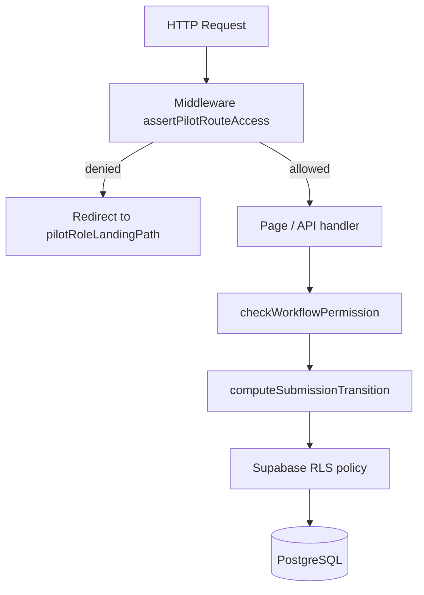

# AgriVault Permissions Matrix

**Version:** 1.0 · 2026-07-03  
**Policy source:** `src/lib/auth/workspace-access.ts` · `src/lib/workflow/roles.ts` · `src/lib/supabase/admin-access.ts`  
**Related:** [ROLE_CATALOG.md](./ROLE_CATALOG.md) · [PRODUCT_PRINCIPLES.md](./PRODUCT_PRINCIPLES.md) · [../SECURITY.md](../SECURITY.md) · [../WORKFLOW_ENGINE.md](../WORKFLOW_ENGINE.md) · [../ARCHITECTURE.md](../ARCHITECTURE.md)

---

## Table of contents

1. [Overview](#overview)
2. [Capability definitions](#capability-definitions)
3. [Master matrix — all 18 roles](#master-matrix--all-18-roles)
4. [Capture capability detail](#capture-capability-detail)
5. [Review capabilities by workflow stage](#review-capabilities-by-workflow-stage)
6. [GIS capability tiers](#gis-capability-tiers)
7. [Route policy inventory](#route-policy-inventory)
8. [Enforcement layers](#enforcement-layers)
9. [Exceptions and read-only roles](#exceptions-and-read-only-roles)
10. [County scope rules](#county-scope-rules)

---

## Overview

AgriVault authorization uses **defense in depth** across four layers (see [../SECURITY.md](../SECURITY.md)):

1. Supabase Auth session
2. Next.js middleware (`assertPilotRouteAccess`)
3. Application-level workflow checks (`checkWorkflowPermission`)
4. PostgreSQL Row Level Security

This matrix documents **application-level capabilities** as implemented in `workspace-access.ts` and `roles.ts`. A user may pass middleware but still fail a workflow mutation if county scope or FSM rules block the action.

Role definitions: [ROLE_CATALOG.md](./ROLE_CATALOG.md)

---

## Capability definitions

| Capability | Function(s) | Meaning |
|------------|-------------|---------|
| **Capture** | `canCreateSubmission()`, field routes, farmer writes | Create domain records and submit operational submissions |
| **Review DAO** | `workflowStageForRole` = `dao`, `checkWorkflowPermission` | Approve, reject, request corrections at DAO stage |
| **Review CAC** | Stage = `cac` | Approve, reject, request corrections at CAC stage |
| **Review Ministry** | Stage = `ministry` | Final approve, reject, escalate, archive |
| **GIS** | `canAccessPilotPrimaryGis()`, `canAccessAdvancedGisIntelligence()` | Map surfaces, boundary capture oversight, geo registry |
| **Inventory** | `canAccessWarehouseLogisticsRoutes()` | Inventory, transfers, logistics, operations |
| **Reports** | `canAccessReportingHub()`, `canAccessExecutiveBriefing()` | Reporting hub and leadership PDF |
| **Admin** | `isAdminConsoleRole()` | `/admin/*` console and admin APIs |
| **Audit read** | `auditor` stage, `/audit-tools`, compliance RLS | Read-only audit trail access |

### Legend

| Symbol | Meaning |
|--------|---------|
| ✅ | Full access |
| 🔶 | Partial / scoped access |
| ❌ | Denied — middleware redirects to role landing |
| 👁 | Read-only — view without mutation |

---

## Master matrix — all 18 roles

| Role | Capture | Review DAO | Review CAC | Review Ministry | GIS | Inventory | Reports | Admin | Audit read |
|------|---------|------------|------------|-----------------|-----|-----------|---------|-------|------------|
| `super_admin` | ✅ | ✅ | ✅ | ✅ | ✅ | ✅ | ✅ | ✅ | 🔶 |
| `admin` | ✅ | ✅ | ✅ | ✅ | ✅ | ✅ | ✅ | ✅ | 🔶 |
| `ministry_admin` | ✅ | ✅ | ✅ | ✅ | ✅ | ✅ | ✅ | ✅ | 🔶 |
| `ministry_officer` | ✅ | ✅ | ✅ | ✅ | ✅ | ✅ | ✅ | ✅ | 🔶 |
| `government_officer` | ✅ | ✅ | ✅ | ✅ | ✅ | ✅ | ✅ | ✅ | 🔶 |
| `county_agriculture_coordinator` | ✅ | 👁 | ✅ | ❌ | ✅ | ✅ | ✅ | ❌ | 🔶 |
| `county_officer` | ✅ | 👁 | ✅ | ❌ | ✅ | ✅ | ✅ | ❌ | 🔶 |
| `dao_officer` | ✅ | ✅ | ❌ | ❌ | ✅ | ✅ | ✅ | ❌ | 🔶 |
| `district_officer` | ✅ | ✅ | ❌ | ❌ | ✅ | ✅ | ✅ | ❌ | 🔶 |
| `clan_technician` | ✅ | ❌ | ❌ | ❌ | 🔶 | ❌ | ✅ | ❌ | ❌ |
| `field_agent` | ✅ | ❌ | ❌ | ❌ | 🔶 | ❌ | ✅ | ❌ | ❌ |
| `warehouse_manager` | 🔶 | ❌ | ❌ | ❌ | ❌ | ✅ | ❌ | ❌ | ❌ |
| `cooperative_manager` | 🔶 | ❌ | ❌ | ❌ | ❌ | ✅ | ❌ | ❌ | ❌ |
| `exporter` | 🔶 | ❌ | ❌ | ❌ | ❌ | ✅ | ❌ | ❌ | ❌ |
| `donor_observer` | ❌ | 👁 | 👁 | 👁 | ❌ | ❌ | ❌ | ❌ | 👁 |
| `donor_partner` | ❌ | 👁 | 👁 | 👁 | ❌ | ❌ | ❌ | ❌ | 👁 |
| `call_center_agent` | 🔶 | ❌ | ❌ | ❌ | ❌ | ❌ | ❌ | ❌ | ❌ |
| `auditor` | ❌ | 👁 | 👁 | 👁 | ❌ | ❌ | ❌ | ❌ | ✅ |

**Notes on matrix cells:**

- Ministry roles can act at **all review stages** because `workflowStageForRole` returns `ministry` and the FSM permits ministry-stage actors to approve at DAO and CAC gates when configured.
- CAC **Review DAO = 👁** reflects `daoReviewReadOnly()` — CAC can view district desk but district UI applies read-only for non-DAO roles.
- CLAN **GIS = 🔶** — CLAN accesses boundary capture (`/field/boundary-capture`) but not `/geo-registry`, `/map`, or `/gis-intelligence` per `canAccessPilotPrimaryGis`.
- **Audit read 🔶** for operational roles = compliance routes only; **✅** for `auditor` = dedicated `/audit-tools` surface.

---

## Capture capability detail

| Role | Domain writes | Workflow submit | Offline sync | Primary routes |
|------|---------------|-----------------|--------------|----------------|
| `clan_technician` | Farmers, plots, visits | ✅ `clan` stage | ✅ IndexedDB | `/field/*`, `/farmers` |
| `field_agent` | Same as CLAN | ✅ | ✅ | Same |
| `dao_officer` | All district domain tables | ✅ `dao` stage | — | `/district-dashboard`, `/workspace/dao` |
| `district_officer` | Same as DAO | ✅ | — | Same |
| `county_agriculture_coordinator` | County-scoped | ✅ `cac` stage | — | `/county-dashboard` |
| `county_officer` | Same as CAC | ✅ | — | Same |
| `ministry_*` | National | ✅ `ministry` stage | — | `/command-center` |
| `warehouse_manager` | Inventory, distributions | 🔶 transfer only | — | `/inventory/*` |
| `cooperative_manager` | Farmer registry | ❌ | — | `/farmers`, `/cooperatives` |
| `exporter` | Lots, movements | ❌ | — | `/cocoa/*` |
| `call_center_agent` | Farmer visits | ❌ | — | `/verification-queue` |
| `donor_*`, `auditor` | ❌ | ❌ | ❌ | — |

Capture writes to PostgreSQL are further restricted by RLS policies in [../DATABASE.md](../DATABASE.md#row-level-security).

---

## Review capabilities by workflow stage

From `checkWorkflowPermission()` in `src/lib/workflow/roles.ts`:

| Action | CLAN | DAO | CAC | Ministry | Donor | Auditor |
|--------|------|-----|-----|----------|-------|---------|
| `submit` | ✅ | ✅ | ✅ | ✅ | ❌ | ❌ |
| `comment` | ✅ | ✅ | ✅ | ✅ | ❌ | ❌ |
| `assign_reviewer` | ❌ | ✅ | ✅ | ✅ | ❌ | ❌ |
| `approve` | ❌ | ✅ (DAO gate) | ✅ (CAC gate) | ✅ (final) | ❌ | ❌ |
| `reject` | ❌ | ✅ | ✅ | ✅ | ❌ | ❌ |
| `request_corrections` | ❌ | ✅ | ✅ | ✅ | ❌ | ❌ |
| `escalate` | ❌ | ✅ | ✅ | ✅ | ❌ | ❌ |
| `archive` | ❌ | ❌ | ❌ | ✅ | ❌ | ❌ |

### Stage × status responsibility

| Workflow status | Responsible reviewer stage |
|-----------------|---------------------------|
| `submitted`, `dao_review` | DAO |
| `dao_approved`, `cac_review` | CAC |
| `cac_approved`, `ministry_review`, `escalated` | Ministry |
| `dao_corrections_requested`, `cac_corrections_requested` | Author (resubmit) |
| `ministry_approved`, `rejected` | Ministry (archive only) |

Full transition table: [../WORKFLOW_ENGINE.md#transition-table](../WORKFLOW_ENGINE.md#transition-table)

---

## GIS capability tiers

| Tier | Function | Roles granted | Routes |
|------|----------|---------------|--------|
| **Field capture** | Boundary walk capture | CLAN (capture only) | `/field/boundary-capture` |
| **Pilot GIS** | `canAccessPilotPrimaryGis()` | CLAN, DAO, CAC, Ministry | `/geo-registry`, `/map` |
| **Advanced GIS** | `canAccessAdvancedGisIntelligence()` | CAC, Ministry only | `/gis-intelligence` |
| **National heat map** | `canAccessNationalHeatMap()` | CLAN, DAO, CAC, Ministry | `/national-heat-map`, `/food-security` |

| Role | Field capture | Pilot GIS | Advanced GIS | Heat map |
|------|---------------|-----------|--------------|----------|
| `clan_technician` | ✅ | ❌ | ❌ | ✅ |
| `dao_officer` | 👁 | ✅ | ❌ | ✅ |
| `county_officer` | 👁 | ✅ | ✅ | ✅ |
| `ministry_officer` | 👁 | ✅ | ✅ | ✅ |
| `donor_observer` | ❌ | ❌ | ❌ | ❌ |
| `auditor` | ❌ | ❌ | ❌ | ❌ |

GIS architecture: [../GIS_ARCHITECTURE.md](../GIS_ARCHITECTURE.md)

---

## Route policy inventory

Selected routes from `PILOT_ROUTE_INVENTORY` in `workspace-access.ts`:

| Route prefix | Access function | Denied roles |
|--------------|-----------------|--------------|
| `/command-center` | `canAccessNationalCommandCenter` | All except Ministry national |
| `/county-dashboard` | `canAccessCountyDashboard` | CLAN, DAO, donor, auditor |
| `/district-dashboard` | `canAccessDistrictDashboard` | Donor, auditor |
| `/verification-queue` | `canAccessVerificationQueue` | CLAN, donor, auditor |
| `/executive-briefing` | `canAccessExecutiveBriefing` | CLAN, DAO, donor, auditor |
| `/inventory`, `/transfers`, `/logistics` | `canAccessWarehouseLogisticsRoutes` | CLAN, donor, auditor |
| `/reporting` | `canAccessReportingHub` | Donor, auditor |
| `/admin` | `isAdminConsoleRole` | All except Ministry admin roles |
| `/donor-dashboard` | Landing only | Operational roles use own landing |
| `/audit-tools` | Landing for auditor | — |
| `/activity`, `/search` | `canAccessActivitySearchDashboard` | Most roles except Ministry, call_center |

---

## Enforcement layers



| Layer | File | Fails closed? |
|-------|------|---------------|
| Middleware | `src/middleware.ts` | Yes — redirect |
| Route assert | `workspace-access.ts` | Yes — redirect |
| Workflow permission | `workflow/roles.ts` | Yes — 403 API error |
| FSM | `workflow/status-model.ts` | Yes — 403 API error |
| RLS | Supabase migrations | Yes — empty result / error |

---

## Exceptions and read-only roles

### Donor roles (`donor_observer`, `donor_partner`)

| Capability | Access |
|------------|--------|
| Capture | ❌ |
| All review mutations | ❌ |
| Workflow read | 👁 via donor dashboard aggregates |
| Farmer registry | 👁 limited |
| Compliance | 👁 |
| Operational workspaces | ❌ |

`isReadOnlyStage('donor')` blocks all workflow mutations.

### Auditor (`auditor`)

| Capability | Access |
|------------|--------|
| Capture | ❌ |
| All review mutations | ❌ |
| `/audit-tools` | ✅ |
| `audit_log` | ✅ per RLS |
| Workflow thread | 👁 via API read |
| All operational routes | ❌ — middleware redirects to `/audit-tools` |

### Warehouse / exporter / cooperative (workflow `none` stage)

These roles have **module-specific write access** (inventory, lots, farmers) but default to `workflowStageForRole` → `none` / `donor`, meaning they cannot approve operational submissions unless explicitly mapped to a chain stage in future phases (see [ROADMAP.md](./ROADMAP.md) Phase 4 TD-020).

---

## County scope rules

| Stage | County-bound? | Rule |
|-------|---------------|------|
| `clan` | Yes | Author or matching `profiles.county` |
| `dao` | Yes | `actorCounty === submission.county` |
| `cac` | Yes | `actorCounty === submission.county` |
| `ministry` | No | National scope |
| `auditor`, `donor` | No | Read-only, no mutations |

```typescript
// County gate (simplified)
actorCountyMatches(stage, actorCounty, submissionCounty)
// Returns true for ministry; requires exact match for clan/dao/cac
```

Violations return `{ ok: false, reason: "Submission is outside your county scope." }`.

---

## Related documents

| Document | Content |
|----------|---------|
| [ROLE_CATALOG.md](./ROLE_CATALOG.md) | Per-role descriptions and landing routes |
| [USER_JOURNEYS.md](./USER_JOURNEYS.md) | How capabilities combine in operational flows |
| [../DATABASE.md](../DATABASE.md) | RLS policy detail per table |
| [../WORKFLOW_ENGINE.md](../WORKFLOW_ENGINE.md) | FSM and API authorization |
| [PRODUCT_PRINCIPLES.md](./PRODUCT_PRINCIPLES.md) | Principle 7 — security by default |
