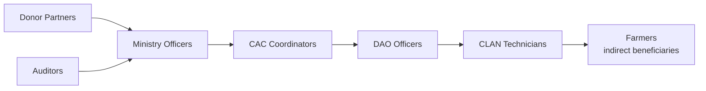

# AgriVault Product Vision

**Version:** 1.0 · 2026-07-03  
**Horizon:** 2026–2030

---

## Executive summary

AgriVault exists so that every farmer registered, every farm boundary captured, and every input distributed in Liberia is recorded once, verified through government hierarchy, and available for national planning — even where connectivity fails.

The platform is not a dashboard. It is the operational system of record for Ministry of Agriculture field operations.

---

## Vision statement

> A Liberian farmer in any district can be registered, geolocated, and served by government programmes through a verified digital record — captured offline if necessary, approved by district and county officers, and visible to national leadership with full audit trail.

---

## Strategic outcomes (2030)

| Outcome | Measure |
|---------|---------|
| Registry completeness | ≥80% of active farmers in pilot commodities registered with verified boundaries |
| Approval cycle time | Median submit → ministry_approved ≤ 48 hours |
| Offline reliability | ≥95% CLAN sync success rate excluding connectivity outages |
| Data trust | ≥90% command center KPIs from LIVE source during national operations |
| Programme alignment | All major donor programmes report through AgriVault exports |

---

## Problem statement

| Current state | AgriVault target state |
|---------------|------------------------|
| Paper registers and duplicate spreadsheets | Single registry with RLS-scoped access |
| No GPS-verified farm boundaries | Mapbox boundary capture with Turf area calculation |
| Approvals via phone and physical signatures | CLAN → DAO → CAC → Ministry FSM with notifications |
| Field staff blocked without connectivity | Offline-first PWA with IndexedDB sync |
| Cabinet reports manually assembled | Executive briefing PDF from operational data |
| Donor reporting disconnected from field data | Shared operational submissions with provenance badges |

---

## Users served

Primary operators: [ROLE_CATALOG.md](./ROLE_CATALOG.md)  
Journeys: [USER_JOURNEYS.md](./USER_JOURNEYS.md)

---

## Non-goals (2026)

- Replacing Ministry financial systems
- Citizen self-service registration without CLAN verification
- Autonomous AI approval of subsidies or distributions
- Multi-ministry platform (agriculture scope only for pilot)

---

## Alignment with national digital transformation

| GDS / World Bank principle | AgriVault alignment |
|----------------------------|---------------------|
| User needs first | Role-specific workspaces and SOPs |
| Build for sustainability | Supabase + documented operating model |
| Address the whole service | End-to-end journey from field to cabinet |
| Be open and accountable | Audit logs, workflow actions, data source badges |
| Digital by default | Offline-capable digital capture replaces paper |

---

## Roadmap summary

| Phase | Timeline | Document |
|-------|----------|----------|
| Pilot | Q3 2026 | [../PILOT_CHECKLIST.md](../PILOT_CHECKLIST.md) |
| Hardening | Q4 2026 | [ROADMAP.md](./ROADMAP.md) |
| County scale | Q1 2027 | [../business/NATIONAL_SCALE_GUIDE.md](../business/NATIONAL_SCALE_GUIDE.md) |
| National | Q2–Q3 2027 | [../government/COUNTY_ROLLOUT_PLAN.md](../government/COUNTY_ROLLOUT_PLAN.md) |

Engineering roadmap: [../ROADMAP_POST_PILOT.md](../ROADMAP_POST_PILOT.md)

---

## Related documents

[PRODUCT_PRINCIPLES.md](./PRODUCT_PRINCIPLES.md) · [../government/MINISTER_BRIEFING.md](../government/MINISTER_BRIEFING.md) · [../business/PLATFORM_OVERVIEW.md](../business/PLATFORM_OVERVIEW.md)
